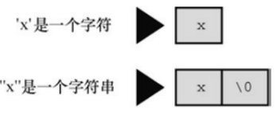

# 第五章 字符串

字符串是一个或多个字符的序列。C 中字符串被存储在 char 类型的数组中，以空字符 '\0' 结尾。所以字符常量 'x' 和字符串常量 "x" 不同，前者是一个字符，后者是一个字符串，带有结束标记空字符。



## 5.1 声明

**字符串字面量**

字符串用双引号括住。若字符串之间没有间隔或用空白字符分隔，C 会将其拼接成一个字符串。

```c
"hello world"; //字符串字面量
"hello" "world" == "helloworld";
```

字符串字面量也称为字符串常量，但和 int, double 类型常量不同，字符串字面量本质上是一个 char 型 const 修饰的指针（char * const ptr），存储该字符串的内存地址。可以对字符串字面量进行 \*（解引用）等指针操作，但不能对 int, double 的类型常量进行相同操作。

```c
&"hello"; //允许对 const 指针取址
*"hello"; //允许解引用 const 指针、
++"hello"; //不允许改变 const 指针所存储的地址值

&1; //不允许
*1; //不允许
```

**char 型数组或指针**

声明一个 char 型数组或指针，用字符串字面量初始化。编译器会自动在最后一个字符末尾加上空字符 '\0' 作为字符串结尾。

```c
char string[10] = "hello";
char string[10] = {'h','e','l','l','o','\0',' \0','\0'};
char * ptr = "hello";
```

字符串字面量初始化 char 型数组时，将静态存储区的字符串拷贝到数组中，此时存在两个相同的字符串，存储在不同的位置；字符串字面量初始化 char 型指针时，把静态存储区的字符串地址拷贝给指针，此时存在两个相同的指针，指向同一个字符串。

```c
char arr[] = "hello";
char * ptr = "hello";

printf("%p %p %p","hello",arr,ptr); //0x400608 0x7ffe44d05580 0x400608
```

不建议修改 char 型指针指向的字符串，因为程序只拥有这一份字符串。char 型数组保存的字符串为原字符串的副本，可以进行修改。

## 5.2 字符串函数

C 提供了多个处理字符串的函数，其原型 在<string.h> 头文件中。

strlen() 函数统计字符串长度。

strcat() 函数拼接两个字符串，将第二个字符串拼接到第一个字符串末尾，返回修改后的第一个字符串。

strncat() 函数和 strcat() 函数类似，但可以指定最大添加字符数，防止溢出。

strcmp() 函数比较两个字符串的内容，而不是字符串的地址。字符串内容相同返回 0。

strncmp() 函数和 strcmp() 函数类似，但可以指定最大比较字符数。

strcpy() 函数将源字符串（包括末尾的结束标记）拷贝到目标字符串中。

strncpy() 函数和 strcpy() 函数类似，但可以指定拷贝的最大字符数。

sprintf() 函数和 printf() 函数类似，但第一个参数可以指定格式化输出结果的存放位置。

strpbrk() 函数在主字符中匹配指定子字符串的任意字符。

strstr() 函数在主字符串中匹配指定的子字符串。

strrchr() 函数在字符串中匹配指定字符的最后一次匹配位置。

