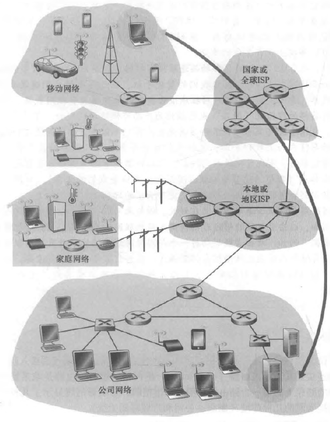
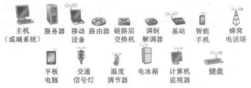
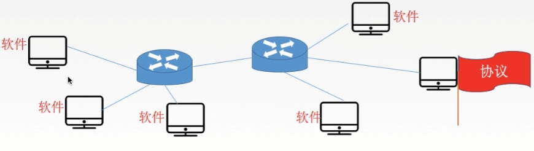
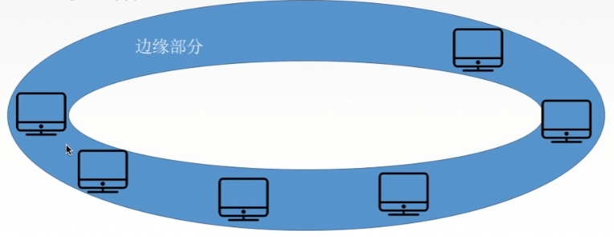
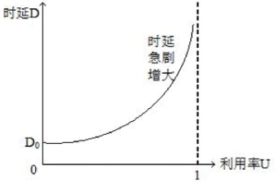
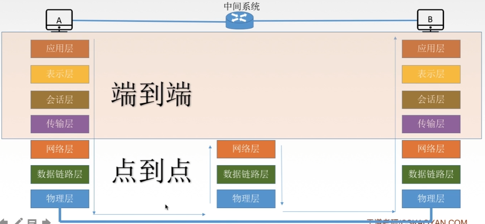
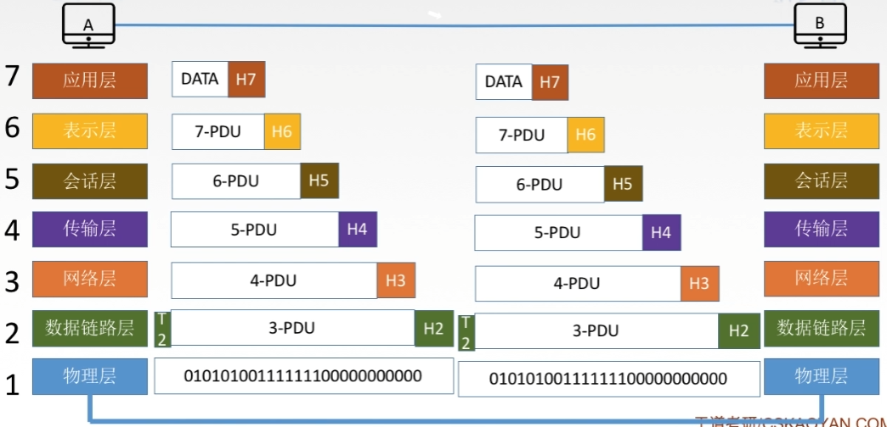
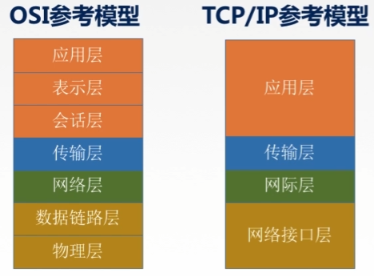
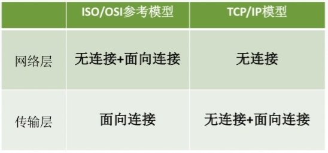
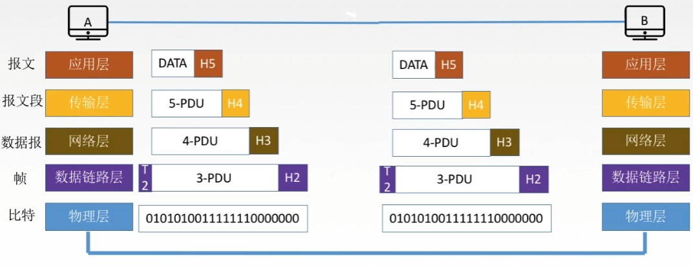

# 第一章 导论

### 计算机网络

#### 定义

计算机网络是一个将分散的、具有独立功能的计算机系统，通过通信设备与线路连接起来，由功能完善的软件实现资源共享和信息传递的系统。计算机网络是互连的、自治的计算机集合。

#### 组成

计算机网络由硬件、软件和协议组成

#### 工作方式

边缘部分：用户直接使用，包括 C/S 结构和 P2P 结构
核心部分：为边缘部分服务

#### 分类

按分布范围：广域网、城域网、局域网、个人区域网
按使用者：公用网和专用网
按交换技术：电路交换、报文交换、分组交换
按拓扑结构：总线型、星型、环型、网状型
按传输技术：
	广播式：共享公共通信信道
	点对点：使用分组存储转发和路由选择机制

#### 功能

数据通信：数据在信道上传输，保证不同主机之间的连通性

资源共享：硬件、软件和数据共享

分布式处理：多台计算机各自承担同一工作任务的不同部分

### 标准化

法定标准：由权威机构制定的正式的、合法的标准

事实标准：某些公司的产品在竞争种占据了主流，时间长了，这些产品中的协议和技术就成了标准

国际标准化组织：ISO
国际化电气联盟：ITU
国际电子电气工程师协会：IEEE
Internet 工程任务组： IETF

### 性能指标

- 带宽：表示网络的通信线路传送数据的能力，通常是指单位时间内从网络中的某一点到另一点所能通过的最高数据率，即网络设备所支持的最高发送速度，单位是 bit/s

- 吞吐量：表示在单位时间内通过某个网络（或信道、接口）的数据量，单位 bit/s。吞吐量受网络的带宽或网络的额定速率的限制。

- 时延：指数据从网络的一端传送到另一端所需要的时间，也成为延迟或迟延，单位是 s。

​		发送时延：数据长度/信道带宽
​		传播时延：信道长度/电磁波在信道上的传播速率
​		排队时延：等待输出/输入链路可用的时间
​		处理时延：路由器检错、转发的时间

- 时延带宽积 = 传播时延 x 带宽，即以比特为单位的链路长度，或者说某链路现在有多少比特。

- 往返时延 RTT：从发送发发送第一个 bit 开始，到发送方收到接收方的第一个 bit 确认时总共经历的时延。RTT 越大，在收到确认之前，可发送的数据越多。RTT = 2*传播时延 + 末端处理时间。末端处理时间即接收方接收到数据后进行处理才发送确认信号所经历的时间

- 利用率：

  信道利用率：有数据通过时间/(有数据通过时间+无数据通过时间)
  网络利用率：信道利用率加权平均值

## 分层结构

上层使用下层的服务，下层为上层提供服务。上层与下层之间通过接口连接。

### OSI 参考模型

OSI 参考模型通信过程：

**应用层**

所有能和用户交互产生网络流量的程序。

典型应用层服务：文件传输 FTP，电子邮件 SMTP，万维网 HTTP

**表示层**

处理两个系统间交换信息的语法与语义问题

- 进行数据格式变换，比特流和特定格式的数据之间的转换

- 数据加密解密

- 数据压缩和解压缩

**会话层**

向用户进程提供建立连接并在连接上有序地传输数据，即建立、管理和终止会话。

在数据流中插入同步点，在通信失效时从同步点继续恢复通信，实现数据同步

**传输层**

通信子网（网络层、数据链路层和物理层）和资源子网（应用层、表示层和会话层）之间的接口，负责主机中两个进程之间的通信，传输单位为报文段或用户数据报。

- 可靠传输和不可靠传输
- 差错控制
- 流量控制
- 复用分用

复用：多个应用层进程可同时使用下面运输层的服务
分用：运输层把收到的信息分别交付给上面应用层中对应的进程

**网络层**

把分组从源端传到目的端，为分组交换网上的不同主机提供通信服务，网络层传输单位是数据报

- 路由选择
- 流量控制
- 差错控制
- 拥塞控制

**数据链路层**

把网络层传下来的数据包组装成帧，传输单位是帧

- 成帧
- 差错控制：帧错、位错

- 流量控制

-  访问控制，控制对信道的访问

**物理层**

在物理媒体上实现比特流的透明传输，传输单位是 bit。透明传输：不管所传数据是什么样的比特组合，都应当能够在链路上传送

- 定义接口特性

- 定义传输模式

​		单工：只能单向通信

​		半双工：可以双向通信，但只能交替进行，例如对讲机

​		全双工：可以双向通信

- 定义传输速率
- 比特同步
- 比特编码

### TCP/IP 参考模型

相同点：

- 都分层
- 基于独立的协议栈概念
- 可以实现异构网络互联

不同点：

- OSI 定义了三点：服务、协议、接口
- OSI 先出现，参考模型先于协议发明，不偏向特定协议
- TCP/IP 设计指出就考虑到异构网互联问题，将 IP 作为重要层次

面向连接：分为三个阶段

- 建立连接
- 开始数据传输
- 传输完毕，释放连接

无连接：直接进行数据传输

### 5 层参考模型

综合了 OSI 和 TCP/IP 的优点

应用层：支持各种网络应用，支持的协议如 FTP、SMTP、HTTP

传输层：进程-进程的数据传输，支持的协议如 TCP、UDP 

网络层：源主机到目的主机的数据分组路由与转发，支持的协议如 IP、ICMP、OSPF 等

数据链路层：网络层传下来的数据报组装成帧，支持的协议如 Ethernet、PPP

物理层：比特传输

**数据封装与解封装过程：**

