# 第二章 应用层

应用层对应用程序的通信提供服务。

### 网络应用模型

**客户/服务器模型**

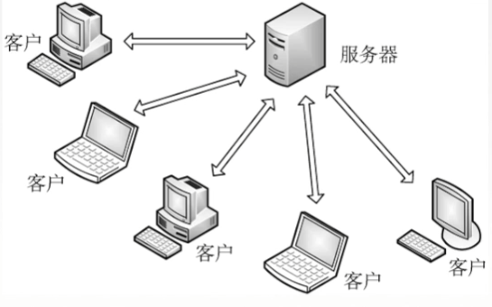

服务器：提供计算服务的设备

1. 永久提供服务
2. 永久性访问地址/域名

客户机：请求计算服务的主机

1. 与服务器通信，使用服务器提供的服务
2. 间歇性加入网络
3. 可能使用动态 IP 地址
4. 不与其他客户机直接通信

**P2P 模型**

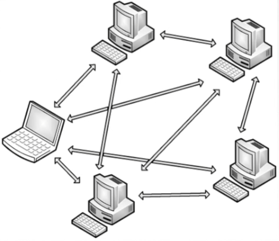

不存在永远在线的服务器
每个主机即可以提供服务，也可以请求服务
任意端系统之间可以直接通讯
节点间歇性接入网络
节点可能改变 IP 地址
可扩展性好
网络健壮性强

### DNS 

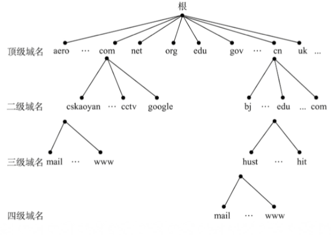

www.baidu.com 中 www 为三级域名，baidu 为二级域名，com 为顶级域名

#### 域名解析过程

**递归查询**

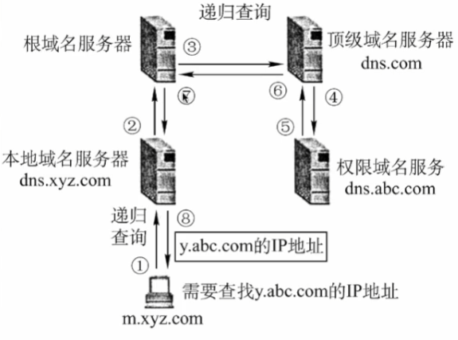

**迭代查询**

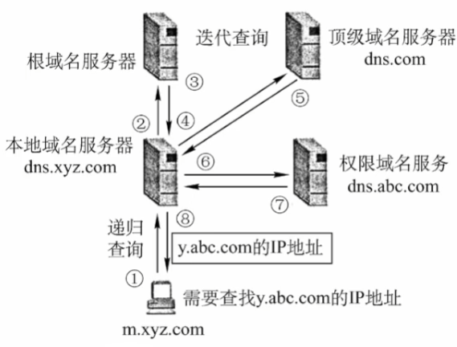

### FTP

提供了不同种类主机系统之间的文件传输能力

FTP 使用 TCP 实现可靠性传输，有的 FTP 服务器需要登录，有的 FTP 服务器可以匿名登录。FTP 服务器有一个主进程和 n 个从属进程。

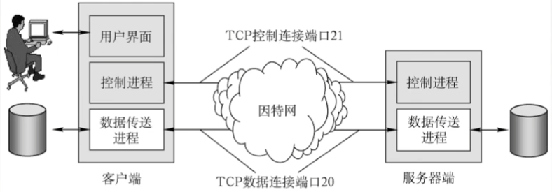

FTP 传输模型
文本模式：ASCII 模式，以文本序列传输数据
二进制模式：Binary 模式，以二进制序列传输数据

### Email

**简单邮件传送协议 SMTP**

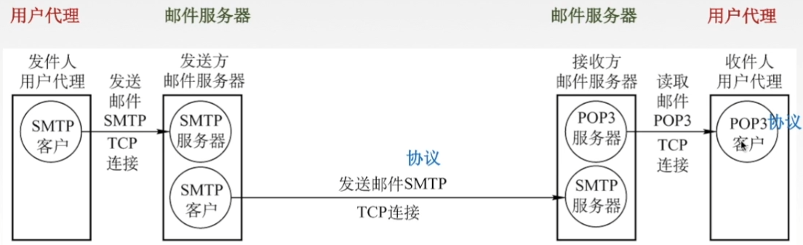

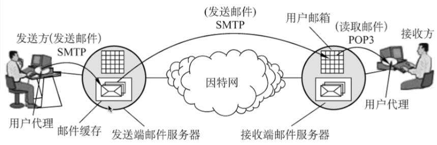

SMTP 规定了在两个相互通信的 SMTP 进程之间应如何交换信息，负责发送邮件的 SMTP 进程是 SMTP 客户，负责接收邮件的进程是 SMTP 服务器

SMTP 不能传送可执行文件或其他二进制对象
SMTP 仅限于传送 7 位 ASCII 码，不能传送其他非英语国家的文字
SMTP 服务器会拒绝超过一定长度的邮件

**通用因特网邮件扩充 MIME**

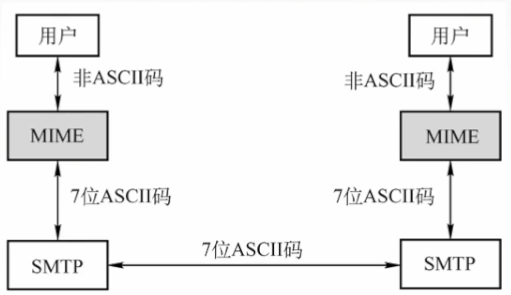

**邮局协议 POP3**

POP3 工作方式：下载并保留和下载并删除

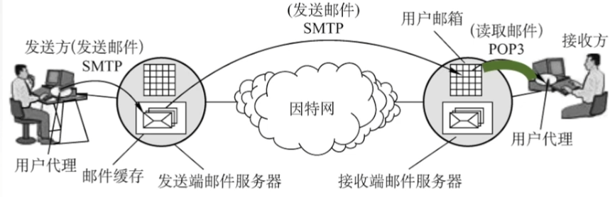

**网际报文存取协议 IMAP**

IMAP 比 POP3 更复杂，可以使用户先看到邮箱的首部，用户打开邮件时该邮件才上传到用户的计算机上。

### Web

万维网是无数个网络站点和网页的集合。通过统一资源定位符能够唯一标识万维网上的资源（文字、视频、音频）

URL = 协议://主机:端口/路径

**HTTP 报文结构**

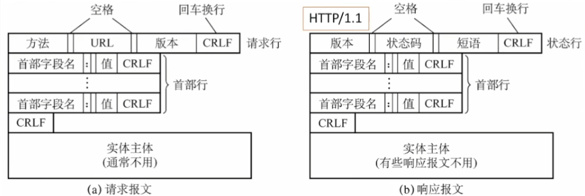

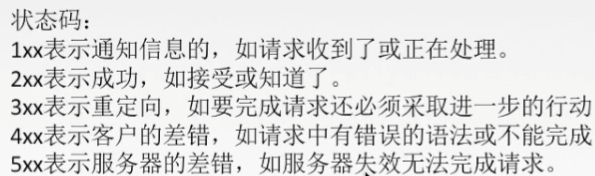
