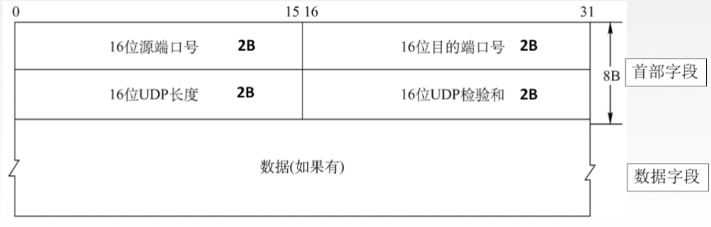
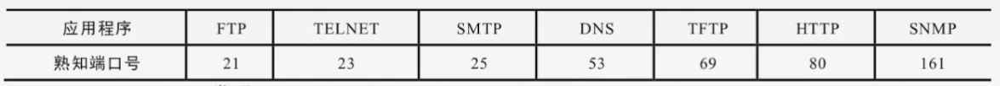
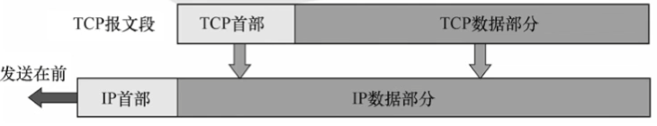
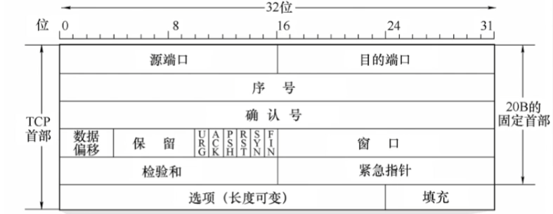
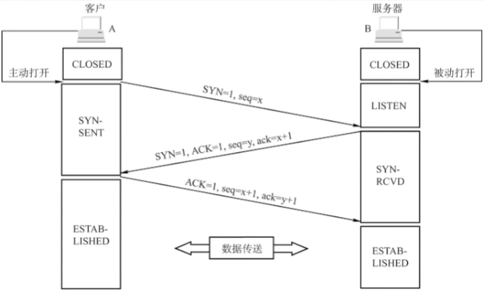
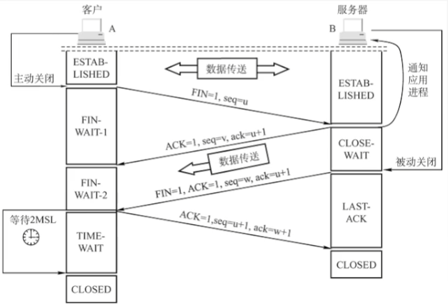
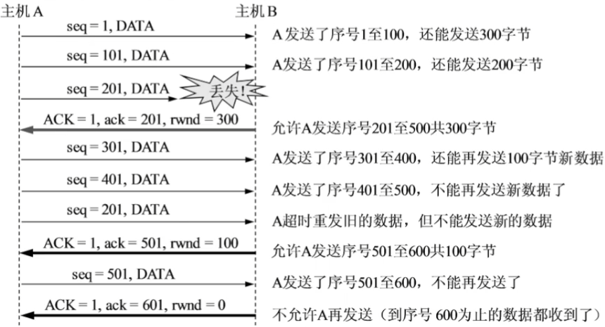
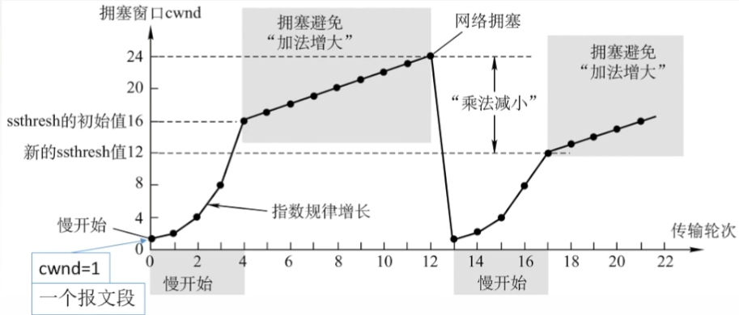
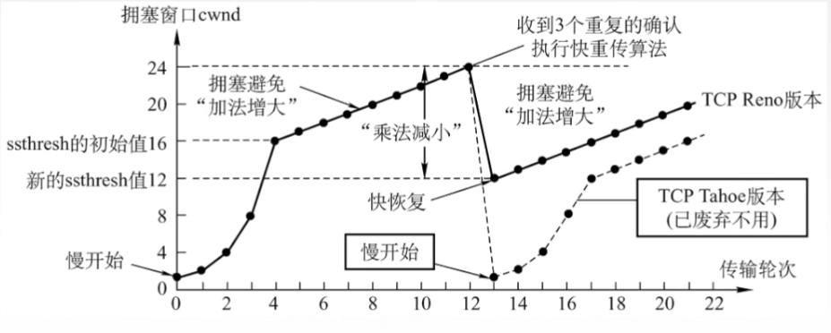

# 第三章 传输层

传输层提供进程与进程之间的逻辑通信，网络层提供主机之间的逻辑通信

- 可靠数据传输机制
- 流量控制机制
- 拥塞控制机制
- 多路复用/多路分用

### 复用分用

接收端进行多路分用：传输层依据头部信息将收到的报文段交给正确的 socket，即不同的进程
发送端进行多路复用：从多个 socket 接收数据，为每块数据封装上头部信息，生成报文段，交给网络层

### UDP

无连接的用户数据报协议 UDP，传送数据之前不需要建立连接，收到 UDP 报文之后也不需要给出任何确认。

UDP 在 IP 数据报服务之上增加了复用分用和差错检测。不可靠，无连接，时延小，适用于小文件。

**UDP 特点：**

基于 IP 协议，实现多路复用/多路分用和简单的错误校验
UDP 实现尽力而为服务，UDP 可能丢失或非按序到达
UDP 发送方和接收方之间不需要握手
UDP 是面向报文的，UDP 一次发一个完整报文
UDP 无需建立连接，能减少延迟
UDP 实现简单，无需维护连接状态
UDP 头部开销少，UDP 首部 8 字节， TCP 首部 20 字节
UDP 没有拥塞控制，应用可以更好地控制发送时间和速率

**UDP 报文段格式：**

UDP 长度：UDP 数据报的整个长度
UDP 校验和：检测 UDP 段在传输中是否发生错误（位翻转）

发送方：

- 将段的内容视为 16 bit 整数
- 校验和计算：计算所有整数的和，进位再与和相加，将得到的值按位取反得到校验和
- 发送方将校验和放入校验和字段中

接收方：

- 计算所收到的段的校验和
- 将其与校验和字段进行对比，不相等说明检测出错误，相等说明没有检测出错误（但也可能有错误）

### 套接字

在网络中采用发送方和接收方的套接字组合来识别端点，套接字唯一表示了网络中的一个主机和它上面的一个进程。套接字 = 主机 IP 地址 + 端口号

端口号长度为 16 bit，能表示 65535 个不同的端口号
0~1023 为熟知端口号，给 TCP/IP 最重要的一些服务端应用程序使用
1024 ~ 49151 为登记端口号，为没有熟知端口号服务端使用
49152~65535 仅在客户端运行时才由操作系统动态选择

### TCP

面向连接的传输控制协议 TCP，传送数据之前必须建立连接，数据传送结束后要释放连接。不提供广播或多播服务。由于 TCP 要提供可靠的面向连接的传输服务，因此增加了开销。

TCP 提供了可靠的、按序的字节流，面向连接，时延大，适用于大文件。
TCP 是面向连接的传输层协议。每一条 TCP 连接只能有两个端点，每一条 TCP 连接只能是点对点的
TCP 提供可靠交付的服务，无差错、不丢失、不重复、按序到达
TCP 提供全双工通信。发送缓存：准备发送的数据&已经发送但尚未收到确认的数据；接收缓存：按序到达但尚未被应用程序读取的数据&不按序到达的数据
TCP 面向字节流：TCP 把应用程序交下来的数据看成仅仅是一连串的无结构的字节流

**TCP 报文段首部格式**

序号 seq：在一个 TCP 连接中传送的字节流中的每一个字节都按顺序编号，序号表示本报文段所发送数据的第一个字节的序号
确认号 ack：期望收到对方下一个报文段的第一个数据字节的序号，若确认号为 N，则证明序号 N-1 为止的所有数据都已正确收到（累计确认）
数据偏移（首部长度）：TCP 报文段的数据起始处距离 TCP 报文段的起始处位置，4B 为单位
紧急位 URG：URG = 1 时，标明此报文段中有紧急数据，是最高优先级的数据，应尽快传送不用在缓存里排队，配合紧急指针字段使用
确认位 ACK：ACK = 1 时确认号有效，在连接建立后所有传送的报文段都必须把 ACK 置为 1
推送位 PSH：PSH = 1 时接收方尽快交付给接收应用进程，不再等到缓存填满再向上交付
复位 RST：RST = 1 时表明 TCP 连接中出现严重差错，必须释放连接，然后再重新建立传输连接
同步位 SYN：SYN = 1 时表明一个连接请求/接收报文
终止位 FIN：FIN = 1 时表明此报文段发送方数据已发完，要求释放连接
窗口：指的是发送本报文段的一方的接收窗口，即现在允许对方发送的数据量
检验和：检验首部+数据，检验时要加上 12 B 伪首部
紧急指针：URG = 1 时才有意义，指出本报文段中紧急数据的字节数
选项：最大报文段长度 MSS、窗口扩大、时间戳、选择确认

**TCP 连接管理**

TCP 连接传输三个阶段：连接建立->数据传送->连接释放
TCP 连接的建立采用客户服务器方式，主动发起连接建立的应用进程叫做客户，而被动等待连接建立的应用叫做服务器。

**TCP 连接建立**

ROUND 1：
客户端发送请求连接报文段，无应用层数据。SYN = 1, seq = x (随机)

ROUND 2：
服务器端为该 TCP 连接分配缓存和变量，并向客户端返回确认报文段，允许连接，无应用层数据。SYN = 1, ACK = 1, seq = y (随机), ack = x + 1

ROUND 3：
客户端为该 TCP 连接分配缓存和变量，并向服务器端返回确认的确认，可以携带数据。SYN = 0, ACK = 1, seq = x + 1, ack = y + 1

**SYN 洪泛攻击**

SYN 洪泛攻击发生在 OSI 第四层，利用 TCP 协议的三次握手。攻击者发送 TCP SYN，即第三次握手的第一个数据包。当服务器返回 ACK 后，该攻击者不对其进行确认，这个 TCP 处于挂起状态（半连接状态）。攻击者对服务器发送大量的 TCP SYN，最终消耗服务器 CPU 和内存。

**TCP 释放连接**

参与一条 TCP 连接的两个进程中的任何一个都能终止该连接，连接结束后，主机中的资源将被释放

ROUND1：客户端发送连接释放报文端，停止发送数据，主动关闭 TCP 连接。FIN = 1, seq = u

ROUND 2：服务器端回送一个确认报文端，释放客户到服务器的连接。ACK = 1, seq = v, ack = u + 1

ROUND 3：服务器端发完数据，就发出连接释放报文，主动关闭 TCP 连接。FIN = 1, ACK = 1, seq = w, ack = u + 1

ROUND 4 ：客户端回送一个确认报文段，再等到时间等待计时器设置的 2MSL （最长报文段寿命）后，连接彻底关闭。ACK = 1, seq = u + 1, ack = w + 1

**TCP 流量控制**

TCP 利用滑动窗口机制实现流量控制

在通信过程中，接收方根据自己接收缓存的大小，动态地调整发送方的发送窗口大小，即接收窗口。接收方设置确认报文段的窗口字段来将 rwnd 通知给发送方，发送方的发送窗口取决于接收窗口 rwnd 和拥塞窗口 cwnd 的最小值

假设 A 向 B 发送数据，连接建立时，B 通知 A：接收窗口为 400 B，设每个报文段 100 B，报文段序号初始值为 1。

TCP 为每一个连接设有一个连续的计时器，只要 TCP 连接的一放收到对方的零窗口通知，就启动持续计时器。
若持续计时器设置的时间到期，就发送一个零窗口探测报文段，接收方收到探测报文段时给出现在的窗口值。
若窗口仍然是 0 ，发送方就重新设置持续计时器。

### 拥塞控制

出现拥塞的条件：对资源需求的总和  > 可用资源。拥塞控制防止过多的数据注入到网络中

接收窗口：接收方根据接收缓存设置的值，并告知给发送方，反映接收方的容量
拥塞窗口：发送方根据自己估算的网络拥塞程序而设置的窗口值，反映网络当前容量

一个传输轮次：发送了一批报文段并收到它们的确认的时间，即一个往返时延 RTT

加性增，乘性减

如果发送方收到对同一数据的 3 个 ACK ，说明该数据之后的段已经丢失，在定时器超时之前进行重传，称为快速重传。

