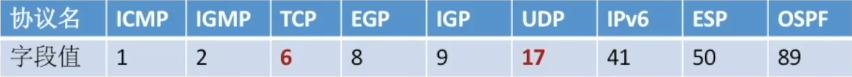
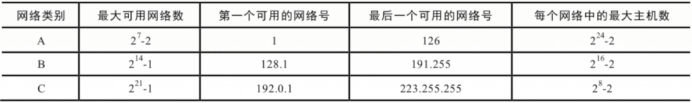

# 第四章 网络层

网络层主要任务是把分组从源端传到目的端，为分组交换网上的不同主机提供通信服务。网络层传输单位是数据报、主要实现功能包括：路由选择和分组转发、异构网络互联和拥塞控制

转发：将分组从路由器的输入端口转移到合适的输出端口
路由：通过路由算法确定分组从源到目的经过的路径

### 数据交换方式

#### 电路交换

优点：通信时延小，有序传输，没有冲突，实时性强，独占通信资源。
缺点：建立连接时间长，线路独占，使用效率低，灵活性差，无差错控制能力
过程：建立连接（呼叫/电路建立）-> 通信 -> 释放连接（拆除电路）

#### 报文交换

报文：源应用发送的信息整体

优点：无需建立连接，存储转发，动态分配路线，路线可靠性高，线路利用率高，多目标服务
缺点：有存储转发时延，报文大小不定，需要网络结点有较大的缓存空间

#### 分组交换

优点：无需建立连接，存储转发，动态分配路线，线路可靠性较高，线路利用率较高，相对于报文交换，更容易存储管理
缺点：有存储转发时延，需要传输额外的信息量，乱序到达目的主机，需要对分组排序重组

报文交换和分组交换都采用存储转发
电路交换传输时延最小，当传送数据量大且传送时间远大于呼叫时间时选择电交换
从信道利用率来看，报文交换和分组交换优于电路交换，其中分组交换时延更小

**数据报方式**

数据报方式为网络层提供无连接服务

无连接服务：不是先为分组的传输确认传输路径，每个分组独立确定传输路径，不同分组传输路径可能不同

每个分组携带源和目的地址，路由器根据分组的目的地址转发分组：基于路由协议/算法构建转发表，检索转发表

| 目的网络地址 | 链路接口 |
| ------------ | -------- |
|              |          |

**虚电路方式**

虚电路方式为网络层提供连接服务：首先为分组的传输确定传输路径，然后沿该路径传输系列分组，系列分组传输路径相同，传输结束后拆除电路

一条源主机到目的主机类似于电路的路径（逻辑连接），路径上的所有结点都要维持这条虚电路的建立，都维持一张虚电路表，每一项记录了一个打开的虚电路信息

每个分组携带虚电路号而不是目的地址。源主机发送“呼叫请求”分组并收到“呼叫应答”分组后才算建立连接。释放连接时源主机发送“释放请求”分组以拆除虚电路。

### IP 数据报

#### IP 数据报格式

版本：IPv4 或 IPv6
首部长度：单位是 4B，最小为 5，因为首部长度最小长度为 20B
区分服务：指示期望获得哪种类型的服务
总长度：首部长度+数据长度，单位是 1B
生存时间 (TTL)：IP 分组经过一个路由器 -1，当 TTL 变成 0 时直接丢弃该分组
协议：数据部分的协议

首部检验和：只检验首部
源 IP 地址和目的 IP 地址：32 位
可选字段：0~40 B，用来排错、测量以及安全等措施
填充：全 0 ，把首部补成 4B 的整数倍

#### IP 数据报分片

标识：同一数据报的分片使用同一标识
标志：有三位，但只有两位有意义：x__

​	中间位：DF，DF = 1（禁止分片），DF = 0（允许分片）
​	最低位：MF，MF =1（后面还有分片），MF = 0（代表最后一片或没分片）

片偏移：分组分片在原分组中的相对位置，以 8 B 为单位。除了最后一个分片，每个分片的长度一定是 8B 的整数倍。

#### 三种传播方式

单播：单播用于发送数据包到单个目的地址，且每发送一份单播报文都使用一个单播 IP 地址作为目的地址，是一种点对点传输方式

广播：广播是指发送数据包到同一广播域或子网内的所有设备，是一种点对多点传输方式

组播（多播）：当网络中的某些用户需要特定数据时，组播数据发送者仅发送一次数据，借助组播路由协议为组播数据包建立组播转发树。被传递的数据到达距离用户端尽可能近的结点后才开始复制和分发，是一种点对多点传输方式

### IPv4 地址

IP 地址是全球唯一的 32 位/4 字节标识符，标识路由器或主机的接口，IP 地址由网络号和主机号构成

#### IP 地址分类

特殊 IP 地址：

私有 IP 地址：路由器不转发私有 IP 地址的分组，适用于内部网路。

#### 网路地址转换 (NAT)

在专用网连接到因特网的路由器上安装 NAT 软件，安装 NAT 软件的路由器叫 NAT 路由器，它至少有一个有效的外部全球 IP 地址。

NAT 路由器维护一张 NAT 转换表，当内网的分组经过 NAT 路由器和外网通信时，NAT 路由器将替换原始的 IP 数据报源地址和端口号。源地址字段的私有 IP 地址被替换成 NAT 路由器的全球 IP 地址，端口号被替换成路由器为其分配的一个端口号。

#### 子网划分

将主机号在细分为子网号和主机号，子网号能更进一步划分主机。

子网掩码与 IP 地址逐位相与得到子网网络地址，包括网络号+子网号

#### 无分类编址方法 (CIDR)

CIDR 把网络前缀都相同的连续 IP 地址划分成一个 CIDR 地址块。CIDR 记法是在 IP 地址后加上 /，然后写上网络前缀的位数，如 128.14.35.7/20 是 CIDR 地址块中的一个地址，即 **10000000 00001110 0010**0011 00000111 中前 20 位（加粗的部分）是网络前缀。CIDR 的地址掩码是在网络前缀全为 1，主机号部分全为 0。

CIDR 消除了传统的 A 类、B 类和 C 类地址划分以及划分子网的概念。

最长前缀匹配：使用 CIDR 时，查找路由表可能获得几个匹配结果，应选择具有最长网络前缀的路由。前缀越长，地址块越小，路由越具体，

#### ARP 协议

由于在实际的链路上传送数据帧时，最终必须使用 MAC 地址。ARP 协议完成主机或路由器 IP 地址到 MAC 地址的映射

APR 协议使用过程：

检查主机或路由器的 **ARP 高速缓存**，有对应表项则写入 MAC 帧中的目的 MAC 地址，没有则用目的 MAC 地址 为 FF-FF-FF-FF-FF 的帧封装并广播 **ARP 请求分组**。**同一局域网中**的所有主机都能收到该请求。目的主机收到该请求后会向源主机单播一个 **ARP 响应分组**，源主机收到后将此映射写入 ARP 缓存中。（10~20 分钟更新一次）

ARP 协议 4 种典型情况：

1. 主机 A 发给本网络上的主机 B：用 ARP 找到主机 B 的 MAC 地址
2. 主机 A 发给另一网络上的主机 B：用 ARP 找到本网络上一个路由器的 MAC 地址
3. 路由器发给本网络的主机 A：用 ARP 找到主机 A 的 MAC 地址
4. 路由器发给另一个网络的主机 B：用 ARP 找到本网络种的一个路由器的 MAC 地址

#### DHCP 协议

动态主机配置协议 DHCP 是**应用层**协议，使用客户端/服务器方式，客户端和服务器通过广播方式进行交互，基于 UDP。

主机可以从 DHCP 服务器动态获取 IP 地址、子网掩码、默认网关，允许地址重用，支持移动用户加入网络，支持在用地址续租。

1. 主机广播 DHCP 发现报文，试图找到网络中的服务器，网络中所有 DHCP 服务器获得主机 IP 地址
2. DCHP 服务器广播 DHCP 提供报文，服务器拟分配给主机一个 IP 地址及相关配置，主机选择第一个达到的提供报文
3. 主机**广播** DHCP 请求报文，主机向所选择的服务器请求提供 IP 地址
4. DHCP 服务器**广播** DHCP 确认报文，服务器正式将 IP 地址分配给主机

#### ICMP 协议

ICMP 协议支持主机或路由器，可生成差错报告报文或网络探询

ICMP 差错报告报文：

1. 终点不可达：当路由器或主机不能交付数据报时向源点发送该报文
2. 源头抑制：当路由器或主机由于拥塞而丢弃数据报时发送该报文
3. 时间超时：当路由器收到生存时间 TTL = 0 的数据报时丢弃数据报并发送该报文；当终点在预先规定的时间内不能收到一个数据报的全部分片时，丢弃已收到的所有分片并发送该报文
4. 参数问题：当路由器或目的主机收到的数据报的首部中有的字段的值不正确时，丢弃该数据并发送该报文
5. 改变路由（重定向）：路由器发送该报文给主机，主机下次可以将数据报发送给其他的路由器。

不发送差错报文的情况：

1. 对 ICMP 差错报告报文不再发送 ICMP 差错报告报文
2. 对第一个分片的数据报文的所有后续分片都不发送 ICMP 差错报告报文
3. 对具有组播地址的数据报都不发送 ICMP 差错报告报文
4. 对具有特殊地址的数据报不发送 ICMP 差错报告报文

**ICMP 差错报告报文数据报格式：**

ICMP 询问报文：

1. 回送请求和回答报文：主机或路由器向特定目的的主机发出询问，收到此报文的主机必须给源主机或路由器发送 ICMP 回送回答报文。测试目的站点是否可达或了解其相关状态
2. 时间戳请求和回答报文：请某个主机或路由器回答当前的日期和时间。用来进行时钟同步和测量时间

Ping 测试两个主机之间的连通性，使用了 ICMP 回送请求和回答报文
Traceroute 跟踪一个分组从源点到终点的路径，使用了 ICMP 时间超过差错报告报文。

### IPv6 地址

IPv6 数据报格式：

 

版本：指明了协议版本，总是 6
优先级：区分数据报的类别和优先级
流标签：所有属于同一个流的数据报都具有同样的流标签
有效载荷长度：扩展首部 + 数据的大小
下一个首部：标识下一个扩展首部，最后一个扩展首部的下一个首部指向数据
跳数限制：相当于 IPv4 的 TTL
源地址：128 位
目的地址：128 位
有效载荷：包含扩展首部和数据

#### IPV 4 与 IPv6

1. IPv6 将地址从 32 位（4B）扩大到 **128 位**（16B），拥有更大的地址空间
2. IPV6 将 IPv4 的检验和字段彻底移除，以减少每条的处理时间
3. IPv6 将 IPv4 的可选字段移除首部，变成**扩展首部**。路由器通常不对扩展首部进行检查，大大提高了路由器的处理效率
4. IPv6 支持**即插即用**（即自动配置），不需要 DHCP 协议
5. IPv6 首部长度必须是 **8B 的整数倍**，IPv4 首部长度是 4B 的整数倍
6. IPv6 **只能在主机处分片**，IPv4 可以在路由器和主机处分片
7. ICMPv6 中增加了分组过大的差错报告
8. IPv6 取消了协议字段，改成下一个首部字段
9. IPv6 取消了总长度字段，改用有效载荷长度字段
10. IPv6 取消了服务类型字段

#### IPv6 地址表示形式

一般采用冒号十六进制记法：4BF5:AA12:0216:FEBC:BA5F:039A:BE9A:2170
压缩形式：4BF5:0000:0000:0000:BA5F:039A:000A:2176 可被压缩成 4BF5:0:0:0:BA5F:39A:A:2176
零压缩：一连串连续的 0 可以被一对冒号取代

**IPv6 地址分类**

单播地址：一对一通信，可做源地址+目的地址
多播地址：一对多通信，可做目的地址
任播地址：一对多中的一个通信，可做目的地址

**IPv6 向 IPv4 过渡的策略**

双栈协议：双协议栈技术指在一台设备上同时启用 IPv4 协议和 IPv6 协议。如果设备是路由器，在路由器的不同接口上分别配置了 IPv4 和 IPv6 地址，可以同时连接 IPv4 网络和 IPv6 网络；如果设备是主机，将同时拥有 IPv4 和 IPv6 地址。

隧道技术：使用隧道传递的数据可以是不同协议的数据帧或数据包。隧道协议将其他协议的数据帧或数据包重新封装然后通过隧道发送，可以将 IPv6 数据封装在 IPv4 中进行传输。

### 路由算法

**静态路由算法（非自适应路由算法）**

管理员手工配置路由信息。路由更新慢，在负载稳定、拓扑结构变化不大的网络中运行效果好，适用于高度安全的军事网络和较小的商业网络，但不适用于大型网络。

**动态路由算法（自适应路由算法）**

路由器之间彼此交换信息，按照路由算法优化出路由表项。路由更新快，适用于大型网络，及时响应链路费用或网络拓扑结构变化，但算法复杂，增加网络负担。

动态路由算法可细分为：

1. 链路状态路由算法 OSPF：所有路由器掌握完整的网络拓扑结构和链路费用信息
2. 距离向量路由算法 RIP：路由只掌握物理相连的邻居及链路费用

路由选择协议分为两种：

1. 内部网关协议 IGP，常使用 RIP 或 OSPF
2. 外部网关协议 EGP，常使用 BGP 

一个自治系统 AS 内部的路由使用内部网关协议 IGP 确定分组在该 AS 内的路由；使用外部网关协议 EGP 确定 AS 之间的路由。

路由器转发分组算法过程：

1. 提取目的 IP 地址
2. 是否直接交付给本网络内的某台主机（通过子网掩码判断），否则进入第 3 步
3. 是否和路由表中特定主机路由匹配，否则进入第 4 步
4. 是否和路由表中所有路径中的某一个匹配，否则进入第 5 步
5. 转发到默认路由 0.0.0.0，当分组 TTL 为 0 时，进入第 6 步
6. 丢弃，报告转发分组错误

#### RIP 协议

- RIP 是一种分布式的基于距离向量的路由选择协议，是因特网的标准协议。RIP 协议要求网络中的每个路由器都维护从它自己到其他每一个目的网络的唯一最佳距离记录

- 距离：也称为跳数，即从源端口到目的端口所经过的路由器个数，经过一个路由器跳数 + 1。特别的，从一个路由器到直接连接的网络距离为 1。RIP 只允许一条路由最多包含 15 个路由器，因此距离 16 代表网络不可达。RIP 协议只适用于小互联网

- RIP 是应用层协议，使用 UDP 传送数据。一个 RIP 报文最多可包括 25 个路由，如果超过，必须再用一个 RIP 报文传送

- RIP 协议规定路由器仅和相邻路由器交换信息，路由器交换的信息是自己的路由表，每 30 秒交换一次路由信息，然后路由器根据新信息更新路由表。若超过 180 秒没收到邻居路由器的通告，则判定邻居路由器没了，并更新自己的路由表

- 路由器刚开始工作时，只知道直接相连的网络距离为 1。接着每一个路由器也只和数目非常有限的相邻路由器交换并更新路由信息。经过若干次更新后，所有路由器最终都会知道到达本自治系统任何一个网络的最短距离和下一跳路由器的地址，即“收敛”。好消息传得快，坏消息传得慢

**距离向量算法过程：**

1. 修改相邻路由器发来的 RIP 报文中的所有表项，对地址为 X 的相邻路由器发来的 RIP 报文，修改此报文中的所有项目：把”下一跳“字段中的地址改为 X，并把所有的距离字段 + 1。  
2. 对修改后的  RIP 报文中的每一个项目，进行以下步骤：
   - 若当前路由表中没有该项的信息，把该项目填入当前路由器中；若有，则查看下一跳路由器地址
   - 若下一跳是 X，则用收到的项目替换源路由表中的项目，保持最新信息
   - 若下一跳不是 X，原来的距离比现在的距离更近则更新，否则不做处理
   - 若 180 秒还没收到相邻路由器 X 的更新路由表，则把 X 标记为不可达的路由器，即把距离设别为 16
   - 返回

#### OSPF 协议

- 开放最短路径优先 OSPF 协议使用了 Dijkstra 提出得最短路径算法 SPF。OSPF 最主要得特征是使用了分布式的链路状态协议

- OSPF 协议使用洪泛法向自治系统内所有路由器发送信息，即路由器通过输出端口向所有相邻路由器发送信息，而每一个相邻路由器又再次将此信息发送其所有的相邻路由器（广播），最终整个区域内所有路由器都得到了这个信息的一个副本

- 发送的信息就是本路由器相邻的所有路由器的链路状态（包括本路由器和哪些路由器相邻，以及该链路的费用、距离、时延和带宽等）

- 只有当链路状态发生变化时，路由器才向所有路由器洪泛发送此信息，最后所有路由器都能建立一个链路状态数据库，即全网拓扑图
- OSPF 直接使用 IP 数据报传送，每隔 30 分要刷新一次数据库中的链路状态，OSPF 不存在坏消息传得慢的问题，因为它的收敛速度很快
- 由于一个路由器的链路状态只涉及到与相邻路由器的连通状态，与整个互联网的规模无直接关系。因此当互联网规模很大时，OSPF 协议要比 RIP 协议好得多

**链路状态路由算法过程：**

1. 每个路由器会发现它的邻居结点 [HELLO 问候分组] 并了解邻居结点的网络地址
2. 设置到它的每个邻居的成本度量 metric
3. 构造 [DD 数据库描述分组]，向邻站给出自己的链路状态数据库中的所有链路状态项目的摘要信息
4. 如果 DD 分组中的摘要自己都有，则邻站不做处理；如果没有或者是更新的，则发送 [LSR 链路状态请求分组]，请求自己没有或比自己更新的信息
5. 收到邻站的 LSR 分组后，发送 [LSU 链路状态更新分组] 进行更新
6. 更新完毕后，邻站返回一个 [LSAck 链路状态确认分组] 进行确认

只要一个路由器的链路状态发生变化：

1. 洪泛发送 [LSU 链路状态更新分组] 进行更新
2. 更新完毕后，其他站返回一个 [LSAck 链路状态确认分组] 进行确认
3. 使用 Dijkstra 根据自己的链路状态数据库构造到其他结点间的最短路劲

#### BGP 协议

- BGP 协议与其他 AS 的邻站 BGP 发言人交换网络可达性信息，即要达到某个网络所要经过的一系列 AS，发生变化时更新有变化的部分

- BGP 所交换的网络可达性的信息就是要到达某个网络所经过的一系列 AS。当 BGP 发言人互相交换了网络可达性的信息后，各 BGP 发言人就根据所采用的策略从收到的路由器信息中找到到达 AS 的较好路由
- BGP 是应用层协议，借助 TCP 传送
- BGP 支持 CIDR，因此 BGP 的路由表应该包括目的网络前缀、下一跳路由器以及到达该目的网络所经过的各个自治系统序列
- BGP 刚刚运行时，BGP 的邻站是交换整个的 BGP 路由表，但以后只需要在发生变化时更新有变化的部分。这样做对节省网络带宽和减少路由器的处理开销都有好处

**BGP-4 的四种报文**

1. OPEN 打开报文：用来与相邻的另一个 BGP 发言人建立关系，并认证发送方
2. UPDATE 更新报文：通告新路径或撤销原路径
3. KEEPALIVE 保活报文：在无 UPDATE 时，周期性证实邻站的连通性，也作为 OPEN 的确认
4. NOTIFICATION 通知报文：报告先前报文的差错；也被用于关闭连接

#### 三种路由协议比较

- RIP 是一种分布式的基于距离向量的内部网关路由协议，通过广播 UDP 报文来交换路由信息
- OSPF 是一个内部网关协议，要交换的信息量较大，应使报文的长度尽量端，所以不使用传输层协议，而是直接采用 IP
- BGP 是一个外部网关协议，在不同的自治系统之间交换路由信息，由于网络环境复杂，需要保证可靠传输，所以采用 TCP

### 移动 IP

移动  IP 技术是移动结点（计算机/服务器等）以固定的网络 IP 地址，实现跨越不同网段的漫游功能，并保持了基于网络的网络权限在漫游过程中不发生任何改变。

移动结点：具有永久  IP 地址的移动设备
归属代理（本地代理）：在对归属网络中帮助移动结点执行移动管理功能的实体叫做本地代理
外部代理（外地代理）：在外部网络中帮助移动结点完成移动管理功能的实体称为外部代理
永久地址（归属地址/主地址）：移动结点在归属网络中的原始地址
转交地址（辅地址）：移动结点在外部网络中使用的临时地址

**移动 IP 通信过程**

A 刚进入外部网络时：

1. 在外部代理登记获得一个转交地址，离开时注销该地址
2. 外地代理向本地代理登记转交地址

B 给 A 发送数据报时：

1. 本地代理截获数据报
2. 本地代理再封装数据报，新的数据报目的地址是转交地址，发给外部代理
3. 外部代理拆封数据报并发给 A

A 给 B 发送数据报时：

A 用自己的主地址作为数据报源地址，用 B 的 IP 地址作为数据报的目的地址

A 移动到下一个网络时：

1. 在新的外部代理登记注册一个转交地址
2. 新外部代理给本地代理发送新的转交地址，覆盖了旧的转交地址
3. 通信

A 回到归属网络时：

1. A 向本地代理注销转交地址
2. 按原始方式通信

### 网络层设备

路由器是一种具有多个输入端口和多个输出端口的专用计算机，其任务是转发分组

路由选择：根据所选定的路由选择协议构造出路由表，同时经常或定期地和相邻路由器交换路由信息而不断地更新维护路由表

分组转发：根据转发表对分组进行转发，若收到 RIP/OSPF 分组等，则把分组送往路由选择处理机；若收到数据分组，则查找转发表并输出

当队列满时，再进入队列的分组由于没有存储空间只能被丢弃。路由器的输入或输出队列产生溢出是造成分组丢失的重要原因

路由表时通过路由选择算法得出，转发表由路由表得来。