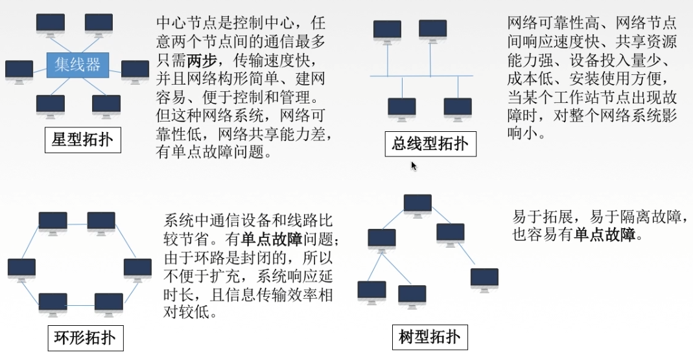
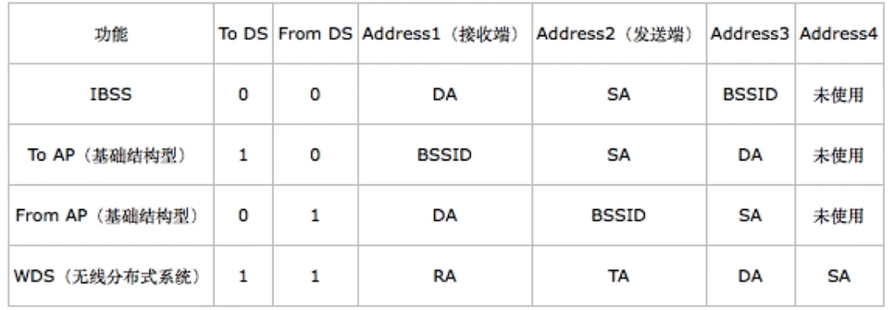

# 第五章 链路层

### 功能

**结点**：主机、路由器

**链路**：网络中两个结点之间的物理通道，链路的传输介质主要有双绞线、光纤和微波。分为有线链路和无线链路

**数据链路**：网络中两个结点之间的逻辑通道，链路和实现数据传输协议的硬件和软件构成数据链路

**帧**：链路层的协议单元数据，封装了网络层数据报

数据链路层负责通过一条链路从一个结点向另一个物理层链路直接相连的相邻结点传送数据报

- 为网络层提供服务：无确认无连接服务、有确认无连接服务、有确认面向连接服务
- 链路管理：建立连接、维持连接和释放连接（用户面向连接的服务）
- 组帧
- 流量控制
- 差错控制

### 组帧

封装成帧是在一端数据的前后部分添加首部和尾部。接收端收到物理层的比特流后，根据首部和尾部的标记，从收到的比特流中识别帧的开始和结束。

**帧同步**：接收方应当能从接收到的二进制比特流中区分出帧的起始和终止。
**透明传输**：不管所传数据是什么比特组合，都应该能在链路上传送。

**字符计数法**

帧首部使用一个计数字段（第一个字节）来标明帧内字符数。

**字符填充法**

若数据中有和控制信息相同的比特序列，插入转义字符，使得接收方能正确识别帧首部和尾部的控制信息。

**零比特填充法**

首部和尾部标记都是 01111110，在发送端扫描整个信息字段时，只要发现连续 5 个 1 就立即填入 1 个 0。
在接收端收到一个帧时，先找到标志字段确定边界，再用硬件对比特流扫描，发现连续 5 个 1 就删除后面的 1 个 0。

**违规编码法**

在曼彻斯特编码中，不可能出现电平高-高或电平低-低的违规编码方式，因此可以利用这两种情况来标记帧的边界。

### 差错控制

传输中的差错都是由于噪声引起的。

全局性：由于线路本身电气特性所产生的随机噪声（热噪声）是信道固有的、随机存在得到。
局部性：外界特定的短暂原因所造成的冲击噪声是产生差错的主要原因。

差错可分为位错和帧错。

- 位错即比特位出错，1 变成 0 ，0 变成 1。
- 帧错包括丢失、重复和失序。

对于通信质量好的有线传输链路链路层为网络层提供了无确认无连接服务。
对于通信质量差的无线传输链路链路层为网络层提供了有确认面向连接服务。

数据链路层针对一组比特编码，通过冗余码技术检测一串比特在传输过程是否出现差错
物理层针对单个比特编码，解决传输过程中比特的同步问题

#### 奇偶校验码

只能检查出奇数个 (1,3,5...) 比特错误，检错能力为 50%。

#### 循环冗余码(CRC)

发送端：要传输的数据 / 生成多项式 = FCS 帧检验序列（冗余码），最终发送的数据 = 要发送数据 + FCS
接收端：接收到的数据 / 生成多项式。若余数为 0 ，接收无误的帧，否则丢弃错误的帧。

计算冗余码：

- 加 0，若多项式有 N 位，阶为 N-1，在要传输数据的比特序列后加上 N-1 个 0
- 模 2 除法，通过异或运算，得到的余数为 FCS

接收方把收到的每一个帧都除以同样的除法，若得到的余数为 0，接收无误的该帧，否则丢弃错误的该帧。

#### 海明码

发现双比特错，纠正单布特错。海明不等式 2^r^ ≥ k+r+1，r 为冗余信息位，k 为信息位

**确认冗余信息位：**
若要发送的数据位数 k = 6，满足不等式的 r 最小值为 4，所以原数据信息位为 6 时，至少需要 4 位冗余信息位。

**确定校验码和数据的位置**

校验码放在 2 的幂次方位置（1，2，4，8...），数据按序把剩下的空填满

**求出校验码的值**

第一位冗余信息位 P~1~位于第 1 位 (0001)，第 3 (0011)、5 (0101)、7 (0111)、9 (1001) 数据位的第 1 bit 位与其对应，都为 1，令所有要校验的位异或为 0 即可求出 P~1~ 的值。

P~1~ XOR D~1~ XOR D~2~ XOR D~4~ XOR D~5~ = 0，即 P~1~ XOR 1 XOR 0 XOR 1 XOR 0 = 0，P~1~ = 0

第二位冗余信息位 P~2~位于第 2 位 (0010)，第 3 (0011)、6 (0110)、7 (0111)、10 (1010) 数据位的第 2 位 bit 与其对应，都为 1，令所有要校验的位异或为 0 即可求出 P~2~ 的值。

P~2~ XOR D~1~ XOR D~3~ XOR D~4~ XOR D~6~ = 0，即 P~2~ XOR 1 XOR 1 XOR 1 XOR 1 = 0，P~2~ = 0

第三位冗余信息位位于第 4 位 (0100)，同理可得第 5 (0101)、6 (0110)、7 (0111) 数据位的第 3 位 bit 与其对应，都为 1。

第四位冗余信息位位于第 8 位 (1000)，同理可得第 9 (1001)、10 (1010) 数据位的第 4 位 bit 与其对应，都为 1。

所以 101101 的海明码为 0010011101。

**检错纠错**

令所有要检验的位异或运算，和上一步类似。若所得结果为 0 ，则数据无误；若所得结果不为 0 ，例如所得的二进制序列 0101 表明第 5 位出错。

### 流量控制

流量控制：控制发送速率，使接收方有足够的缓冲空间来接收每一个帧
可靠传输：发送端发什么接收方就接收什么
滑动窗口解决了流量控制和可靠传输

数据链路层的流量控制是点对点的，传输层的流量控制是端到端的。
数据链路层当接收方收不下时就不回复确认；传输层当接收方收不下时给发送方一个窗口公告。

停止-等待协议：发送窗口大小 = 1，接收窗口大小 = 1
后退 N 帧协议 (GBN)：发送窗口大小 >1，接收窗口大小 = 1
选择重传协议 (SR)：发送窗口大小 > 1，接收窗口大小 > 1

**停止-等待协议**

停等协议的信道利用率太低，信道利用率 = T~D~/(T~D~ + RTT + T~A~)

**GBN 协议**

- GBN 对 n 号帧采用累计确认方式，表明接收方已经收到 n 号帧和它之前的全部帧
- 如果出现超时，发送方重传所有已发送但未确认的帧

- 接收方如果正确并按序收到 n 号帧，接收方为 n 帧发送一个 ACK，并将该帧中的数据部分交付上层
- 接收方无需缓存任何失序帧，只接收按顺序的帧，丢弃无序帧。只需要维护一个信息：期望接收的下一个帧的序号
- 若采用 n 个比特对帧编号，那么滑动窗口的尺寸应满足：1 ≤ W~T~ ≤ 2^n^-1。若滑动窗口过大，接收方无法区别新帧和旧帧

GBN 协议因连续发送数据帧而提高了信道利用率，但重传时必须把原来正确传送的数据帧重传，传送效率降低。

**SR 协议**

- 每个帧都有自己的定时器，一个超时事件发生后只重传一个帧
- 接收方将确认一个正确接收的帧并不管该帧是否按序。失序的帧将被缓存，只重传出错的帧
- 对数据帧逐一确认，接收一个帧确认一个帧
- 如果收到了窗口序号外（上一个窗口）的帧，将返回一个 ACK；收到上一个窗口之前的帧将直接丢弃且不回应
- 若采用 n 个比特对帧编号，那么滑动窗口的尺寸应满足：W~Tmax~ =  W~Rmax~ = 2^(n-1)^

### 介质访问控制

传输数据使用的两种链路：

点对点俩路：两个相邻节点通过一个链路相连，没有第三者。例如 PPP 协议，常用于广域网。
广播式链路：所有主机共享通信介质，常用于局域网

介质访问控制是采取一定的措施，使得两对结点之间的通信不会发生互相干扰的情况。

信道划分介质访问控制协议适用于网络负载重时，共享信道效率高且公平；网络负载轻时，共享信道效率低。
随机访问介质访问控制协议适用于网络负载轻时，共享信道效率高，单个结点可利用信道全部带宽；网络负载重时，会产生冲突开销。

轮询访问介质访问控制协议既要不产生冲突，又要发生时全全部带宽。

#### 静态划分信道（信道划分介质访问控制）

将使用介质的每个设备与来自同一信道上的其他设备的通信隔开，把时域和频域合理地分配给网络上的设备。
多路复用技术：把多个信号组成在一条物理信道上进行传输，使得多个计算或终端设备共享信道资源，提供信道利用率

**频分多路复用 FDM**

用户在分配到一定的频带后，在通信过程中自始自终都占用这个频带。频分复用的所有用户在同样的时间占用不同的带宽（频率带宽）资源。

**时分多路复用 TDM**

将时间划分为一段段等长的时分复用帧。每一个时分复用的用户在每一个 TDM 帧中占用固定序号的时隙，所有用户轮流占用信道。

**波分多路复用 WDM**

波分多路复用就是光的频分多路复用，在一根光纤中传输多种不同波长的光信号，由于波长不同，所以各路光信号互不干扰，最后再用波长分解复用器将各路波长分解出来。

**码分多路复用 CDM**

1 个比特分为多个码片，每一个站点被指定一个唯一的 m 位的芯片序列。
发送 1 时站点发送芯片序列，发送 0 时发送芯片序列反码。

#### 动态分配信道

信道并非在用户通信时固定分配给用户。

**轮询访问介质访问控制**

*轮询协议：*

主结点轮流邀请从属结点发送数据，但会产生轮询开销和等待延迟，也有可能产生单点故障。

*令牌传递协议：*

令牌传递协议常用于网络负载重、通信量较大的网络中，应用于物理星型拓扑，逻辑环型拓扑，但令牌传递协议会有令牌开销和等待延迟，也有可能产生单点故障。

令牌是一种特殊格式的 MAC 控制帧，不包含任何信息。令牌控制信道的使用，确保同一时刻只有一个结点独占信号，每个结点都可以在一定的时间内获得发送数据的权力。

**随机访问介质访问控制**

所有用户可随机发送信息，发送信息时占据全部带宽。

*纯 ALOHA 协议*

不监听信道，不安时间槽发送，随机重发。如果发生冲突，接收方会检测出差错，然后不予确认，发送方在一定时间内收不到就判断发生冲突，超时后等一随机时间再重传。

*时隙 ALOHA 协议*

把时间分成若干个相同的时间片，所有用户在时间片开始时刻同步接入网络信道。若发生冲突，则必须等到下一时间片开始时刻再发送。

纯 ALOHA 比时隙 ALOHA 吞吐量更低，效率更低。
纯 ALOHA 想发就发，时隙 ALOHA 只有在时间片段开始时才能发送。

*CSMA 协议 （载波监听多路访问协议）*

每一个站点在发送数据之前要检测一下总线上是否有其他计算机在发送数据。当几个站同时在总线上发送数据时，总线上的信号电压摆动值增大，当一个站检测到的信号电压摆动值超过一定的阈值后，就认为总线上至少有两个站同时在发送数据，表明产生了碰撞。

在发送帧之前，监听信道。若信道空闲则发送完整帧；信道忙时推迟发送，但发生冲突之后还是会坚持把数据帧发送完。

*CSMA/CD 协议*

在 CSMA 的基础上增加了碰撞检测，适配器边发送数据边检测信道上的信号电压变化情况，以便判断在发送数据时是否发生碰撞，适用于总线式以太网。

最多两倍的传播时延 (2RTT) 才能检测到碰撞，该时间也称为争用期、冲突窗口或碰撞窗口。

发生碰撞后重传时间采用截断二进制指数规避算法：

- 确认基本退避时间为 2RTT
- 定义参数 k，当 k 不超过 10 时，k 等于重传次数；当重传次数大于 10 时，k 为 10
- 从离散的整数集合 [0,1,...,2^k^-1] 中随机取出一个数 r，重传时间为 2RTT \* r
- 当重传 16 次仍不能成功时，说明网络太拥挤，认为此帧永远无法正确发出，抛弃此帧并向高层报告出错

- 最小帧长 (bit) = 数据传输速率 \* 2RTT，防止很短的帧在帧发送完毕之后才检测到碰撞。

以太网规定给最短帧长为 64 B，凡是长度小于 64 B 的都是由于冲突而异常终止的无效帧。

*CSMA/CA 协议*

在 CSMA 的基础上增加了碰撞避免，适用于无线局域网。

当空闲时发送 RTS，包括发送端的地址、接收端的地址、下一份数据将持续发送的时间等信息。
接收端收到 RTS 后，将响应 CTS。其余发送端没有收到 CTS 不会发送数据。
发送端接收到 CTS 后，开始发送数据帧，同时预约信道，告知其他站点自己要传多久数据。
接收端收到数据帧后，用 CRC 来检验数据正确性，正确则响应 ACK 帧。
发送方收到 ACK 后进行下一个数据帧的发送，若没有收到 ACK 帧则一直重传直到最大重传次数为止。

### 局域网

局域网 (LAN) 是指在某一区域内由多台计算机互联组成的计算机组，使用广播信道，传输介质为电磁波。

**局域网拓扑结构**

**分类**

以太网：以太网是应用最广泛的局域网，物理上采用星型拓扑结构，逻辑上是总线拓扑结构
令牌环网：物理上采用星型拓扑结构，逻辑上是环形拓扑结构
FDDI 网：物理上采用双环拓扑结构，逻辑上是环形拓扑结构
ATM 网：较新型的单元交换技术，使用 53 字节固定长度的单元进行交换
无线局域网：采用 IEEE 802.11 标准

#### 以太网

当今局域网最通用的通信协议标准，采用 CSMA/CD 技术。
以太网提供无连接服务，提供不可靠的传输服务，只实现无差错接收。

10BASE-T 是传送基带信号的无屏蔽双绞线以太网，传输速率 10Mb/s，每段双绞线最长为 100 m，采用曼彻斯特编码，采用 CSMA/CD 介质访问控制协议。

计算机通过通信适配器与外界有线局域网连接。通信适配器也称为网络接口板、网络接口卡。适配器上装有处理器和存储器，其中的 ROM 上有计算机硬件地址。

在局域网中，硬件地址又称为物理地址，或 MAC 地址。每个适配器有一个全球唯一的 48 位二进制地址，前 24 位代表厂家（由 IEEE 规定），后 24 位厂家决定。常用 6 个十六进制数表示。

以太网 MAC 帧结构：

#### 无线局域网

802.11 的 MAC 帧头格式

### 广域网

跨接很大的物理范围，能连接多个城市或国家，形成国际性的远程网络。

**PPP 协议**

点对点协议是目前使用最广泛的数据链路层协议，只支持全双工链路。

将 IP 数据报封装到 PPP 协议的帧中，链路控制协议 LCP 建立并维护数据链路连接，网络控制协议 NCP 配置不同的网络层协议。

PPP 协议帧格式

**HDLC 协议**

高级数据链路控制，是一个面向比特的数据链路层协议，采用全双工通信。

主站：发送命令帧接收响应帧，负责控制整个链路。
从站：接收主站发来的命令帧，向主站发送响应帧，配合主站参与差错恢复等链路控制。
复合站：既能发送又能接收命令帧和响应帧，并负责整个链路的控制。

HDLC 帧格式

控制 C 字段第一位为 0 ，表明该帧为信息帧，用来传输数据信息；
控制 C 字段为 10 ，表明该帧为监督帧，用于流量控制和差错控制；
控制 C 字段为 11，表明该帧为无编号帧，用于提供建立链路、拆除等多种功能

**HDLC 和 PPP 异同点**

HDLC、PPP 都支持全双工链路
都可以实现透明传输
都可以实现差错控制，但不纠正错误

### 链路层设备

**网桥**

网桥根据 MAC 帧的目的地址对帧进行转发和过滤。当网桥收到一个帧时，先检查此帧的目的 MAC 地址再确认将该帧转发到哪一个接口，网桥两端连接两个不同的网段。

*透明网桥*：以太网上的站点并不知道所发送的帧将经过几个网桥，透明网桥能够自学习，根据发送源头能够知道源头的 MAC 地址。
*源路由网桥*：发送帧时，把最详细的最佳路由（路由最少/时间最短）信息放在帧首部中。

**交换机**

多接口网桥即以太网交换机。

*直通式交换机：*检查目的地址后立即转发，但不进行差错检测
*存储转发式交换机：*将帧放入高速缓存中，检查正确的帧转发，错误的帧丢弃

冲突域：在同一时间内只能有一台设备发送数据的范围。
广播域：网络中能接收任一设备发出的广播帧的所有设备集合。

路由器可以互联两个不同网路层协议的网段
网桥可以互联两个物理层和链路层不同的网段
集线器不能互联两个物理层不同的网段
