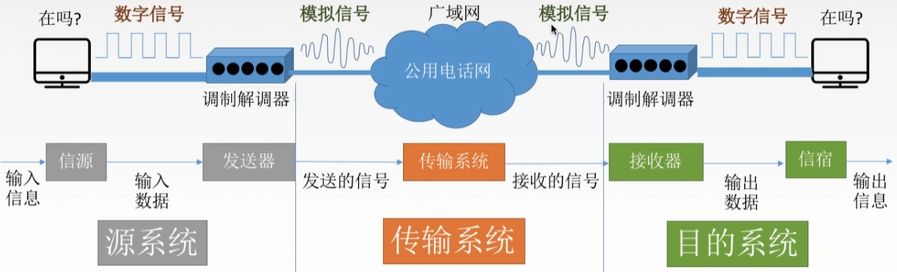
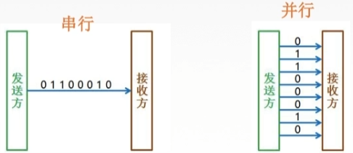
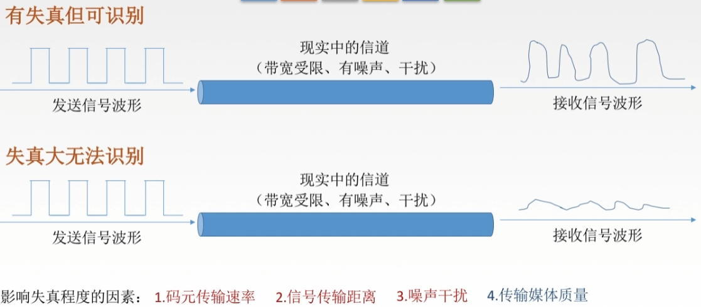
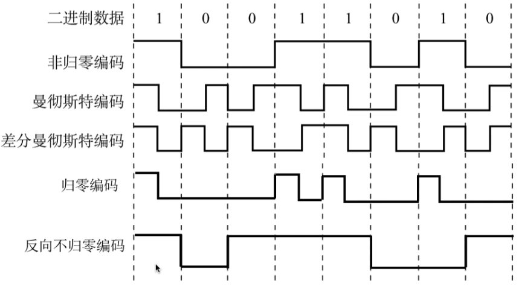
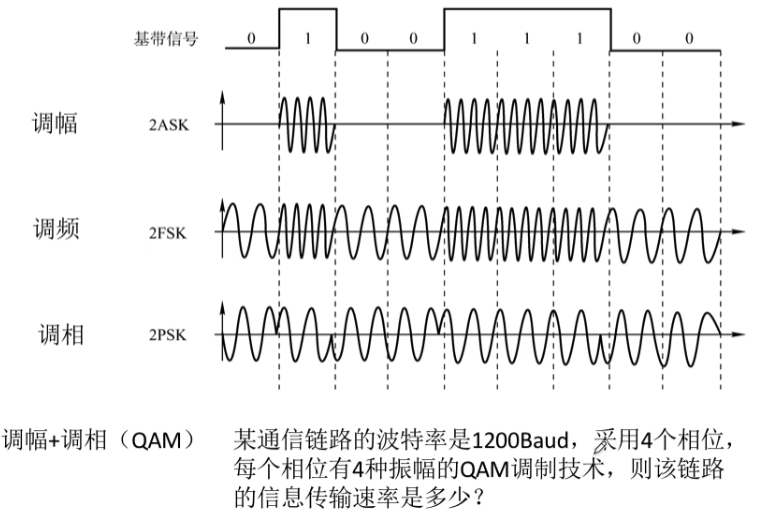
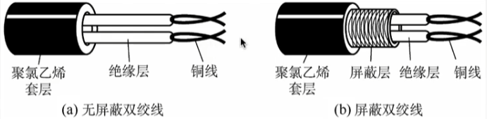
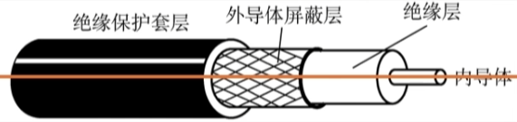
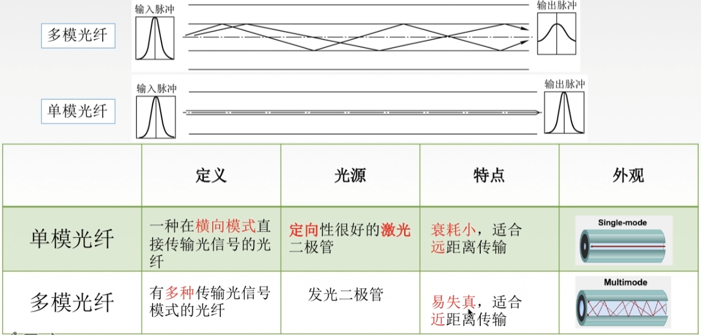

# 第六章 物理层

物理层解决如何在连接各种计算机的传输媒体上传输数据比特流，确定与传输媒体接口有关的一些特性：

机械特性：定义物理连接的特性，规定物理连接时所采用的规格、接口形状、引线数目、引脚数量和排列情况等
电气特性：规定传输二进制位时，线路上信号的电压范围、阻抗匹配、传输速率和距离限制等
功能特性：指明某条线上出现的某一电平表示何种意义，接口不见的信号线用途
规程特性：定义各条物理线路的工作规程和时序关系

### 数据通信

数据：传送信息的实体、通常是有意义的符号序列
信号：数据的电气/电磁的表现，是数据在传输过程中的存在形式
			数字信号：代表消息的参数取值是离散的 
			模拟信号：代表消息的参数取值是连续的
信源：产生和发送数据的源头
信宿：接收数据的重点
信道：信号的传输媒介。一般用来表示某一个方向传送信息的介质，因此一条通信线路往往包含一条发送信号和一条接收信道

#### 通信方式

单工通信：只有一个方向的通信而没有反方向的交互、仅需要一条信道
半双工通信：通信的双反可以发送或接收消息，但任何一方都不能同时发送和接收，需要两条信道
全双工通信：通信双反可以同时发送和接收消息，也需要两条信道

#### 传输方式

串行传输：速度慢、费用低，适合远距离
并行传输：速度快、费用高，适合近距离

#### 码元

码元是指用一个固定时长的信号波形（数字脉冲），代表不同离散数值的基本波形，是数字通信中数字信号的计量单位，在这个时长内的信号称为 K 进制码元、而该时长称为码元宽度。当码元的离散状态有 M 个时，此时码元为 M 进制码元。

一个码元可以携带多个比特的信息量。例如4 进制码元可以携带两个 bit 的信息量。 -> 码元的离散状态有 4 个 -> 4 种高低不同的信号波形 -> 00、01、10、11

#### 速率

数据传输速率可以用码元传输速率和信息传输速率表示。

- 码元传输速率，别名码元速率、波形速率、调制速率、符号速率等，表示单位时间内数字通信系统所传输的码元个数，单位是波特(Baud)
- 信息传输速率：别名信息速率、比特率等，表示单位时间内数字通信系统所传输的二进制码元个数，即比特数，单位是 bit/s。

若一个码元携带 n bit 的信息量，则 M Baud 的码元传输速率所对应的信息传输速率为 Mxn bit/s
系统传输的是比特流，通常根据信息传输速率来判断传输速率快慢。

### 两个公式

**失真**

**码间串扰**

码间串扰是失真的一种现象，即当接收端收到的信号波形失去了码元之间清晰界限的现象

信道带宽：信道能通过的最高频率和最低频率之差。当过低频率的信号通过信道时，因为信号衰减导致接收端无法接收到信号；当过高频率的信号通过信道时，接收端接收到信号后无法分清码元之间的界限。

#### 奈氏准则

在理想低通（无噪声、带宽受限）条件下，为了避免码间串扰，极限码元传输速率为 2 W Baud，W 是信道带宽，单位是 Hz。
理想低通信道下的极限码元传输速率 = 2Wlog~2~V (bit/s)，W 为带宽(Hz)，V 为码元数

结论：

- 在任何信道上，码元传输速率是有上限的。若传输速率超过此上限，就会出现严重的码间串扰现象，使接收端无法完全正确识别码元。
- 信道的频带越宽，就可以用更高的速率进行码元的有效传输。
- 奈氏准则给出了码元传输速率的限制，但没有对信息传输速率做出限制。
- 由于码元传输速率受奈氏准则的制约，为了提高数据的传输速率，就必须设法使每个码元能携带更多比特的信息量。

#### 香农定理

信噪比：信号的平均功率/噪声的平均功率，常记为 S/N，单位为分贝 dB。信噪比(dB) = 10log~10~(S/N)

香农定理：在带宽受限且有噪声的信道中，为了不产生误差，信道极限信息传输速率 = Wlog~2~(1+S/N) (bit/s)

结论：

- 信道的带宽或信道中的信噪比越大，信息的极限传输速率越高。
- 只要信心传输速率低于信道的极限信息传输速率，就一定能找到某种方法实现无差错的传输。
- 实际信道能达到的传输速率一定小于香农定理得出的极限信息传输速率。

#### 奈氏准则和香农定理

| 奈氏准则                                           | 香农定理                                 |
| -------------------------------------------------- | ---------------------------------------- |
| 带宽受限无噪声条件下极限码元传输速率               | 带宽受限有噪声条件下的极限信息传输速率   |
| 理想低通信道下的极限码元传输速率                   | 信道的极限信息传输速率                   |
| 要提高数据传输速率，要提高带宽或采用更好的编码技术 | 要提高数据传输速率，就要提高带宽或信噪比 |

### 编码与调制

- 基带信号：信源发出的没有经过调制的原始电信号，直接用两种不同的电压表示数字信号 1 和 0，再送到数字信道上去传输（基带传输）
- 宽带信号：将基带信号进行调制后形成的频分复用模拟信号，把基带信号经过微波调制后，把信号的频率范围移到较高的频段中以便在信道中传输，再传送到模拟信道上去传输（宽带传输）

在传输距离较近时，计算机网络采用基带传输方式（近距离衰减小，信号内容不易发生变化）
在传输距离较远时，计算机网络采用宽带传输方式（远距离衰减大，即使信号变化大最后也能过滤出基带信号）

编码：将数据转为数字信号
调制：将数据转为模拟信号

| 编码                               | 调制                                 |
| ---------------------------------- | ------------------------------------ |
| 数字数据 -> 数字发送器 -> 数字信号 | 数字信号 -> 调制器 -> 模拟信号       |
| 模拟数据 -> PCM 编码器 -> 数字信号 | 模拟数据 -> 放大器调制器 -> 模拟信号 |

#### 编码

**数字数据编码**

- 非归零编码：高电平对应 1，低电平对应 0 ，编码容易实现，没有检错功能，无法判断一个码元的开始和结束。
- 反向不归零编码：信号电平翻转表示 0，信号电平不变表示 1。
- 归零编码：高电平对应 1，低电平对应 0，信号电平在一个码元之内要恢复到零。
- 曼彻斯特编码：一个码元分为两个间隔。前一个间隔为低电平后一个间隔为高电平代表码元 1，相反代表码元 0。曼彻斯特编码比较特殊，单位时间内码元传输速率为 2 ，但信息传输速率为 1，所以调制速率为数据传输速率的 2 倍。

- 差分曼彻斯特编码：前半个间隔的电平与上一个码元的后半个间隔的电平相同代表 1，相反代表 0。
- 4B/5B 编码：比特流中插入额外的比特来打破一连串的 0 或1，即用 5 个比特来编码 4 个比特的数据，编码效率为 80%。

**模拟数据编码**

计算机内部处理的是二进制数据，需要将模拟音频通过采样、量化和编码成有限个数字表示的离散序列，例如对音频信号进行编码的脉码调制(PCM)。

1. 抽样：对模拟信号周期性扫描，把时间上连续的信号变成时间上离散的信号。采样定理：f~采样频率~ >= 2f~信号最高频率~
2. 量化：把抽样取得的电平幅值按照一定的分级标度转为对应的数字值，并取整数。
3. 编码：把量化的结果转为与之对应的二进制编码。

#### 调制

**数字信号调制**

数字数据调制技术在发送端将数字信号转换为模拟信号（调制），而在接收端将模拟信号还原为数字信号（解调）。

**模拟信号调制**

为了实现传输的有效性，可能需要较高的频率，可以采用频分复用技术。

### 传输介质

传输介质也称为传输媒体/传输媒介，是数据传输系统中在发送设备和接收设备之间的物理通路。

传输媒体不是物理层，传输媒体在物理层之下，传输媒体传输信号，但并不知道所传输信号的含义，物理层规定了电气特性，能够识别所传送比特流的含义。

#### 导向性传输介质

**双绞线** 

双绞线是古老最常用的传输介质，它由两根采用一定规则并排绞合的、相互绝缘的铜导线组成。绞合可以较少对相邻导线的电磁干扰。

为了提高抗电磁干扰能力，在双绞线的外面加一层由金属丝编织成的屏蔽层，称为屏蔽双绞线(STP)，无屏蔽层的双绞线称为非屏蔽双绞线(UTP)。

双绞线价格便宜，是最常用的传输介质，通信距离一般为几公里到数十公里。距离太远时，对于模拟传输可用放大器放大衰减信号；对于数字传输可用中继器整形失真信号。

**同轴电缆**

基带同轴电缆主要用于传送基带数字信号；宽带同轴电缆主要用于传送宽带信号。

同轴电缆抗干扰性比双绞线好，传输距离更远，但价格更昂贵。

**光纤**

利用光导纤维传递光脉冲进行通信。有光脉冲表示 1，无光脉冲为 0。光纤的带宽远远大于其他传输媒体。

光纤在发送端有光源，可采用发光二极管或半导体激光器，它们能在电脉冲作用下产生光脉冲；在接收端用光电二极管做成光检测器，在检测到光脉冲时可还原除电脉冲。

光纤主要有纤芯和包层构成，光波通过纤芯进行传导，包层较纤芯有较低的折射率。当光从高折射率的介质射向低折射率的介质时，其折射角将大于入射角。如果入射角足够大，就会出现全反射，即光碰到包层时会折射回纤芯，如此反复。

传输损耗小，中继距离长，适合远距离传输
抗雷电和电磁干扰性能好
无串音干扰，保密性好，不易窃听或截取数据
体积小，重量轻

#### 非导向性传输介质

无线电波：较强穿透能力，可远距离传输，信号向所有方向传播
微波：微波通信频率较高、频段范围宽，因此数据率很高
红外线、激光：把要传输的信号分别转为各自的信号格式，即红外光信号和激光信号再传播

### 物理层设备

#### 中继器

再生数字信号。中继器两端的网络部分是网段而不是子网，适用于完全相同的两类网络的互连，且两个网段速率要相同。

5-4-3规则：10 M 以太网中，5 个网段内最多只能有 4 个中继器，最多只能连 3 台主机，防止信号延迟过大。

#### 集线器（多口中继器）

再生、放大信号，集线器不能分割冲突域，连在集线器上的工作主机平分带宽。
