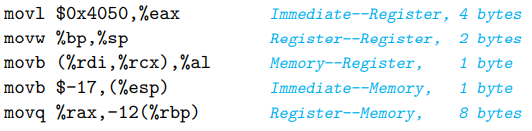

# 第二章 程序的机器级表示

处理器从 16 位发展到 32 位，到如今的 64 位。IA 32 是 Intel 32 位架构，x86-64 是 IA 32 结合 AMD 的 64 位扩展。

gcc -S 编译到汇编语言，不进行汇编和链接，编译后默认创建 .s 文件。
gcc -c 编译、汇编到目标代码，不进行链接，汇编后默认创建 .o 文件。
gcc -O[level]，level 越高，优化后的代码效率越高。
反汇编器 ```objdump -d file.o``` 将目标代码反汇编成汇编代码。

x86-64 指令集的指令长度从 1 到 15 个字节不等，常用的指令及操作数较少的指令用更少的字节数，不常用及操作数较多的指令使用更多字节数。

GCC, OBJDUMP 等工具采用 AT&T 汇编代码格式，Microsoft 和 Intel 采用 Intel 汇编代码格式。
gcc -masm=[intel | att] 可选择汇编代码格式。

## 数据格式

Intel 用一个字 (word) 表示 16 位。32 位称为双字，64 位称为四字。下表列出 C 的数据类型和 Intel 数据类型。

| C 声明  | Intel 数据类型 | 汇编代码后缀 | 大小（字节） |
| :------ | :------------- | :----------- | :----------- |
| char    | 字节           | b            | 1            |
| short   | 字             | w            | 2            |
| int     | 双字           | l            | 4            |
| long    | 四字           | q            | 8            |
| char \* | 四字           | q            | 8            |
| float   | 单精度         | s            | 4            |
| double  | 双精度         | l            | 8            |

一个 x86-64 架构的 CPU 包含一组用来存储整数数据和指针的通用寄存器。共 16 个寄存器，每个寄存器存储 64 位。

指令可以对寄存器中的数据进行操作。8 位操作只能访问最低的字节，16 位操作只能访问低位的 2 个字节，32 位操作只能访问低位的 4 个字节，64 位操作可以访问整个寄存器。

8 位和 16 位操作只改变寄存器的低位字节，不改变高位字节；32 位操作改变寄存器的低 32 位时，高 32 位被置为 0 。


## 复制指令

不同格式的操作符可以访问寄存器中的值，内存中的值或常数值。假设 R[r~a~] 代表寄存器 r~a~ 中的值，M~b~[Addr] 代表从 地址 Addr 开始的 b 个字节的值。比例因子 s 只能是 1、2、4 或 8。

| 类型   | 格式               | 值                              | 名称                |
| ------ | ------------------ | ------------------------------- | ------------------- |
| 立即数 | \$Imm              | Imm                             | 立即数寻址          |
| 寄存器 | r~a~               | R[r~a~]                         | 寄存器寻址          |
| 存储器 | Imm                | M[Imm]                          | 绝对寻址            |
| 存储器 | (r~a~)             | M[R[r~a~]]                      | 间接寻址            |
| 存储器 | Imm(r~a~)          | M[Imm + R[r~a~]]                | （基址+偏移量）寻址 |
| 存储器 | (r~b~, r~i~)       | M[R[r~b~] + R[r~i~]]            | 变址寻址            |
| 存储器 | Imm(r~b~, r~i~)    | M[Imm + R[r~b~] + R[r~i~]]      | 变址寻址            |
| 存储器 | (, r~i~, s)        | M[R[r~i~] \* s]                 | 比例变址寻址        |
| 存储器 | Imm(, r~i~, s)     | M[Imm + R[r~i~] \* s]           | 比例变址寻址        |
| 存储器 | (r~b~, r~i~, s)    | M[R[r~b~] + R[r~i~] \* s]       | 比例变址寻址        |
| 存储器 | Imm(r~b~, r~i~, s) | M[Imm + R[r~b~] + R[r~i~] \* s] | 比例变址寻址        |

数据复制指令将源位置的值复制到目标位置。源位置可以是立即数、寄存器或内存，目标位置可以是寄存器或内存。x86-64 加了一条限制，不能直接将源内存中的值直接复制到目标内存中，必须先将源内存中的值加载到寄存器中，再将该寄存器中的值写入目标内存中。

MOV 类指令只将源位置的值复制到目标位置，不做任何额外的修改。注意，movl 指令会将寄存器中高位的 4 个字节置为 0。movq 指令只能将 32 位补码数扩展成 64 位（扩展其符号位）后再复制，movabsq 指令能直接将 64 位常数值复制到目标寄存器中。

| 指令         | 效果                                   |
| ------------ | -------------------------------------- |
| movb S, D    | Src(byte) --> Dest(byte)               |
| movw S, D    | Src(word) --> Dest(word)               |
| movl S, D    | Src(double word) --> Dest(double word) |
| movq S, D    | Sec(quad word) --> Dest(quad word)     |
| movabsq I, R | Imm(quad word) --> Reg(quad word)      |



MOVS 类指令将源寄存器或内存中的值复制到目标寄存器中，并根据源值的符号位填充目标寄存器中剩余的位。

| 指令        | 效果                                |
| ----------- | ----------------------------------- |
| movsbw S, R | Src(byte) --> Reg(Word)             |
| movsbl S, R | Src(byte) --> Reg(double word)      |
| movsbq S, R | Src(byte) --> Reg(quad word)        |
| movswl S, R | Src(word) --> Reg(double word)      |
| movswq S, R | Src(word) --> Reg(quad word)        |
| movslq S, R | Src(double word) --> Reg(quad word) |
| cltq        | movslq %eax,%rax                    |

MOVZ 类指令和 MOVS 类似，但将目标寄存器中剩余的位填充为 0。

| 指令        | 效果                           |
| ----------- | ------------------------------ |
| movzbw S, R | Src(byte) --> Reg(Word)        |
| movzbl S, R | Src(byte) --> Reg(double word) |
| movzbq S, R | Src(byte) --> Reg(quad word)   |
| movzwl S, R | Src(word) --> Reg(double word) |
| movzwq S, R | Src(word) --> Reg(quad word)   |

在 x86-64 中，程序栈存放在内存中某个区域。从栈顶到栈底，其内存地址依次增大。栈指针 %rsp 保存着栈顶元素的地址。执行 push 指令时，栈指针 %rsp 减去 n，n 个字节的数据压入程序栈中。pop 指令将 n 个字节的数据弹出到目标位置，栈指针 %rsp 增加 n。

在  64 位计算机中，字长为 64 位，每次只能读写四字，要使用 pushq 和 popq 指令。

| 指令    | 效果                                                    |
| ------- | ------------------------------------------------------- |
| push S  | R[%rsp] - n --> R[%rsp]; Src[n byte] --> M[R[%rsp]]     |
| pop D   | M[R[%rsp]] --> Dest[n byte]; R[%rsp] + n --> R[%rsp]    |
| pushq S | R[%rsp] - 8 --> R[%rsp]; Src[quad word] --> M[R[%rsp]]  |
| popq D  | M[R[%rsp]] --> Dest[quad word]; R[%rsp] + 8 --> R[%rsp] |

x86-64 规定 ```pushq %rsp``` 时先将 %rsp 中的旧值压入栈中，然后寄存器 %rsp 的值更新为 %rsp - 8。```popq %rsp``` 时先将寄存器 %rsp 的值更新为 %rsp + 8，然后再将内存中的值弹出到 %rsp。

## 算术和逻辑指令

| 指令      | 效果                 | 描述               |
| --------- | -------------------- | ------------------ |
| leaq M, R | &Mem --> Reg         | 取址               |
| inc D     | Desr + 1 --> Dest    | 加1                |
| dec D     | Desr -1 --> Dest     | 减1                |
| neg D     | -Dest --> Dest       | 取负               |
| not D     | ~Dest --> Dest       | 取反               |
| add S, D  | Dest + Src --> Dest  | 加                 |
| sub S, D  | Dest - Src --> Dest  | 减                 |
| imul S, D | Dest \* Src --> Dest | 乘                 |
| xor S, D  | Dest ^ Src --> Dest  | 异或               |
| or S, D   | Dest \| Src --> Dest | 或                 |
| and S, D  | Dest & Src --> Dest  | 与                 |
| sal k, D  | Dest << k --> Dest   | 左移               |
| shl k, D  | Dest << k --> Desr   | 左移（等同于 sal） |
| sar k, D  | Dest >> k --> Dest   | 算术右移           |
| shr k, D  | Dest >> k --> Dest   | 逻辑右移           |

leaq 指令将源内存的地址复制到目标寄存器中。

inc, dec, neg, not 一元操作指令可以操作一个寄存器或一个内存。

add, sub, imul 等指令是二元操作指令，源操作数可以是立即数、寄存器或内存。目标操作数可以是寄存器或内存。当目标操作数是内存中的值时，处理器必须先从内存中读出值，执行操作后，再把结果写回目标内存中。

sal, shl, sar, shr 指令是移位操作，源操作数是移位量，可以是立即数或寄存器 %c1 中的值。目标操作数可以是寄存器或内存。

**操作 128 位的指令**

x86-64 指令集支持对 128 位数进行部分操作。

| 指令    | 效果                                                         | 描述             |
| ------- | ------------------------------------------------------------ | ---------------- |
| imulq S | S x R[%rax] --> R[%rdx]:R[%rax]                              | 补码乘法         |
| mulq S  | S x R[%rax] --> R[%rdx]:R[%rax]                              | 无符号乘法       |
| cqto    | R[%rax] --> R[%rdx]:R[%rax]                                  | 四字转八字，补码 |
| idivq S | R[%rdx]:R[%rax] mod S --> R[%rdx]; R[%rdx]:R[%rax] / S --> R[%rax] | 补码             |
| divq S  | R[%rdx]:R[%rax] mod S --> R[%rdx]; R[%rdx]:R[%rax] / S --> R[%rax] | 无符号除法       |

imulq 和 mulq 指令将64 位源操作数和 %rax 寄存器中的数相乘，将结果的高 64 位放在寄存器 %rdx 中，低 64 位放在寄存器 %rax 中。

idivq 和 divq 指令将 %rdx 寄存器中的数作为高 64 位，%rax 寄存器的数作为低 64 位，共 128 位作为被除数。源操作数作为除数，商存储在 %rax 寄存器中，余数存储在 %rdx 寄存器中。

## 控制

### 条件码寄存器

一个 x86-64 架构的 CPU 还包含一组条件码寄存器，大小为 1 位。它们保存着最近一次的算术或逻辑操作的信息。常用的条件码有：

CF：进位标志。最近的操作使最高位产生进位时设置为 1，否则为 0
ZF：零标志。最近的操作结果为 0 时设置为 1，否则为 0
SF：符号标志。最近的操作结果为负数时设置为 1，否则为 0
OF：溢出标志。最近的操作导致补码数溢出时设置为 1，否则为 0

leaq 指令不改变条件码，inc, dec, neg 等算术操作指令和 xor, or, and 等逻辑操作指令不仅改变目标寄存器的值，也改变条件码寄存器的值。cmp, test 指令只改变条件码寄存器的值，不改变目标寄存器。

| 指令            | 效果        | 描述 |
| --------------- | ----------- | ---- |
| cmp S~1~, S~2~  | S~2~ - S~1~ | 比较 |
| test S~1~, S~2~ | S~1~ & S~2~ | 测试 |

### 使用条件码

**1.**根据条件码的组合，将一个字节设置为 0 或 1

**2.**有条件地跳转到程序的指定位置

**3.**有条件地复制数据

SET 类指令根据条件码的组合，操作单字节寄存器或内存，将其设置为 0 或 1。

| 设置指令 | 同义名 | 效果                   | 设置条件           |
| -------- | ------ | ---------------------- | ------------------ |
| sete D   | setz   | ZF --> D               | 相等               |
| setne D  | setnz  | ~ZF --> D              | 不等               |
| sets D   |        | SF --> D               | 负数               |
| setns D  |        | ~SF --> D              | 非负数             |
| setg D   | setnle | ~(SF ^ OF) & ~ZF --> D | 大于（补码）       |
| setge D  | setnl  | ~(SF ^ OF) --> D       | 大于等于（补码）   |
| setl D   | setnge | SF ^ OF --> D          | 小于（补码）       |
| setle D  | segng  | (SF ^ OF) \| ZF --> D  | 小于等于（补码）   |
| seta D   | setnbe | ~CF & ~ZF --> D        | 大于（无符号）     |
| setae D  | setnb  | ~CF --> D              | 大于等于（无符号） |
| setb D   | setnae | CF --> D               | 小于（无符号）     |
| setbe D  | setna  | CF \| ZF --> D         | 小于等于（无符号） |

跳转指令根据条件码跳转到程序指定位置。跳转目标作为指令的一部分编码时称为直接跳转，跳转目标从寄存器或内存中读取时称为间接跳转。

| 跳转指令      | 同义名 | 效果             | 跳转条件           |
| ------------- | ------ | ---------------- | ------------------ |
| jmp Label     |        | 1                | 无条件直接跳转     |
| jmp \*Operand |        | 1                | 无条件间接跳转     |
| je Label      | jz     | ZF               | 相等               |
| jne Label     | jnz    | ~ZF              | 不等               |
| js Label      |        | SF               | 负数               |
| jns Label     |        | ~SF              | 非负数             |
| jg Label      | jnle   | ~(SF ^ OF) & ~ZF | 大于（补码）       |
| jge Label     | jnl    | ~(SF ^ OF)       | 大于等于（补码）   |
| jl Label      | jnge   | SF ^ OF          | 小于（补码）       |
| jle Label     | jng    | (SF ^ OF) \| ZF  | 小于等于（补码）   |
| ja Label      | jnbe   | ~CF & ~ZF        | 大于（无符号）     |
| jae Label     | jnb    | ~CF              | 大于等于（无符号） |
| jl Label      | jnae   | CF               | 小于（无符号）     |
| jle Label     | jna    | CF \| ZF         | 小于等于（无符号） |

汇编代码中，直接跳转目标是标号伪指令 (.L2, .L3) 。


```at&t
  movq %rdi,%rax
  jmp .L2
.L3:
  sar1 %rax
.L2:
  testq %rax,%rax
  jg .L3
  rep;ret
```

将汇编代码编译成目标代码时，汇编器会用标号伪指令后的首条指令地址替换标号伪指令。如以下反汇编代码所示， .L3 后的首条指令地址为 0x5，.L2 后的首条指令地址为 0x8，0x5 和 0x8 将分别代替 .L3 和 .L2，跳转目标是 0x8 和 0x5。

在目标代码中，除了将跳转目标的地址编码进指令外，更经常使用相对程序计数器的编码。将跳转目标地址减去跳转指令后一条指令的地址，其差值编码进指令。如目标代码所示，jmp 8 对应的机器码为 eb 03，因为跳转目标地址为 0x8，jmp 指令后一条指令地址为 0x5，所以将 0x3 (0x8 - 0x5) 编码到机器码中，而不是将跳转目标的地址 0x8 编码到机器码中。 

```at&t
目标代码				反汇编代码
0x0: 48 89 f8		       mov %rad,%rax
0x3: eb 03               jmp 8 <loop+0x8>
0x5: 48 d1 f8            sar %rax
0x8: 48 85 c0            test %rax,%rax
0xb: 7f f8               jg 5 <loop+0x5> 
0xd: f3 c3               repz retq
```

条件复制指令根据条件码将源寄存器或内存中的值复制到目标寄存器中。

| 复制指令    | 同义名  | 效果             | 复制条件           |
| ----------- | ------- | ---------------- | ------------------ |
| cmove S, R  | cmovz   | ZF               | 相等               |
| cmovne S, R | cmovnz  | ~ZF              | 不等               |
| cmovs S, R  |         | SF               | 负数               |
| cmovns S, R |         | ~SF              | 非负数             |
| cmovg S, R  | cmovnle | ~(SF ^ OF) & ~ZF | 大于（补码）       |
| cmovge S, R | cmovnl  | ~(SF & OF)       | 大于等于（补码）   |
| cmovl S, R  | cmovnge | SF ^ OF          | 小于（补码）       |
| cmovle S, R | cmovng  | (SF ^ OF) \| ZF  | 小于等于（补码）   |
| cmova S, R  | cmovnbe | ~CF & ~ZF        | 大于（无符号）     |
| cmovae S, R | cmovnb  | ~CF              | 大于等于（无符号） |
| cmovb S, R  | cmovnae | CF               | 小于（无符号）     |
| cmovbe S, R | cmovna  | CF \| ZF         | 小于等于（无符号） |

## 过程

过程是一种封装代码的方式，也叫做函数、方法、子例程和处理函数等。

### 运行时栈

运行时栈由若干个栈帧组成。一个栈帧保存着一个函数调用过程中的信息，一个完整的栈帧可划分为 Saved registers, Local varibles, Argument build area 和 Return address 四个区域。 %rsp 寄存器保存着运行时栈的栈顶位置，%rbp 寄存器保存着最顶部一个栈帧的某个特定位置。


入口函数 main 调用函数 Callee 时，%rsp 指针减少，为函数 Callee 创建栈帧。%rbp 中的旧值保存到 Callee 栈帧的 Saved registers 区，%rbp 保存着 %rbp 旧值的内存地址。

函数 Callee 执行完毕时，弹出 Callee 栈帧 Saved registers 区保存的 %rbp 旧值并保存到 %rbp 中，%rsp 指针增加，销毁 Callee 栈帧。

函数 main 调用函数 Callee 前寄存器 %rsp 和 %rbp 的值和函数 Callee 执行完毕后寄存器 %rsp 和 %rbp 的值相同。如下 C 代码所示。

```c
void Callee(){}

int main(){
    Callee();
    return 0;
}
```
对应的汇编代码如下所示。
```at&t
Callee:
  pushq   %rbp         %rbp 中的旧值保存到 Saved registers 区，%rsp 指向 %rbp 旧值
  movq    %rsp, %rbp   %rbp 指向 %rbp 旧值
  nop				   空操作
  popq    %rbp         弹出 %rbp 旧值并保存到 %rbp 中
  ret 				   返回函数 main

main:
  ...
  call    Callee 	   调用函数 Callee
  ...    
```

### 转移控制

| 转移控制指令   | 描述           |
| -------------- | -------------- |
| call Label     | 直接调用       |
| call \*Operand | 间接调用       |
| ret            | 从当前函数返回 |

函数 main 中调用函数 Callee 时会执行 call 指令，效果是 main 函数中 call 指令的后一条指令地址作为返回地址压入 main 栈帧的 Return address 区中。程序计数器 %rip 设置为函数 Callee 首条指令的地址，之后 CPU 执行函数 Callee 中的指令。

当函数 Callee 执行完毕时会执行 ret 指令，效果是将返回地址弹出并保存到程序计数器 %rip 中，之后 CPU 执行函数 main 中 call 指令的后一条指令。

```at&t
Callee:
  pushq   %rbp         %rip 指向 Callee 的首条指令     
  ...
  ret 				   

main:
  ...
  call    Callee 	   调用函数 Callee
  ...  				   此条指令的地址作为返回地址		
```

### 参数传递

x86-64 提供了 6 个用于传递参数值（形参或局部变量）的寄存器 (%rdi, %rsi, %rdx, %rcx, %r8, %r9) 和一个保存返回值的寄存器 %rax。函数 main 把 n 个参数传给函数 Callee 时，若 n ≤ 6，将参数复制到寄存器中，函数 Callee 访问指定寄存器即可获取参数值；若 n ＞ 6，将前 6 个参数复制到寄存器中，第 7 ~ n 个参数保存在函数 main 栈帧的 Argument build area 区中并保持 8 字节对齐。函数 Callee 访问指定寄存器和 main 栈帧的 Argument build area 区即可获取参数值。

函数 Callee 将返回值保存在寄存器 %rax 中，函数 main 访问寄存器 %rax 即可获得返回值。如下 C 代码所示。

```c
#include <stdio.h>
  
int Callee(int a,int b ,int c, int d, int e, int f,int g, int h){
        return 3;
}

int main(void){
    Callee(1,2,3,4,5,6,7,8);
}
```

对应的汇编代码如下所示。

```at&t
Callee:
  ...
  movl    %edi, -4(%rbp)    获取寄存器 %edi 中保存的第 1 个参数
  movl    %esi, -8(%rbp)    获取寄存器 %esi 中保存的第 2 个参数
  movl    %edx, -12(%rbp)   获取寄存器 %edx 中保存的第 3 个参数
  movl    %ecx, -16(%rbp)   获取寄存器 %ecx 中保存的第 4 个参数
  movl    %r8d, -20(%rbp)   获取寄存器 %r8d 中保存的第 5 个参数
  movl    %r9d, -24(%rbp)   获取寄存器 %r9d 中保存的第 6 个参数
  movl    -4(%rbp), %edx  
  movl    -8(%rbp), %eax  
  addl    %eax, %edx        前 2 个参数相加的结果
  movl    -12(%rbp), %eax
  addl    %eax, %edx        前 3 个参数相加的结果
  movl    -16(%rbp), %eax 
  addl    %eax, %edx        前 4 个参数相加的结果
  movl    -20(%rbp), %eax
  addl    %eax, %edx        前 5 个参数相加的结果
  movl    -24(%rbp), %eax
  addl    %eax, %edx        前 6 个参数相加的结果
  movl    16(%rbp), %eax    获取 main 栈帧的 Argument build area 区中的第 7 个参数
  addl    %eax, %edx        前 7 个参数相加的结果
  movl    24(%rbp), %eax    获取 main 栈帧的 Argument build area 区中的第 8 个参数
  addl    %edx, %eax        前 8 个参数相加的结果，结果保存在寄存器 %eax 中
  ... 
 
main:
  ...
  pushq   $8                第 8 个参数保存在 main 栈帧的 Argument build area 区中
  pushq   $7			    第 7 个参数保存在 main 栈帧的 Argument build area 区中
  movl    $6, %r9d		    第 6 个参数保存在寄存器 %r9d 中
  movl    $5, %r8d		    第 5 个参数保存在寄存器 %r8d 中
  movl    $4, %ecx		    第 4 个参数保存在寄存器 %ecx 中
  movl    $3, %edx		    第 3 个参数保存在寄存器 %edx 中
  movl    $2, %esi		    第 2 个参数保存在寄存器 %esi 中
  movl    $1, %edi		    第 1 个参数保存在寄存器 %edi 中
  call    Callee
  ...
```

### 局部存储

调用函数 Callee 时 main 函数内的局部变量会被压入 main 栈帧的 Local varibales 区中。如下 C 代码所示。

```c
#include <stdio.h>
  
void  Callee(int num1, int num2){}

int main(void){
    int num1 = 1;
    int num2 = 2;
    Callee(num1,num2);
}
```

对应的汇编代码如下所示。

```at&t
main:
  ...
  subq    $16, %rsp           开辟 16 字节内存空间
  movl    $1, -4(%rbp)        局部变量 1 存放在 main 栈帧的 Local varibales 区中
  movl    $2, -8(%rbp)        局部变量 2 存放在 main 栈帧的 Local varibales 区中
  ...
```

### 寄存器共享

寄存器组是唯一被所有函数共享的资源。x86-64 规定寄存器 %rbx, %rbp 和 %r12 ~ %r15 是被调寄存器 (Callee saved)。剩余的寄存器都是主调寄存器 (Caller saved)，%rsp 寄存器除外。主调寄存器中的值随时都会被修改。

若 main 调用函数 Callee，调用函数 Callee 之前和函数 Callee 执行结束返回到 main 函数之后，被调寄存器中的值必须保持不变。执行函数 Callee 时，要么不改变被调寄存器的值，要么将被调寄存器中的原值压入 Callee 栈帧的 Saved registers 区中再改变被调寄存器的值。返回 main 函数时弹出 Callee 栈帧 Saved registers 区中原值，保存到被调寄存器中。

## 数组

假设 int 数组 E 的首地址 x~E~ 和索引 i 分别存放在寄存器 %rdx 和 %rcx 中。将 int 元素和 int 指针分别存放在寄存器 %eax 和 %rax 中。

| 表达式       | 类型   | 值                | 汇编代码                      |
| ------------ | ------ | ----------------- | ----------------------------- |
| E            | int \* | x~E~              | movq %rdx, %rax               |
| E[0]         | int    | M[x~E~]           | movl (%rdx), %rax             |
| E[i]         | int    | M[x~E~ + 4i]      | movl (%rdx, %rcx, 4), %eax    |
| &E[i]        | int \* | x~E~ + 4i         | leaq (%rdx, %rcx, 4), %rax    |
| E + i -1     | int \* | x~E~ + 4i - 4     | leaq -4(%rdx, %rcx, 4), %rax  |
| \*(E + i -3) | int    | M[x~E~ + 4i - 12] | movl -12(%rdx, %rcx, 4), %eax |
| &E[i] - E    | long   | i                 | movq %rcx, %rax               |

二维或多维数组在内存中按照行优先的顺序排列，例如 int 型二维数组 A\[3]\[2] 为 3 行 2 列的二维数组，共占据 24 个字节的内存空间。

| 行    | 元素     | 地址      |
| ----- | -------- | --------- |
| A[0]  | A\[0][0] | x~A~      |
|       | A\[0][1] | x~A~ + 4  |
| A\[1] | A\[1][0] | x~A~ + 8  |
|       | A\[1][1] | x~A~ + 12 |
| A\[2] | A\[2][0] | x~A~ + 16 |
|       | A\[2][1] | x~A~ + 20 |

结构和联合在内存中的存放方式类似数组，不在此赘述。

## 数据对齐

数据对齐能提高内存系统性能，对齐原则是任何 K 字节的基本数据类型的地址必须是 K 的倍数。

| K    | 类型                  |
| ---- | --------------------- |
| 1    | char                  |
| 2    | short                 |
| 4    | int, float            |
| 8    | long, double, void \* |

例如结构 S1：

```
struct S1{
    int i; 
    char c;
    int j;
};
```

若 S1 的首地址为 4 的倍数，则字段 i 的地址也是 4 的倍数，字段 c 的地址一定是 1 的倍数，字段 j 的地址一定不是 4 的倍数，不满足 4 字节对齐。


编译器在字段 c 和字段 j 之间插入一个 3 字节的间隙（蓝色区域），字段 j 的地址就能满足 4 字节对齐。


## 浮点数

AVX2 浮点体系结构将浮点数存储在 16 个 256 位的 YMM 寄存器中，名字为 %ymm0 ~ %ymm15。单精度浮点数只使用低 32 位，双精度浮点数只使用低 64 位。

XMM 寄存器 %xmm0 ~ %xmm7 最多可传递 8 个浮点参数，多余的浮点参数会存放在栈帧的 Argument build area 区中。%xmm0 存储浮点返回值。

所有 XMM 寄存器都是调用寄存器。主调函数的浮点局部变量也会被压入其栈帧的 Local varibales 区中。


### 复制指令

32 位内存满足 4 字节对齐，64 位内存满足 8 字节对齐。立即数只能是整数，不能是浮点数。所以浮点数要么保存在 XMM 寄存器中，要么保存在内存中。

浮点数复制指令把源位置的值复制到目标位置中。源位置和目标位置可以是内存或 XMM 寄存器。M~32~ 代表 32 位内存，M~64~ 代表 64 位内存，X 代表 XMM 寄存器。

| 复制指令         | 描述               |
| ---------------- | ------------------ |
| vmovss M~32~,  X | 复制单精度         |
| vmovss X, M~32~  | 复制单精度         |
| vmovsd M~64~, X  | 复制双精度         |
| vmovsd X, M~64~  | 复制双精度         |
| vmovaps X, X     | 复制对齐好的单精度 |
| vmovapd X, X     | 复制对齐好的双精度 |

### 转换指令

双操作数转换指令读取源位置的浮点数，可能发生截断并转为整数后，复制到目标位置中。源位置可以是 XMM 寄存器或内存，目标位置只能是整数寄存器。R~32~ 代表 32 位寄存器，R~64~ 代表 64 位寄存器。


| 转换指令                   | 描述               |
| -------------------------- | ------------------ |
| vcvttss2si X/M~32~, R~32~  | 单精度转为双字整数 |
| vcvttsd2si X/M~64~, R~32~  | 双精度转为双字整数 |
| vcvttss2siq X/M~32~, R~64~ | 单精度转为四字整数 |
| vcvttsd2siq X/M~64~, R~64~ | 双精度转为四字整数 |


GCC 编译器会采用以下方式转换单精度和双精度浮点数。
```at&t
%xmm0 中的单精度转为双精度浮点数
vunpcklps %xmm0, %xmm0, %xmmo
vcvtps2pd %xmm0, %xmm0

%xmm0 中的双精度转为单精度浮点数
vmovddup %xmm0, %xmm0
vcvtpd2psx %xmm0, %xmm0
```

三操作数转换指令中第三个操作数的 XMM 寄存器的高 64 位由第二个操作数的 XMM 寄存器决定，低 64 位由第一个操作数决定。


| 转换指令                     | 描述               |
| ---------------------------- | ------------------ |
| vcvtsi2ss M~32~/R~32~, X, X  | 双字整数转为单精度 |
| vcvtsi2sd M~32~/R~32~, X, X  | 双字整数转为双精度 |
| vcvtsi2ssq M~64~/R~64~, X, X | 四字整数转为单精度 |
| vcvtsi2sdq M~64~/R~64~, X, X | 四字整数转为双精度 |

### 算术和逻辑指令

算术和逻辑指令有两个操作数，S~1~ 可以是 XMM 寄存器或内存，S~2~ 和 D 必须是 XMM 寄存器。

| 单精度指令           | 双精度指令           | 效果                  | 描述         |
| -------------------- | -------------------- | --------------------- | ------------ |
| vaddss S~1~, S~2~, D | vaddsd S~1~, S~2~, D | S~2~ + S~1~ --> D     | 浮点数相加   |
| vsubss S~1~, S~2~, D | vsubsd S~1~, S~2~, D | S~2~ + S~1~ --> D     | 浮点数相减   |
| vmulss S~1~, S~2~, D | vmulsd S~1~, S~2~, D | S~2~ x S~1~ --> D     | 浮点数相乘   |
| vdivss S~1~, S~2~, D | vdivsd S~1~, S~2~, D | S~2~ / S~1~ --> D     | 浮点数相除   |
| vmaxss S~1~, S~2~, D | vmaxsd S~1~, S~2~, D | max(S~2~, S~1~) --> D | 浮点数最大值 |
| vminss S~1~, S~2~, D | vminsd S~1~, S~2~, D | min(S~2~, S~1~) --> D | 浮点数最小值 |
| sqrtss S~1~, D       | sqrtsd S~1~, D       | （S~1~)^1/2^ --> D    | 浮点数平方根 |
| vxorps S~1~, S~2~, D | xorpd S~1~, S~2~, D  | S~2~ ^ S~1~ --> D     | 位级异或     |
| vandps S~1~, S~2~, D | andpd S~1~, S~2~, D  | S~2~ & S~1~ --> D     | 位级与       |
| ucomiss S~1~, S~2~   | ucomisd S~1~, S~2~   | S~2~- S~1~            | 比较         |
