# 第三章 处理器体系结构

处理器执行一系列指令，每条指令执行某个操作。一个处理器支持的指令和指令的字节级编码称为处理器的指令集体系结构 (ISA)。

### Y86-64 指令集

不同厂商的处理器有不同的指令集，同一厂商不同型号的处理器的指令集也可能有差别。以下是本书创建的一种的 Y86-64 指令集，是 x86-64 指令集的一个子集。

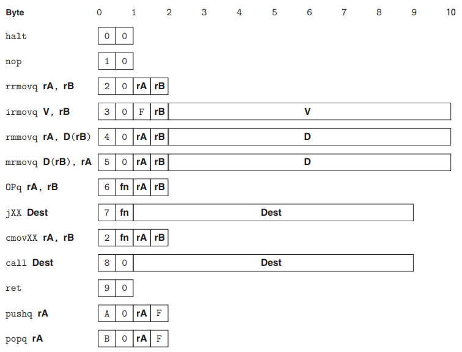

- 指令的机器码是 0 和 1 组成的二进制数。如上图所示，一般用 16 进制展示指令的机器码。Y86-64 指令的编码长度为 1~10 个字节（即 2~20 个 16 进制数）。
- rrmovq, irmovq, rmmovq, mrmovq 指令中的 rr, ir, rm 和 mr 前缀代表从寄存器到寄存器，从立即数到寄存器，从寄存器到内存和从内存到寄存器的复制指令。
- Opq 代表 4 个算术和逻辑操作指令，分别是 addq, subq, andq 和 xorq 指令。
- jXX 代表 7 个跳转指令，分别是 jmp, jle, jl, je, jne, jge 和 jg 指令。
- cmovXX 代表 6 个条件复制指令，分别是 cmovle, cmovl, cmove, cmovne, cmovge 和 cmovg 指令。

### 指令编码

一条指令机器码的首字节必须指明指令的类型。这个字节分为两个部分，高 4 位是代码部分 (icode)，低 4 位是功能部分 (ifun)。功能相近的指令归为一类指令，有相同的高 4 位。一类指令内的不同指令根据其功能，用低 4 位作为其的唯一标识符。所以每条指令的首字节都是独一无二的。

如下图所示，所有的跳转类指令的高 4 位都是 0x7。跳转指令中的 jmp 指令用低 4 位 0x0 作为其唯一标识符。

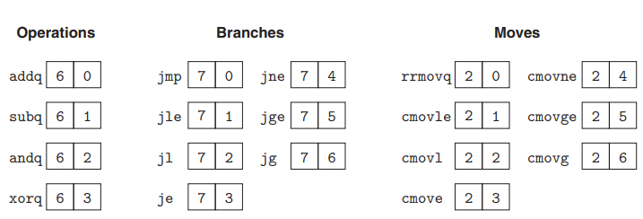

每个寄存器都有一个编号，Y86-64 用 0~0xE 标识 15 个寄存器。用 0xF 强调不访问任何寄存器。

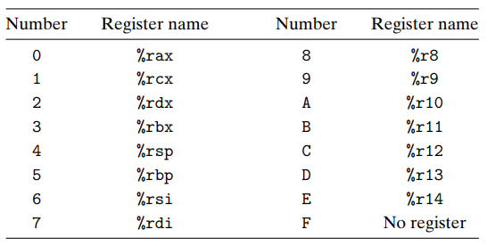

状态码描述程序执行的总体状态。Y86-64 描述了 4 种状态。0x1 代表正常执行，0x2 代表执行了 halt 指令，0x3 代表读写的内存地址超过了限定值，0x4 代表遇到了无法识别的指令。

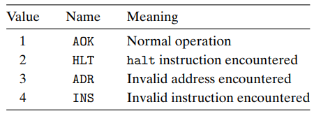

### 逻辑电路

时钟信号是周期性信号，有固定的时钟频率。

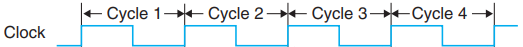

将若干个逻辑门组合成一个网，称为组合电路。组合电路不存储信息，只是简单地响应信号。给组合电路输入信号，经过很短的延迟 (ps 级别)，就会产生输出信号。

算术逻辑单元 ALU 就是一种很重要的组合电路。ALU 根据指令码操作另外两个输入，经过很短的延迟后输出操作结果。

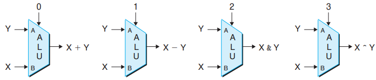

和存储元件结合组成可以存储信息的组合电路，称为时序电路。时序电路可以存储信息。给时序电路输入信号，在下一个时钟周期开始时才将输入信号保存到存储元件中。在任意时刻都可以读取存储元件中的值作为输出信号。

更新程序计数器、条件码寄存器、状态码寄存器、寄存器文件和内存受到时钟控制，读取时不受时钟控制。

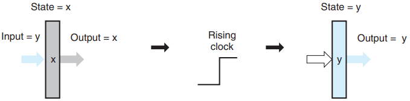

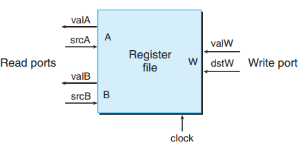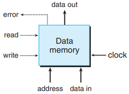

### Y86-64 顺序实现

顺序实现意味着处理器在一个时钟周期内只执行一条 Y86-64 指令。

#### 指令阶段

搭建一个框架，将一条指令的执行过程细分为 6 个阶段。

1. 取指：根据程序计数器 (PC) 中保存的地址值，到内存中对应地址读取一条指令。根据该指令地址和指令长度计算出下一条指令的地址 valP
2. 译码：若指令需要读取寄存器，同时读取寄存器文件读端口 A 的值 valA 和读端口 B 的值 valB
3. 执行：ALU 计算得出结果 valE。对于算术和逻辑操作指令，ALU 对 valA 和 valB 进行加减乘除移位等计算，更新条件码寄存器的值；对于复制指令，ALU 进行两数的加法计算；对于 pushq 和 popq 指令，ALU 加减栈指针的值；对于传送指令，ALU 根据条件码和传送条件计算是否跳转
4. 访存：从内存中读出值 valM 或写入数据
5. 写回：数据写入寄存器文件中，端口 E 用来写 ALU 计算的值 valE，端口 M 用来写从内存中读出的值 valM
6. 更新：一般情况下，PC 的值被设置为下一条指令的地址 valP。对于跳转指令，PC 的值可能被设为跳转目标的地址 valC；对于 ret 指令，PC 的值被设为从程序栈中读取的返回地址 valM

#### 分析指令阶段

| 阶段 | Opq rA, rB                                                   | rrmovq rA, rB                                                | irmovq V, rB                                                 |
| ---- | ------------------------------------------------------------ | ------------------------------------------------------------ | ------------------------------------------------------------ |
| 取指 | M~1~[PC] --> icode:ifun<br/>M~1~[PC+1] --> rA:rB<br/>PC+2 --> valP | M~1~[PC] --> icode:ifun<br/>M~1~[PC+1] --> rA:rB<br/>PC+2 --> valP | M~1~[PC] --> icode:ifun<br/>M~1~[PC+1] --> rA:rB<br/>M~8~[PC+2] --> valC<br/>PC+10 --> valP |
| 译码 | R[rA] --> valA<br/>R[rB] --> valB                            | R[rA] --> valA                                               |                                                              |
| 执行 | valA OP valB --> valE<br/>Set CC                             | 0 + valA --> valE                                            | 0+valC --> valE                                              |
| 访存 |                                                              |                                                              |                                                              |
| 写回 | valE --> R[rB]                                               | valE --> R[rB]                                               | valE --> R[rB]                                               |
| 更新 | valP --> PC                                                  | valP --> PC                                                  | valP --> PC                                                  |

以下显示执行一条 subq 指令的 6 个阶段。假设 subq 指令位于内存地址 0x014 中，%rdx 和 %rbx 的值被前一条指令设置为 9 和 21。

| 阶段 | Opq rA, rB                                                   | subq %rdx, %rbx                                              |
| ---- | ------------------------------------------------------------ | ------------------------------------------------------------ |
| 取指 | M~1~[PC] --> icode:ifun<br/>M~1~[PC+1] --> rA:rB<br/>PC+2 --> valP | M~1~[0x014]=6:1 --> icode:ifun<br/>M~1~[0x015]=2:3 --> rA:rB<br/>0x014+2=0x016 --> valP |
| 译码 | R[rA] --> valA<br/>R[rB] --> valB                            | R[%rdx]=9 --> valA<br/>R[%rbx]=21 -->valB                    |
| 执行 | valA OP valB --> valE<br/>Set CC                             | valB-valA=21-9=12 --> valE<br/>ZF --> 0, SF --> 0, OF --> 0  |
| 访存 |                                                              |                                                              |
| 写回 | valE --> R[rB]                                               | valE=12 --> R[%rbx]                                          |
| 更新 | valP --> PC                                                  | valP=0x016 --> PC                                            |

| 阶段 | rmmovq rA, D(rB)                                             | mrmovq D(rA), rB                                             |
| ---- | ------------------------------------------------------------ | ------------------------------------------------------------ |
| 取指 | M~1~[PC] --> icode:ifun<br/>M~1~[PC+1] --> rA:rB<br/>M~8~[PC+2] --> valC<br/>PC+10 --> valP | M~1~[PC] --> icode:ifun<br/>M~1~[PC+1] --> rA:rB<br/>M~8~[PC+2] --> valC<br/>PC+10 --> valP |
| 译码 | R[rA] --> valA<br/>R[rB] --> valB                            | R[rA] --> valA                                               |
| 执行 | valB + valC --> valE                                         | valA + valC --> valE                                         |
| 访存 | valA --> M~8~[valE]                                          | M~8~[valE] --> valM                                          |
| 写回 |                                                              | valM --> R[rA]                                               |
| 更新 | valP --> PC                                                  | valP --> PC                                                  |

以下显示执行一条 rmmovq 指令的 6 个阶段。假设 rmmovq 指令位于内存地址 0x020 中，%rsp 和 %rbx 的值被前一条指令设置为 128 和 12。

| 阶段 | rmmovq rA, D(rB)                                             | rmmovq %rsp, 100(%rbx)                                       |
| ---- | ------------------------------------------------------------ | ------------------------------------------------------------ |
| 取指 | M~1~[PC] --> icode:ifun<br/>M~1~[PC+1] --> rA:rB<br/>M~8~[PC+2] --> valC<br/>PC+10 --> valP | M~1~[0x020]=4:0 --> icode:ifun<br/>M~1~[0x021]=4:3 --> rA:rB<br/>M~8~[0x022]=100 --> valC<br/>0x020+10=0x02a --> valP |
| 译码 | R[rA] --> valA<br/>R[rB] --> valB                            | R[%rsp]=128 --> valA<br/>R[%rbx]=12 --> valB                 |
| 执行 | valB + valC --> valE                                         | valB+valC=12+100=112 --> valE                                |
| 访存 | valA --> M~8~[valE]                                          | valA=128 --> M~8~[112]                                       |
| 写回 |                                                              |                                                              |
| 更新 | valP --> PC                                                  | valP=0x02a --> PC                                            |

| 阶段 | pushq rA                                                     | popq rA                                                      |
| ---- | ------------------------------------------------------------ | ------------------------------------------------------------ |
| 取指 | M~1~[PC] --> icode:ifun<br/>M~1~[PC+1] --> rA:rB<br/>PC+2 --> valP | M~1~[PC] --> icode:ifun<br/>M~1~[PC+1] --> rA:rB<br/>PC+2 --> valP |
| 译码 | R[rA] --> valA<br/>R[%rsp] -->valB                           | R[%rsp] --> valA<br/>R[%rsp] -->valB                         |
| 执行 | valB+(-8) --> valE                                           | valB+8 --> valE                                              |
| 访存 | valA --> M~8~[valE]                                          | M~8~[valA] --> valM                                          |
| 写回 | valE --> R[%rsp]                                             | valM --> R[rA]<br/>valE --> R[%rsp]                          |
| 更新 | valP --> PC                                                  | valP --> PC                                                  |

以下显示执行一条 pushq %rdx 指令的 6 个阶段。假设 pushq 指令位于内存地址 0x02a 中，寄存器 %rdx 中的值为 9，寄存器 %rsp 的值为 128。
| 阶段 | pushq rA                                                     | pushq %rdx                                                   |
| ---- | ------------------------------------------------------------ | ------------------------------------------------------------ |
| 取指 | M~1~[PC] --> icode:ifun<br/>M~1~[PC+1] --> rA:rB<br/>PC+2 --> valP | M~1~[0x02a]=a:0 --> icode:ifun<br/>M~1~[0x02b]=2:f --> rA:rB<br/>0x02a+2=0x02c --> valP |
| 译码 | R[rA] --> valA<br/>R[%rsp] -->valB                           | R[%rdx]=9 --> valA<br/>R[%rsp]=128 --> valB                  |
| 执行 | valB+(-8) --> valE                                           | valB+(-8)=128+(-8)=120 --> valE                              |
| 访存 | valA --> M~8~[valE]                                          | valA=9 --> M~8~[120]                                         |
| 写回 | valE --> R[%rsp]                                             | valE=120 --> R[%rsp]                                         |
| 更新 | valP --> PC                                                  | valP=0x02c --> PC                                            |

| 阶段 | jXX Dest                                                     | call Dest                                                    | ret                                       |
| ---- | ------------------------------------------------------------ | ------------------------------------------------------------ | ----------------------------------------- |
| 取指 | M~1~[PC] --> icode:ifun<br/>M~8~[PC+1] --> valC<br/>PC+9 --> valP | M~1~[PC] --> icode:ifun<br/>M~8~[PC+1] --> valC<br/>PC+9 --> valP | M~1~[PC] --> icode:ifun<br/>PC+1 --> valP |
| 译码 |                                                              | R[%rsp] --> valB                                             | R[%rsp] --> valA<br/>R[%rsp] --> valB     |
| 执行 | Cond(CC,ifun) --> Cnd                                        | valB+(-8) --> valE                                           | valB+8 --> valE                           |
| 访存 |                                                              | valP --> M~8~[valE]                                          | M~8~[valA] --> valM                       |
| 写回 |                                                              | valE --> R[%rsp]                                             | valE --> R[%rsp]                          |
| 更新 | Cnd?valC:valP --> PC                                         | valC --> PC                                                  | valM --> PC                               |

以下显示执行一条 je 0x040 指令的 6 个阶段。假设 je 指令位于内存地址 0x02e 中，跳转目标地址为 0x040。前一条算术与逻辑指令已将条件码都设为 0。因为 ZF=0，所以 je 不满足条件，不进行跳转，PC 更新为下一条指令 0x037 而不是跳转目标地址 0x040。
| 阶段 | jXX Dest                                                     | je 0x040                                                     |
| ---- | ------------------------------------------------------------ | ------------------------------------------------------------ |
| 取指 | M~1~[PC] --> icode:ifun<br/>M~8~[PC+1] --> valC<br/>PC+9 --> valP | M~1~[0x02e]=7:3 --> icode:ifun<br/>M~8~[0x02f]=0x040 --> valC<br/>0x02e+9=0x037 --> valP |
| 译码 |                                                              |                                                              |
| 执行 | Cond(CC,ifun) --> Cnd                                        | Cond(<0,0,0,>,3)=0 --> Cnd                                   |
| 访存 |                                                              |                                                              |
| 写回 |                                                              |                                                              |
| 更新 | Cnd?valC:valP --> PC                                         | 0?0x040:0x037=0x037 --> PC                                   |

| 阶段 | cmovXX rA, rB                                                |
| ---- | ------------------------------------------------------------ |
| 取指 | M~1~[PC] --> icode:ifun<br/>M~1~[PC+1] --> rA:rB<br/>PC+2 --> valP |
| 译码 | R[rA] --> valA                                               |
| 执行 | valA+0 --> valE<br/>Cond(CC,ifun) --> Cnd                    |
| 访存 |                                                              |
| 写回 | if(Cnd) valE --> R[rB]                                       |
| 更新 | valP --> PC                                                  |

#### 实现指令阶段

蓝色方框表示硬件单元，白色方框表示 PC，浅灰色方框表示控制逻辑块，加粗的线条表示传输 64 位，普通线条表示传输 4 或 8 位，虚线表示传输 1 位。以下展示实现 6 个指令阶段的硬件结构和 CPU 整体的硬件结构。

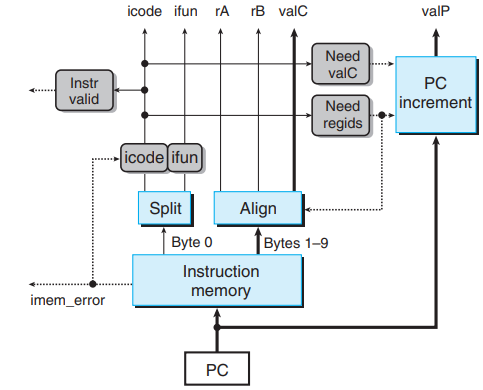

<center>取指阶段<center/>

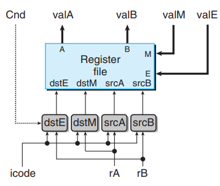

<center>译码和写回阶段<center/>

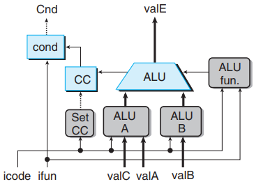

<center>执行阶段<center/>

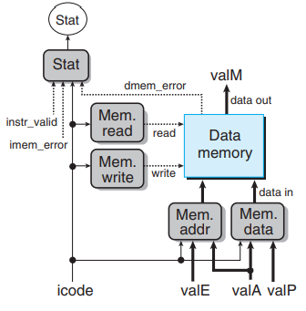

<center>访存阶段<center/>

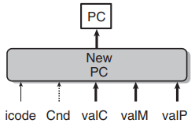

<center>更新阶段<center/>
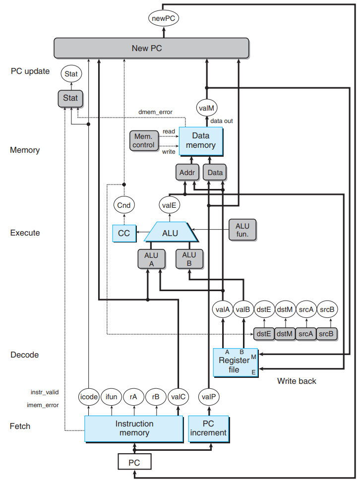
<center>顺序实现的整体硬件结构<center/>


#### 追踪时钟周期

追踪第3 和第 4 个顺序实现的时钟周期。

在第 3 个时钟周期开始时，浅灰色部分表示的时序电路中的值被更新为第 2 个时钟周期的旧值，例如 CC=100，%rbx=0x100，PC=0x014。白色部分表示的组合电路还未开始执行。

在第 3 个时钟周期的过程中，蓝色部分表示的组合电路执行了 addq 指令的 6 个阶段。浅灰色部分表示的时序电路中的值还未被更新。

在第 4 个时钟周期开始时，蓝色部分表示的时序电路的值被更新为第 3 个时钟周期的旧值，例如 CC=000，%rbx=0x300，PC=0x016。白色部分表示的组合电路还未开始执行。

在第 4 个时钟周期的过程中，灰色部分表示的组合电路执行了 je 指令的 6 个阶段。蓝色部分表示的时序电路中的值还未被更新。

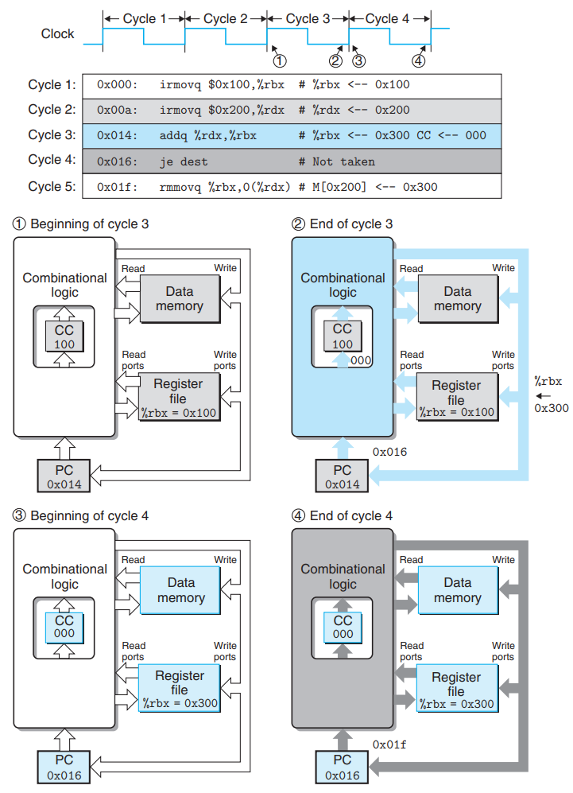

#### 局限性

顺序实现存在以下问题：

1. 时钟周期非常慢，以使信号能在一个时钟周期内传遍所有的阶段。
2. 不能充分利用硬件，每个硬件单元只在整个时钟周期的一部分时间内才被使用。

### Y86-64 流水线实现

在顺序实现中，一个时钟周期内只能执行一个指令完整的 6 个阶段。假设组合电路的延迟为 300 ps，更新时序电路的值需要 20 ps（这里做了简化，实际上依赖于不同的存储系统，容量越大的存储器延迟越高）。执行一条指令的总延迟为 320 ps，CPU 的最大吞吐量为时钟周期的倒数 1/(320ps) ≈ 3.12 GIPS，每秒钟最多可以执行 31.2 亿条指令。

第 1 个时钟周期执行指令 I1，第 2 个时钟周期执行指令 I2。指令间互不干扰，不能充分利用硬件单元。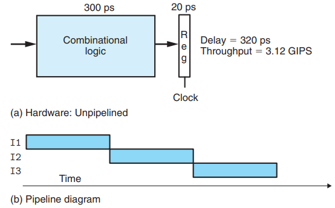

若将原先的组合电路分成 3 阶段，每阶段的输出保存在流水线寄存器中。执行每条指令都经过 3 个阶段的组合电路，共 3 个时钟周期。执行一条指令的延迟为 (100 + 20)\*3 = 360 ps，CPU 的最大吞吐量为 1/(120ps) ≈ 8.33 GIPS。

第1 个时钟周期执行指令 I1 的阶段 A，第 2 个时钟周期执行指令 I1 的阶段 B 和 指令 I2 的阶段 A，充分利用硬件单元。

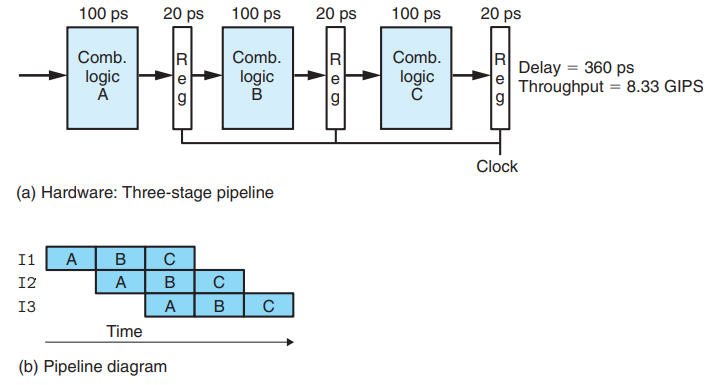

#### 分支预测

流水线要求每个时钟周期都要有一条新指令进入流水线，但跳转指令要到执行阶段才确定下一条指令的地址，ret 指令要等到访存阶段才确定返回地址。

处理器猜测下一条指令的地址并开始取指的技术称为分支预测。对于跳转指令，本书选择 AT(always taken) 的预测策略，即预测跳转指令一定会跳转。对于 ret 指令，本书选择不预测的策略。

#### 流水线冒险

顺序实现中指令间互不干扰，一条指令执行完后的结果保存到时序电路中。下一条指令可以从时序电路中读取上一条指令的结果，不会产生任何问题。

流水线中指令之间有依赖关系，例如下一条指令可能需要上一条指令计算的结果。指令间的联系导致的流水线产生错误的计算称为冒险。冒险分为数据冒险和控制冒险。

**数据冒险**

当前一条指令还未经过写回阶段更新指定寄存器时，下一条指令就读取该寄存器中的错误值，称为数据冒险。

如下代码，```irmovq $10,%rdx``` 指令在第 4 个时钟周期时处于访存阶段，还未更新寄存器 %rdx。```irmovq $3,%rax``` 指令在第 4 个时钟周期时处于执行阶段，还未更新寄存器 %rax。```addq %rdx,%rax``` 指令在第 4 个时钟周期时，无法读取到正确的值 (%rdx=10, %rax=3)，只能读到错误的值。


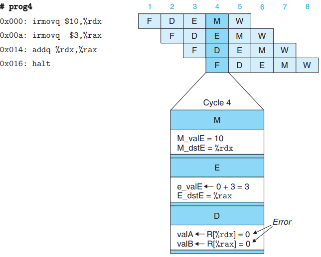

通过**暂停技术**避免数据冒险。暂停技术会影响性能。在第 4 个时钟周期指令 addq 处于译码阶段时，暂停控制逻辑块发现执行、访存和写回阶段中至少有一条指令会更新寄存器 %rdx 和 %rax。处理器在执行阶段插入若干条 nop 指令将 addq 指令阻塞在译码阶段。直到第 7 个时钟周期，寄存器 %rdx 和 %rax 分别被更新为 10 和 3，才取消阻塞 addq 指令。

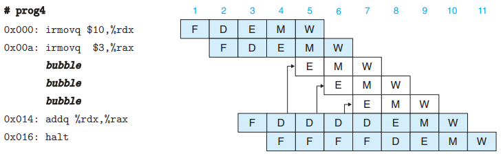

通过**转发技术**来避免数据冒险。转发技术不会影响性能，但需要一些额外的控制逻辑块。在第 4 个时钟周期指令 addq 处于译码阶段，转发控制逻辑块发现用来更新寄存器 %rdx 和 %rax 的值 10 和 3，直接将这两个正确值转发给 addq 指令，addq 指令无需从寄存器文件中读取。

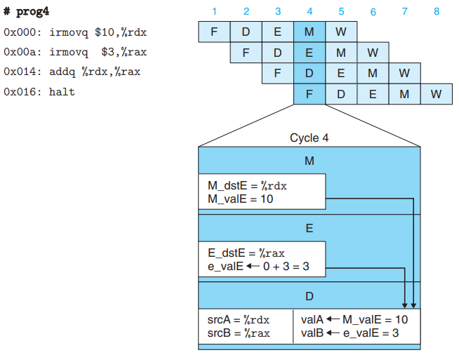


有一类称为加载/使用的数据冒险无法单纯用转发解决。如下代码，在第 7 个时钟周期 ```mrmovq 0(%rdx),%rax``` 指令还未更新寄存器 %rax， ```addq %ebx,%eax``` 指令可以通过转发技术读到正确的值 (%rbx=10)，但无法读到正确的 %rax 中的值。

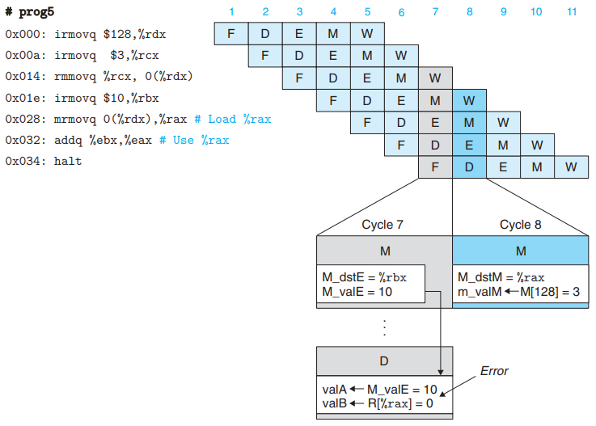

结合**暂停和转发技术**来避免加载/使用的数据冒险。流水线控制逻辑块会阻塞 addq 一个时钟周期，等到第 8 个时钟周期，从内存中取出正确的值 (%rax=3)，将正确的值转发给 addq 指令。

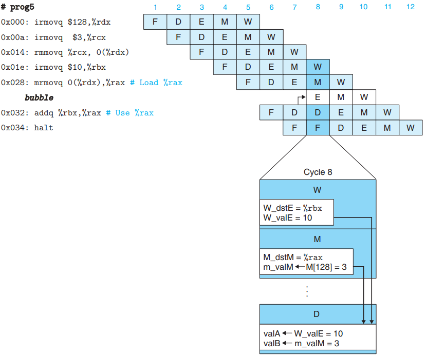

**控制冒险**

当处理器无法根据取指阶段的指令确定下一条指令的地址时，称为控制冒险。对于 Y86-64 指令，只有 ret 指令和跳转指令有控制冒险。

如下代码，因为本书对 ret 指令选择不预测的策略，所以当 ret 指令经过译码、执行和访存阶段时，流水线应暂停，直到第 7 个时钟周期时 ret 指令获取返回地址，PC 将返回地址作为下一条指令的取指地址。

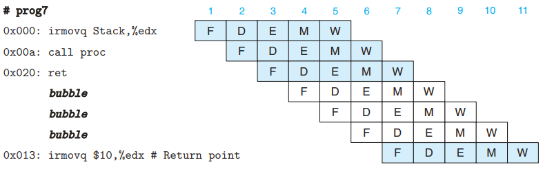

如下代码，因为本书对跳转指令选择 AT 的预测策略，所以在第 3 时钟周期会取出位于跳转目标的指令，第 4 个时钟周期会取出位于跳转目标指令的下一条指令。但在第 4 个时钟周期，je 指令在执行阶段才发现不进行跳转，即产生预测错误。此时取消执行 2 条预测错误的指令，取出正确的指令。

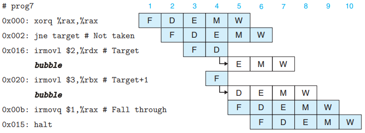

#### 流水线控制逻辑

流水线控制逻辑必须处理以下情况：

1. 加载/使用冒险：在一条内存中读出一个值的指令和一条使用该值的指令之间，流水线必须暂停一个周期。

2. 处理 ret：流水线必须暂停直到 ret 指令达到写回阶段。

3. 分支预测错误：在发现分支预测错误时，跳转目标的几条指令已经进入流水线。此时必须取消这些指令，从跳转指令的下一条指令开始执行。

4. 异常：当异常指令到达访存阶段时，禁止其后面的指令更新内存、条件码。异常指令到达写回阶段时，暂停其写回阶段，暂停整个流水线。最终的效果是：异常指令之前的指令都完成了，异常指令之后的指令没有更新寄存器、内存和条件码。

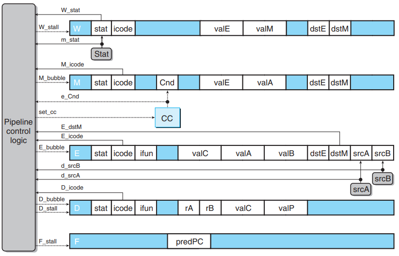
<center>流水线控制逻辑的整体硬件结构<center/>

#### 实现指令阶段

流水线中一个时钟周期内可以执行若干条指令。流水线在一个时钟周期开始时执行就更新 PC ，而不是等到当前周期结束。流水线寄存器分隔不同阶段的组合电路，每个阶段组合电路的输出保存到流水线寄存器中。

F：保存 PC 的预测值

D：位于取指和译码阶段之间，保存取指阶段组合电路的输出，包括最新取出的指令信息

E：位于译码和执行阶段之间，保存译码阶段组合电路的输出，包括最新译码后的指令和从寄存器文件读出的值

M：位于执行和访存阶段之间，保存执行阶段组合电路的输出，包括最新执行的指令的结果

W：位于访存和写回阶段之间，保存访存阶段组合电路的输出，包括将最新的值写入寄存器文件中

蓝色方框表示硬件单元，白色方框表示 PC，浅灰色方框表示控制逻辑块，加粗的线条表示传输 64 位，普通线条表示传输 4 或 8 位，虚线表示传输 1 位。以下展示实现 6 个指令阶段的硬件结构和 CPU 整体的硬件结构。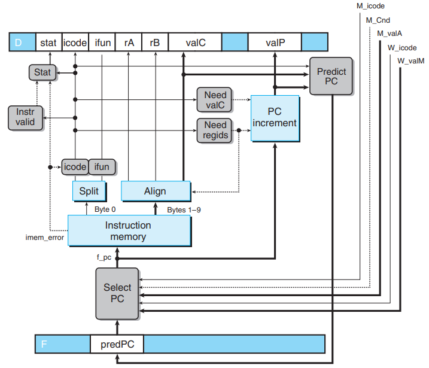

<center>取指阶段<center/>

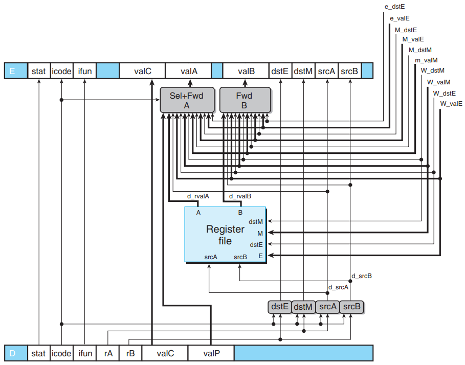

<center>译码和写回阶段<center/>

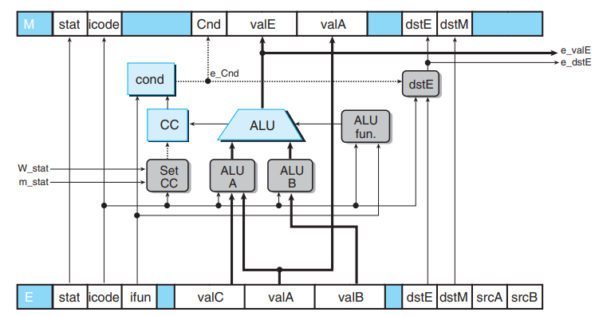

<center>执行阶段<center/>

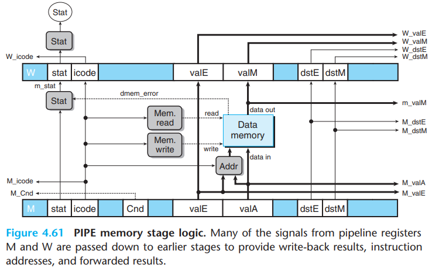

<center>访存阶段<center/>

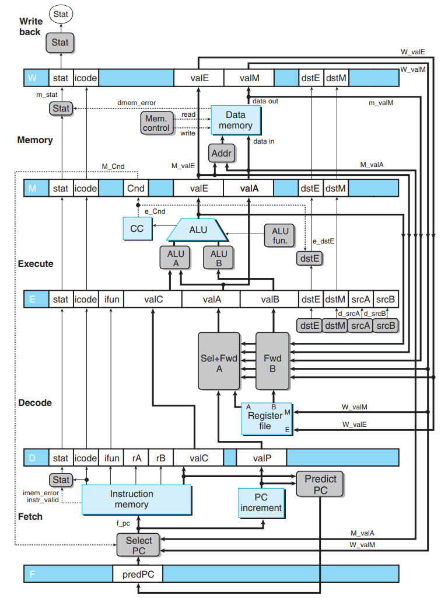

<center>流水线的整体硬件结构<center/>

#### 追踪时钟周期

追踪第 2 和 3 个流水线的时钟周期。

在第 2 个时钟周期开始时 (121ps)，指令 I1 经过组合电路 A 执行阶段 A 产生的输出 A 被保存到第 1 个流水线寄存器。

在 第 2 个时钟周期过程中 (121ps~239ps)，指令 I1 经过组合电路 B 执行阶段 B 产生输出 B，指令 I2 经过组合电路 A 执行阶段 A 产生输出 A。

在第 3 个时钟周期开始时 (241ps)，输出 A 被保存到第 1 个流水线寄存器中，输出 B 被保存到第 2 个流水线寄存器中。

在第 3 个时钟周期过程中 (241ps~359ps)，指令 I1 经过组合电路 C 执行阶段 C 产生输出 C，指令 I2 经过组合电路 B 执行阶段 B 产生输出 B，指令 I3 经过组合电路 A 执行阶段 A 产生输出 A。

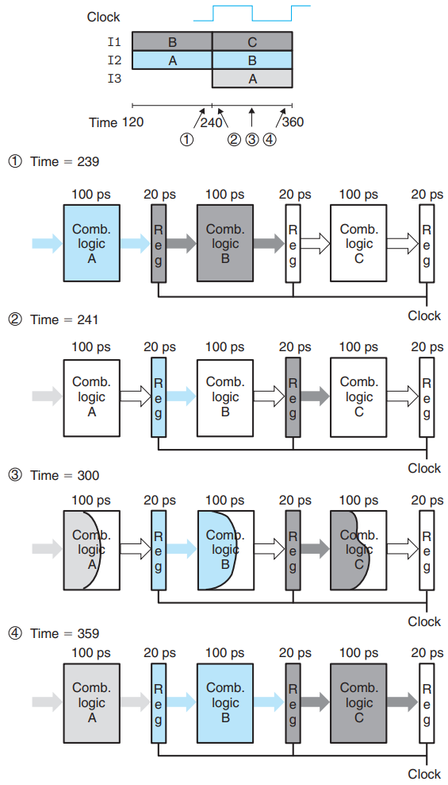

#### 局限性

将整个组合电路划分为多个具有相同延迟的组合电路是个挑战。时钟周期取决于延迟最大的阶段。例如组合电路 A 延迟为 (50+20) ps，组合电路 B 的延迟为 (150+20) ps，组合电路 C 的延迟为 (100+20) ps，因此时钟周期必须设为 170ps，整体延迟为 170*3=510 ps，CPU 的最大吞吐量为 1/(170ps) ≈ 5.88 GIPS。 

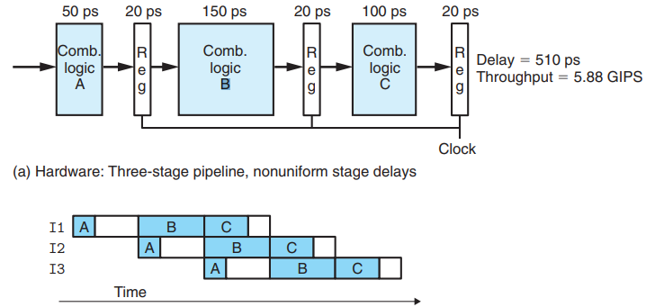

流水线设计遵循边际递减效应，将流水线深度提高 2 倍，从 3 阶段提高为 6 阶段。最大吞吐量从 8.33 GIPS 提高到 14.29 GIPS，只提高了 1.71 倍，并没有提高 2 倍。

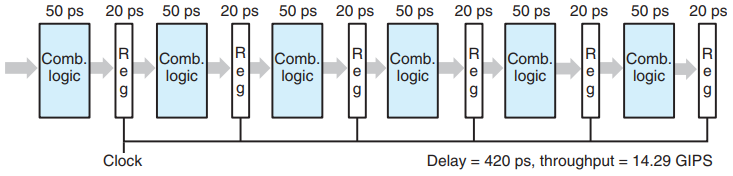
