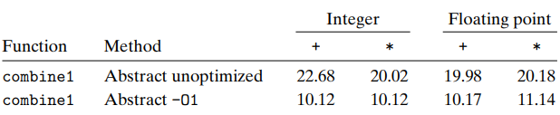
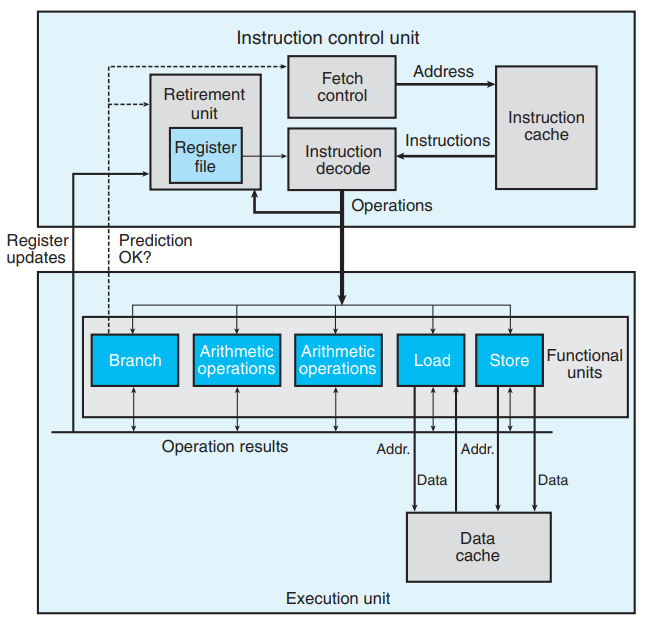
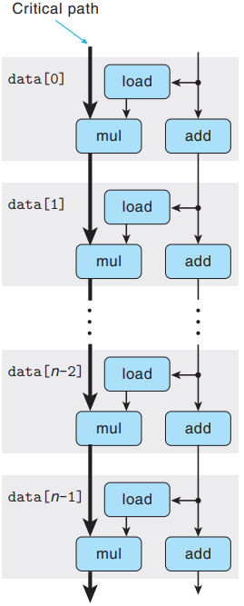
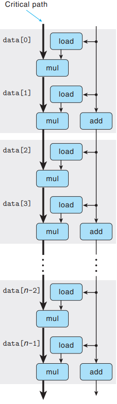
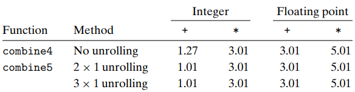
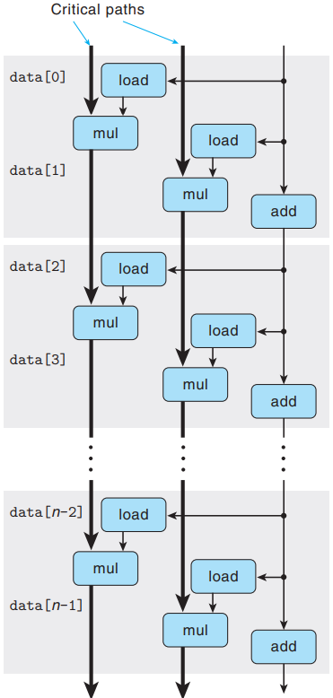
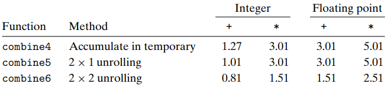
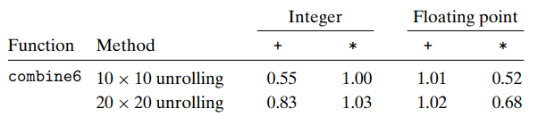

# 第四章 优化程序性能

### 编译器局限性

#### 内存别名使用

编译器只会对程序进行安全的优化。如下代码的 fun1 和 fun2 执行后似乎有相同的结果，似乎 fun1 可以优化成 fun2。

```c
void fun1(long *xp, long *yp){
    *xp += *yp;
    *xp += *yp;
}

void fun2(long *xp, long *yp){
    *xp += 2* *yp;
}
```

但当 xp 和 yp 指向同一个内存位置时，称为内存别名使用。此时 fun1 执行的结果是 *xp 的值增加 4 倍，fun2 执行的结果是 *xp 的值增加 3 倍。编译时编译器无法知道 xy 和 yp 是否指向同一个内存位置，所以 fun1 不能被优化成 fun2。

#### 函数调用

如下代码的 fun1 和 fun2 执行后似乎有相同的结果，似乎 fun1 可以优化成 fun2。

```c
long f();

long func1(){
	return f() + f() + f() +f();
}

long fun2(){
    return 4*f();
}
```

但当 f 函数会修改全局变量时，改变调用 f 函数的次数会改变全局变量。fun1 执行的结果是 counter 值为 0+1+2+3=6，fun2 执行的结果是 counter 值为 4\*0=0。编译时编译器无法确定一个函数是否会修改全局变量，所有 fun1 不能被优化成 fun2。

```c
long counter = 0;
/*f 函数有副作用*/
long f(){
    return counter++;
}
```

### 不依赖机器的优化

#### 程序性能

CPE (Cycles Per Element) 代表每个元素耗费的时钟周期数，适用于度量执行重复计算的程序的性能。

#### 程序示例

创建一个 C 结构表示向量，向量由头信息 len 和 data_t 类型的指针组成，data_t 可以是整型 (int,long) 和浮点型 (float, double)。该结构还会分配一个 data_t 类型的数组。

```c
typedef struct {
    long len;
    data_t *data;
}vec_rec, *vec_ptr;
```


以下是生成向量、访问向量元素和确定向量长度的函数。

```c
/*
 *生成向量
 */
vec_ptr new_vec(long len){
    /*为结构分配内存空间*/
    vec_ptr result = (vec_ptr)malloc(sizeof(vec_rec));
    data_t *data = NULL;
    if(!result)
        return NULL;
    result->len = len;
    
    if(len > 0){
        /*为数组分配内存空间*/
        data = (data_t *)calloc(len, sizeof(data_t));
        if(!data){
            free((void *)result);
            return NULL;
        }
    }
    result->data = data;
    return result;
}

/*
 *访问向量元素，存放指针 *dest 中
 */
int get_vec_element(vec_ptr v, long index, data_t *dest){
    /*数组索引越界返回 0*/
    if(index < 0 || index >= v->len)
        return 0;
    *dest = v->data[index];
    /*成功执行返回 1*/
    return 1;
}

/*
 *确定向量长度
 */
long vec_length(vec_ptr v){
    return v->len;
}                 
```
函数 combine1 使用加法或乘法运算，累加或累乘一个向量中的所有元素。

```c
/*给加法运算时使用*/
#define INDENT 0
#define OP +

/*给乘法运算时使用*/
#define INDENT 1
#define OP *

void combine1(vec_ptr v, data_t *dest){
    long i;
    *dest = INDENT;

    for(i = 0; i<vec_length(v);i++){
		data_t val;
		get_vec_element(v,i,&val);
        /*累加或累乘*/
		*dest = *dest OP val;
    }
}
```

以下显示函数 combine1 不使用优化和使用编译器 O1 级别优化的程序性能。不经过优化时，CPE 大约为 20；经过优化后，CPE 大约为 10。经过一些基本的优化程就能显著提高程序性能。



#### 优化测试条件

观察函数 combine1 发现，每次循环时都必须对测试条件 ```i<vec_length(v)``` 求值，因为 ```vec_length(v)``` 是一个定值，所以只需要计算一次。函数 combine2 只对```vec_length(v)``` 计算一次。

```c
void combine2(vec_ptr v, data_t *dest){
	long i;
	*dest = INDENT;
	long length = vec_length(v);

	for(i = 0; i <  length; i++){

	data_t val;
	get_vec_element(v,i,&val);
	*dest = *dest OP val;
    }
}
```

以下显示函数 combine1 和 combine2 的程序性能，可以看出减少不必要的测试条件是提高程序性能的一个因素。


#### 减少函数调用

函数调用会产生开销。观察函数 combine2 发现，每次循环都需要调用函数 ```get_vec_element``` 获取数组中的元素。在函数 combine3 中，在循环开始前获取数组的首地址，通过索引直接获取数组元素，减少函数调用次数。

```c
data_t *get_vec_start(vec_ptr v){
    return v->data;
}

void combine3(vec_ptr v,data_t *dest){
    long i;
    long length = vec_length(v);
    data_t *data = get_vec_start(v);
    
    *dest = INDENT;
    for(i=0; i<length;i++){
        *dest = *dest OP data[i];
    }
}
```

以下显示函数 combine2 和 combine3 的程序性能。由于其他因素影响，两个函数性能差不多，但减少函数调用仍然是提高程序性能的一个因素。


#### 减少内存读写

频繁读写内存会产生开销。观察函数 combine3 发现，每次循环都需要读取 \*dest 的值，累加或累乘后的结果 \*dest 再写入内存。这是一种没有必要的行为，因为上一次循环结束后的 \*dest 值会被下一次循环使用。函数 combine4 将循环时每次计算出的 \*dest 结果保存在临时变量 temp 中，等循环结束再写入内存中。

```c
void combine4(vec_ptr v, data_t *dest){
    long i;
    long length = vec_length(v);
    data_t *data = get_vec_start(v);
    data_t temp = INDENT;
    
    for(i=0; i<length; i++){
        temp = temp OP data[i];
    }
    *dest = temp;
}
```

以下显示函数 combine3 和 combine4 的程序性能。可以看出减少内存读写是提高程序性能的一个因素。


函数 combine4 优化了测试条件，减少了函数调用，减少内存读写次数，CPE 性能从函数 combine1 的 9~11 提升到 1~5。

### 依赖机器的优化

#### 现代微处理器

下图是简化的基于 Intel 的现代微处理器示意图。ICU (Instruction control unit) 负责取指和译码，生成一组基本操作，EU (Execution unit) 负责执行基本操作。

Fetch control：从 Instruction chche 中取指

Instrcution cache：保存最近执行过的指令

Instrcution decode：译码，将指令转换成一组基本的操作

Retirement unit：控制寄存器文件的更新，一条指令执行结束且分支预测正确时更新寄存器文件

Functional units：执行读写内存，整数和浮点数的运算，判断分支预测是否正确等基本操作

Data cache：保存最近读写的数据值



#### 循环展开

下图展示函数 combine4 执行循环过程中的数据流。每次循环都需要从内存中加载 (load) 一个数组元素进行累加或累乘 (mul)，数组索引自增 (add)。必须等到第一个循环的所有指令执行完毕，才能执行第二个循环。



增加每次循环计算的元素数量，减少循环次数称为循环展开。当设置高优化等级时，GCC 就会执行循环展开。函数 combine5 执行 2x1 循环展开，每次循环计算 2 个元素的值，循环总次数减少。

```c
void combine5(vec_ptr v, data_t *dest){
    long i;
    long length = vec_length(v);
    long limit = length -1;
    data_t *data = get_vec_start(v);
    data_t temp = INDENT;
    
    /*2x1循环展开*/
    for(i=0; i<limit; i+=2){
        temp = (temp OP data[i]) OP data[i+1];
    }
    
    /*处理剩余的元素*/
    for(; i<length; i++){
        temp = temp OP data[i];
    }
    *dest = temp;
}
```


循环展开是提高程序性能的一个因素。但循环展开次数不是越高越好，当循环展开到一定次数时，程序性能基本没有显著的改变。


#### 指令并行

循环展开到一定次数后，性能瓶颈不再是循环次数，而是只有当次循环的循环结果写入临时变量 temp 之后才能开始下次循环。函数 combine6 增加多个临时变量，并行地执行多个循环指令。

```c
void combine6(vec_ptr v, data_t *dest){
    long i;
    long length = vec_length(v);
    long limit = length -1;
    data_t *data = get_vec_start(v);
    data_t temp0 = INDENT;
    data_t temp1 = INDENT;
    
    /*2x2循环展开*/
    for(i=0; i<limit; i+=2){
        temp0 = temp0 OP data[i];
        temp1 = temp1 OP [datai+1];
    }
    
    /*处理剩余元素*/
    for(; i<length; i++){
        temp0 = temp0 OP data[i];
    }
    *dest = temp0 OP temp1;
}
```



可以看出指令并行是提高程序性能的一个因素。



### 限制因素

#### 寄存器溢出

指令并行时创建的局部变量个数大于寄存器个数时，会在运行时栈上分配空间，存储无法存放在寄存器中的局部变量。从内存中频繁读写局部变量会影响性能。



#### 预测错误

处理器分支预测错误也会影响性能。优先考虑使用三元运算符，再考虑使用条件分支。
