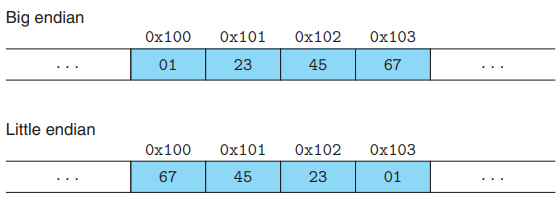
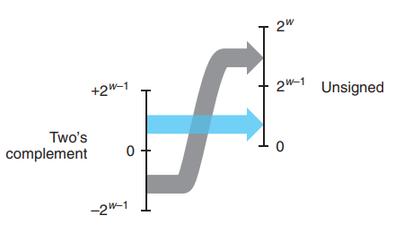
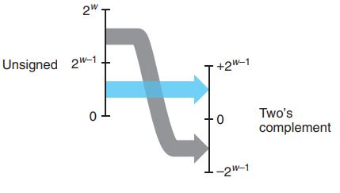
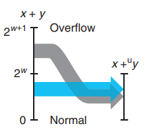
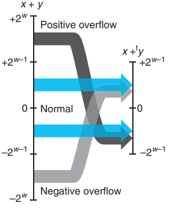
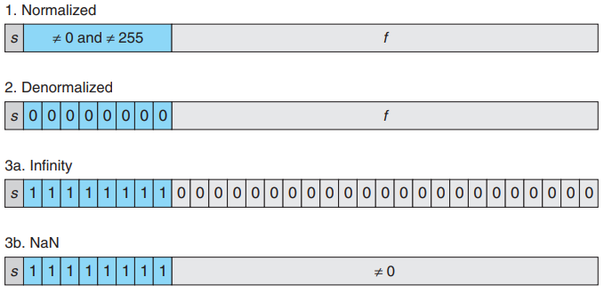

# 第一章 信息存储与处理

**小端法和大端法**

在几乎所有机器上，多字节对象被存储为连续的字节序列。例如占据 4 个字节的 int 类型的变量 x 地址为 0x100，表示变量 x 占据内存中 0x100, 0x101, 0x102 和 0x103 位置。

假设变量 x 的值为 0x01234567，根据我们的理解，0 是最高位，7是最低位。若在内存中，按照最高位到最低位的顺序排列存储，称为大端法；若按照最低位到最高位的顺序排列存储，称为小端法。



大多数 Intel 兼容机都只采用小端法，IBM 和 Oracle 的大多数机器采用大端法。

**逻辑右移和算术右移**

逻辑右移：左端补 k 个 0；算术右移：左端补 k 个符号位的值。

对于一个由 w 位组成的数据类型，若右移 k (k ≥ w) 位，移位指令实际上右移了 (k mod w) 位。

## 整数表示法

无符号表示法只能表示非负数。若用 w 位编码非负数 x，x 的取值范围为 [0,2^w^-1]。

[1011] = 1x2^3^ + 0x2^2^ + 1x2^1^ + 1x2^0^ = 11
[1111] = 1x2^3^ + 1x2^2^ + 1x2^1^ + 1x2^0^ = 15


补码表示法可以表示整数。若用 w 位编码，表示的范围为 [-2^w-1^,2^w-1^-1]。

[1011] = 1x2^-3^ + 0x2^2^ + 1x2^1^ + 1x2^0^ = -5
[1111] = 1x2^-3^ + 1x2^2^ + 1x2^1^ + 1x2^0^ = -1

**补码数转无符号数**

w 位编码，补码表示法的整数 x。若 x ≥ 0 ，补码表示法与无符号表示法表示相同的数。若 x < 0，x + 2^w^ 为转换后的无符号数。
$$
f(x) = \left\{
  \begin{array}{lr}
    x+2^w &  x < 0\\
    x &  x \ge 0
  \end{array}
\right.
$$

| 位向量 | 补码表示法 | 无符号表示法           |
| ------ | ---------- | ---------------------- |
| [0010] | 转换前：2  | 转换后：2              |
| [1011] | 转换前：-5 | 转换后：-5 + 2^4^ = 11 |




**无符号数转补码数**

w 位编码，无符号表示法的无符号数 x。若 x ≤ 2^w-1^-1，无符号表示法与补码表示法表示相同的数。若 x > 2^w-1^-1，x - 2^w^ 为转换后的补码数。

$$
f(x) = \left\{
  \begin{array}{lr}
    x &  x \le 2^{w-1}-1\\
    x-2^w &  x > 2^{w-1}-1
  \end{array}
\right.
$$

| 位向量 | 无符号表示法 | 补码表示法           |
| ------ | ------------ | -------------------- |
| [0010] | 转换前：2    | 转换后：2            |
| [1011] | 转换前：11   | 转换后：11 - 16 = -5 |



**类型提升**

当一个无符号数转为一个更大的数据类型时，在高位一端补 0；当一个补码数转为一个更大的数据类型时，在高位一端补符号位的值。类型提升时，位向量所表示的值不会发生改变。

| 位向量                | 无符号表示法            | 补码表示法              |
| --------------------- | ----------------------- | ----------------------- |
| [1011]，表示 11 或 -5 | [0000**1011**]，表示 11 | [1111**1011**]，表示 -5 |
| [0110]，表示 6        | [0000**0110**]，表示 6  | [0000**0110**]，表示 6  |

**类型降级**

当一个 w 位编码无符号数 x 转为一个更小的 k 位编码的数据类型时，舍弃高位一端的 w-k 位，保留低位一端的 k 位。转换后的值为 x mod 2^k^。补码数同理，但转换后的值需根据符号位进行判断。

| 位向量               | 无符号表示法       | 补码表示法      |
| -------------------- | ------------------ | --------------- |
| [1001]，表示 9 或 -7 | [001]，9 mod 8 = 1 | [001]，表示 1   |
| [0101]，表示 5       | [101]，5 mod 8 = 5 | [101] ，表示 -3 |

## 整数运算

### 加法

**无符号加法**

对于 w 位编码的无符号数字 x, y (0 ≤ x, y < 2^w^)， 0 ≤ x + y ≤ 2^w+1^ - 2。

若 x + y < 2^w^，运算结果处于 w 位无符号数可表示的自然数范围内，加法运算正常；若 2^w^ ≤ x + y < 2^w+1^，运算结果超出 w 位无符号数字可表示的自然数范围，加法运算溢出，舍弃最高位，保留剩余的 w 位。
$$
sum = \left\{
  \begin{array}{lr}
    x+y &  x+y < 2^w\\
    x+y-2^w & 2^w \le x+y <2^{w+1}
  \end{array}
\right.
$$


4 位无符号数可表示 [0,16) 的数，x = 4，y = 2，x + y = 6 < 16，运算结果正常。

```
x = [0100], y = [0010]
x + y = [0100] + [0010] = [0110] 
```

x = 8，y = 13，x + y = 21 ≥ 16，运算结果溢出，舍弃最高位，最后运算结果为 21 - 2^4^ = 5。当且仅当 x + y < x (或 x + y < y) 时，无符号加法溢出。

```
x = [1000], y = [1101]
x + y = [1000] + [1101] = [10101] = [0101]
```

**补码加法**

对于 w 位编码的补码数字 x, y (-2^w-1^ ≤ x, y < 2^w-1^-1)， -2^w^ ≤ x + y ≤ 2^w^ - 2。

若 -2^w-1^ ≤ x + y < 2^w-1^，运算结果处于 w 位补码数可表示的整数范围内，加法运算正常；若 2^w-1^ ≤ x + y，运算结果超出 w 位补码数字可表示的最大正整数范围，加法运算上溢；若 x + y < -2^w-1^，运算结果超出 w 位补码数字可表示的最小负整数范围，加法运算下溢。
$$
sum = \left\{
  \begin{array}{lr}
    x+y-2^w &   2^{w-1} \le x+y \ \\
    x+y & -2^{w-1} \le x+y <2^{w-1}\\
    x+y+2^w & x+y < -2^{w-1}
  \end{array}
\right.
$$



4 位补码数可表示 [-8,8) 的数，x = 4，y = 2，x + y = 6 $\in$ [-8,8)，运算结果正常。

```
x = [0100], y = [0010]
x + y = [0100] + [0010] = [0110] 
```

x = -7，y = -3，x + y = -10 < -8，运算结果下溢，舍弃最高位，最后运算结果为 -10 + 2^4^ = 6。当且仅当 x > 0，y > 0，x + y < 0 时，补码加法下溢。

```
x = [1001], y = [1101]
x + y = [1001] + [1101] = [10110] = [0110]
```
x = 7，y = 6，x + y = 13 ≥ 8，运算结果上溢，最后运算结果为 13 - 2^4^ = -3。当且仅当 x < 0，y < 0，x + y > 0 时，补码加法上溢。
```
x = [0111], y =[0110]
x + y = [0111] + [0110] = [1101]
```

### 乘法

**无符号和补码乘法**

对于 w 位编码的无符号数字 x, y (0 ≤ x, y < 2^w^)， 0 ≤ x \* y ≤ 2^2w^ - 2^2+1^ + 1。

若 x \* y < 2^w^，运算结果处于 w 位无符号数可表示的自然数范围内，乘法运算正常；若 2^w^ ≤ x \* y，运算结果超出 w 位无符号数字可表示的自然数范围，乘法运算溢出，从高位一端开始舍弃，只保留低位一端的 w 位。

3 位无符号数可表示 [0,8) 的数，x = 3，y = 2，x \* y = 6 < 8，运算结果正常。

```
x = [011], y = [010], x * y = [110] = [110]
```

x = 4，y = 7，x \* y = 28 ≥ 8，运算结果溢出，只保留低位一端的 3 位，最后运算结果为 28 mod 2^3^ = 4。

```
x = [100], y = [111], x * y = [11100] = [100]
```

补码乘法和无符号乘法类似。

$$
product = \left\{
  \begin{array}{lr}
    x*y &  x*y < 2^w\\
    x*y \mod 2^w & 2^w \le x*y
  \end{array}
\right.
$$

**乘法优化**

加法、减法、位级运算和移位指令只需要 1 个时钟周期，乘法指令需要 10 个或更多的时钟周期。当乘法表达式中有常数，用少量的移位、加减法指令就可以代替此常数时，编译器会进行优化。

例如乘法表达式 x \* 14，可用以下两种形式代替：

形式 A：(x <<  3) + (x << 2) + (x << 1)

形式 B：(x << 4) - (x << 1) 

**除法优化**

除法指令比乘法指令更慢，需要 30 或更多的时钟周期。当除数为 2^n^ 时，可以用右移指令代替除法指令。

对于无符号数，进行逻辑右移。例如 x / 8 用 x >> 3 代替。若商不是整数，向零取整得到结果，例如 15 / 8 = 1.875 = 1。

```
([1111] >> 3) = [0001]
15 / 8 = 1
```

对于补码数，进行算术右移。

若商不是整数且被除数大于 0，向零取整得到结果，例如 15 / 8 = 1。
若商不是整数且被除数小于 0，向下取整得到结果，例如 -15 / 8 =  -2。

```
([01111] >> 3) = [00001]
15 / 8 = 1

([10001] >> 3) = [11110]
-15 / 8 = -2
```

被除数为负数时，向下取整得到的结果是不合适的，-15 / 8 = -1 才是合理的。因此对被除数增加一个偏置值，向零取整后得到合适的结果。偏置值为除数 - 1。

```
([10001] + [00111]) >> 3 = ([11000] >> 3) = [11111]
(-15 + 7) / 8 = -1
```

## 浮点数表示法

几乎所有的计算机都支持 IEEE 浮点表示法。IEEE 浮点表示法用 V = (-1)^S^ x M x 2^E^三部分来表示一个浮点数。

- 符号：s 是最高位的符号位，决定了浮点数的符号
- 尾数：M 是一个二进制小数
- 阶码：E 对浮点数加权，表示 2 的 E 次幂

最常见的两种浮点数格式——单精度和双精度格式。

单精度：符号用 1 位编码，尾数用 8 位编码，阶码用 23 位编码，总共用 32 位表示一个浮点数

双精度：符号用 1 位编码，尾数用 11 位编码，阶码用 52 位编码，共用 64 位表示一个浮点数

**规格化浮点数**

以单精度格式为例，当阶码中的位既不全为 0 ，也不全为 1 时，属于规格化浮点数。

- 规格化浮点数的阶码用无符号数表示，偏置值为 2^8-1^ -1 = 127。

- 尾数 $\in$ [1,2)，所有可以省略小数点前面的 1，只表示小数点后面的数字。

<hr>

将单精度的规格化浮点数 [01000110101101110110000011010111] 转换为十进制小数

1.符号位为 [0] ，表示正浮点数

2.阶码为 [10001101]，表示无符号数 141~10~，减去偏置值后得到结果 141 - 127 = 14，表示 2^14^

3.尾数为 [01101110110000111000000]，加上省略小数点前的 1，完整的尾数为 1.01101110110000111~2~

最终的结果为 1.01101110110000111~2~ x 2^14^ = 23472.875~10~

<hr>

将十进制小数 23472.875~10~ 转换为单精度格式

1.十进制小数 23472.875~10~ 转为二进制格式 1.01101110110000111 x 2^14^

2.正浮点数，符号位为 0

3.14 加上偏置值后得到无符号数 14 + 127 = 141，即 [10001101]

4.尾数为 1.01101110110000111，省略小数点前面的 1，得到最终的尾数为 [01101110110000111000000]

**非规格化浮点数**

当阶码中的位全部为 0 时，表示非规格化浮点数。

1.非规格化浮点数的阶码为固定值，1 - 127 = -126。

2.尾数 $\in$ [0,1)，不省略小数点前的 1。

<hr>

将单精度的非规格化浮点数 [00000000010101000000000000000000] 转换为十进制小数

1.符号位为 [0]，表示正浮点数

2.阶码为固定值，表示 2^-126^

3.尾数为 [10101000000000000000000]，表示 0.10101

最终的结果为 0.10101~2~ x 2 ^-126^ = 7.714 x 10^-39^

**0**

当阶码中的位全部为 0 ，且尾数中的位全部为 0 时，若符号位为 1，表示 -0.0；若符号位为 0，表示 +0.0。

**无穷大**

当阶码中的位全部为 1，且尾数中的位全部为 0 时，若符号位为 1，表示负无穷；若符号位为 0，表示正无穷。

**NaN**

当阶码中的位全部为 1，且尾数中的位并非全部为 0 时，表示 NaN。




## 舍入

| 舍入方式       | 1.44 | 1.46 | 1.45 | -1.45 |
| -------------- | ---- | ---- | ---- | ----- |
| 四舍六入五成双 | 1.4  | 1.5  | 1.4  | -1.4  |
| 向零舍入       | 1.4  | 1.4  | 1.4  | -1.4  |
| 向下舍入       | 1.4  | 1.4  | 1.4  | -1.5  |
| 向上舍入       | 1.5  | 1.5  | 1.5  | -1.5  |

一般采用四舍六入五成双的舍入：

| 十进制 | 10.52 | 10.53 | 10.54 | 10.55 | 10.56 |
| ------ | ----- | ----- | ----- | ----- | ----- |
| 舍入   | 10.5  | 10.5  | 10.5  | 10.6  | 10.6  |

| 二进制 | 1.000 | 1.001 | 1.010 | 1.011 | 1.101 |
| ------ | ----- | ----- | ----- | ----- | ----- |
| 舍入   | 1.0   | 1.0   | 1.0   | 1.1   | 1.1   |