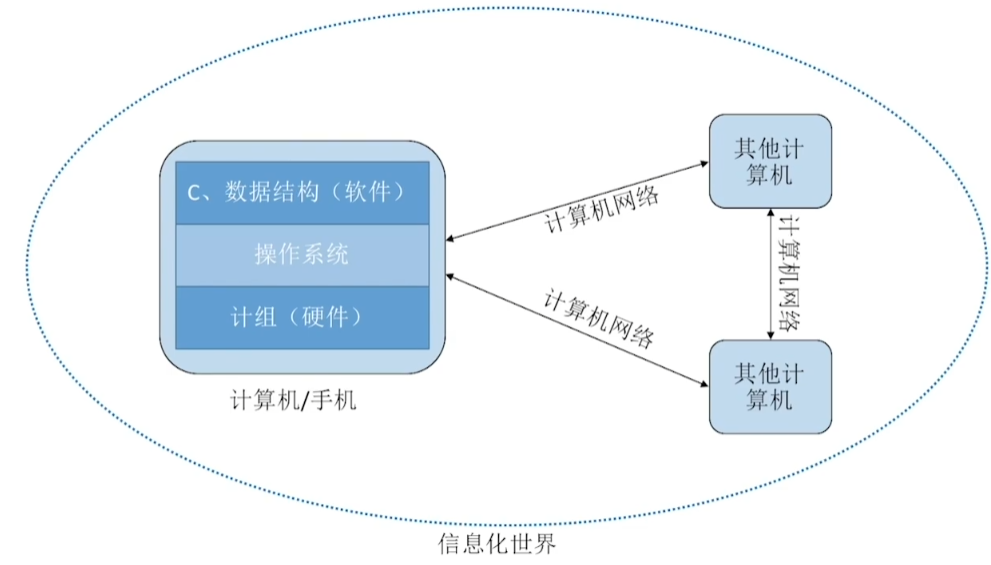
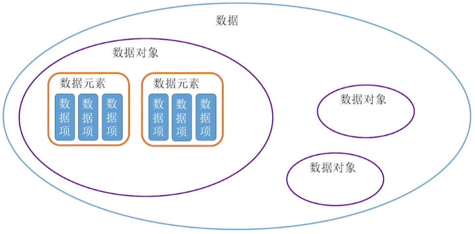
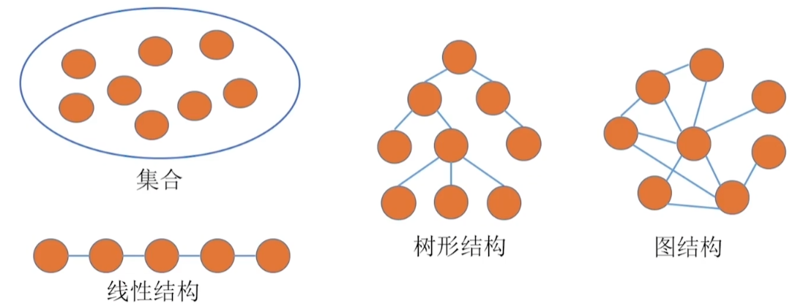
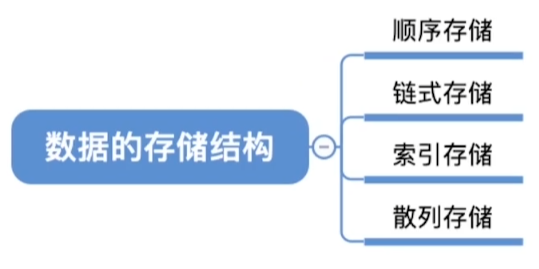

# 第一章 导论

数据结构学习如何用程序代码把现实世界的问题信息化

### 基本概念

**数据**：数据是信息的载体，是所有能输入到计算机中并被计算机程序识别和处理的符号集合。数据是计算机程序加工的原料。

**数据元素**：数据元素是数据的基本单位，一个数据元素可由若干个数据项组成

**数据项**：数据项是构成数据元素的不可分割的最小单位

**数据结构**：数据结构是相互之间存在一种或多种特定关系的数据元素的集合

**数据对象**：数据对象是具有相同性质的数据元素的集合，是数据的一个子集

**数据类型**：数据类型是一个值的集合和定义在该集合上的一组操作的总称

**抽象数据类型**：抽象数据类型 ADT 是抽象数据组织及与之相关的操作，ADT 用数学化的语言定义了数据的逻辑结构和数据运算，与具体的实现无关。

数据结构三要素：逻辑结构、物理结构和数据运算

1. 数据的逻辑结构表明了数据元素之间的逻辑关系

2. 数据的物理结构（存储结构）表明了数据在物理上的存储方式

3. 数据运算是施加在数据上的运算，包括运算的定义和实现。

### 算法

算法是解决问题的一系列程序指令集合，

有穷性：一个算法必须总在执行有穷步之后结束，且每一步都可在有穷时间内完成
确定性：算法中每条指令必须有确切的含义，对于相同的输入只能得出相同的输出
可行性：算法中描述的操作都可以通过已实现的基本运算执行有限次来实现
输入：一个算法有零个或多个输入
输出：一个算法有一个或多个输出

**好算法特点：**

正确性：算法应该能够正确地解决求解问题
可读性：算法应具有良好的可读性高，以帮助人们理解
健壮性：输入非法数据，算法能适当地做出反应或进行处理
高效率和低存储量需求：时间复杂度和空间复杂度尽可能低

#### 时间复杂度

事前预估算法时间开销与问题规模 n 的关系

大 O 表示法可以只考虑最高阶

最坏时间复杂度：最坏情况下算法的时间复杂度
平均时间复杂度：所有输入示例等概率出现的情况下，算法的期望运行时间
最好时间复杂度：最好情况下算法的时间复杂度

#### 空间复杂度

一维数组：一维数据的空间复杂度为 O(n)
二维数组：二维数组的空间复杂度为 O(n^2^)
