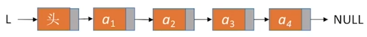
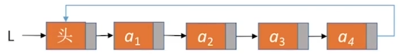
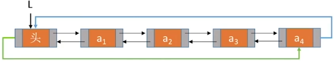

# 第二章 线性表

线性表是具有**相同**数据类型的 n 个数据元素的**有限序列**。其中 n 为表长。当 n 为 0 时线性表是一个空表。
除第一个元素之外，每个元素有且仅有一个直接前驱；除最后一个元素之外，每个元素有且仅有一个直接后继。

### 基本操作

initList(&L)：初始化表，构造一个空的线性表 L，分配内存空间。
DestoryList(&L)：销毁操作，销毁线性表，并释放线性表 L 所占用的内存空间
ListInsert(&L,i ,e)：插入操作，在表 L 中的第 i 个位置上插入指定元素 e
ListDelete(&L,i,&e)：删除操作，删除表 L 中的第 i 个位置的元素，并用 e 返回删除元素的值
LocateElem(L,e)：按值查找操作，在表 L 中查找具有给定关键字值的元素
GetElem(L,i)：按位查找操作，获取表 L 中的第 i 个位置的元素的值
Length(L)：求表长，返回线性表 L 的长度，即 L 中数据元素的个数
PrintList(L)：输出操作，按前后顺序输出线性表 L 的所有元素值
Empty(L)：判空操作，若 L 为空表，返回 true，否则返回 false

### 顺序表

顺序表用顺序存储的方式实现线性表。把逻辑上相邻的元素存储在物理位置上也相邻的存储单元中。

顺序表特点：

- 随机访问，可以在 O(1) 时间内找到第 i 个元素
- 存储密度高，每个结点只存储数据元素
- 扩展容量不方便
- 插入、删除操作不方便，需要移动大量元素

```c++
#include <stdio.h>
#include <stdlib.h>
#define InitSize 10  //顺序表初始长度

typedef int ElemType; //假设数据元素类型为 int

typedef struct{
    ElemType *data;  //指向数据元素的指针
    int MaxSize;     //顺序表的最大容量
    int length;  	 //顺序表的当前长度
}SqList;			 //顺序表的类型定义
   
void InitList(SqList &L){
   	//用 malloc 函数申请一片连续的存储空间
    L.data = (int *)malloc(InitSize*sizeof(ElemType));
    L.length = 0;
    L.MaxSize = InitSize;
}

bool ListInsert(SqList &L,int i, ElemType e){
    if(i < 1 || i > L.length + 1) 			//处理越界情况
        return false;
    
    if(L.length >= L.MaxSize)				//处理顺序表溢出情况
        return false;
    
    for(int j = L.length; j >=i; j--)		//后移第 i 个元素及其之后的所有元素
        L.data[j]=L.data[j-1];
    L.data[i-1]= e;							//在位置 i 放入 e
    L.length++;								//更新顺序表长度
    return true;
}

bool ListDelete(SqList &L, int i, ElemType &e){
    if(i < 1 || i > L.length)				//处理越界情况
        return false;
    e=L.data[i-1];							//获取待删除元素
    for(int j = i; j < L.length; j++)       //前移第 i 个元素及其之后的所有元素
        L.data[j-1]=L.data[j];
    L.length--;								//更新顺序表
    return true;
}

void IncreaseSize(SqList &L, int len){
    int *p = L.data;  									//临时保存原顺序表的指针
    L.data = (ElemType *)malloc((L.MaxSize + len)*sizeof(ElemType));//创建一片新区域
    for(int i = 0; i < L.length; i ++){				
        L.data[i] = p[i];								//将数据复制到新区域中
    }
    L.MaxSize = L.MaxSize + len;						//更新顺序表长度
    free(p);											//释放原存储空间
}

ElemType GetElem(SqList L,int i){
    return L.data[i-1];
}

int LocateElem(SqList L,int e){
    for(int i = 0; i < L.length;i++)
        if(L.data[i] == e)
            return i+1;
    return 0;
}

int main(){
    SqList L;			//声明一个顺序表
    InitList(L);		//初始化顺序表
    IncreaseSize(L,5);  //扩容顺序表
    ListInsert(L,3,3); //在位置 3 插入元素 "3"
    int e = -1;
    if(ListDelete(L,3,e))
        printf("已删除第3个元素，删除元素值=%d\n",e);
    else
        printf("删除失败\n");
    return 0;
}
```

### 链表

#### 单链表

单链表用链式存储的方式实现线性表。逻辑上相邻的元素存储在物理位置上可能相邻也可能不相邻的存储单元中。



```c++
#include <stdio.h>
#include <stdlib.h>

typedef int ElemType;  //假设数据元素类型为 int

//带头结点的单链表
typedef struct LNode{
    ElemType data; 		 //结点保存的数据元素
    struct LNode *next;  //指向下一个结点的指针
}LNode,*LinkList;		 //单链表结点的类型定义，单链表指针的类型定义

LNode *GetElem(LinkList L,int i){
  	if(i < 0)
        return NULL;
    LNode *p;				//指向当前扫描的结点
    int j = 0;				//当前处于第 j 个结点
    p = L;					//指向头结点
    while(p!=NULL && j<i){	//循环直到找到第 i 个结点
        p=p->next;
    	j++;
    }
	return p;
}

int Length(LinkList L){
    int len = 0;
    LNode *p = L;
    while(p->next != NULL){
        p = p->next;
        len++;
    }
    return len;
}

LNode *LocateElem(LinkList L,ElemType e){
    LNode *p = L->next;
    while(p!=NULL && p->data !=e)	//循环查找数据为 e 的结点
        p = p->next;			
    return p;						//找到后返回该结点指针，否则返回 NULL
}

bool Empty(LinkList L){
    if(L->next == NULL)		//单链表下一个结点为 NULL时
        return true;
    else
        return false;	
}

bool InitList(LinkList &L){
    //分配内存空间
    L = (LNode *)malloc(sizeof(LNode));
    if(L == NULL)			//内存分配失败
        return NULL;
    L->next = NULL;			//头结点下一个结点为 NULL
    return true;
}

//后插操作：在 p 结点之后插入元素 e
bool InsertNextNode(LNode *p, ElemType e){
    if(p==NULL)
        return false;
    LNode *s = (LNode *)malloc(sizeof(LNode));
    if(s == NULL)
        return false;
    s->data = e;	    //数据 e 放入结点 s 中
    s->next = p->next;  //s 的下一个结点为 p 的下一个结点
    p->next = s;		//p 的下一个结点指向 s
    return true;
}

//前插操作：在 p 结点之前插入元素 e
bool InsertPriorNode(LNode *p,ElemType e){
    if(p == NULL)
        return false;
    LNode *s = (LNode *)malloc(sizeof(LNode));
    if(s == NULL)
        return false;
    s->next = p->next;		//s 的下一个结点为 p 的下一个结点
    p->next = s;			//s 为 p 的下一个结点
    s->data = p->data;		//p 的数据放入 s 中
    p->data = e;			//e 的数据放入 p 中
    return true;
}

bool ListInsert(LinkList &L,int i, ElemType e){
    if(i < 1)
        return false;
    LNode *p=GetElem(L,i-1);
    return InsertNextNode(p,e);
}

bool ListDelete(LinkList &L,int i,ElemType &e){
    if(i < 1)
        return false;
    LNode *p = GetElem(L,i-1);
    if(p==NULL || p->next == NULL)  //循环到最后一个结点时
        return false;
    
    LNode * q = p->next;	//p 的下一个结点为待删除结点 q
    q->data = e;			//q 的数据放入 e
    p->next = q->next;		//p 下一个节点指向 q 的下一个结点
    free(q);				//释放结点的存储空间
    return true;
}

//删除指定结点
bool DeleteNode(LNode *p){
    if(p==NULL)
        return false;
    LNode *q = p->next;			//存储 p 的下一个结点 q
    p->data = p->next->data;	//q 的数据存入 p 中
    p->next = q->next;			//p 的下一个结点为 q 的下一个节点
    free(q);					//释放 q
    return true;
}

//尾插法建立单链表
LinkList List_TailInsert(LinkList &L){
    ElemType data;
    L=(LinkList)malloc(sizeof(LNode));	//创建头结点
    LNode *s,*r = L;  					//s 为待插入结点指针，r 为尾结点指针
    scanf("%d",&data);					//输入结点数据
    while(data!=9999){					//输入 9999 表示结束数据输入
        s = (LNode *)malloc(sizeof(LNode));
        s->data = data;
        r->next = s;					//头结点下一个结点为新的结点
        r = s;							//r 指向新的尾结点
        scanf("%d",&data);
    }
    r->next = NULL;						//尾结点指针置空
    return L;
}

//头插法建立单链表
LinkList List_HeadInsert(LinkList &L){
    LNode *s;
    ElemType data;
    L = (LinkList)malloc(sizeof(LNode));  //创建头结点
    L->next = NULL;						  //初始为空链表
    scanf("%d",&data);					
    while(data != 9999){
        s = (LNode*)malloc(sizeof(LNode));
        s->data = data;					  
        s->next = L->next;				  //新结点的下一个结点为头结点的下一个结点
        L->next = s;					  //头结点的下一个结点为头结点
        scanf("%d",&data);
    }
        return L;
}
    
int main(){
    LinkList L; //声明一个指向单链表的指针
    InitList(L); //初始化单链表
    return 0;
}
```

#### 双链表

双链表在单链表基础为每个结点增加了前向指针。


```c++
#include <stdio.h>
#include <stdlib.h>

typedef int ElemType;  //假设数据元素类型为 int

//带头结点的双链表
typedef struct DNode{
    ElemType data;				//结点保存的数据元素
    struct DNode *prior,*next;  //指向下一个结点和上一个结点的指针
}DNode,*DLinkList;				//双链表的类型定义，双链表指针的类型定义

bool InitDLinkList(DLinkList &L){
    L = (DNode *)malloc(sizeof(DNode));
    if(L == NULL)
        return false;
    L->prior = NULL;	//头结点的前向指针为 NULL
    L->next = NULL;		//头结点的后向指针为 NULL
    return true;
}

bool Empty(DLinkList L){
    if(L->next == NULL)
        return true;
    else
        return false;
}

//在 p 结点之后插入 s 结点
bool InsertNextNoded(DNode *p,DNode *s){
    if(p == NULL || s  == NULL)
        return false;
    s->next = p->next;  	//s 的下一个结点为 p 的下一个结点
    if(p->next != NULL) 	//如果 p 有后继结点
    	p->next->prior = s; //p 的下一个结点的前向指针为 p
    s->prior = p;			//s 的前向指针指向 p
    p->next =s;				// p 的后向指针指向 s
    return true;
}

//删除 p 结点的后继结点 q
bool DeleteNextNode(DNode *p){
    if(p == NULL)
        return false;
    DNode *q = p->next;
    if(q == NULL)			// p 没有后继结点
        return false;
   	p->next = q->next;		//p 的后向指针为q 的后向指针
    if(q->next !=NULL)		//如果 q 结点不是最后一个结点
        q->next->prior = p;	//q 的下一个结点的前向指针为 p
    free(q);
    return true;
}

void DestoryList(DLinkList &L){
    //循环释放各个数据结点
    while(L->next != NULL)
        DeleteNextDNode(L);
    free(L); 				//释放头结点
    L = NULL;				//头结点指向 NULL
}

int main(){
    DLinkList L; //初始化双链表
    InitDLinkList(L);
    return 0;
}
```

#### 循环链表

**循环单链表**

循环单链表的尾结点的 next 指针指向头结点。



```c++
#include <stdio.h>
#include <stdlib.h>

typedef int ElemType;  //假设数据元素类型为 int

//带头结点的单链表
typedef struct LNode{
    ElemType data; 		 //结点保存的数据元素
    struct LNode *next;  //指向下一个结点的指针
}LNode,*LinkList;		 //单链表结点的类型定义，单链表指针的类型定义

bool InitList(LinkList &L){
    L = (LNode*)malloc(sizeof(LNode));
    if(L == NULL)
        return false;
    L->next = L;		//头结点的 next 指针指向头结点
    return true;
}

bool Empty(LinkList L){
    if(L->next == L)	//头结点的 next 指针指向头结点
        return true;
    else
        return false;
}

bool isTail(LinkList L,LNode *p){
    if(p->next ==L)
        return true;
    else
        return false;
}

int main(){
    return 0;
}
```

**循环双链表**

循环双链表头结点的前向指针指向表尾结点，表尾结点的后向指针指向头结点。



```c++
#include <stdio.h>
#include <stdlib.h>

typedef int ElemType;  //假设数据元素类型为 int

//带头结点的双链表
typedef struct DNode{
    ElemType data;				//结点保存的数据元素
    struct DNode *prior,*next;  //指向下一个结点和上一个结点的指针
}DNode,*DLinkList;				//双链表的类型定义，双链表指针的类型定义

bool InitDLinkList(DLinkList L){
    L = (DNode *)malloc(sizeof(DNode));
    if(L == NULL)
        return false;
    L->prior = L;		//头结点的前向指针指向 L
    L->next = L;		//头结点的后向指针指向 L
    return true;
}

bool Empty(DLinkList L){
    if(L->next == L && L->prior == L)
        return true;
    else
        return false;
}

bool isTail(DLinkList L,DNode *p){
    if(p->next == L)
        return true;
    else
        return false;
}

int main(){
    return 0;
}
```

顺序表适合查询操作更多的情况
链表适合增/删操作更多的情况
