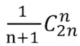
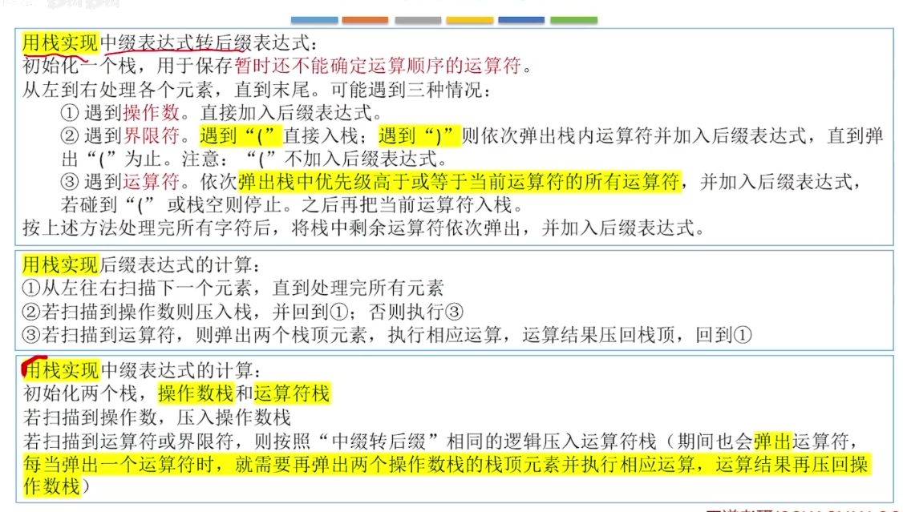

# 第三章 栈和队列

### 栈

栈是只允许在一端进行插入或删除操作的线性表，后进先出（LIFO）。

栈顶：允许插入和删除的一端
空栈：没有数据元素的栈
栈底：不允许插入和删除的一端
栈顶元素：处于栈顶的元素
栈底元素：处于栈底的元素

#### 基本操作

InitStack(&S)：初始化栈，构造一个空栈 S，分配内存空间。
DestoryStack(&S)：销毁栈，销毁并释放栈 S 所占用的内存空间。
Push(&S,x)：进栈，若栈未满，则将元素 x 加入使之成为新的栈顶元素。
Pop(&S,&x)：出栈，若栈非空，则将弹出栈顶元素 x。
GetTop(S,&x)：读取栈顶元素，若栈 S 非空，获取栈顶元素 x。
StackEmpty(S)：判断一个栈 S 是否为空，空返回 true，否则返回 false。

n 个不同元素进栈，出栈元素的不同排列的个数为卡特兰数：

#### 顺序栈

顺序栈用顺序存储的方式实现栈。把逻辑上相邻的元素存储在物理位置上也相邻的存储单元中。

```c
#define MaxSize 10			//定义栈的最大存储容量
typedef int ElemType;

typedef struct{
    ElemType data[MaxSize];	//栈存储的数据元素
    int top;				//栈顶指针
}SqStack;

void InitStack(SqStack &S){
    S.top = -1; 	//初始化栈顶指针
}

bool StackEmpty(SqStack S){
    if(S.top == -1)			
        return true;
    else 
        return false;
}

bool Push(SqStack &S,ElemType x){
    if(S.top == MaxSize -1)			//栈满，报错
        return false;
    S.top = S.top+1;				//更新栈顶指针
    S.data[S.top] = x;				//新元素入栈
    return true;
}

bool Pop(SqStack &S,ElemType &x){
    if(S.top == -1)					//栈空，报错
        return false;
    x = S.data[S.top];				//栈顶元素先出栈
    S.top--;						//更新栈顶指针
    return true;  
}

bool GetTop(SqStack S,ElemType &x){
    if(S.top == -1)					//栈空，报错
        return false;
    x = S.data[S.top];				//获取栈顶元素
    return true;
}

int main(){
    SqStack S;
    return 0;
}
```

共享栈：两个栈共享同一片内存空间，两个栈从两边往中间增长。

#### 链栈

链栈用链式存储的方式实现栈。逻辑上相邻的元素存储在物理位置上可能相邻也可能不相邻的存储单元中。

```c++
typedef int ElemType;

typedef struct LinkNode{
    ElemType data;
    struct LinkNode *next;
}*LiStack;
```

### 队列

队列是只允许在一端进行插入，在另一端进行删除操作的线性表，先进先出（FIFO）。

队尾：允许插入的一端
空队列：没有数据元素的队列
队头：允许删除的一端
队头元素：处于队头的元素
队尾元素：处于队尾的元素

#### 基本操作

InitQueue(&Q)：初始化队列，构造一个空队列 Q，分配内存空间。
DestoryQueue(&Q)：销毁队列，销毁并释放队列 Q 所占用的内存空间。
EnQueue(&Q,x)：入队，若队列未满，则将元素 x 加入使之成为新的队尾元素。
DeQueue(&Q,&x)：出队，若队列非空，则将队头元素 x 出队。
GetHead(Q,&x)：读取队头元素，若队列 Q 非空，获取队头元素 x。
QueueEmpty(Q)：判断一个队列 Q 是否为空，空返回 true，否则返回 false。

#### 顺序队列

顺序队列用顺序存储的方式实现队列。把逻辑上相邻的元素存储在物理位置上也相邻的存储单元中。

```c++
#define MaxSize 10			  //定义队列的最大存储容量
typedef int ElemType;

typedef struct{
    ElemType data[MaxSize];   //队列存储的数据元素
    int front,rear;			  //队头指针和队尾指针
}SqQueue;

void InitQueue(SqQueue &Q){
    Q.rear = Q.front = 0; 	  //初始化队头和队尾指针，指向 0 
}

bool QueueEmpty(SqQueue Q){
    if(Q.rear == Q.front)
        return true;
    else
        return false;
}

bool EnQueue(SqQueue &Q,ElemType x){
    if((Q.rear+1)%MaxSize == Q.front)  //队满则报错
        return false;
    Q.data[Q.rear] = x;				   //将 x 插入队尾
    Q.rear = (Q.rear+1)%MaxSize;	   //队尾指针加1取模
    return true;
}

bool DeQueue(SqQueue &Q,ElemType &x){
    if(Q.rear == Q.front)			   //队空则报错
        return false;
    x= Q.data[Q.front];				   //获取队头元素
    Q.front = (Q.front +1)%MaxSize;	   //队头指针后移
    return true;
}


bool GetHead(SqQueue &Q,ElemType &x){
    if(Q.rear == Q.front)				
        return false;
    x= Q.data[Q.front];
    return true;
}

int main(){
    SqQueue Q;
    InitQueue(Q);
    return 0;
}
```

#### 链队列

链队列用链式存储的方式实现队列。逻辑上相邻的元素存储在物理位置上可能相邻也可能不相邻的存储单元中。

```c++
#include <stdio.h>
#include <stdlib.h>
typedef int ElemType;
typedef struct LinkNode{
    ElemType data;
    struct LinkNode *next;
}LinkNode;

typedef struct{
    LinkNode *front, *rear;
}LinkQueue;

void InitQueue(LinkQueue &Q){
    Q.front = NULL;
    O.rear = NULL;
}

bool QueueEmpty(LinkQueue Q){
    if(Q.front == NULL)
        return true;
    else
        return false;
}

void EnQueue(LinkQueue &Q,ElemType x){
    LinkNode *s = (LinkNode *)malloc(sizeof(LinkNode));
    s->data = x;				//数据存入结点 s 中
    s->next = NULL;				//s 作为队尾元素，后向指针指向 NULL
    if(Q.front == NULL){		//在空队列中插入第一个元素时
        Q.front = s;			//修改队头指针
        Q.rear = s;
    }else{
        Q.rear->next = s;		//新结点插入到队尾结点之后
        Q.rear = s;				//修改队尾指针
    }
}

void DeQueue(LinkQueue &Q,ElemType &x){
    if(Q.front == NULL)			//队空则报错
        return false;
    LinkNode *p = Q.front;		//获取队头元素 p
    x = p->data;
    Q.front = p->next;			//队头指针指向下一个结点
    if(Q.rear == p){			//队列中最后一个元素出队时
        Q.front = NULL;			//队头指针为 NULL
        Q.rear = NULL;			//对尾指针为 NULL
    }
    free(p);					//释放结点空间
    return true;
}

int main(){
    LinkNode Q;		//声明一个队列
    InitQoeue(Q);   //初始化队列
    return 0;
}
```

### 双端队列

双端队列：只允许从两端插入、两端删除的线性表
输入受限的双端队列：允许从两端删除、从一端插入的队列
输出受限的双端队列：允许从两端插入、从一端删除的队列

### 表达式

后缀表达式（逆波兰表达式）：运算符在两个操作数后面
中缀表达式：运算符在两个操作符中间
前缀表达式（波兰表达式）：运算符在两个操作数前面

中缀转后缀只要左边的运算符能计算，优先计算左边的
中缀转前缀只要右边的运算符能计算，优先计算左边的



