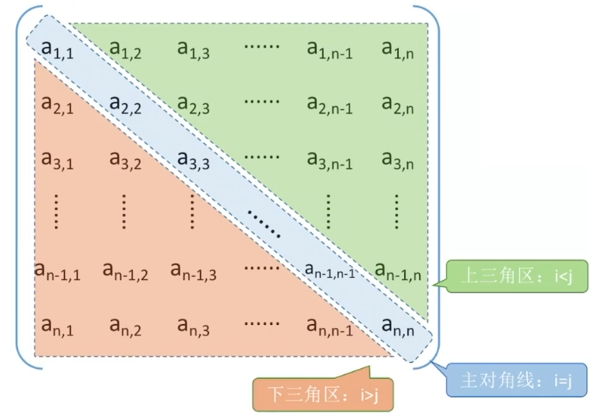
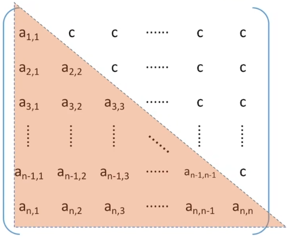
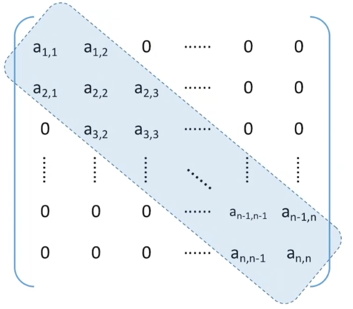
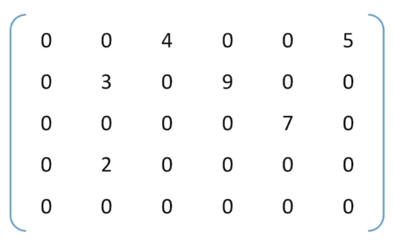
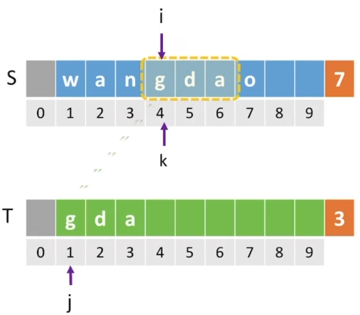

# 第四章 串

**一维数组：**

数组元素 a[i] 的存放地址 = LOC + i*sizeof(ElemType)

**二维数组：**

M 行 N 列的二维数组 b\[M][N] 中
若按行优先存储，则 b\[i][j] = LOC + (i\*N + j)\*sizeof(ElemType)*
若按照列优先存储，则 b\[i][j] = LOC + (j \*M + i)*sizeof(ElemType)

### 矩阵

#### 对称矩阵

若 n 阶方阵中任意一个元素 a~i,j~ 都由 a~i,j~ = a~j,i~，则该矩阵为对称矩阵

压缩存储策略之一：使用行优先原则，只存储主对角线 + 下三角区

按照行优先原则将各元素存入一维数组中

$$ k=\left\{ \begin{aligned} \frac{i(i-1)}{2}+j-1 & , & i \ge j(下三角区和主对角线元素) \\ \frac{j(j-1)}{2}+i-1 & , & i<j (上三角区元素 a_{ij} = a_{ij})\end{aligned} \right. $$



#### 三角矩阵

下三角矩阵：除了主对角线和下三角区，其余的元素都相同
上三角矩阵：除了主对角线和上三角区，其余的元素都相同

压缩存储策略之一：使用行优先原则将下三角矩阵存入一维数组，最后一个位置存储常量 C

$$ k=\left\{ \begin{aligned} \frac{i(i-1)}{2}+j-1 & , & i \ge j(下三角区和主对角线元素) \\ \frac{n(n-1)}{2}& , & i<j (上三角区元素为数组最后一个元素)\end{aligned} \right. $$




#### 带状矩阵

也称为三对角矩阵，当 |i-j| > 1 时，有 a~i,j~ = 0

压缩存储策略之一：使用行优先原则，只存储带状部分



#### 稀疏矩阵

非零元素个数远远少于矩阵元素个数

压缩存储策略之一：十字链表法



### 串

串，即字符串，是由零个或多个字符组成的有限序列，串的数据对象类型限定为字符集。一般记为 S = 'a~1~a~2~......a~n~'  (n ≥ 0)，其中 S 为串名，S 所存储的数据称为串的值，串中字符的个数 n 称为串的长度，长度为 0 的串称为空串。

字串：串中任意个连续的字符组成的子序列
主串：包含字子串的串
字符在主串中的位置：字符在串中的序号，从 1 开始
字串在主串中的位置：字串的第一个字符在主串中的位置，以 1 开始

#### 基本操作

StrAssign(&T,chars)：赋值操作。把串 T 赋值给 chars
StrCopy(&T,S)：复制操作。由串 S 复制得到串 T
StrEmpty(S)：判空操作。若 S 为空串返回 true 否则返回 false
StrLength(S)：求串长。返回串 S 的元素个数
ClearString(&S)：清空操作，将 S 清为空串
DestoryString(&S)：销毁串。将串 S 销毁
Concat(&T,S1,S2)：串拼接。用 T 返回由 S1 和 S2 拼接而成的新串
SubString(&Sub,S,pos,len)：求字串，用 Sub 返回串 S 的第 pos 个字符起长度为 len 的字串
Index(S,T)：定位操作。若主串 S 中存在与串 T 值相同的字串，返回它在主串 S 中第一次出现的位置
StrCompare(S,T)：比较操作。若 S>T，返回值 > 0；若 S = T，返回值等于 0 ；若 S < T，返回值 < 0

#### 顺序存储

```c++
#define MAXLEN 255
typedef struct{
    char ch[MAXLEN];
    int length;
}SString;				//定长顺序存储

typedef struct{
    char *ch;
    int length;
}HSting;				//堆分配存储
HString S;
S.ch = (char *)malloc(sizeof(char)*MAXLEN);
S.length = 0;
```

#### 链式存储

```c++
#define N 10		//每个结点可以存储字符个数
typedef struct{
    char ch[N];
    struct StringNode *next;
}StringNode, *String;		
```

#### 朴素模式匹配

串的模式匹配：在主串中找到与模式串相同的字串，并返回其所在位置。在主串中存在的子序列称为字串，在主串中不一定存在的序列称为模式串。

思想：从主串中获取与模式串长度相同的字串，逐个与模式串比较；当字串与模式串不匹配时，立即放弃当前字串，检索下一个字串。

```c++
int Index(SString S,SString T){
    int i = 1;
    int j = 1;
    int k = 1;
    
    while(i <=S.length && j <T.length){
        if(S.ch[i] == T.ch[j]){
            ++i;
            ++j;		//继续比较后序字符
        }else{
            k++;		//检查下一个字串
            i=k;
            j=1;
        }
    }
    if(j>T.length){
        return k;
    }else{
        return 0;
    }
}
```



若主串长度为 n，模式串长度为 m，当 n 远大于 m 时则：

最好的情况：每个字串的第一个字符与模式串不匹配/匹配
最坏的情况：每个字串的前 m-1 个字符都与模式串匹配，只有第 m 个字符不匹配/匹配

匹配成功最好时间复杂度 O(m)；匹配失败最好时间复杂度 O(n-m+1) ≈ O(n)
匹配成功/失败的最坏时间复杂度 O((n-m+1)*m) = O(nm-m^2^+m) = O(nm)

#### KMP 算法

当某些字串与模式串能部分匹配时，主串的扫描指针 i 经常回溯，导致时间开销增加，但如果 j = k 时才发现匹配失败，说明 1~k-1 都匹配成功。KMP 算法：当字串和模式串不匹配时，主串指针 i 不回溯，模式串指针 j = next[j]，算法平均时间复杂度：O(n+m)。

串的前缀：包含第一个字符且不包含最后一个字符的若干个子串
串的后缀：包含最后一个字符且不包含第一个字符的若干个子串

当第 j 个字符匹配失败时，由前 1~j-1 个字符组成的串记为 S，则：S 的最长相等前后缀长度 + 1 为 next[j] 的值。特别地，next[1] = 0

```c++
//求模式串 T 的 next 数组
void get_next(SString T,int next[]){
    int i = 1, j = 0;
    next[1] = 0;
    while(i<T.length){
        if(j==0||T.ch[i] == T.ch[j]){
            ++i;
            ++j;
            //若 pi = pj，则 next[j+1] = next[j]+1
            next[i]=j;
        }else
            //否则令 j = next[j]，循环继续
            j=next[j];
    }
}

//KMP 算法
int Index_KMP(SString S,SString T){
    int i = 1, j =1;
    int next[T.length+1];
    get_next(T,next);			//求模式串 T 的 next 数组
    while(i<=S.length && j<=T.length){
        if(j==0||S.ch[i] == T.ch[j]){
            ++i;
            ++j;				//继续比较后继字符
        }else
            j = next[j];		//模式串向右移动
    }
    if(j > T.length)
        return i=T.length;		//匹配成功
    else
        return 0;
}
```

KMP 算法优化：nextval 数组的求法：先算出 next 数组，令 nextval[1] = 0

```c++
for(int j = 2; j <= T.length;j++){
	if(T.ch[next[j]] == T.ch[j])
		nextval[j] = nextval[next[j]];
	else
		nextval[j] = next[j];
}
```
