# 第五章 树

### 基本概念

树是 n (n ≥ 0) 个结点的有限集合，n = 0 时称为空树。在任何一棵非空树中应满足：

- 有且仅有一个特定的称为根的结点
- 当 n > 1 时，其余结点可分为 m (m>0) 个互不相交的有限集合 T~1~,T~2~,...,T~m~，其中每个集合本身又是一棵树，称为根结点的子树。

树有且仅有一个根结点
除了根结点之外，任何一个结点有且仅有一个前驱
每个结点可以有 0 个或多个后继
没有后继结点称为**叶子结点**
有后继的结点称为**分支结点**
结点的子树的根称为该节点的**孩子结点**
该结点称为孩子的**双亲结点**（**父节点**）
同一个双亲的孩子之间互为**兄弟结点**
从根到该结点所经过分支上的所有结点称为该节点的**祖先结点**
以某结点为根的子树中的任一结点都称为该结点的**子孙结点**
从一个结点到另一个结点（从上往下）所经过的结点集合称为两个结点之间的路径，所经过的边为路径长度。
结点的**层次**（深度）：默认从 1 开始，从上往下数到该结点的层数
结点的**高度**：默认从 1 开始，从下往上数到该结点的层数
树的**高度**（深度）：树中结点的最大层次
**结点的度**：该结点的孩子结点数
**树的度**：各个结点中度的最大值
**有序树**：树中结点的各个子树从左至右是有次序的，不能互换
**无序树**：树中结点的各个子树从左至右是无次序的，不能互换
**森林**：m (m≥ 0) 棵不相交的树的集合

### 性质

1. 总结点数 = 总度数 + 1

2. m 叉树 ≠ 度为 m 的树

| 度为 m 的树                     | m 叉树                   |
| ------------------------------- | ------------------------ |
| 任意结点的度 ≤ m                | 任意结点的度 ≤ m         |
| 至少有一个结点的度为 m          | 允许所有结点的度都小于 m |
| 一定是非空树，至少有 m+1 个结点 | 可以是空树               |

3. 度为 m 的树和 m 叉树的第 i 层至多有 m^i-1^ 个结点 (i ≥ 1)
4. 高度为 h 的 m 叉树至多有 1-m^h^/1-m 个结点
5. 高度为 h 的 m 叉树至少有 h 个结点；度为 m 的树至少有 h-m+1 个结点

6. 具有ｎ个结点的 m 叉树的最小高度为 $\lceil log_m(n(m-1)+1)\rceil$

### 存储结构

双亲表示法（顺序存储）：每个结点中保存指向双亲的指针

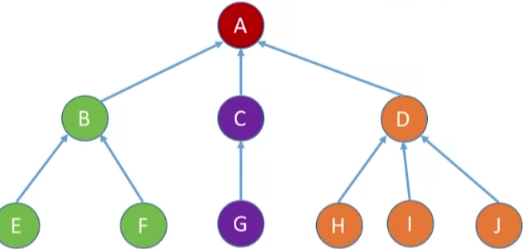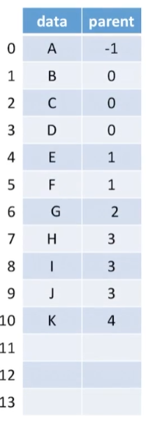

孩子表示法（顺序存储+链式存储）：顺序存储各结点，每个结点中保存孩子链表头指针

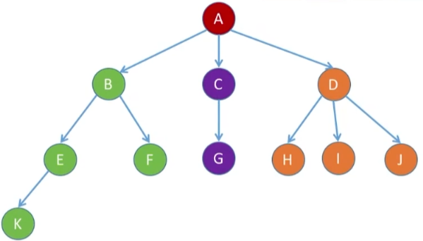

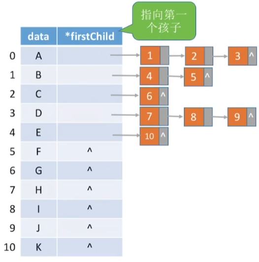

孩子兄弟表示法（链式存储）：左指针指向孩子结点，右指针指向右兄弟结点，可以实现树和二叉树的相互转化，森林和二叉树的互相转换。

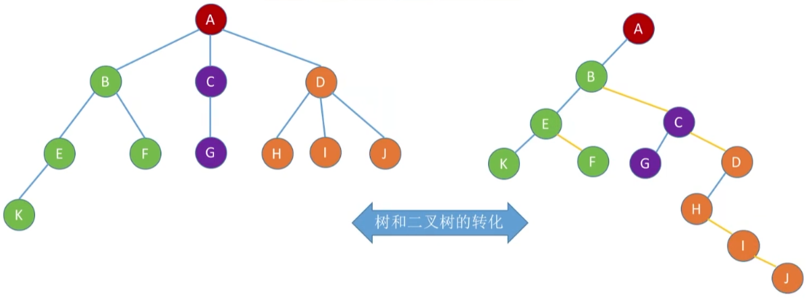

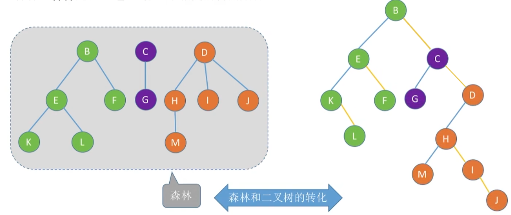

### 遍历

**树的层次遍历（广度优先遍历）**：基于树的层次特性确定的次序规则
**树的先根遍历（深度优先遍历）**：若树为空则不进行任何操作；若树非空，先访问根结点，再依次先根遍历每棵子树。
**树的后根遍历（深度优先遍历）**：若树为空则不进行任何操作；若树非空，先依次后根遍历每棵子树，再访问根结点。

**森林的先序遍历**：等于依次对各个树进行先根遍历
**森林的中序遍历**：等于依次对各个树进行后根遍历

| 树       | 森林     | 二叉树   |
| -------- | -------- | -------- |
| 先根遍历 | 先序遍历 | 先序遍历 |
| 后根遍历 | 中序遍历 | 中序遍历 |

### 二叉树

#### 基本概念

二叉数是 n 个结点的有限集合。当 n = 0 时称为空二叉树；n > 0 时由一个根结点和两个子树组成。左子树和右子树仍然是二叉树。

**满二叉树：**一棵高度为 h，且含有 2^h^-1 个结点的二叉树。

- 只有最后一层有叶子结点
- 不存在度为 1 的结点
- 按层序从 1 开始编号，结点 i 的左孩子为 2i，右孩子为 2i + 1，结点 i 的父节点为 $\lfloor i/2\rfloor$

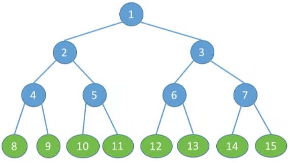

**完全二叉树：**当且仅当每个结点都与高度为 h 的满二叉树中编号为 1~n （必须连续） 的结点一一对应时的二叉树。

- 只有最后两层可能有叶子结点
- 最多只有一个度为 1 的结点
- 按层序从 1 开始编号，结点 i 的左孩子为 2i，右孩子为 2i + 1，结点 i 的父节点为 $\lfloor i/2\rfloor$
- i ≤ $\lfloor i/2\rfloor$ 为分支结点，i ＞ $\lfloor i/2\rfloor$ 为叶子结点

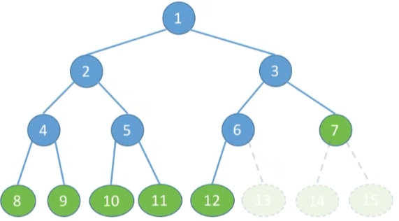


**二叉排序树**：左子树上的所有结点的关键字均小于根节点的关键字且右子树上的所有结点的关键字均大于根节点的关键字的二叉树。

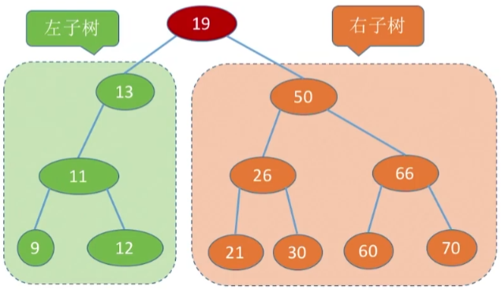

**平衡二叉树**：树上任一结点的左子树和右子树的深度之差不超过 1。

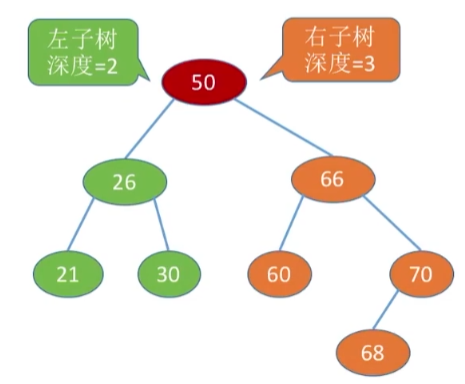

#### 性质

1. 设非空二叉树中树的度为 0、1 和 2 的结点个数分别为 n~0~，n~1~ 和 n~2~，则 n~0~ = n~2~ + 1。
2.  二叉树的第 i 层至多有 2^i-1^ 个结点 (i ≥ 1)
3. 高度为 h 的 二叉树至多有 2^h^-1 个结点
4. 具有 n (n > 0) 个结点的完全二叉树的高度 h 为  $\lceil log_2(n+1)\rceil$ 或  $\lceil log_2n\rceil+1$
5. 若完全二叉树有 2k 个结点，则必有 n~1~ = 1，n~0~ = k，n~2~=k-1；若完全二叉树有 2k-1 个结点，则必有 n~1~ = 0，n~0~ = k，n~2~=k-1

#### 顺序存储

二叉树的顺序存储结构只适合存储完全二叉树。

```c++
#define MaxSize 100
struct TreeNode{
    ElemType value;		//结点中的数据元素
    bool isEmpty;		//结点是否为空
}

TreeNode t[MaxSize];
```

#### 链式存储

```c++
typedef int ElemType;
//二叉树的结点
typedef struct BiTNode{
    ElemType data;						//数据域
    struct BiTNode *lchild,*rchild;		//左孩子和右孩子指针
}BiTNode,*BiTree;

//定义一颗空树
BiTree root = NULL;

//插入根结点
root = (BiTree)malloc(sizeof(BiTNode));
root->data = {1};
root->lchild = NULL;
root->rchild = NULL;

//插入新结点
BiTNode *p = (BiTNode *) malloc(sizeof(BiTNode));
p->data = {2};
p->lchild = NULL;
p->rchild = NULL;
root->lchild = p;
```

#### 遍历

按照某种次序把所有结点都访问一遍。

**层次遍历**：基于树的层次特性确定的次序规则
**先序遍历**（根左右）：若二叉树为空则不进行任何操作；若二叉树非空，先访问根结点，再先序遍历左子树，最后先序遍历右子树。
**中序遍历**（左根右）：若二叉树为空则不进行任何操作；若二叉树非空，中序遍历左子树，再访问根结点，最后中序遍历右子树。
**后序遍历**（左右根）：若二叉树为空则不进行任何操作；若二叉树非空，后序遍历左子树，再后序遍历右子树，最后访问根结点。

```c++
//先序遍历
void PreOrder(BiTree T){
    if(T!=NULL){
        visit(T);				//访问根结点
        PreOrder(T->lchild);	//递归遍历左子树
        PreOrder(T->rchild);	//递归遍历右子树
    }
}

//中序遍历
void PreOrder(BiTree T){
    if(T!=NULL){
        PreOrder(T->lchild);	//递归遍历左子树
        visit(T);				//访问根结点
        PreOrder(T->rchild);	//递归遍历右子树
    }
}

//后序遍历
void PreOrder(BiTree T){
    if(T!=NULL){
        PreOrder(T->lchild);	//递归遍历左子树
        PreOrder(T->rchild);	//递归遍历右子树
        visit(T);				//访问根结点
    }
}

typedef struct LinkNode{
    BiTNode *data;			//队列中中保存指针而不是结点
    struct LinkNode *next;
}LinkNode;

//层序遍历
void LevelOrder(BiTree T){
    LinkQueue Q;
    InitQueue(Q);						//初始化辅助队列
    BiTree p;
    EnQueue(Q,T);						//根结点入队
    while(!IsEmpty(Q)){					//队列不为空则循环
        DeQueue(Q,p);					//队头结点出队
        visit(p);						//访问出队结点
        if(p->lchild!=NULL)			
            EnQueue(Q,p->lchild);		//左孩子入队
        if(p->rchild!=NULL)
            EnQueue(Q,p->rchild);		//右孩子入队
    }
}
```

#### 构造二叉树

若只给出一棵二叉树的先序、中序、后序或层序遍历中的一种，不能唯一确定一棵二叉树，只有以下组合才能唯一确定一棵二叉树。

|              |              |
| ------------ | ------------ |
| 前序遍历序列 | 中序遍历序列 |
| 后序遍历序列 | 中序遍历序列 |
| 层序遍历序列 | 中序遍历序列 |

#### 线索二叉树

n 个结点的二叉树，有 n+1 个空链域，可用来记录前驱、后继结点的信息，二叉树转为线索二叉树的过程称为线索化。指向前驱和后继结点的指针称为线索。

在普通二叉树结点基础上，增加了两个标志位 ltag 和 rtag 区分指向孩子结点还是前驱后继结点								

```c++
//二叉树的结点
typedef struct BiTNode{
    ElemType data;
    struct BiTNoded *lchild,*rchild;
}BiTNode,*BiTree;

//线索二叉树结点
typedef struct ThreadNode{
    ElemType data;
    struct ThreadNode *lchild,*rchild;
    //当 tag == 0 时表示指针指向孩子结点；当 tag == 1 时表示指针是线索
    int ltag,rtag;						//左、右线索标志
}ThreadNode,*ThreadTree;
```

先序线索二叉树以先序遍历序列 ABDGECF 为依据进行线索化。 															


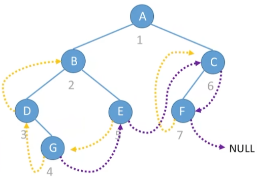

中序线索二叉树以中序遍历序列 DGBEAFC 为依据进行线索化。

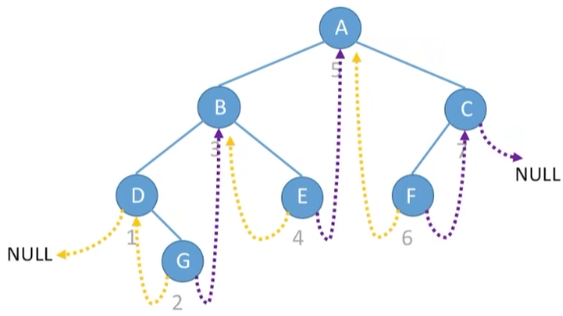

后序线索二叉树以后序遍历序列 GDEBFCA 为依据进行线索化。

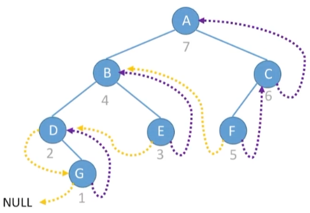

#### 线索化

中序线索化和后序线索化不存在循环问题。

```c++
ThreadNode *pre = NULL;	//指向当前访问结点的前驱

//访问结点
void visit(ThreadNode *q){
    if(q->lchild == NULL){				//该结点左孩子结点为空，建立前驱线索
        q->lchild = pre;
        q->ltag=1;
    }			
    if(pre!=NULL&&pre->rchild==NULL){	//访问的上一个结点的右孩子结点为空，建立后继线索
        pre->rchild=q;
        pre->rtag=1;
    }
    pre=q;								//更新 pre 指针
}

//中序遍历二叉树，一边遍历一边线索化
void InThread(ThreadTree T){
    if(T!=NULL){
        InThread(T->lchild);			//递归遍历左子树
        visit(T);						//访问根结点
        InThread(T->rchild);			//递归遍历右子树
    }
}

//中序线索化二叉树
void CreateInThread(ThreadTree T){
    pre = NULL;
    if(T!=NULL){
        InThread(T);					//中序线索化二叉树
        if(pre->rchild ==NULL)
            pre->rtag=1;				//处理遍历的最后一个结点
    }
}
```

先序线索化时，先访问根结点，若此时线索化该根结点的左孩子结点后，下一次访问该左孩子结点后会返回该结点造成循环。因此只有当 ltag = 0 时，才能对左子树线索化。

```c++
//先序遍历二叉树，一边遍历一边线索化
void PreThread(TheadTree T){
    if(T!=NULL){
        visit(T);
        if(T->ltag == 0){			//lchild 不是前驱线索才能对左子树线索化
            PreThread(T->lchild);
        }
        PreThread(T->rchild);
    }
}
```

#### 找前驱/后继

**中序遍历找中序后继**

左	根（（**左**	根	右）根	右），若 rtag == 0 时右子树最左下结点为后继结点。

```c++
//以 p 为根的中序线索二叉树中找到第一个被中序遍历的结点
ThreadNode *FirstNode(ThreadNode *p){
    //循环找到最左下结点
	while(p->ltag == 0)
        p=p->lchild;
    return p;
}

//在中序线索二叉树找到结点 p 的后继结点
ThreadNode *NextNode(ThreadNode *p){
    if(p->rtag==0)						//若 rtag==0 右子树最左下的结点为后继结点
        return FirstNode(p->rchild);
    else								//rtag==1 直接返回后继线索
        return p->rchild;
}

//中序遍历中序线索二叉树，利用线索实现的非递归算法
void InOrder(ThreadNode *T){
    for(ThreadNode *p=FirstNode(T);p!=NULL;p=NextNode(p))
        visit(p);
}
```
**中序遍历找中序前驱**

（左	根	（左	根	**右**））	根	右，若 ltag == 0 时左子树最右下结点为前驱结点。

```c++
//以 p 为根的中序线索二叉树中找到最后一个被中序遍历的结点
ThreadNode *LastNode(ThreadNode *p){
    //循环找到最右下结点
	while(p->rtag == 0)
        p=p->rchild;
    return p;
}

//在中序线索二叉树找到结点 p 的前驱结点
ThreadNode *PreNode(ThreadNode *p){
    if(p->ltag==0)						//若 ltag==0 左子树最右下的结点为前驱结点
        return LastNode(p->lchild);
    else								//ltag==1 直接返回前驱线索
        return p->lchild;
}

//逆向中序遍历中序线索二叉树
void RevInOrder(ThreadNode *T){
    for(ThreadNode *p=LastNode(T);p!=NULL;p=PreNode(p))
        visit(p);
}
```

### 二叉排序数 (BST)

进行中序遍历，可以得到一个递增的有序序列。

```c++
//二叉排序树结点
typedef struct BSTNode{
    int key;
    struct BSTNode *lchild,*rchild;
}BSTNode,*BSTree;

//在二叉排序树中查找值为 key 的结点
BSTNode *BST_Search(BSTree T,int key){
    while(T!=NULL&&key!=T->key){		//数空或找到值为 key 的结点时结束循环
        if(key<T->key)						
            T=T->lchild;				//小于，在左子树上查找	
        else
            T=T->rchild;				//大于，在右子树上查找
    }
    return T;
}

//在二叉排序树中插入关键字为 k 的新结点
int BST_Insert(BSTree &T,int k){
    while(T!=NULL){
       if(k==T->key)				//树中已经存在该关键字，插入失败
           return 0;
        else if(k<T->key)	
            T=T->lchild;			//插入到左子树
        else
            T=T->rchild;			//插入到右子树
    }
    T=(BSTNode)malloc(sizeof(BSTNode));	
    T->key=k;
    T->lchild=T->rchild=NULL;
    return 1; 
}

//根据 str[] 中的关键字序列建立二叉排序树
void Create_BST(BSTree &T,int str[],int n){
    T=NULL;
    int i =0;
    while(i < n){
        BST_Insert(T,str[i]);
        i++;
    }
}
```

查找长度：在查找运算中，需要对比关键字的次数
查找成功的平均查找长度 ASL：查找每个子节点的次数之和/总结点数
查找失败的平均查找长度 ASL：只有查找到二叉排序树的叶子结点时，仍然未查找到关键字就是查找失败

### 平衡二叉树 (AVL)

结点的平衡因子=左子树高-右子树高。平衡二叉树的平衡因子只可能是 -1、0 或 1。平衡二叉树的平均查找长度为 O(log~2~n)。

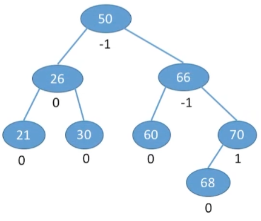

```c++
//平衡二叉树结点
typedef struct AVLNode{
    int key;				//数据域
    int balance;			//平衡因子
    struct AVLNode *lchild,*rchild;
}AVLNode,*AVLTree;
```

**最小不平衡子树**：从插入点往回找到第一个不平衡结点作为根结点的子树，在插入操作中，只要将最小不平衡子树调为平衡，则其祖先结点都会恢复平衡。

**LL**：在最小不平衡子树的左孩子的左子树中插入导致不平衡。
调整：A 的左孩子结点右上旋。


**RR**：在最小不平衡子树的右孩子的右子树中插入导致不平衡。
调整：A 的右孩子结点左上旋。

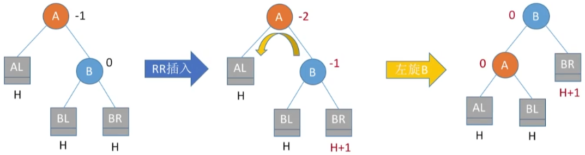

**LR**：在最小不平衡子树的左孩子的右子树中插入导致不平衡。
调整：A 的左孩子的右孩子先左上旋再右上旋。

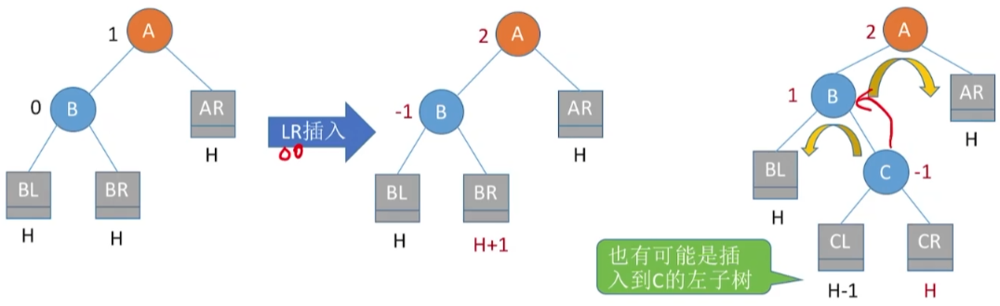

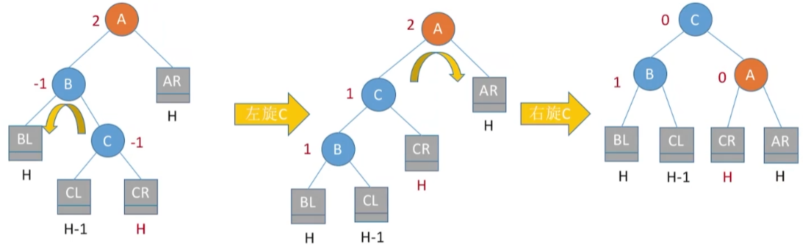

**RL**：在最小不平衡子树的右孩子的左子树中插入导致不平衡。
调整：A 的右孩子的左孩子先右上旋再左上旋。

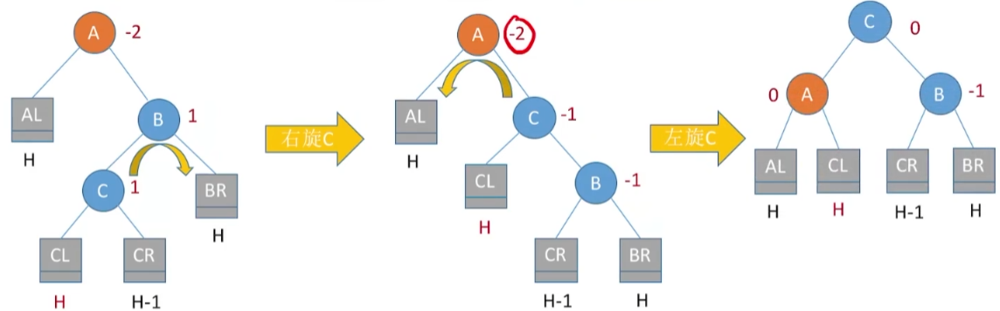

### 哈夫曼树

结点的权：结点上有某种现实含义的数值。
结点的带权路径长度：从树的根到该结点的路径长度与该结点上权值的乘积
树的带权路径长度：树中所有叶结点的带权路径长度之和 WPL =$\sum_{i=1}^nw_il_i$ 

在含有 n 个带权叶结点的二叉树中，其中带权路径长度最小的二叉树称为哈夫曼树，也称为哈夫曼树。

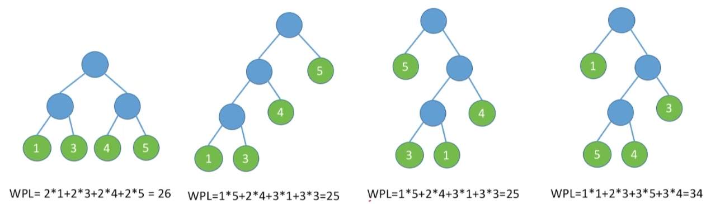

#### 构造

给定 n 个权值分别为 w~1~,w~2~,w~3~,...w~n~ 的结点，每次选两个根节点权值最小的树合并，将二者权值之和作为新的根结点的权值，重复直到最后只剩下一棵树。

- 每个初始结点最终都称为叶结点，且权值越小的结点到根结点的路径长度越大。
- 哈夫曼树的结点总数为 2n-1。
- 哈夫曼树中不存在度为 1 的结点。
- 哈夫曼树并不唯一，但 WPL 必然相同且最优。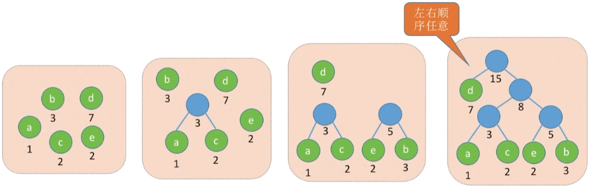

将字符频次作为字符结点权值，构造哈夫曼树，即可得到哈夫曼编码，用户数据压缩。

