# 第六章 图

图 G 由顶点集 V 和边集 E 组成，记为 G =  (V, E)，其中 V(G) 表示图 G 中顶点的有限**非空集**；E(G) 表示图 G 中顶点之间的关系（边）集合。若 V = {v~1~,v~2~,...,v~n~}，则用 |V| 表示图 G 中顶点的个数，也称为图 G 的阶，E = {(u,v)} |u ∈ V, v ∈ V|，用 |E| 表示图 G 中边的条数。图不可以是空图，V 一定是非空集。

### 基本概念

 **无向图**

若 E 是无向边（简称边）的有限集合时，则图 G 为无向图。边是顶点无序对，记为 (v,w) 或 (w,v)。其中 v, w 是顶点。边 (v,w) 依附于顶点 w 和 v，或者说边 (v,w) 和顶点 v,w 相关联。

G~2~ = (V~2~,E~2~), V~2~ = {A,B,C,D,E}, E~2~ = {(A,B),(B,D),(B,E),(C,D),(C,E),(D,E)}

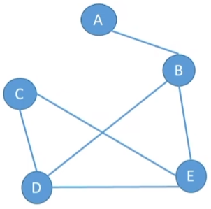


**有向图**

若 E 是有向边（也称为弧）的有限集合时，则图 G 为有向图。弧是顶点有序对，记为 <v,w>。其中 v, w 是顶点。v 称为弧尾，w 称为弧头。<v,w> 称为从顶点 v 到顶点 w 的弧，也称为  v 邻接 w，或 w 邻接着 v。<v,w> ≠ <w,v>

G~2~ = (V~2~,E~2~), V~2~ = {A,B,C,D,E}, E~2~ = {<A,B>,<A,C>,<A,D>,<A,E>,<B,A>,<B,C>,<B,E>,<C,D>}

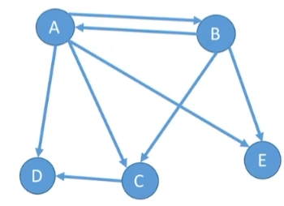

**简单图**

不存在重复边且不存在顶点到自身的边的图称为简单图。

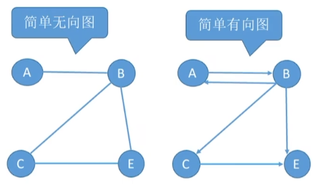

**多重图**

图 G 中某两个结点之间的边数多于一条，又允许顶点通过同一条边和自己关联的图称为多重图。

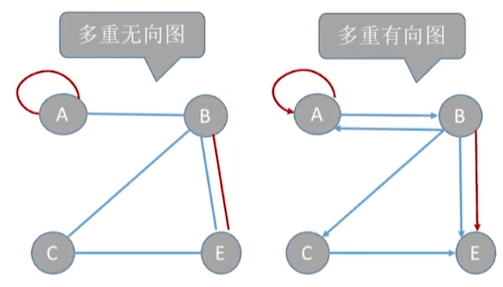

对于无向图，顶点 v 的**度**是指依附于该顶点读的边的条数，记为 TD (v)。无向图的全部顶点的度的和等于边数的 2 倍，$\sum_{i=1}^nTD(V_i) = 2e$。

对于有向图，顶点 v 的**入度**是以该顶点为终点的有向边的数目，记为 ID(v)。
对于有向图，顶点 v 的**出度**是以该顶点为起点的有向边的数目，记为 OD(v)。
对于有向图，顶点 v 的**度**等于其入度和出度之和，即 TD(v) = ID(v) + OD(v)。
在有向图中入度之和 = 出度之和，$\sum_{i=1}^nID(V_i) = \sum_{i=1}^nOD(V_i) = e$。

**路径**：顶点 v~p~ 到顶点 v~q~ 之间的一条路径。无向图中路径没有方向，有向图中路径有方向。
**回路（环）**：第一个顶点和最后一个顶点相同的一条路径
**简单路径**：在路径序列中，顶点不重复出现的路径
**简单回路**：除第一个顶点和最后一个顶点外，其余顶点不重复出现的回路
**路径长度**：路径上边的数目
**点到点的距离**：从顶点 u 出发到顶点 v 的最短路径；若不存在从顶点 ｕ到顶点 v 的路径，u 到 v 的距离为无穷大。
在无向图中，若存在从顶点 v 到顶点 w 路径则称 v 和 w 是**连通**的。 
在有向图中，若从顶点 v 和顶点 w 和顶点 w 到顶点 v 之间都有路径，则称为两个顶点是**强连通**的。

**连通图**

若图 G 中任意两个顶点都是连通的，则图 G 称为**连通图**，否则称为**非连通图**。

- 对于 n 个顶点的无向图 G。若 G 是连通图，则最少有 n - 1 条边。
- 若 G 是非连通图，则最多可能有  $C_{n-1}^2$条边。

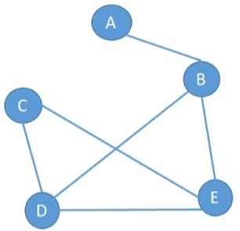

**强连通图**

若途中任何一对顶点都是强连通的，则图 G 称为**强连通图**。

- 对于 n 个顶点的有向图 G，若 G 是强连通图，则最少有ｎ条边（形成回路）。

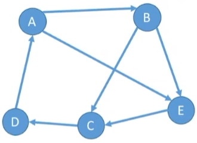

**子图**

设有两个图 G = (V,E) 和 G‘ = (V',E')，若 V’ 是 V 的子集，且 E‘ 是 E 的子集，则称 G’ 是 G 的**子图**。若满足 V(G') = V(G) 的子图 G‘，则称其为 G 的**生成子图**。

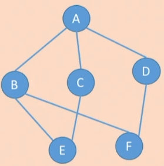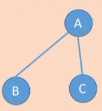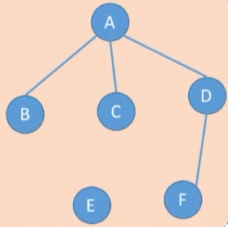

​							无向图											子图									 		 生成子图

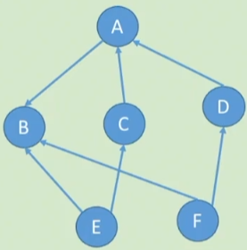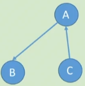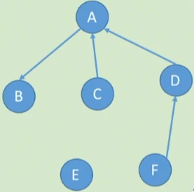

​								有向图											子图												生成子图

**连通分量**

无向图中极大连通子图称为**连通分量**。

**强连通分量**

有向图中的极大强连通子图称为**强连通分量**。

**生成树**

连通图的生成树是包含图中全部顶点的一个极小连通子图。生成树要包含所有顶点 n 和尽可能少的边，即 n-1 条边，若边大于 n-1 则一定有回路，若边小于 n-1 则会变成非连通图。

**生成森林**

在非连通图中，连通分量的生成树构成了非连通图的生成森林

**带权图**（网）：边上带有权值的图称为带权图，也称为网。
**边的权**：在一个图中，每条边都可以标上具有某种含义的数值，该数值称为该边的权值。
**带权路径长度**：带权图中，一条路径上所有边的权值之和。

**无向完全图**：无向图中任意两个顶点之间都存在边。若无向图的顶点数 |V| = n，则 |E| ∈ [0,$C_n^2$] = [0, n(n-1)/2]。

**有向完全图**：有向图中任意两个顶点之间都存在方向相反的两条弧。若有向图的顶点数 |V| = n，则 |E| ∈ [0,$2C_n^2$] = [0, n(n-1)]

**稀疏图**：边数很少的图

**稠密图**：边数很多的图

对于 n 个顶点的无向图 G：

- 所有顶点的度之和 =  2 |E|
- 若 G 是连通图，则最少有 n - 1 条边；若 |E| > n - 1，则一定有回路
- 若 G 是非连通图，则最多可能有 $C_{n-1}^2$条边
- 无向完全图共有 $C_n^2$ 条边

对于 n 个顶点的有向图 G：

- 所有顶点的出度之和 =  入度之和 = |E|
- 所有顶点的度之和 =  2|E|
- 若 G 是强连通图，则最少有 n 条边（形成回路）
- 有向完全图共有 $2C_n^2$ 条边

### 存储结构

#### 邻接矩阵法

```c++
#define MaxVertexNum 100					//顶点数目最大值

typedef struct{
    char Vex[MaxVertexNum];					//顶点表
    int Edage[MaxVertexNum][MaxVertexNum];	//邻接矩阵，边表
    int vexnum,arcnum;						//图的当前顶点数和边数
}MGraph;			
```

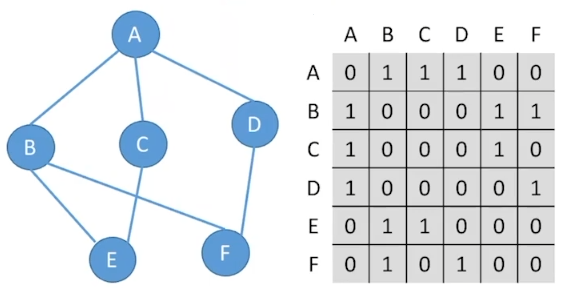
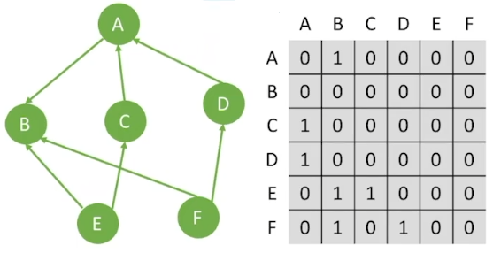

设图 G 的邻接矩阵为 A （矩阵元素为 0/1），则 A^n^ 的元素 A^n^\[i][j] 等于由顶点 i 到顶点 j 的长度为 n 的路径的数目。

#### 邻接矩阵

```c++
//顶点
typedef struct VNode{
    VertexType data;			//顶点数据域
    ArcNode *frist;				//指向第一条边
}VNode,AdjList[MaxVertexNum];

typedef struct ArcNode{
    int adjvex;					//指向哪个结点
    struct ArcNode *next;		//指向下一条弧的指针		
}ArcNode;				

typedef struct{
    AdjList vertices;
    int vexnum,arcnum;
}ALGraph;
```

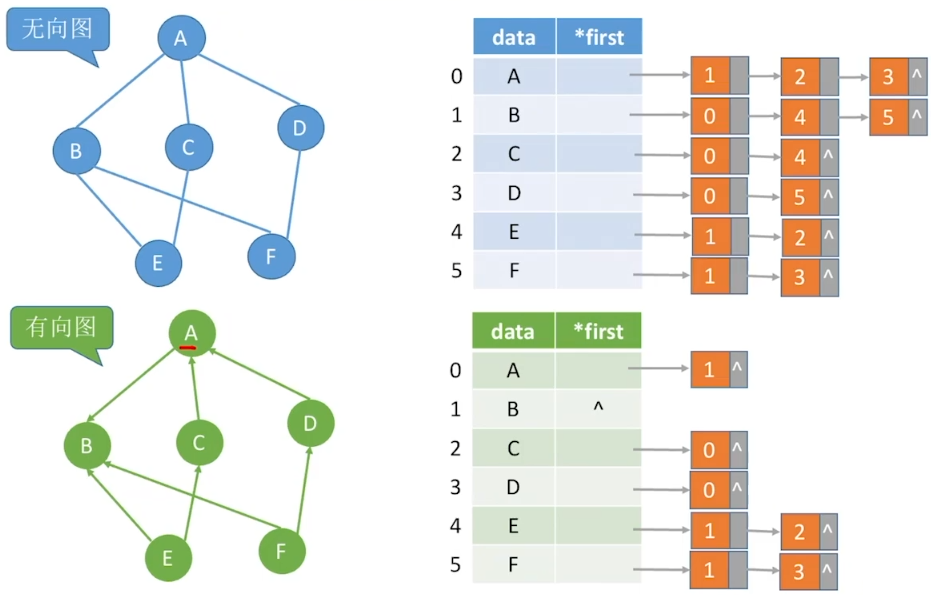

#### 十字链表法

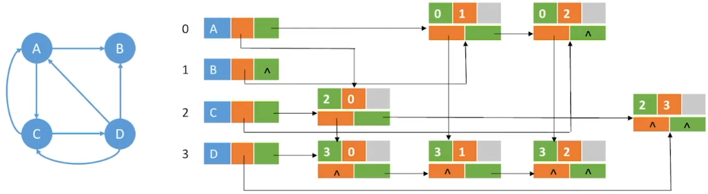


#### 邻接多重表

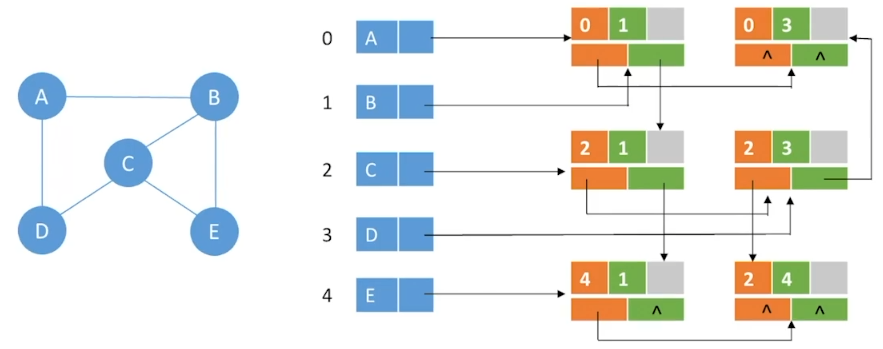


|                  | 邻接表                                               | 邻接矩阵           | 十字链表                 | 邻接多重表               |
| ---------------- | ---------------------------------------------------- | ------------------ | ------------------------ | ------------------------ |
| 空间复杂度       | 无向图 O (\|V\| + 2 \|E\|)；有向图 O (\|V\| + \|E\|) | O (\|V\|^2^)       | O (\|V\| + \|E\| )       | O (\|V\| + \| E\|)       |
| 适合类型         | 存储稀疏图                                           | 存储稠密图         | 有向图                   | 无向图                   |
| 表示方式         | 不唯一                                               | 唯一               | 不唯一                   | 不唯一                   |
| 计算度/入度/出度 | 计算有向图的出度、入度不方便，其余很方便             | 必须遍历对应行或列 | 沿着指针可以很方便地计算 | 沿着指针可以很方便地计算 |
| 找到相邻的边     | 找有向图的入边不方便，其余很方便                     | 必须遍历对应行或列 | 很方便                   | 很方便                   |

### 基本操作

Adjacent(G,x,y)：判断图 G 是否存在边 <x,y> 或 (x,y)
Neighbors(G,x)：列出图 G 中与结点 x 邻接的边
InsertVertex(G,x)：在图 G 中插入顶点 x
DeleteVertex(G,x)：从图 G 中删除顶点 x
AddEdge(G,x,y)：若无向边 (x,y) 或有向边 <x,y> 不存在，则向图 G 中添加该边
RemoveEdge(G,x,y)：若无向边 (x,y) 或有向边 <x,y> 存在，则从图 G 中删除该边
FirstNeighbor(G,x)：求图 G 中顶点 x 的第一个邻接顶点，若有则返回顶点号，若 x 没有邻接点或图中不存在 x，则返回 -1
NextNeighbor(G,x,y)：假设图 G 中顶点 y 是顶点 x 的一个邻接点，返回除 y 之外顶点 x 的下一个邻接点的顶点号，若 y 是 x 的最后一个邻接点，则返回 -1
Get_edge_value(G,x,y)：获取图 G 中边 (x,y) 或 <x,y> 对应的权值
Set_edge_value(G,x,y,v)：设置图 G 中边 (x,y) 或 <x,y> 对应的权值 v

### 广度优先遍历

```c++
bool visited[MAX_VERTEX_NUM];		//标记已访问过的数组

void BFSTraverse(Graph G){			//对图 G 进行广度优先遍历
    for(int i =0; i <G.vexnum;i++)
        visited[i] = FALSE;			//初始化标记数组
    InitQueue(Q);					//初始化辅助队列 Q
    for(int i = 0;i<G.vexnum;i++)	//从 0 号顶点开始遍历
        if(!visited[i])				//对每个连通分量调用一次 BFS
            BFS(G,i);			
}

//广度优先遍历，对于无向图，调用 BFS 函数的次数 = 连通分量数
void BFS(Graph G,int v){			//从顶点 v 出发，广度优先遍历图 G
	visit(v);						//访问初始顶点 v
	visited[v] = TRUE;				//对 v 做出已访问标记
	EnQueue(Q,v);					//顶点 v 入队
	while(!IsEmpty(Q)){				
		DeQueue(Q,v);					//顶点 v 出队
		for(w = FirstNeighbor(G,v);w >=0;w=NextNeighbor(G,v,w))
        //检测 v 的所有邻接顶点
		if(!visited[w]){				//w 为 v 尚未访问的邻接顶点
			visit(w);					//访问顶点 w
			visited[w] = TRUE;			//对 w 做出已访问标记
			EnQueue(Q,w);				//顶点 w 入队
		}
	}
}
```

最坏空间复杂度为 O (|V|)
邻接矩阵存储的图：最坏时间复杂度为 O (|V|^2^)；邻接表存储的图：最坏时间复杂度为 O (|V| + |E|)

### 深度优先遍历

```c++
bool visited[MAX_VERTEX_NUM];		//标记已访问过的数组

void DFSTraverse(Graph G){			//对图 G 进行深度优先遍历
    for(int i =0; i <G.vexnum;i++)
        visited[i] = FALSE;			//初始化标记数组
    for(int i = 0;i<G.vexnum;i++)	
        if(!visited[i])				
            DFS(G,i);			
}

void DFS(Graph G,int v){
    visit(v);
    visited[v]= TRUE;
    for(w = FirstNeighbor(G,v); w >=0;w = NextNeighbor(G,v,w))
        if(!visited[w]){
            DFS(G,w);
        }
}
```

最坏空间复杂度为 O (|V|)
邻接矩阵存储的图：最坏时间复杂度为 O (|V|^2^)；邻接表存储的图：最坏时间复杂度为 O (|V| + |E|)

### 最小生成树

对于一个带权连通无向图 G = (V,E)，生成树不同，每棵树的权也可能不同。设 R 为 G 的所有生成树的集合，若 T 为 R 中边的权值之和最小的生成树，则 T 称为 G 的最小生成树（MST）。

最小生成树可能有多个，但边的权值之和总是唯一且最小的。
最小生成树的边树 = 顶点树 - 1。去掉一条边则不连通，增加一条边则会出现回路。

#### Prim 算法

从某一个顶点开始构建生成树，每次将代价最小的新顶点纳入生成树，直到所有顶点都纳入为止。
时间复杂度：O (|V|^2^)，适用于边稠密图

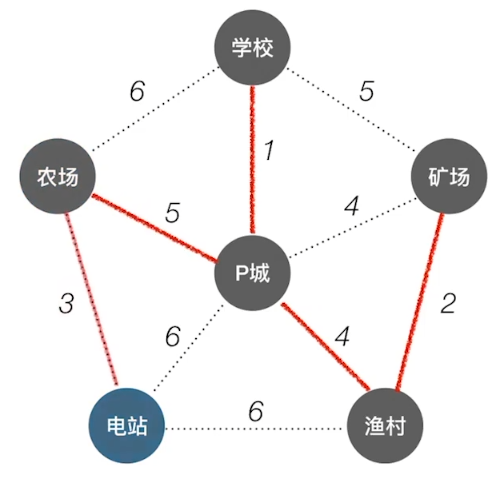

#### Kruskal 算法

每次选择一条权值最小的边，使这条边的两头连通（原本已连通的就不选），直到所有结点连通。

时间复杂度：O (E|log~2~|E||)，适用于边稀疏图

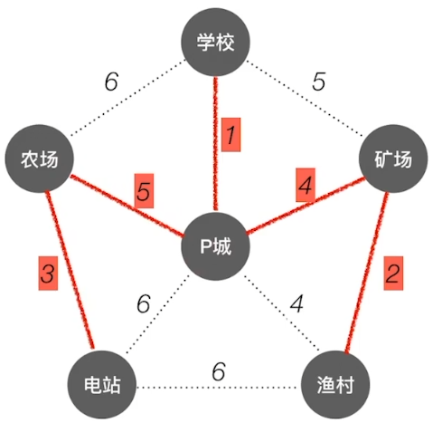

#### 最短路径问题

|                | BFS 算法                          | Dijkstra 算法        | Floyd 算法                   |
| -------------- | --------------------------------- | -------------------- | ---------------------------- |
| 无权图         | 可以                              | 可以                 | 可以                         |
| 带权图         | 不可以                            | 可以                 | 可以                         |
| 带负权值的图   | 不可以                            | 不可以               | 可以                         |
| 带负权回路的图 | 不可以                            | 不可以               | 不可以                       |
| 时间复杂度     | O (\|V\|^2^) 或 O (\|V\| + \|E\|) | O (\|V\|^2^)         | O (\|V\|^3^)                 |
| 通常用于       | 带无权图的单源最短路径            | 带权图的单源最短路径 | 带权图中各个顶点间的最短路径 |
