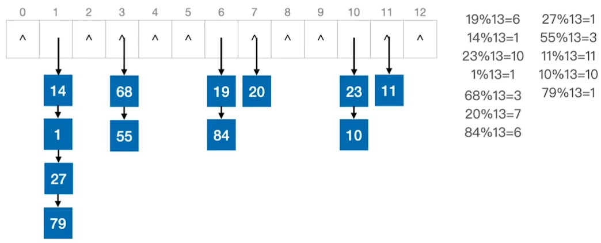

# 第七章 查找和排序

查找：在数据集中寻找满足某种条件的数据元素的过程
查找表：用于查找的数据集合，由同一类型的数据元素（或记录）组成
关键字：数据元素中唯一标识该元素的某个数据项的值，使用基于关键字的查找，查找结果应该是唯一的
查找长度：在查找运算中需要对比关键字的次数
平均查找长度：所有查找过程中进行关键字的比较次数的平均值

### 查找

#### 顺序查找

从头到尾依次查找，通常用于线性表。

```c++
typedef struct{			//查找表的数据结构（顺序表）
    ElemType *elem;		//动态数组基址
    int TableLen;		//表的长度
}SSTable;

//顺序查找
int Search_Seq(SSTable ST,ElemType key){
    int i;
    for(i = 0; i <ST.TableLen && ST.elem[i]!= key; ++i);
    //查找成功，返回元素下标；查找失败则返回 -1
    return i == ST.TableLen ?-1:i;
}
```

时间复杂度 O (n)

#### 折半查找

又称为二分查找，仅适用于有序的顺序表。

```c++
//折半查找
int Binary_Search(SSTable L;ElemType key){
    int low = 0,high = L.TableLen -1,mid;
    while(low <= high){
        mid = (low+high)/2;					//取中间位置
        if(L.elem[mid] == key)
            return mid;						//查找成功则返回所在位置
        else if(L.elem[mid] > key)
            high = mid -1;					//从前半部分继续查找
        else
            low = mid + 1;					//从后半部分继续查找
    }
    return -1;								//查找失败，返回 -1
}
```

时间复杂度：O (log~2~n)

#### 分块查找

又称为索引顺序查找，数据分块存储，块内无序，块间有序。索引表中记录每个分块的最大关键字和分块的存储区间。先查索引表，再对分块内进行顺序查找。平均查找长度 = 查索引表的平均查找长度 + 查分块的平均查找长度

```c++
//索引表
typedef struct{
    ElemType maxValue;
    int low,high;
}Index;

//顺序表存储实际元素
ElemType List[100];
```

#### B 树

又称为多路平衡查找树，B 树中所有结点的孩子个数的最大值称为 B 树的阶，通常用 m 表示，一棵 m 阶 B 树或为空树，或为满足如下特性的 m 叉树：

- 树中每个结点至多有 m 棵子树，即至多含有 m -1 个关键字
- 若根结点不是终端结点，则至少有两个子树
- 除根结点外的所有非叶子结点至少有 $\lceil \frac{m}{2} \rceil$ 棵子树，即至少含有 $\lceil\frac{m}{2} -1\rceil$ 个关键字
- 所有叶子结点都出现在同一层次上，且不带数据。
- 所有非叶子结点的结构如下：


其中，K~i~ 为结点的关键子，且满足 K~1~ < K~2~ < ... < K~n~，P~i~ 为指向子树根结点的指针，且指针 P~i-1~ 所指向子树中所有结点的关键字均小于 K~i~，P~i~ 所指子树中所有结点的关键字均大于 K~i~，n 为结点中关键字个数。


m 阶 B 树的核心特性：

-   根结点的子树数 ∈ [2,m]，关键字数 ∈ [1,m-1]，其他结点的子树数 ∈ [$\lceil \frac{m}{2} \rceil$,m]，关键字数 ∈ [$\lceil \frac{m}{2} \rceil$-1,m-1]
-   对于任一个结点，其所有子树高度相同
-   关键字的值：子树 0 < 关键字 1 < 子树 1 < 关键字 2 < ...

#### B+ 树

一棵 m阶的 B+ 树需满足下列条件：

- 每个分支结点最多有 m 棵子树（孩子结点）
- 非叶根结点至少有两棵子树，其他每个分支结点至少有 $\lceil \frac{m}{2} \rceil$ 棵子树
- 结点的子树个数与关键字个数相等
- 所有叶结点包含全部关键字及指向对应记录的指针，叶子结点按关键字大小顺序排列，并且相邻叶结点按大小顺序相互连接起来
- 所有分支结点中仅包含它的各个子结点中关键字的最大值及指向其子结点的指针
- 根结点的关键字数 ∈ [1,m]，其他结点的关键字数 ∈ [$\lceil \frac{m}{2} \rceil$,m]


|              | m 阶 B 树                                | m 阶 B+ 树                                   |
| ------------ | ---------------------------------------- | -------------------------------------------- |
| 类比         | m 叉查找树                               | 多级分块查找                                 |
| 关键字与分叉 | n 个关键字对应 n + 1 个分叉              | n 个关键字对应 n 个分叉                      |
| 结点包含信息 | 所有结点都包含记录的信息                 | 只有最下层叶子结点才包含记录的信息           |
| 查找方式     | 不支持顺序查找，查找成功可能停留在某一层 | 支持顺序查找，查找成功或失败都会到达叶子结点 |
| 相同点       | 保持绝对平衡                             | 保持绝对平衡                                 |

#### 散列查找

散列表，又称为哈希表。数据元素的关键字与其存储地址直接相关。

若不同的关键字通过散列函数映射到同一个位置， 称它们为同义词。

通过散列函数确定的位置已经存放其他元素称为冲突

表中记录数/散列表长度 = 装填因子 α

**链表法**

把所有同义词存储在一个链表中。




**开放定址法**

可存放新表项的空闲地址既向它的同义词表项开放，又向它的非同义词表项开放。
H~i~ = (H (key) + d~i~) % m，m 为散列表长度，d 为增量序列

*线性探测法*

d~i~ = 0,1,2,...m-1；当发生冲突时，每次往后探测相邻的下一个单元是否为空

*平方探测法*

d~i~ = 0,1,-1,4,-4,9,-9,...,k^2^,-k^2^；当发生冲突时，每次往后探测 d~i~ 间隔的单元是否为空

*伪随机序列法*

d~i~ 是一个伪随机序列

**再散列法**

当散列函数冲突时，用下一个散列函数计算一个新地址，直到不冲突为止。

**散列函数获取方法**

除留余数法 H (key) = key % p
散列表长度为 m，取一个不大于 m 但最接近或等于 m 的质数 p
直接定址法 H (key) = key  或 H(key) = a*key + b
数字分析法：选取数码分布较为均匀的若干位作为散列地址
平方取中法：取关键字的平方值的中间几位作为散列地址

### 排序

排序是重新排列表中的元素，使表中的元素满足按关键字有序的过程。
排序算法稳定性：关键字相同的元素在排序之后相对位置保持不变

#### 插入排序

每次将一个待排序的记录按其关键字大小插入到前面已排好序的子序列中，直到全部记录插入完成。

```c++
void InsertSort(int A[],int n){
    int i,j,temp;
    for(i = 1;i < n;i++)							//将各个元素插入到已排好序的序列中
        if(A[i] < A[i-1]){							//若前一个元素小于当前元素
            temp = A[i];								
            for(j = i-1; j > 0 && A[j] > temp;--j)	//检查前面所有已排好序的元素
                A[j+1] = A[j];						//所有大于当前元素的元素都向后移动
            A[j+1]=temp;
        }
}
```

最坏时间复杂度：O (n^2^)
最好时间复杂度：O(n)
空间复杂度：O(1)
适用于顺序表和链表
算法稳定

#### 希尔排序

先将待排序的记录分割成若干个子表，对各个子表分别进行直接插入排序，再缩小增量 d（每次将增量缩小一半），重复直到 d = 1 为止。

```c++
void ShellSort(int A[],int n){
    int d,i,j;
    for(d = n/2;d >=1;d=d/2)		//每次增量 d 减半
        for(i = d+1; i <=n;++i)
            if(A[i]<A[i-d]){
                A[0]=A[i];			//暂存在 A[0] 中
                for(j = i-d;j>0&& A[0]<A[j];j-=d)
                   A[j+d]=A[j]; 
                A[j+d] = A[0];
            }
}
```

最坏时间复杂度：O (n^2^)
空间复杂度：O(1)
仅可用于顺序表
算法不稳定

#### 冒泡排序

根据序列中两个元素关键字的比较结果来交换这两个记录在序列中的位置

```c++
void swap(int &a, int &b){
    int temp = a;
    a = b;
    b = temp;
}

void BubbleSort(int A[],int n){
    for(int i = 0;i<n-1;i++){
        bool flag = false;			//是否发生交换的标志
        for(int j = n-1;j>i;j--)	//一趟冒泡过程
            if(A[j-1] > A[j]){
                swap(A[j-1],A[j])	//交换
                    flag = true;
            }
        if(flag = false)
            return;			//遍历后没有发生交换说明已经有序了
    }
}
```

最坏时间复杂度：O (n^2^)
最好时间复杂度：O(n)
空间复杂度：O(1)
适用于顺序表和链表
算法稳定

#### 快速排序

```c++
int Partition(int A[],int low,int high){
    int pivot = A[low];						//枢轴元素
    while(low < high){								
        while(low <high && A[high] >=pivot) 
            --high;
        A[low]=A[high];						//比枢轴小的元素移动到 low 左边
        while(low <high&&A[low]<=pivot)
            ++low;
        A[high]=A[low];						//比枢轴大的元素移动到 high 右边
    }
    A[low]=pivot;
    return low;
}

void QuickSort(int A[],int low,int high){
    if(low < high){								//递归跳出条件
        int pivotpos = Partition(A,low,high);	//划分
        QuickSort(A,low,pivotpos-1);			//划分左子表
        QuickSort(A,pivotpos+1,high);			//划分右子表
    } 
}
```

时间复杂度：O(nlog~2~n) ~ O(n)
空间复杂度：O(n) ~ O(log~2~n)
算法不稳定

#### 简单选择排序

每一趟在待排序元素中选取关键字最小的元素加入有序子序列

```c++
void swap(int &a, int &b){
    int temp = a;
    a = b;
    b = temp;
}

void SelectSort(int A[],int n){
    for(int i =0; i < n-1; i++){
        int min = i;				//记录最小元素位置
        for(int j = i+1; j <n;j++)	//选择最小的元素
            if(A[j]<A[min])
                min = j;			//更新最小元素位置
        if(min!=i)
            swap(A[i],A[min]);
    }
}
```

时间复杂度：O(n^2^)
空间复杂度：O(1)
适用于顺序表和链表
算法不稳定

#### 堆排序

大根堆：顺序存储的完全二叉树中，根 ≥左右
小根堆：顺序存储的完全二叉树中，根 ≤左右 

每一趟在待排序元素中选取关键字最大的元素加入有序子序列，并将待排序元素再次调整为大根堆（小元素不断下坠）。

```c++
//建立大根堆
void BuildMaxHeap(int A[],int len){
    for(int i = len/2; i > 0;i--)
        HeadAdjust(A,i,len);
}

//将以 k 为根的子树调整为大根堆
void HeadAdjust(int A[], int k,int len){
    A[0] = A[k];
    for(int i = 2*k;i<=len; i*=2){
        if(A<len&&A[i]<A[i+1])
            i++;					//选中左孩子和右孩子中值更大的一个
        if(A[0] >=A[i])				//结点比左孩子和右孩子都大
            break;
        else{
            A[k]=A[i];				//孩子结点顶替父节点
        	k=i;					//更新 k 值，以便继续向下筛选
        }
    }
    A[k]=A[0];						//小元素最终下坠的位置
}


void HeadSort(int A[],int len){
    BuildMaxHeap(A,len);			//建立堆
    for(int i = len;i > 1; i--){
        swap(A[i],A[1]);			//堆顶元素和堆底元素交换
        HeadAdjust(A,1,i-1);		//剩余的待排序元素整理成堆
    }
}
```

时间复杂度：O(nlog~2~n)
空间复杂度：O(1)
仅适用于顺序表
算法不稳定

#### 归并排序

把两个或多个已经有序的序列合并成一个

```c++
int *B = (int *)malloc(n*sizeof(int)); 		//辅助数组 B

//A[low...mid] 和 A[mid...high] 各自有序，将两部分归并
void Merge(int A[],int low,int high,int mid){
    int i,j,k;
    for(k = low, k <=high;k++)
        B[k] = A[k];				//将 A 中所有元素复制到 B 
    for(i = low, j = mid+1,k = i; i <=mid && j <=high;k++){
        if(B[i] <= B[j])
            A[k] = B[i++];			//较小的值复制到 A 中
        else
            A[k]=B[j++];
    }
    while(i < mid) A[k++] = B[i++];		//可能没有归并完的部分复制到尾部
    while(j <=high) A[k++] = B[j++];	//可能没有归并完的部分复制到尾部
}

void MergeSort(int A[],int low,int high){
    if(low < high){						//递归结束条件
        int mid = (low + high)/2;
        MergeSort(A,low,mid);			//对左半部分归并排序
        MergeSort(A,mid+1,high);		//对右半部分归并排序
        Merge(A,low,mid,high);			//对并
    }
}
```

时间复杂度：O(nlog~2~n)
空间复杂度：O(n)
算法稳定

#### 基数排序

基数排序擅长解决的问题：

- 数据元素的关键字可以方便地拆分为 d 组，且 d 较小
- 每组关键字地取值范围不大，即 r 较小
- 数据元素个数 n 较大

思想：

- 将整个关键字拆分为 d 组
- 按照各个关键字地权重次数做 d 趟分配和收集
- 分配：顺序扫描各个元素，根据当前处理的关键字位，将元素插入相应队列
- 收集：把各个队列中的结点依次出队并连接

时间复杂度：O(d(n+r))
空间复杂度：O(r)
算法稳定
