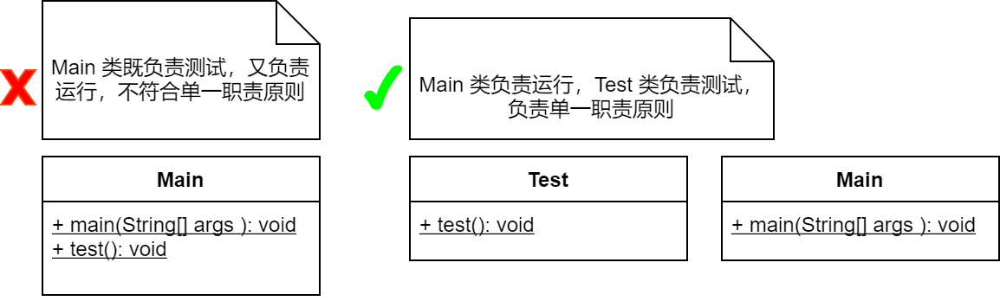
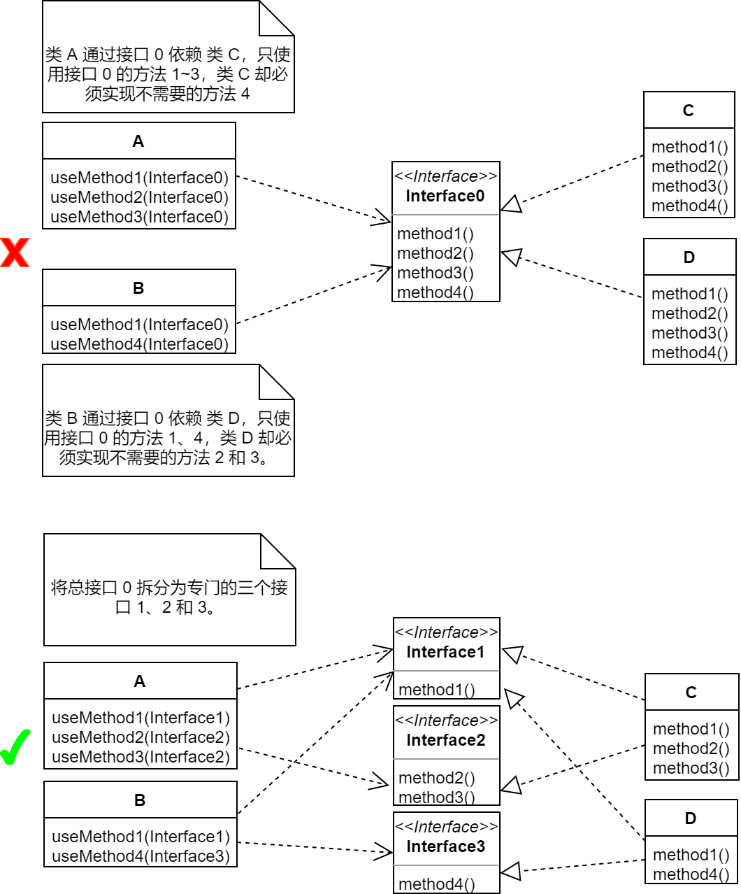
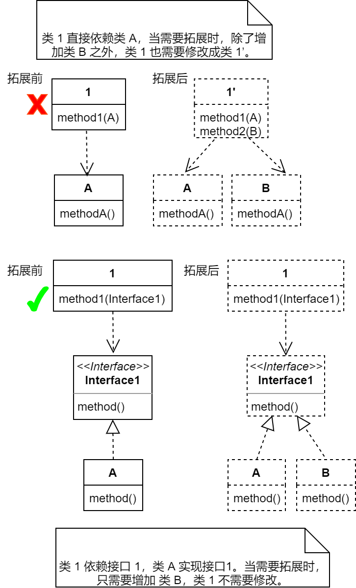
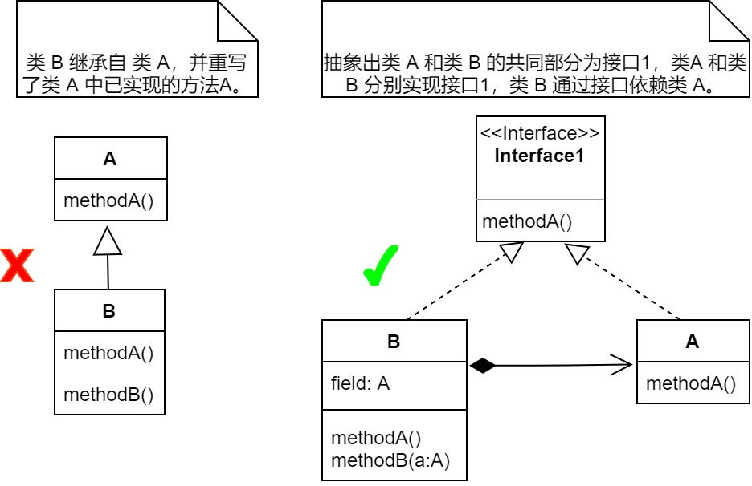
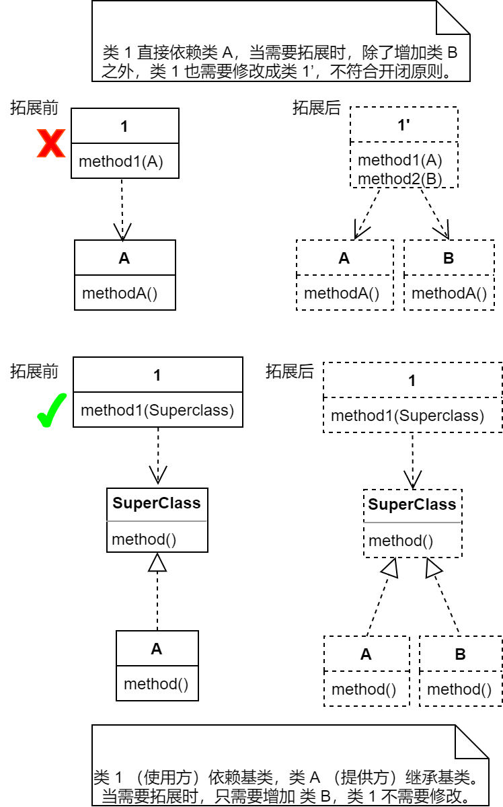
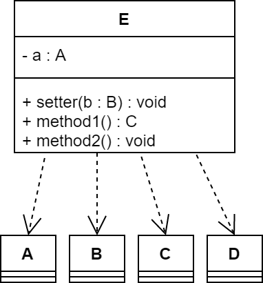
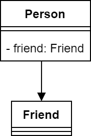
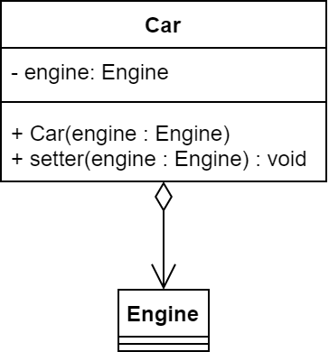
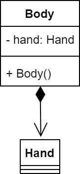

# 第一章 预备知识

## 1 概述
了解面向对象四大特征（封装、继承、多态、抽象）并不足以设计出良好的面向对象系统（可复用、可扩展、可维护）。从基础的四大特征到高级的23种设计模式，都是为了设计出更好的程序。

设计模式：软件设计中常见问题的经典解决方案。
角色：类、接口和对象在模式中所起到的作用。

**创建型模式**

工厂方法模式、抽象工厂模式、简单工厂模式、生成器模式、原型模式、单例模式

**结构型模式**

适配器模式、桥接模式、组合模式、装饰模式、外观模式、享元模式、代理模式

**行为模式**

责任链模式、命令模式、迭代器模式、中介者模式、备忘录模式、观察者模式、状态模式、策略模式、模板方法模式、访问者模式、解释器模式

## 2 七个基本原则

- 单一职责原则（SRP：Single Responsibility Principle）

  一个类只应该负责一项职责，即有且只有一个原因可以改变一个类或模块，否则会增加耦合。

  

- 接口隔离原则（ISP：Interface Segregation Principle）

  一个类对另一个类的依赖应该建立在最小的接口上，即使用多个专门的接口比使用单一的总接口要好。

  

- 依赖倒转原则（DIP：Dependence Inversion Principle）

  高层模块不应该依赖于底层模块，二者都应该依赖于抽象。

  抽象不应该依赖于具体实现，具体实现应该依赖于抽象。

  程序要依赖抽象接口，不要依赖具体实现。

  

- 里氏替换原则（LSP：Liskov Substitution principle）

  所有使用父类的地方必须能够使用子类对象替换。子类可以拓展父类，但不要重写父类**已实现的方法**。



- 开闭原则（OCP：Open Closed Principle）

  可以让提供方进行功能拓展，禁止在使用方进行修改。即尽量在不用修改现有类的前提下拓展新的类。



- 迪米特原则（LKP：Least Knowledge Principle）

  一个应该对其他类保持最小的了解。只与自己的朋友交互。朋友包括：

  - 当前对象本身

  - 通过方法参数传递进来的对象

  - 当前对象所创建的对象

  - 当前对象的成员变量所引用的对象

  - 方法内所创建的对象

- 合成复用原则（CRP：Composite Reuse Principle）

  优先考虑用组合、聚合等关联关系而不是继承关系去实现复用。

## 3 类与类之间的关系

- 依赖（Association）
类之间最弱的一种临时性联系。
一般在一个类的成员变量、方法形参返回值、或局部变量中使用其他类。



```java
class A{}
class B{}
class C{}
class D{}

class E{
    private A a; //成员变量

    public void setter(B b){} //方法形参

    public C method1(){} //返回值

    public void method2(){
        D d = new D(); //局部变量
    }
}
```


- 关联（Dependency）
类之间较弱的一种永久性联系。类之间平等。一般在一个类地成员变量中使用使用其他类。比如你和朋友。



```java
class Friend{}

class Person{
    private Friend friend;
}
```
- 聚合（Aggregation）

  类之间较强的一种关联关系。类之间不平等。一般在一个类的构造方法或 setter 方法中使用另一个类。如汽车和引擎。

  
```java
class Engine {}

class Car {
    private Engine engine;

    public Car(Engine engine) { //构造方法中
        this.engine = engine;
    }

    public void setter(Engine engine) { //setter 方法中
        this.engine = engine;
    }
}
```
- 组合（Composition）

  类之间最强的一种关联关系。组合类负责被组合类的生命周期。通常在组合类的构造方法中直接实例化被组合类对象。比如身体和手。

  
  
  
```java
class Hand {
}

class Body {
    private Hand hand;

    public Body() {
        this.hand = new Hand(); //构造方法中直接实例化被组合类
    }
}
```
- 泛化（Generalization）
即继承，子父类之间的关系。
- 实现（implementation）
接口和实现类之间的关系。