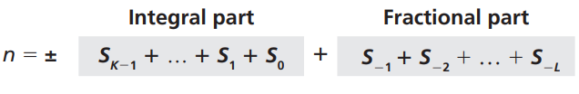

# 第二章 数字系统

数字系统定义如何用独特的符号表示一个数字。数字系统分为两类：位置化系统和非位置化系统。

## 2.1 位置化数字系统

在位置化数字系统中，数字中符号所占据的位置决定符号所表示的值。例如进制系统，在不同进制中数字的通式如下：


S 是一套符合集合，b 是基数，等于符号集中的符号总数，S~K~和 S~L~ 分别是整数部分和小数部分的符号。通式的值为：


### 2.2.1 十进制

在十进制中，基数为 10，用 10 个符号表示一个数字。符号集合 S = {0,1,2,3,4,5,6,7,8,9}，这些符号被称为十进制数码。十进制数字例如 +224, -24.13 等。

### 2.2.2 二进制

在二进制中，基数为 2 ，用 2 个符号表示一个数字。符号集合 S = {0,1}，这些符号被称为二进制数码。二进制数字例如 (11001)~2~, -(101.11)~2~ 等。

### 2.2.3 十六进制

在十六进制中，基数为 16，用 16 个符号表示一个数字。符号集合 S = {0,1,2,3,4,5,6,7,8,9,A,B,C,D,E,F}，这些符号被称为十六进制数码。十六进制数字例如 (2AE)~16~, -(D5.14)~16~ 等。

### 2.2.4 八进制

在八进制中，基数为 8，用 8 个符号表示一个数字。符号集合 S = {0,1,2,3,4,5,6,7}，这些符号被称为八进制数码。八进制数字例如 (1256)~8~, -(53.26)~8~ 等。

| 十进制 | 二进制 | 十六进制 | 八进制 |
| :----: | :----: | :------: | :----: |
|   0    |   0    |    0     |   0    |
|   1    |   1    |    1     |   1    |
|   2    |   10   |    2     |   2    |
|   3    |   11   |    3     |   3    |
|   4    |  100   |    4     |   4    |
|   5    |  101   |    5     |   5    |
|   6    |  110   |    6     |   6    |
|   7    |  111   |    7     |   7    |
|   8    |  1000  |    8     |   10   |
|   9    |  1001  |    9     |   11   |
|   10   |  1010  |    A     |   12   |
|   11   |  1011  |    B     |   13   |
|   12   |  1100  |    C     |   14   |
|   13   |  1101  |    D     |   15   |
|   14   |  1110  |    E     |   16   |
|   15   |  1111  |    F     |   17   |

### 2.2.5 转换

**1.其他进制转换成十进制**

(110.11)~2~ = 1 x 2^2^ + 1 x 2^1^ + 0 x 2^0^ + 1 x 2^-1^ + 1 x 2^-2^ = 6.75

(2D.8)~16~ = 2 x 16^1^ + 13 x 16^0^ + 8 x 16^-1^ = 45.5

(12.34)~8~ = 1 x 8^1^ + 2 x 8^0^ + 3 x 8^-1^ + 4 x 8^-2^ = 10.4375

**2.十进制转换成其他进制**

**整数部分**

十进制整数部分转为其他进制时，整数部分不断除以其他进制的基数，直到商为0停止，得到的余数逆序排列，为转换后的值。

35 转换成 (100011)~2~

```
35 / 2 = 17 ... 1
17 / 2 = 8 ...  1 
8 / 2 = 4 ...   0
4 / 2 = 2 ...   0 
2 / 2 = 1 ...   0
1 / 2 = 0 ...   1 
```

 126 转换为 (176)~8~

```
126 / 8 = 15 ... 6
15 / 8 = 1 ...   7
7 / 8 = 0 ...    1
```

126 转换为(7E)~16~

```
126 / 16 = 7 ... E
7 / 16 = 0 ...   7
```

**小数部分**

十进制小数部分转为其他进制时，小数部分不断乘以其他进制的基数，直到积为整数，得到的整数部分顺序排列，为转换后的值。0.6875 转换为 (0.1011)~2~

```
0.6875 x 2 = 1.375(1 + 0.375)
0.375 x 2 = 0.75  (0 + 0.75)
0.75 x 2 = 1.5    (1 + 0.5)
0.5 x 2 = 1       (1 + 0.0)
```

0.6875 转换为 (0.54)~8~

```
0.6875 x 8 = 5.5(5 + 0.5)
0.5 x 8 = 4     (4 + 0.0)
```

0.6875 转换为 (0.B)~16~

```
0.6878 x 16 = 11 (11 + 0.0)
```

很多情况下积无法为整数，得到足够位数后停住运算。

0.68 转换为 (0.10101)~2~，精确到 5 位小数

```
0.68 x 2 = 1.36(1 + 0.36)
0.36 x 2 = 0.72(0 + 0.72)
0.72 x 2 = 1.44(1 + 0.44)
0.44 x 2 = 0.88(0 + 0.88)
0.88 x 2 = 1.76(1 + 0.76)
...
```

**3.十六进制与二进制转换**

二进制中的 4 位转换为十六进制中的 1 位，反之成立。

(10011100010)~2~ 转换为 (4E2)~16~

```
10011100010 = 0100 1110 0010 = 4 E 2
```

(24C)~16~ 转换为 (001001001100)~2~

```
24C = 0010 0100 1100 = 001001001100
```

**4.八进制与二进制转换**

二进制中的 3 位转换为八进制中的 1 位，反之成立。

(101110010)~2~ 转换为 (562)~8~

```
101110010 = 101 110 010 = 5 6 2
```

(24)~8~ 转换为 (010100)~2~

```
24 = 010 100 = 010100
```

**5.八进制与十六进制转换**

八进制和十六进制转换成二进制后，可以互相转换。

## 2.2 非位置化数字系统

在非位置化数字系统中，每个符号代表固定的值，数字中符号所占据的位置与符号所表示的值无关。例如罗马数字系统，通式如下：


通式的值为：



在罗马数字系统中，S = {I,V,X,L,C,D,M}，分别代表十进制中的 {1,5,10,50,100,500,1000}。

```
III = 1 + 1 + 1 = 3
VI = 5 + 1 = 6
IV = 5 - 1 = 4
```

