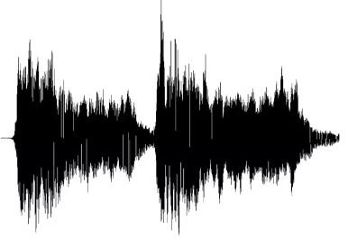

# 第三章 数据存储

数据有多种表示形式，包括数字、文本、图像、音频和视频。

多媒体：包含数字、文本、图像、音频和视频的信息

比特（bit）是计算机的最小存储单位，8 个比特称为 1 字节（byte）。一比特有 0 和 1 两种不同状态。无论何种数据，在计算机中都存储为一定数量的比特序列。

计算机只负责存储比特序列，它并不关心存储的数据类型。计算机中存储的一段比特序列例如 01000001，当数字处理器程序读取 01000001 后，将其解析为数字 65；当文本处理器读取 01000001 后，将其解析为字符 A；当图像处理器读取 01000001 后，将其解析为图片的一部分。计算机中存储的比特序列所代表的数据类型由程序决定。

## 3.1 存储数字

### 3.1.1 整数

整数通常使用定点表示法存储，即整数被当作小数点位置固定的数字，假定的小数点固定在最右边。 如下图：

还需要考虑如何存储正整数和负整数，有以下三种方法：

1. **无符号表示法**

​    无符号表示法没有为 ± 符号分配存储空间，所以只能存储 [0, +2^n^-1] 的整数，n 是为该整数分配的存储位数。

   存储过程如下：

   - 整数转为二进制；
   - 若二进制位数 < n 位，在左边补 0；若二进制位数 > n 位，丢失最左边多出的位数，即溢出。

   无符号表示法常用于无需负整数的情况：

- 计数：从 0 或 1 开始；

- 寻址：在一个存储单元储存另一个存储单元的地址时，地址从 0 开始存储

- 存储其他数据类型：文本、图像、音视频都可以存储为无符号整数

2. **有符号表示法**

​    有符号表示法用最左边 1 位存储符号（0 表示 +，1 表示 -），剩余的 n-1 位存储无符号整数。 有符号表示法不经常使用。

   存储过程如下：

   - 根据无符号表示法，将整数存储为 n-1 位二进制；
   - 符号存储在最左边的 1 位。

3. **补码表示法**

​    几乎所有计算机都使用二进制补码表示法存储有符号整数。和有符号表示法类似，最左边 1 位为符号位。

   存储过程如下：

   - 根据无符号表示法，将整数转为 n-1 位二进制；
   - 如果整数为 0 或正整数，保持原样存储；若为负整数，取其补码（所有位取反 + 1 后的结果）存储。

### 3.1.2 实数

实数使用定点表示法存储时固定了精度，无法应对不同的精度要求。通常使用浮点表示法存储实数，即小数点是可以移动的。在浮点表示法中，一个数字由三部分组成：符号、位移量和定点数，规定对于 n (n >1) 进制的数字，定点数应该介于 [1, n) 之间。10 进制数字的浮点表示法称为科学计数法。

-782123.123 = - 7.82123123 x 10^5^，符号为 -，位移量为 5，定点数为 7.82123123。
-(0.000101)~2~ = - 1.01 x 2^-4^，符号为 -，位移量为 -4，定点数为 (1.01)~2~。

IEEE 定义了几种存储浮点数的标准，规定符号、位移量和定点数如何转换为二进制数字。

**符号**

符号只有正负两种状态，0 代表 +，1 表示 -。

**位移量**

位移量是一个有符号的整数，IEEE 标准中使用余码表示法而不是补码表示法存储位移量。给位移量分配 n 位存储空间，所有位移量 + 2^n-1^-1 后整体向右移，保证所有整数为正整数后，用无符号表示法存储。

**定点数**

二进制定点数介于 [1, 2)，整数部分恒大于1，只存储尾数。例 (1.01)~2~ 只存储尾数 (01)~2~。

IEEE 标准中常用的单精度和双精度：

| 参数           | 单精度 | 双精度 |
| -------------- | ------ | ------ |
| 实数的存储空间 | 32     | 64     |
| 符号位存储空间 | 1      | 1      |
| 位移量存储空间 | 8      | 11     |
| 定点数存储空间 | 23     | 52     |

十进制 - 0.0234575 转为单精度：

- 符号为负，符号位为 1；
- 十进制转为二进制： 0.0234575 = (0.0000011)~2~；
- 转为浮点表示法：(0.0000011)~2~ = (1.1)~2~ x 2^-6^；
- 位移量为 -6，经过余码表示法转换，整体向右移 2^8-1^-1 位，位移量为 -6+127 = 121  = (01111001)~2~；
- 定点数 (1.1)~2~ 只存储尾数 (1)~2~。

约定当符号、位移量和定点数都为 0 时，表示 0 这个数字。

## 3.2 存储文本

ASCII 用 7 位代表一个字符，包括了大小写字母，0-9、英文标点符号和一些控制字符等 128 个字符。大写字母 A 从 65 开始，小写字母和大写字母相差 32。数字的 ASCII 编码与数字本身相差 48。

Unicode 用 32 位代表一个符号，包括了世界上不同语言的各种符号，ASCII 已成为 Unicode 的一个子集。

## 3.3 存储音频

音频是频率对时间的函数。每秒采集的样本数称为采样率。一般来说每秒 40000 个样本就足够重现音频信号。每个样本值为一个真实的数字。通常情况下会将样本值截取成最接近的整数值，这个过程称为量化。量化后的样本值用无符号表示法存储。给样本值分配的存储空间称为位深度，存储空间越大，可存储的样本值范围越广。

音频编码的主流标准 MP3，采样率为 44100，位深度 16 位，去掉人耳无法识别的频率后，用霍夫曼编码压缩。

原始音频信号

放大后的信号

8 位深度

2 位深度

## 3.4 存储图像

计算机中的图像使用两种不同的技术存储：位图（光栅图）和矢量图。

### 3.4.1 位图

图像是颜色对空间的函数。在一个有限的空间上，有若干个像素。给每个像素分配 24 位存储空间，用 8 位编码红色，用 8 位编码蓝色，用 8 位编码绿色。称为**真彩色**。
当不需要很多的颜色范围时，可以使用**索引色**。从真彩色中选出一些颜色建立索引，减少存储空间。

### 3.4.2 矢量图

矢量图使用数学公式描述每个几何形状，几何形状组合成一个图像。存储图像时，存储如何绘制这些几何形状的命令即可。但矢量图不适合复杂、精妙的图像。

## 3.5 存储视频

视频是图像对时间的函数。视频就是一系列的图像一张接一张地播放。