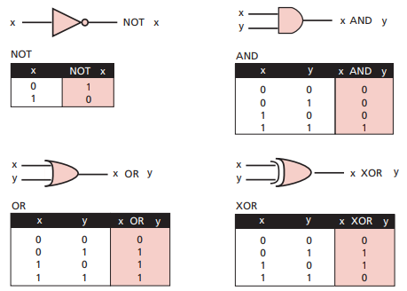
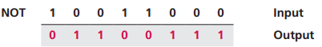
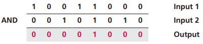
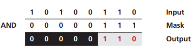
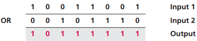
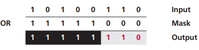
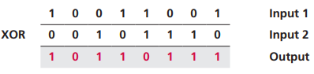
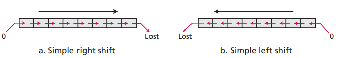
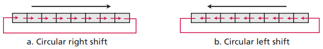
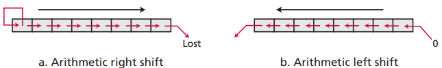

# 第四章 数据运算

## 4.1 逻辑运算

一个位可能是 0 或 1，若用 0 代表逻辑假，1 代表逻辑真，可以用布尔代数的中的运算去操作二进制位。

1. **非（NOT）**

   NOT 运算符是一元操作符。只有一个输入。若输入 1 ，则输出 0；若输入 0 ，则输出 1。NOT 运算常用于取反运算。

2. 与（AND）

​    AND 运算符是二元操作符，有两个输入。当输入都是 1，则输出 1，否则都输出 0。

​    AND 运算的一个应用是把一个输入的指定位**复位**。这种情况下，第二个输入称为掩码。只要掩码中为 0 的位和第一个输入进行 AND 运算，指定位的输出必为 0，达到复位的效果。

3. 或（OR）

​    OR 运算符是二元操作符，有两个输入。当输入都是 0，则输出 0，否则都输出 1。

​    OR 运算的一个应用是把一个输入的指定位**置位**。只要掩码中为 1 的位和第一个输入进行 OR 运算，指定位的输出必为 1，达到置位的效果。

4. 异或（XOR）

​    XOR 运算符是二元操作符，有两个输入。当输入相同时，输出 0；否则都输出 1。

​    XOR 运算的一个应用是把一个输入的指定位**反转**。只要掩码中为 1 的位和第一个输入进行 XOR 运算，指定位的输出必反转。

## 4.2 移位运算

移位运算可以向左或向右移动位，改变位的位置。移位运算可分为两大类：逻辑移位运算和算术移位运算。

### 4.2.1 逻辑移位运算

逻辑移位运算应用于不带符号位的数字。

**简单移位**

简单右移运算每次整体向右移动一位，最右位丢失，最左位补 0；简单左移反之同理。

**循环移位**

简单位移会丢失位，循环位移不会丢失位。循环右移运算每次整体向右移动一位，最右位回环成最左位；循环左移反之同理。

### 4.2.2 算术移位运算

算术移位运算应用于用补码表示法表示的带符号位的整数。算术右移保留符号位并整体右移，最右位丢失，常被用来除以 2；算术左移丢弃最左位的符号位，若新的符号位与原符号位相同，那么运算成功，否则发生溢出。算术左移常被用来乘以 2。

## 4.3 算术运算

算术运算包括加减乘除，适用于整数和浮点数。

用补码表示法表示的带符号位的整数中，减法可以转变位加法进行运算。被减数减去减数，只需要将减数取法并加一，和被减数相加，即可得到两者的差。

A - B = A + (-B) = A +(!B + 1)。