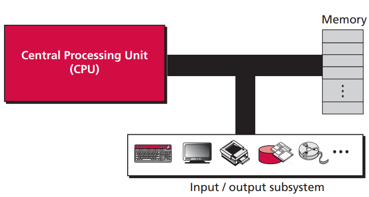
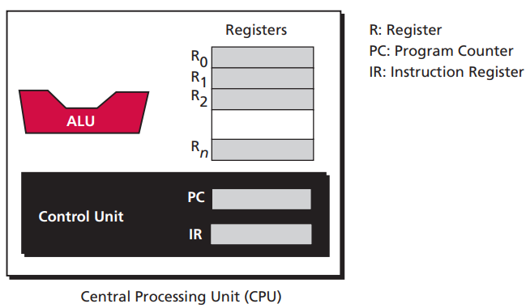
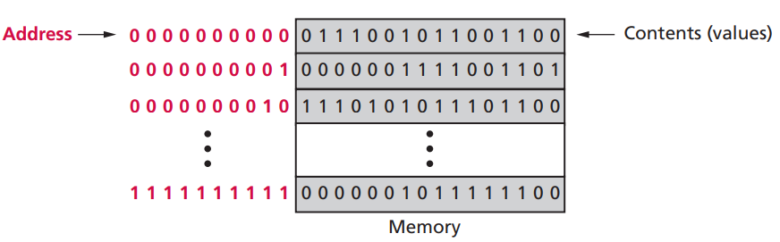

# 第五章 计算机组成

计算机由三部分构成：中央处理器、主存储器和输入输出。

## 5.1 中央处理器

中央处理器用于处理数据。在大多数体系结构中由三个部分组成：算术逻辑单元，控制单元和寄存器组。

### 5.1.1 算术逻辑单元

算术逻辑单元对数据进行逻辑、移位和算术运算。逻辑运算包括与、或、非和异或等；移位运算包括左移和右移运算；算术运算包括对整数和实数的加减乘除等。

### 5.1.2 寄存器

寄存器是用来存放临时数据的高速存储单元。寄存器根据用途可分为几类：

- 数据寄存器

​    数据寄存器用来存储输入数据和运算结果，如上图 R~0~ 到 R~n~。

- 指令寄存器

​    指令寄存器存储指令。如上图 IR。CPU 从内存中逐条取出指令放在指令寄存器中，解释并执行指令。

- 程序计数器

​    程序计数用于保存当前正在执行的指令地址。当前指令执行完后，计数器指向下一条指令的内存地址。如上图 PC。

### 5.1.3 控制单元

控制单元控制计算机进行的操作，有指令寄存器和程序计数器两个专用的寄存器。

## 5.2 主存储器

主存储器也被称为内存，是若干个存储单元的集合。每个存储单元都有唯一的标识，称为地址。每个存储单元的容量称为字长。字长 x 总地址个数 = 内存大小。

一个 64 KB (2^16^ 字节)，字长是 1 字节的内存，共有 2^16^个存储单元，需要 2^16^ 个地址来标识每个存储单元。内存可以分为两类：

|          | RAM（随机存取存储器） | ROM（只读存储器）  |
| -------- | --------------------- | ------------------ |
| 读写状态 | 可读写                | 只读不可写         |
| 断电后   | 断电后丢失所有数据    | 断电后不会丢失数据 |

## 5.3 输入输出

输入输出系统让计算机可以与外界通信。包括键盘、显示器、打印机等非存储设备和硬盘、光盘和磁盘等存储设备。

## 5.4 子系统互连

CPU、主存储器和输入输出三个子系统不是互相独立，它们需要互相传输信息。

### 5.4.1 CPU 和主存储器的连接

CPU 和内存通过总线连接，包括数据总线、地址总线和控制总线。

**数据总线**

每一根线上每一次只能传输 1 位数据。若 CPU 能同时处理 n 位数据，则需要 n 根数据总线。

**地址总线**

CPU 需要根据地址访问指定的存储单元。若内存有 2^n^ 个地址，则需要 n 根地址总线传输地址。

**控制总线**

 CPU 和内存之间传输信息时需要特定的控制命令，若有 n 根控制总线，则 CPU 最多能有 2^n^ 条控制指令。

### 5.4.2 CPU 与 IO 设备的连接

IO 设备无法直接与 CPU 连接，需要通过输入输出控制器连接到总线上。常见控制器有 USB，HDMI 等接口。

## 5.5 程序执行

CPU 利用重复的机器周期来执行程序中的指令，一个简化的周期包括：取指令、译码和执行。

**取指令**

控制单元命令系统将下一条要执行的指令复制到 CPU 的指令寄存器中，该指令的地址保存在程序计数器中。

**译码**

控制单元负责译码，产生一系列可以执行的二进制代码。

**执行**

控制单元根据二进制代码，发送命令到对应的部件，例如让 CPU 执行一次计算。