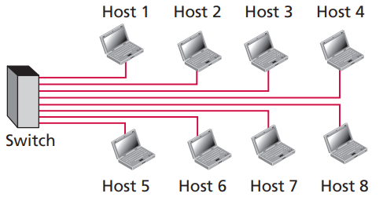
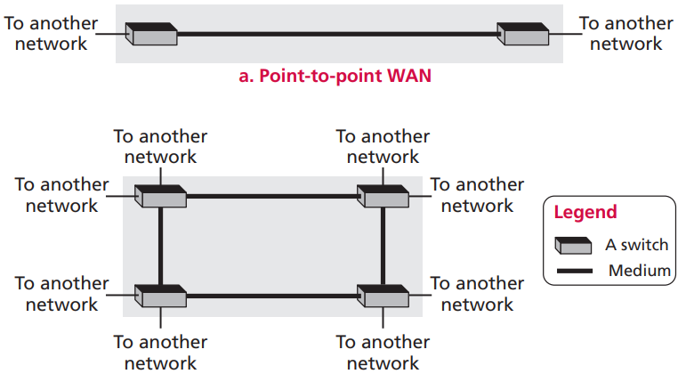
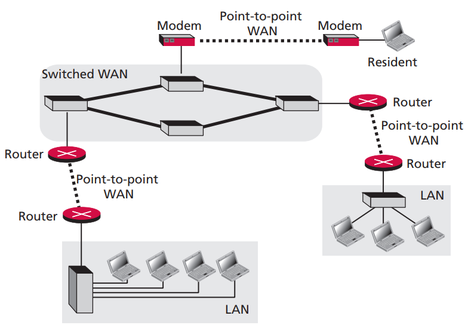
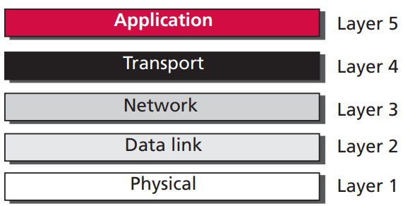

# 第六章 计算机网络

网络是一系列可用于通信的设备相互连接构成的。这里的设备可以是一台计算机、路由器、交换机或调制解调器等，设备之间通过有线或无线传输媒介连接。网络根据其规模大小，可以分为以下几类：

**局域网**

局域网通常由几台主机连接在一起，形成一个小规模的网路。

局域网

**广域网**

广域网通常利用交换机、路由器和调制解调器连接不同的局域网。

广域网

**互联网**

互联网连接不同的广域网，将所有网络连接成一体。

互联网

协议是一组通信规则。如今的互联网使用 TCP/IP 协议族，将通信规范化为五层结构。每层结构都有各自的职责和规范。

## 6.1 应用层

应用层处于 TCP/IP 协议族的最高层，只接收传输层提供的服务，不向上提供服务。应用层上的协议规定了应用程序如何发送和处理数据。常见的协议有：HTTP, FTP, TELNET, SSH 和 DNS 等。

## 6.2 传输层

传输层从网络层接收服务并为应用层提供服务。传输层上的协议定义了不同主机上的进程通信规范。常见的协议有：TCP, UDP 等。

## 6.3 网络层

网络层从数据链路层接收服务并为传输层提供服务。网络层上的协议定义了不同主机之间的通信规范。常见的协议有：IP (IPv4 和 IPv6) 等。

## 6.4 数据链路层

数据链路层从物理层接收服务并为网络层提供服务。数据链路层上的协议定义了不同网络之间的通信规范。常见的协议有：以太网，WIFI，蓝牙，有线电视网络，手机网络，卫星网络等。

## 6.5 物理层

物理层为数据链路层提供服务。物理层的作用是将从数据链路层接收的二进制数据转换成可传输的电磁信号。常用的传输媒介有：双绞线，同轴电缆，光纤电缆，无线电波等。