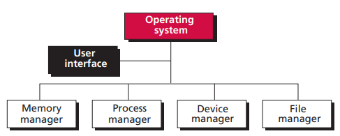
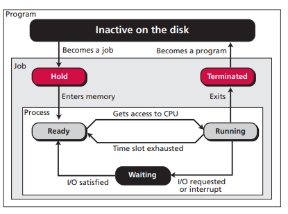

# 第七章 操作系统

计算机软件分为两大类：操作系统和应用程序。操作系统控制计算机系统用户对硬件的访问。应用程序使用计算机硬件来解决用户的问题。

## 7.1 定义

操作系统有一些常见的定义：

- 操作系统是介于计算机硬件和用户之间的接口。
- 操作系统是一种用来使得其他程序更加方便有效运行的程序集。
- 操作系统作为通用管理程序，管理着计算机系统中每个部件，能对计算机硬件和软件资源进行访问。

操作系统本身也是程序，也需要被装入内存中运行。当计算机通电时，通过一个存在 ROM 中的自举程序，把操作系统装入 RAM 中。

## 7.2 演化

### 7.2.1 批处理系统

批处理系统设计于 20 世纪 50 年代。一个运行的程序称为作业，一个作业占据所有计算机资源。运行作业时通过穿孔卡片将程序和数据输入计算机。

### 7.2.2 分时系统

将多个作业同时装入内存，当一个作业需要资源且资源可用时，可将资源分配给该作业。最终的结果是每个作业可以分到一段时间来使用资源。

### 7.2.3 个人系统

个人计算机产生后，单用户操作系统如 DOS 就产生了。

### 7.2.4 并行系统

一个计算机中安装多个 CPU，每个 CPU 处理一个程序或一部分程序。作业不再是串行处理而是并行处理。

### 7.2.5 分布式系统

不同计算机之间通过网络连接，程序可以在一台计算机上运行一部分，在另一台计算机上运行另一部分。

### 7.2.6 实时系统

实时系统是指在特定时间限制内完成任务。

## 7.3 组成部分

现代计操作系统至少具有以下 4 种功能：内存管理、进程管理、设备管理和文件管理，通常还有一个用户界面。

### 7.3.1 用户界面

每个操作系统都有用户界面，即用来接收用户的输入的程序。如 Linux 中的 shell，Windows 中的窗口。

### 7.3.2 内存管理

**单道程序**

在单道程序的管理模式中，除了操作系统，同一时刻内存中只能装载一个程序。程序运行完毕后载入新的程序。这是一种老旧的内存管理模式。

单道程序内存管理

**多道程序**

现代操作系统采用多道程序的管理模式，同一时刻可以装入多个程序。CPU 轮流为程序服务。 

多道程序内存管理

在多道程序的管理模式中，又可以分为两种非交换技术，即程序在运行期间始终驻留在内存中；两种交换技术，即程序在运行期间在内存和硬盘之间多次交换数据。

**分区调度**

分区调度是一种非交换技术。内存被分为不定长的几个分区，每个分区都保存一个程序。CPU 在各个程序之间交替服务。CPU 执行一个程序时，若遇到 IO 操作或到达分配给该程序的时限后，CPU 执行下一个程序。

分区调度

**分页调度**

分页调度是一种非交换技术。内存被分为若干个大小相等的部分，称为帧。程序被分为大小相等的部分，称为页。页和帧的大小通常是一样的。在分页调度中，程序在内存中不必是连续的。相比于分区调度，提高了内存利用率。

分页调度

**请求分页调度**

请求分页调度是一种交换技术。分页调度需要将一个程序全部载入内存中运行。请求分页调度不需要载入整个程序。页可以依次载入内存运行，然后被另一个页替代。程序的部分页在内存中，部分页在磁盘上。

请求分页调度

**请求分段调度**

请求分段调度是一种交换技术。请求分段调度以程序员的视角考虑问题，将程序分为若干个模块。运行时将程序的某个模块载入内存中。

请求分段调度

**请求分页和分段调度**

结合请求分页调度和请求分段调度的优点，提高系统效率。将内存分为若干个帧，将程序的一个模块分成若干个页。

在请求分页和请求分段或两者结合的模式中，程序不需要整个载入内存中，只有部分程序载入内存运行，剩下的部分仍放在硬盘上。

## 7.3.3 进程管理

程序是由程序员编写的一组指令，存放在磁盘上，还未执行。当一个程序被选中执行时，该程序称为作业。当一个程序正在运行中时，该程序称为进程。

程序、作业和进程的示意图

### 7.3.4 设备管理

设备管理器负责管理输入和输出设备。

### 7.3.5 文件管理

文件管理器负责管理程序对文件的访问。

## 7.4 主流操作系统

大多数操作系统都有几个部分组成：内核、命令解释器、标准工具和应用程序。

- 内核：操作系统的心脏，包含操作系统最近基本的内存管理、进程管理、设备管理和文件管理。系统所有其他部分均调用内核来执行这些服务。

- 命令解释器：命令解释器用来接收和解释用户输入的命令。
- 工具：工具是操作系统提供的内置标准程序，例如文本编辑器、搜索程序、排序程序等。
- 应用：应用不是操作系统内置的标准程序，由第三方人员开发编写，提供对操作系统的扩展。

主流的操作系统如 UNIX, Linux, Windows 等。

