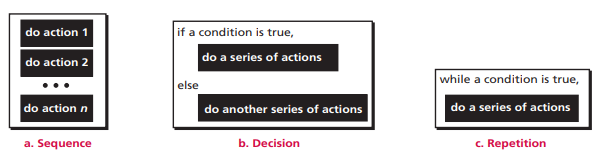
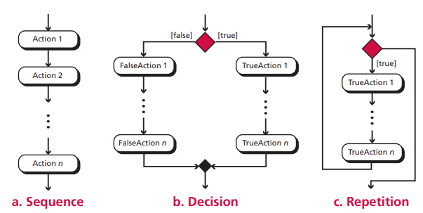
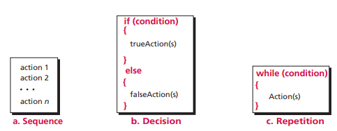
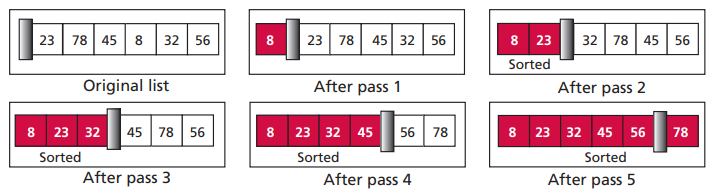
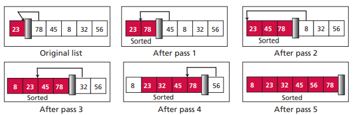
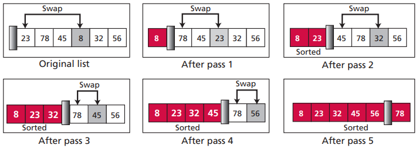
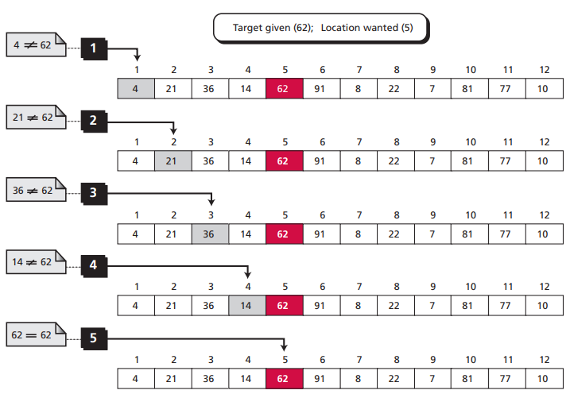
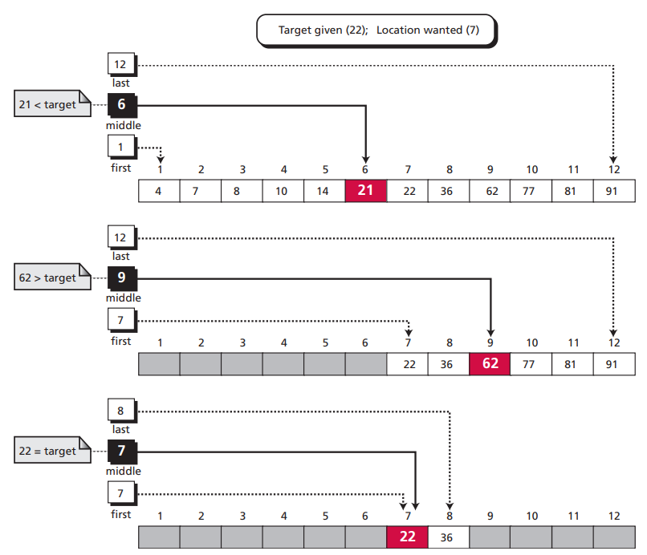

# 第八章 算法

算法是一组步骤明确的有序指令集合，它产生结果并在有限时间内终止。所有算法程序都可以只由三种基本结构组成：顺序结构、判断结构和循环结构。

通常用 UML和伪代码表示算法逻辑，真正的算法指令由不同的高级程序语言编写。

UML

伪代码

常见的算法包括排序算法和查找算法。排序算法例如冒泡排序、选择排序和插入排序。查找算法例如顺序查找和折半查找。

冒泡排序

插入排序

选择排序

顺序查找

折半查找
