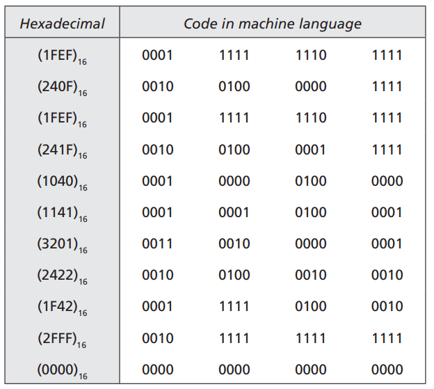
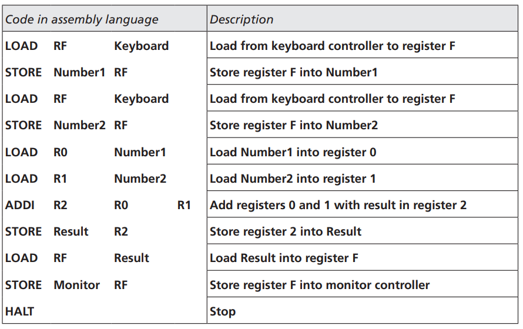
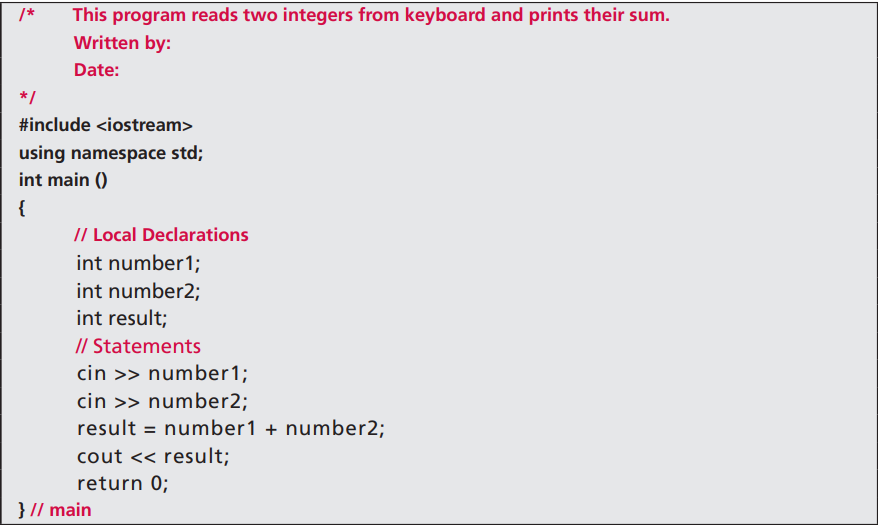
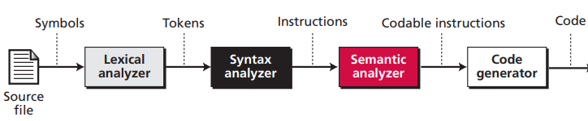
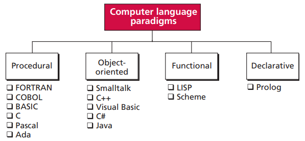
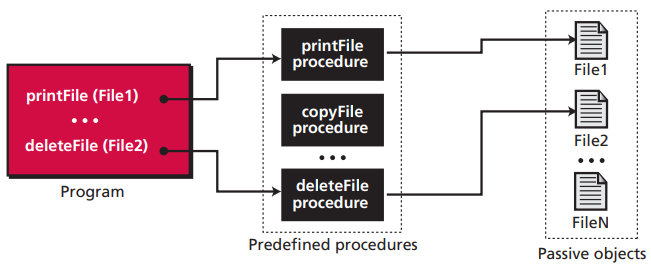
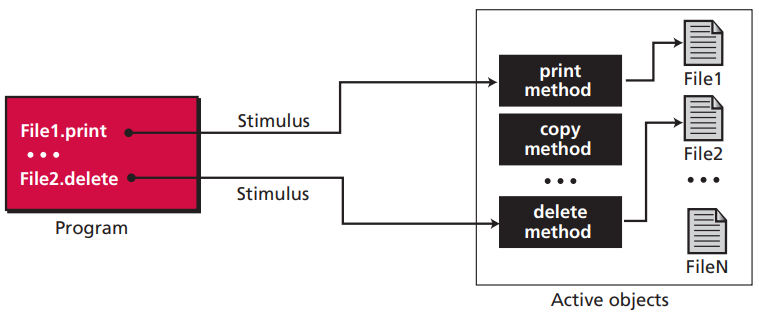
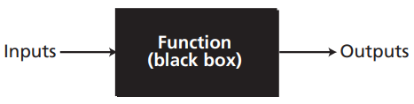

# 第九章 程序设计语言

## 9.1 演化

### 9.1.1 机器语言

在计算机早期，唯一的程序设计语言是机器语言，机器语言是计算机唯一识别的语言。但机器语言依赖于计算机的硬件且十分晦涩难懂。

将两个数字相加的一些机器语言

### 9.1.2 汇编语言

使用一些人类看的懂的助记符代替某些机器语言，这些助记符称为汇编语言。因为计算机只能识别机器语言，所以最终仍然需要借助汇编程序将汇编语言转为机器语言。

汇编语言

### 9.1.3 高级语言

高级语言定义人类能够理解的语法，让人们能够更加容易的编写程序。高级语言最终仍然需要转换成机器语言。

C 语言

## 9.2 翻译

高级语言需要翻译成为它所在的计算机能够识别的机器语言后才能被计算机识别执行。翻译往往需要借助一些外部的程序。翻译的具体过程如下：

翻译过程

1. 词法分析器

​    词法分析器一个接一个符号地读入源代码，创建源语言中的助符表。如 w, h, i, l, e 被读入后，组合起来形成 Java 中的助记符 while。

2. 语法分析器

​    语法分析器分析一组助记符，找出指令。如分析 "x", "=", "0" 后，创建赋值语言指令。

3. 语义分析器

​    语义分析器检查语法分析器创建的句子，保证没有语法错误或二义性。

4. 代码生成器

​    每条指令转化为机器语言。

### 9.2.1 编译

编译是指编译程序将高级语言一次性全部翻译成机器语言的过程。包含高级语言的源文件被编译程序编译成包含机器语言的目标文件后，供计算机执行。例如 C, C++ 等。

### 9.2.2 解释

解释是指解释程序逐行解释包含高级语言的源文件后立刻执行，不生成包含机器语言的目标文件。例如 Python 等。

有的高级语言执行过程包括编译和解释，例如 Java。Java 编译程序将 Java 源代码文件编译成字节码文件，运行时 JVM 里的解释器逐行解释成机器语言。

## 9.3 编程模式

编程模式是计算机语言看待问题的一种方式。计算机语言可以分为以下 4 种模式：

### 9.3.1 过程式模式

在过程式模式中，程序由许多过程组成。程序调用过程执行特定操作。

### 9.3.2 面向对象模式

在面向对象模式中，程序由许多类组成。程序调用类的方法执行特定操作。

### 9.3.3 函数式模式

在函数式模式中，程序被看成是一个数学函数。函数式语言会预定义一系列可供开发者调用的原始函数。

### 9.3.4 声明式模式

声明式模式依据逻辑推理的原则响应查询。

## 9.4 共同概念

大多数计算机高级语言都有一些共同的概念。

### 9.4.1 标识符

所有计算机语言都由标识符。标识符是开发时使用的名字，用于给变量、常量等命令。

### 9.4.2 数据类型

数据类型定义了一系列值及应用在这些值的一系列操作。大多数语言都定义了两种数据类型：简单数据类型和复合数据类型。

- 简单数据类型是不能分解成更小数据类型的数据类型，包括整数、实数、字符、布尔类型等。
- 复合数据类型是一组元素，每个元素可能是简单数据类型或复合数据类型。

### 9.4.3 变量

开发者定义变量后，无须知道内存单元的真实地址就可以使用内存单元。通常需要先声明变量和初始变量。

### 9.4.4 字面量

字面量是程序中使用的预定义的值。如圆周率 Pi 等。大多数高级语言中可以有整数、实数、字符和布尔字面量。

### 9.4.5 常量

常量和变量类似，不同点是赋予常量一个值后不能再更改。

### 9.4.6 输入和输出

几乎所有高级语言都需要输入和输出数据，如 C 语言中的 scanf 输入函数和 printf 输出函数。

### 9.4.7 表达式

表达式是由一系列操作数和运算符组成的一个单一数据。常见运算符有：算术运算符、关系运算符和逻辑运算符。

| 算术运算符 | 定义         | 例子     |
| ---------- | ------------ | -------- |
| +          | 加           | 3 + 5    |
| -          | 减           | 4 - 2    |
| \*         | 乘           | 4 \* 5   |
| /          | 除           | 100 / 10 |
| %          | 取余（取模） | 10 % 4   |
| ++         | 自增         | 4++      |
| --         | 自减         | 5--      |

| 关系运算符 | 定义     | 例子   |
| ---------- | -------- | ------ |
| <          | 小于     | 1 < 5  |
| <=         | 小于等于 | 2 <= 5 |
| >          | 大于     | 5 > 1  |
| >=         | 大于等于 | 5 >= 4 |
| ==         | 等于     | 5 == 5 |
| !=         | 不等于   | 5 != 6 |

| 逻辑运算符 | 定义 | 例子            |
| ---------- | ---- | --------------- |
| !          | 非   | ! true          |
| &&         | 与   | 5 >2 && 3 <4    |
| \|\|       | 或   | 5 >2 \|\| 4 > 3 |

### 9.4.8 语句

语句能使程序执行一个相应的动作，能被翻译成一条或多条指令。语句包括：赋值语句、复合语句和控制语句等。

- 赋值语句给变量赋值。
- 复合语句是一个包含若干个语句的代码块。常用 {} 包围。
- 控制语句包括顺序、判断和循环结构的语句。

### 9.4.9 子程序

子程序也称为函数或方法。主程序将一个值传入子程序中有两种方式：值传递和引用传递。