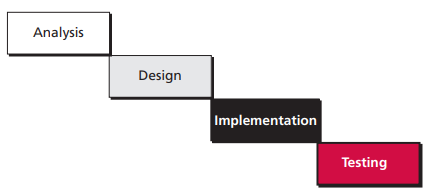
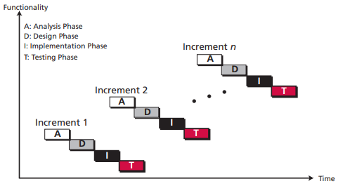
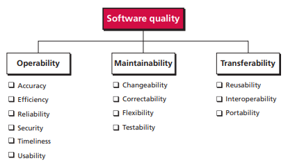

# 第十章 软件工程

## 10.1 软件生命周期

软件开发完成后不是一成不变，在使用一段时间后可能需要根据现有情况进行修改。软件被不断地使用和修改，直到软件过时。过时意味着效率低下、语言过时、需要发生重大变化或其他因素导致软件失去其有效性。

软件开发包括 4 个阶段：分析、设计、实现和测试。软件开发过程中有两种常见模型：瀑布模型和增量模型。

**瀑布模型**

在瀑布模型中，开发方向只往一个方向流动。前一个阶段不结束，后一阶段就不会开始。

**增量模型**

在增量模型中，软件开发需要经历许多个周期的更新迭代。每个周期都完成一次分析、设计、实现和测试。

## 10.2 分析阶段

开发过程始于分析阶段。分析阶段生成规格说明文档，描述软件的功能。分析阶段根据实现阶段使用的语言分为：面向过程分析和面向对象分析。

**面向过程分析**

使用数据流图、实体关系图和状态图等建模工具生成说明文档。

**面向对象分析**

使用用例图、类图和状态图等建模工具生成说明文档。

## 10.3 设计阶段

设计阶段设计如何实现软件的功能。软件的所有组成部分都被详细的定义。

**面向过程设计**

在面向过程设计中，整个系统被分解成一组过程或模块。每个模块都有对应的功能。

**面向对象设计**

设计出类的细节，例如类的属性和方法等。

## 10.4 实现阶段

具体的编码过程为实现阶段。编写的软件必须有良好的质量，通过一些标准判断软件质量，如下图。

## 10.5 测试阶段

测试阶段的目标是发现错误。

**白盒测试**

白盒测试是基于知道软件内部结构的情况下，测试软件的所有部分是否被全部设计出来。白盒测试保证至少需要满足以下 4 条标准：

- 每个模块中的所有独立的路径至少被测试过一次。
- 所有的判断结构的每个分支都被测试过。
- 每个循环都被测试。
- 所有数据结构都被测试。

**黑盒测试**

黑盒测试是在不知道软件内部结构的情况下测试。常见的黑盒测试方法有：穷尽测试、随机测试和边界值测试。

## 10.6 文档

**用户文档**

告诉用户如何一步步地使用软件，帮助用户熟悉软件的各种特性。

**系统文档**

让除原始开发人员之外的人能够维护和修改软件。分析阶段收集的信息，设计阶段用到的工具，实现阶段的代码注释，测试阶段的测试记录等都是文档记录。

**技术文档**

描述了软件的安装和服务。