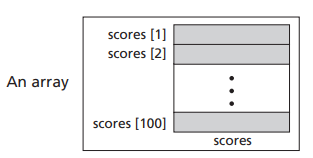
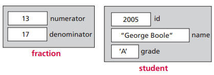
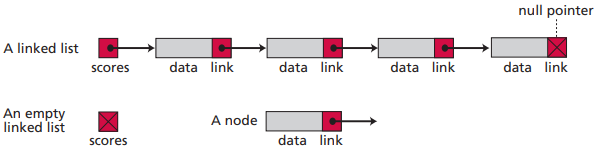

# 第十一章 数据结构

## 11.1 数组

数组是相同数据类型元素的顺序集合。索引是元素在数组中的顺序号。数组名是整个数组结构的名字，元素名是数组内每个元素的名字。例如数字名 scores，第一个元素名字 scores[0]。

数组结构

对数组的常见操作有：查找元素，插入元素，删除元素，遍历数组等。数组不适合进行大量的插入和删除，适合大量的查找。

## 11.2 记录

记录是一组相关元素的集合。这些相关元素可能是不同的数据类型。记录里的元素称为字段。通常用记录名.字段名获取元素。如 student.name 获取 student 记录中的 name 字段。

记录结构

## 11.3 链表

链表中每个元素包含数据和指向下一个元素的地址。链表上的节点称为节点。链表的头指针为链表名，头指针指向第一个节点。

链表结构

链表适合大量的插入和删除，不适合大量的查找。