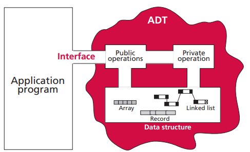
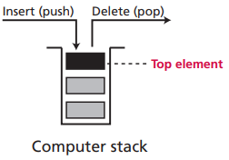
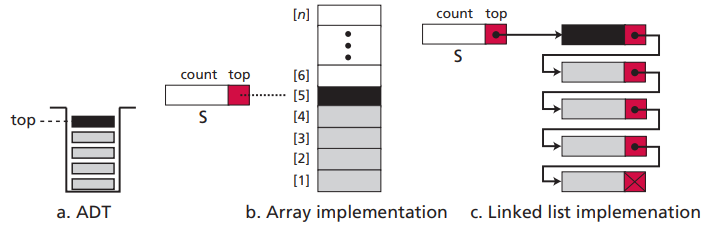
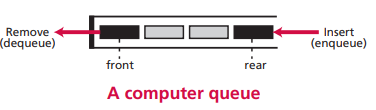
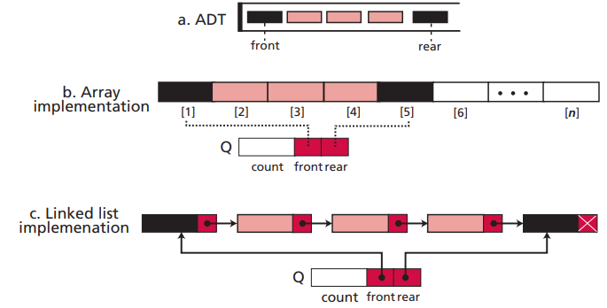
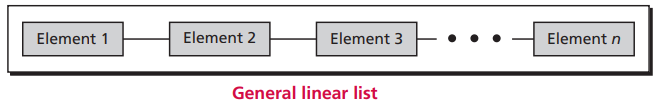
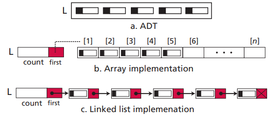
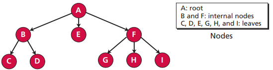
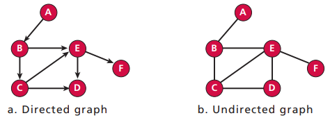

# 第十二章 抽象数据类型

数据结构和在该数据结构上的操作封装成抽象数据类型。如下图所示，应用程序只能调用抽象数据类型提供的公共接口完成操作，至于内部如何实现，应用程序并不知道。

## 12.1 栈

栈是一种限制线性表。只能在栈顶压入或弹出元素。栈的操作包括：建栈、入栈、出栈和清空。

栈的结构

数组和链表都可以实现栈。

## 12.2 队列

队列是一种限制线性表。只能在队尾插入元素，在队头删除元素。队列的操作包括：建队列、入队、出队和清空。

队列的结构

数组和链表都可以实现队列。

## 12.3 线性表

栈和队列都是限制线性表，只能在特定位置插入和删除元素。广义上的线性表没有任何限制，可以在任何位置插入和删除元素。线性表的操作包括：建表、插入、删除、查询、遍历和清空。

线性表的结构

数组和链表都可以实现线性表。

## 12.4 树

树包括一组有限的元素，称为节点。同时包括一组有限的有向线段，用来连接节点，称为弧。

树的结构

## 12.5 图

图是由一组顶点和一组顶点间的连线构成。包括有向图和无向图。

图的结构

