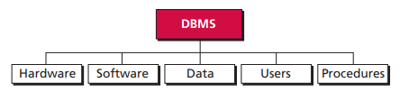
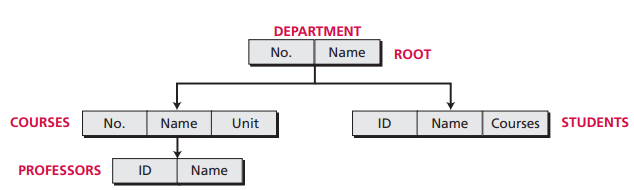
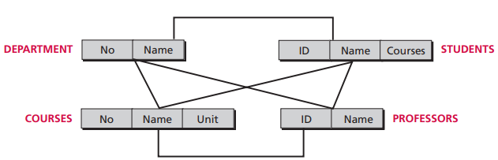
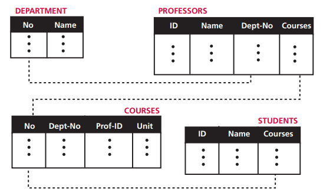

# 第十三章 数据库

数据库是逻辑一致的相关数据的集合。数据库管理系统是定义、创建和维护数据库的一种工具。DBMS 由 5 部分构成：

- 硬件：允许存取数据的真实硬件。
- 软件：允许用户存取、维护和更新物理数据的实际程序。
- 数据：数据库中的数据存储在物理存储设备上。
- 用户：从数据库获取信息的人类用户和存取数据的应用程序。

DBMS 组成

## 13.1 数据库模型

现在的数据库一般使用关系模型。

层次模型

网状模型

关系模型

关系型数据库使用结构化查询语言操作数据库。常用的操作包括：插入、删除、更新、选择、投影、连接、并、交和差。

## 13.2 范式

规范化过程定义了一组层次范式，遵守范式可以让数据库有更坚固的结构。

