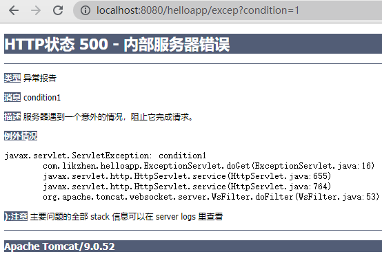
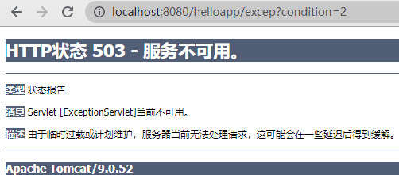

# 第四章 Servlet 技术（上）

### 3.1 Servlet API
Servlet API 主要由两个 java 包组成：javax.servlet 和 javax.servlet.http。
javax.servlet 包中定义了 Servlet 接口以及相关的通用接口和类，如接口 ServletConfig、ServletContext、RequsetDispatcher、ServletRequest、ServletResponse、Servlet 和 Generic Servlet。
javax.servlet.http 包中定义了与 HTTP 协议相关的 HttpServlet 类、HttpServletRequest 和 HttpServletResponse 接口。

### 3.2 Servlet 接口

所有 Servlet 类都必须实现 javax.servlet.Servlet 接口。此接口定义了 5 个方法，其中有 3 个由 Servlet 容器调用，容器会在 Servlet 对象生命周期的不同阶段调用特定方法：
1. init(ServletConfig config) 方法负责初始化 Servlet 对象。容器在创建好 Servlet 对象之后，就会调用该方法。
2. service(ServletRequest req, ServletResponse res) 方法负责响应客户的请求，为客户提供相应的服务。容器接收到客户端要求访问特定 Servlet 对象的请求时，就会调用该 Servlet 对象的 service 方法。
3. destory() 方法负责释放 Servlet 对象占用的资源。当 Servlet 对象结束生命周期时，容器会调用此方法。

还有 2 个返回 Servlet 信息的方法。Web 应用中的代码可以调用 Servlet 对象 的这两个方法。
1. getServletConfig() 返回一个 ServletConfig 对象，该对象包含 Servlet 对象的初始化参数信息。
2. getServletInfo() 返回一个字符串包含 Servlet 对象的创建者、版本和版权等信息。

在 Servlet API 中，javax.servlet.GenericServlet 抽象类实现了 Servlet 接口，javax.servlet.http.HttpServlet 抽象类是 GenericServlet 的子类。当用户开发自己的 Servlet 类时，可以选在 GenericSerlvet 或 HTTPServlet 抽象类。

### 3.3 GenericServlet 抽象类

GeneticServlet 抽象类实现了 Servlet、ServletConfig 和 Serializable 接口。它与任何网络应用层协议无关。

### 3.4 HttpServlet 抽象类

是 GenericServlet 类的子类。为 Servlet 接口提供了与 HTTP 协议相关的实现。在开发 Web 应用时，自定义的 Servlet 类一般都继承 HttpServlet 类。
针对不同的客户请求，HttpServlet 类提供了对应的服务方法，如 doGet()、doPost()、doPut()、doDelete() 等方法。默认实现为向客户端返回一个错误：
- 如果客户与服务器之间采用 HTTP1.1 协议通信，则返回错误HttpServletResponse.SC_METHOD_NOT_ALLOWED(响应状态码 405)
- 如果客户端与服务器之间不是采用 HTTP1.1 协议通信，返回错误 HttpServletResponse.SC_BAD_REQUEST(响应状态码 400)

对于 HttpServlet 类的具体子类，一般会针对客户端的请求方法，重写 HttpServlet 类中对应的 doXXX() 方法。

### 3.5 ServletRequest 接口

Servlet 接口的 service(ServletRequest req, ServletResponse res) 方法中有一个 ServletRequest 类型的参数，表示来自客户端的请求。当 Servlet 容器接收客户端访问特定 Servlet 对象的请求时，容器先解析客户端的原始请求数据，把它包装成一个 ServletRequest 对象，并传入 service() 方法中。
ServletRequest 接口提供了一系列用于读取客户端请求数据的方法：

- getContentLength()：返回请求正文长度。若长度未知，返回-1。
- getContentType()：返回请求正文的 MIME 类型，若类型未知，返回 null。
- getInputStream()：返回用于读取请求正文的输入流。
- getLocalAddr()：返回服务器端的 IP 地址。
- getLocalName()：返回服务器端的主机名。
- getLocalPort()：返回服务器端的 FTP 端口号。
- getParameter(String name)：根据给定的请求参数名，返回客户请求中对应的请求参数值。
- getProtoclo()：返回客户端与服务器通信所用的协议名称及版本号
- getReader()：返回读取字符串形式的请求正文的 BufferedReader 对象。
- getRemoteAddr()：返回客户端的 IP 地址。
- getRemoteHost()：返回客户端主机名。
- getRemoteHost()：返回客户端的 FTP 端口号。
- setAttribute(String name, java.lang.Object object)：在请求范围内保存一个属性，name 为属性名，object 为属性值。
- getAttribute(String name)：根据 name 参数返回请求范围内匹配的属性值。
- removeAttribute(String name)：从请求范围内删除一个属性。

### 3.6 HttpServletRequest 接口

是 ServletRequest 接口的子接口，提供了用于读取 HTTP 请求中相关信息的方法：
- getContextPath()：返回客户端所请求的 Web 应用的 URL 入口。
- getCookies()：返回 HTTP 请求中的所有 Cookie。
- getHeader(String name)：返回 HTTP 请求头部的特定项。
- getHeaderNames()：返回一个 Enumeration 对象，包含 HTTP 请求头部的所有项目名。
- getMethod()：返回 HTTP 请求方式。
- getRequestURI()：返回 HTTP 请求头第一行的 URI。
- getQueryString()：返回 HTTP 请求的查询字符串（请求参数）。
- getParts()：返回包含多个 Part 对象的集合。

### 3.7 ServletResponse 接口

Servlet 接口的 service(ServletRequest req, ServletResponse res) 方法中有一个 ServletRespinse 类型的参数，表示服务器生成的响应结果。当 Servlet 容器接收客户端访问特定 Servlet 的请求时，容器会创建一个 ServletResponse 对象，传入 service() 方法中。
ServletResponse 接口定义了一系列与生成响应结果相关的方法：
- getCharacterEncoding(String charset)：设置响应正文的字符编码。默认编码为 ISO-8859-1。
- setContentLength(int len)：设置响应正文的长度。
- setContentTType(String type)：设置响应正文的 MIME 类型。
- getCharacterEncoding()：返回响应正文的字符编码。
- getContentType()：返回响应正文的 MIME 类型。
- setBufferSize(int size)：设置用于存放响应正文数据的缓冲区大小。
- getBufferSize()：获取缓冲区大小。
- reset()：清空缓冲区的正文数据、响应状态码和响应头。
- resetBuffer()：仅仅清空缓冲区的正文数据，不清空响应状态码和响应头。
- flushBuffer()：强制把缓冲区的响应正文数据发送到客户端。
- isCommiiitted()：返回缓冲区的数据是否已经提交给客户端。
- getOutputStream()：返回一个 ServletOutputStream 对象，输出二进制的响应结果正文数据。
- getWriter()：返回一个 PrintWriter 对象，输出字符串形式的响应结果正文数据。

以下几种情况，缓冲区的数据会被发送给客户端：
1. 缓冲区数据已满，ServletOutputStream 或 PrintWriter 会自动把缓冲区内的数据发送给客户端，并清空缓冲区。
2. Servlet 调用 ServletResponse 对象的 flushBuffer() 方法。
3. Servlet 调用 ServletOutputStream 或 PrintWriter 对象的 flush() 或 close() 方法。

在 Tomcat 中，如果 Servlet 对象的 service() 方法没有调用 ServletOutputStream 或 PrintWriter 的 close() 方法。在调用完 service() 方法后，会关闭 ServletOutputStream 或 PrintWriter 对象，确保 Servlet 输出的所有数据提交给客户端。

### 3.8 HttpServletResponse 接口

是 ServletResponse 接口的子接口，提供了与 HTTP 协议相关的一些方法。
- addHeader(String name, String value)：向 HTTP 响应头中加入一项内容。
- sendError(int sc)：向客户端发送一个代表特定错误的 HTTP 响应状态码。
- sendError(int sc, String msg)：向客户端发送一个 HTTP 响应状态码和具体错误信息。
- setHeader(String name, String value)：设置 HTTP 响应头的一项内容，会覆盖已存在内容。
- setStatus(int sc)：设置 HTTP 响应状态码。
- addCookie(Cookie cookie)：向 HTTP 响应中加入一个 Cookie。

此接口还定义了表示 HTTP 响应状态码的静态常量：
HttpServletResponse.SC_BAD_REQUEST 表示响应状态码 400。
HttpServletResponse.SC_FOUND 表示响应状态码 302。
HttpServletResponse.SC_METHOD_NOT_ALLOWED 表示响应状态码 405。
HttpServletResponse.SC_NON_AUTHORITATIVE_INFORMATION 表示响应状态码 203。
HttpServletResponse.SC_FORBIDDEN 表示响应状态码 403。
HttpServletResponse.SC_NOT_FOUND 表示响应状态码 404。
HttpServletResponse.SC_OK 表示响应状态码 200。

### 3.9 ServletConfig 接口

Servlet 接口的 init(ServletConfig config) 方法有一个 ServletConfig 类型的参数。当 Servlet 容器初始化一个 Servlet 对象时，会为这个对象创建一个 ServletConfig 对象，包含 Servlet 的初始化信息。所以，Servlet 对象与 ServletConfig 对象建立联系，ServletConfig 对象与当前 Web 应用的 ServletContext 对象关联。ServletConfig 接口定义了如下方法：
- getInitParameter(String name)：根据指定初始化参数名，返回匹配的初始化参数值。
- getInitParameterNames()：返回一个 Enumeration 对象，包含所有初始化参数名。
- getServletContext()：返回一个 ServletContext 对象。
- getServletName()：返回 Servlet 对象名字，即 web.xml 中对应 <servlet> 的 <servlet-name> 的值。

每个初始化参数是一个键值对形式。在 web.xml 中配置一个 Servlet 对象时，可以用 <init-param> 元素设置初始化参数。子元素 <param-name> 设置参数名，<param-value> 设置参数值。
```xml
<servlet>
	<servlet-name>Font</servlet-name>
	<servlet-class>mypack.FontServlet</servlet-class>
	<init-param>
		<param-name>color</param-name>
		<param-value>blue</param-value>
	</init-param>
</servlet>
```
因为 GenericServlet 接口实现了 ServletConfig 接口，所有 HttpServlet 类或 GenericServlet 类及其子类都可以直接调用 ServletConfig 接口中的方法。 

### 3.10 ServletContext 接口

ServletCotext 接口是 Servlet 与 Servlet 容器之间进行通信的接口。每个 Web 应用都有唯一的 ServletContext 接口。Servlet 对象们通过 ServletContext 访问容器中的各种资源。

ServletContext 接口提供几种类型的方法：
1. **用于在 Web 应用范围内存取共享数据的方法。**
	- setAttribute(String name, java.lang.Object object)：把一个 Java 对象与一个属性名绑定，存入 ServletContext 中。
	- getAttributes(String name)：根据属性名获得属性值。
	- getAttributeNames()：返回一个 Enumeration 对象，包含所有存放在 ServletContext 中的属性名。
	- removeAttribute(String name)：移除指定属性名的参数。
2. **访问当前 Web 资源。**
	- getContextPath()：返回当前 Web 应用的 URL 入口。
	- getInitParameter(String name)：根据给定参数名，返回 Web 应用范围内的匹配初始化参数值。在 web.xml 文件中，在 <web-app> 根元素下 <context-param> 元素表示应用范围内的初始化参数。
	- getInitParameterNames()：返回一个 Enumeration 对象，包含 Web 应用范围内的所有初始化参数。
	- getServletContextName()：返回 Web 应用名字。
	- getRequestDispatcher(String path)：返回一个用于向其他 Web 组件转发请求的 RequestDispatcher 对象。
3. **访问 Servlet 容器中的其他 Web 应用。** 
	-getContext(String uripath)：根据指定 URI，返回当前 Servlet 容器中的其他 Web 应用的 ServletContext 对象。
4. **访问 Servlet 容器的相关信息**
	- getMajorVersion()：返回 Servlet 容器支持的 Java Servlet API 的主版本号。
	- getMinorVersion()：返回 Servlet 容器支持的 Java Servlet API 的次版本号。
	- getServerInfo()：返回 Servlet 容器的名字和版本。
5. **访问服务器端的文件系统资源**
	- getRealPath(String path)：根据指定的虚拟路径，返回文件系统中的真实路径。
	- getResource(String path)：返回指定路径的资源 URL。
	- getResourceAsStream(String path)：返回一个读取指定资源的输入流。
	- getMimeType(String file)：返回指定文件的 MIME 类型。
6. **输出日志**
	- log(String msg)：向 Servlet 的日志文件中写日志。
	- log(String message, java.lang.Throwable throwable)：向 Servlet 的日志文件写错误日志，以及异常的堆栈信息。

在 HttpServlet 或 GenericServlet 类及其子类中都可以直接调用 getServletContext() 方法获得当前 Web 应用的 ServletContext 对象。

### 3.11 Java Web 应用的生命周期

Web 应用的生命周期由 Servlet 容器来控制，包括三个阶段：
1. 启动阶段：加载 Web 应用的有关数据，创建 ServletContext 对象，初始化 Filter 和一些 Servlet 对象
2. 运行时阶段：为客户端提供服务
3. 终止阶段：释放 Web 应用所占用的各种资源

#### 3.11.1 启动阶段

Servlet 容器在启动 Web 应用时，会完成以下操作：
- 把 web.xml 文件中的数据加载到内存中。
- 为 Web 应用创建一个 ServletContext 对象。
- 初始化所有 Filter。
- 初始化在 Web 应用启动时就需要加载的 Servlet 对象。

#### 3.11.2 运行时阶段

所有 Servlet 对象都处于待命状态，随时可以响应客户端的特定请求，提供相应服务。若客户端请求的 Servlet 对象还不存在，Servlet 容器会先加载并初始化 Servlet 对象，然后再调用它的 service() 方法。

#### 3.11.3 终止阶段

Servlet 容器终止 Web 应用时，会完成以下操作：
- 销毁 Web 应用中所有处于运行时状态的 Servlet 对象。
- 销毁 Web 应用中所有处于运行时状态的 Filter。
- 销毁所有与 Web 应用相关的对象，如 ServletContext 对象，并释放 Web 应用所占用的资源。

#### 3.11.4 用 Tomcat 管理平台管理 Web 应用

修改 <CATALINA_HOME>/conf/tomcat-users.xml 文件，加入一个 <user> 元素。
```xml
<tomcat-users>
	<role rolename="manager-gui" />
	<user username="likezhen" password="admin1234" roles="manager-gui" /> #账户名 likezhen，密码 admin1234
</tomcat-users>
```
启动 Tomcat，打开 http://localhost:8080/manager/html，弹出验证窗口，输入账号密码，即可进入管理平台，执行启动、终止、重启、卸载 Web 应用等操作。 

### 3.12 Servlet 对象的生命周期

Web 应用的生命周期由 Servlet 容器控制，Servlet 对象作为 Web 应用的最核心组件，其生命周期也由 Servlet 容器控制。Servlet 对象的生命周期和 Web 应用一样，分成三个阶段。其中，初始化和销毁只会发生一次，因此 init() 和 destory() 方法只会被 Servlet 容器调用一次，而 service() 方法可能会被调用多次，取决于客户端请求访问 Servlet 对象的次数。

#### 3.12.1 初始化阶段

Servlet 对象初始化阶段包括四个步骤：
- Servlet 容器加载 Servlet 类，把它的 .class 文件数据加载到内存中。
- Servlet 容器创建 ServletConfig 对象，与当前 Web 应用的 ServletContext 对象关联。
- Servlet 容器创建 Servlet 对象。
- Servlet 容器调用 Servlet 对象的 init(ServletConfig config) 方法，建立 Servlet 对象与 ServletConfig 对象的联系。Servlet 对象调用 getServletContext() 方法就能获得当前 Web 应用的 ServletContext 对象。

#### 3.12.2 运行时阶段

在运行时阶段，Servlet 对象可以随时响应客户端的请求。Servlet 容器接收要求访问特定 Servlet 对象的请求，创建针对这个请求的 ServletRequest 对象和 ServletResponse 对象，调用相应 Servlet 对象的 service(ServletRequest req, ServletResponse res) 方法。当 Servlet 容器把响应结果发送给客户后，Servlet 容器会销毁 ServeletRequest 对象和 ServletResponse 对象。

#### 3.12.3 销毁阶段

当 Web 应用被终止时，Servlet 容器会先调用 Web 应用中所有 Servlet 对象的 destory() 方法，释放 Servlet 占用的资源（如关闭文件输出输入流，关闭数据库连接等），再销毁这些 Servlet 对象和 ServletConfig 对象。

### 3.13 Servlet 的服务方法抛出异常

Servlet 接口的 service() 方法抛出两个异常：
- ServletException：表示当 Servlet 进行常规操作时出现的异常。
- IOException：表示当 Servlet 进行 I/O 操作时出现的异常。

ServletException 有一个子类 UnavailableException，表示无法访问当前 Servlet 的异常。如果 Servlet 由于内存不足或无法访问第三方服务器等情况时可以抛出这种异常。抛出的异常由 Servlet 容器捕获，捕获之后向客户端发送相应的错误信息。


没有报错


抛出 ServletException 异常




抛出 2 秒内不能访问该 Servlet 的异常




抛出不访问该 Servlet 的异常，除非重启 Web 应用


### 3.14 Web 应用范围与请求范围

**Web 应用范围**与 ServletContext 对象的生命周期对应。Web 应用范围内的共享数据作为 ServletContext 对象的属性，通过 set|getAttribute() 来存取共享数据。Web 组件共享同一个 ServletContext 对象，就能共享 Web 应用范围内的共享数据。
**请求范围**与 ServletRequest 对象和 ServletResponse 对象的生命周期对应。Servlet 容器每接收到一个客户请求，就会创建一个 ServletRequest 对象和 ServletResponse 对象，并传入 service() 方法中。待容器把本次请求的响应结果返回给客户时，ServletRequest 对象和 ServletResponse 对象就被销毁。请求范围内的共享数据作为 ServletRequest 对象的属性，通过 set|getAttribute() 来存取共享数据。当存在转发或包含时，Web 组件共享同一个 ServletRequest 对象和 ServletResponse 对象，就能共享请求范围内的共享数据。

