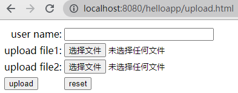
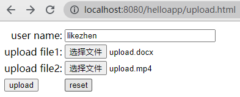
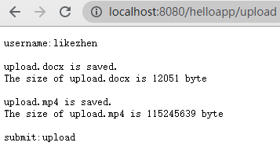

# 第五章 Servlet 技术（下）

### 5.1 下载文件

下载文件是把服务器端的文件发送给客户端。当用户访问 http://localhost:8080/helloapp/download?filename=1.txt 时，会下载 1.txt 文件。源代码如下

```java
@WebServlet(name="DownloadServlet", value = "/download")
public class DownloadServlet extends HttpServlet {
    @Override
    protected void doGet(HttpServletRequest request, HttpServletResponse response) throws ServletException, IOException {
        OutputStream out;
        InputStream in;
        String filename = request.getParameter("filename");

        if (filename == null) {
            out = response.getOutputStream();
            out.write("please input filename.".getBytes());
            out.close();
            return;
        }

        in = getServletContext().getResourceAsStream("/resource/" + filename);
        int length = in.available();

        response.setContentType("application/force-download");
        response.setHeader("Content-Length", String.valueOf(length));
        response.setHeader("Content-Disposition", "attachment;filename=\"" + filename + "\" ");

        out = response.getOutputStream();
        int bytesRead = 0;
        byte[] buffer = new byte[512];
        while ((bytesRead = in.read(buffer)) != -1) {
            out.write(buffer, 0, bytesRead);
        }
        in.close();
        out.close();
    }
}
```

### 5.2 上传文件

上传文件是把客户端的文件发送到服务端。当客户端向服务器上传文件时，客户端发送的 HTTP 请求正文采用 "multipart/form-data" 数据类型，表示多个部分的复杂复合表单。不管是何种数据类型，Servlet 容器都会把 HTTP 请求包装成一个 HttpServletRequest 对象 ，可以利用现成的类库进行处理。如 Apache 提供的 fileupload 和 I/O 软件包，或 Servlet API 中的 Part 接口。
利用 Servlet 的 Part 接口，复合表单中的每个子部分被视为一个 Part 对象。Part 提供了读取子部分各种信息的方法。
- getHeader(String name)：根据参数名，读取子部分的请求头中指定参数值。
- getContextType()：读取请求正文数据类型。
- getSize()：读取请求正文长度，单位为字节。
- getName()：读取子部分名字，和 HTML 表单中 <input> 元素的 name 属性对应。
- getSubmittedFileName()：获取子部分的文件名
- write(String filename)：把请求正文写到指定文件中。




```html
<!DOCTYPE html>
<html lang="en">
<head>
    <meta charset="UTF-8">
    <title>upload</title>
</head>
<body>
    <!--提交表单后，由 URL helloapp/upload 映射的 UploadServlet 类处理表单数据。-->
<form name="uploadForm" method="post" enctype="multipart/form-data" action="upload">
    <table>
        <tr>
            <td><div align="right">user name:</div></td>
            <td><input type="text" name="username" size="30"></td>
        </tr>
        <tr>
            <td><div align="right">upload file1:</div></td>
            <td><input type="file" name="file1" size="30"></td>
        </tr>
        <tr>
            <td><div align="right">upload file2:</div> </td>
            <td><input type="file" name="file2" size="30"></td>
        </tr>
        <tr>
            <td><input type="submit" name="submit" value="upload"></td>
            <td><input type="reset" name="reset" value="reset"></td>
        </tr>
    </table>
</form>
</body>
</html>
```

```java
/*处理上传文件请求的 Servlet 请求*/
@WebServlet(name = "UploadServlet", value = "/upload")
@MultipartConfig
public class UploadServlet extends HttpServlet {
    @Override
    protected void doPost(HttpServletRequest request, HttpServletResponse response) throws ServletException, IOException {
        //设置响应头类型
        response.setContentType("text/plain");

        //设置保存文件路径
        String savePath = request.getServletContext().getRealPath("/resource");
        PrintWriter out = response.getWriter();
        //获取正文表单数据，放到 Part 对象集合中
        Collection<Part> parts = request.getParts();
        for (Part part : parts) {
            String type = part.getContentType();
            long size = part.getSize();
            String name = part.getName();
            String header = part.getHeader("content-disposition");
            //在 Tomcat 服务器上显示每个子部分的信息
            System.out.println("----Part----");
            System.out.println("type: " + type);
            System.out.println("size: " + size);
            System.out.println("name: " + name);
            System.out.println("header: " + header);

            //如果子部分为普通表单域，向客户端发送名字和取值
            if (type == null) {
                String value = request.getParameter(name);
                out.println(name + ":" + value + "\r\n");
                //如果子部分为 file1 和 file2 文件域，保存上传文件
            } else if (name.indexOf("file") != -1) {
                String filename = part.getSubmittedFileName();
                part.write(savePath + File.separator + filename);
                //保存完毕，向客户端发送反馈信息
                out.println(filename + " is saved.");
                out.println("The size of " + filename + " is " + size + " byte\r\n");
            }
        }
        out.close();
    }
}
```


Tomcat 服务器控制台输出信息。

```dos
----Part----
type: null
size: 8
name: username
header: form-data; name="username"
----Part----
type: application/vnd.openxmlformats-officedocument.wordprocessingml.document
size: 12051
name: file1
header: form-data; name="file1"; filename="upload.docx"
----Part----
type: video/mp4
size: 115245639
name: file2
header: form-data; name="file2"; filename="upload.mp4"
----Part----
type: null
size: 6
name: submit
header: form-data; name="submit"
```

### 5.3 动态生成图像


