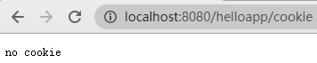
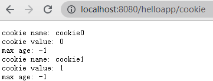

# 第五章 Servlet 技术（下）

### 5.1 下载文件

下载文件是把服务器端的文件发送给客户端。当用户访问 http://localhost:8080/helloapp/download?filename=1.txt 时，会下载 1.txt 文件。源代码如下

```java
/*处理下载文件请求的 Servlet 类*/
@WebServlet(name="DownloadServlet", value = "/download")
public class DownloadServlet extends HttpServlet {
    @Override
    protected void doGet(HttpServletRequest request, HttpServletResponse response) throws ServletException, IOException {
        //创建输入输出流
        OutputStream out;
        InputStream in;
        //获取请求参数值
        String filename = request.getParameter("filename");

        if (filename == null) {
            out = response.getOutputStream();
            out.write("please input filename.".getBytes());
            out.close();
            return;
        }
        
		//读取服务器上 Web 应用 helloapp/resource/ 目录下的文件
        in = getServletContext().getResourceAsStream("/resource/" + filename);
        int length = in.available();

        //设置响应类型为强制下载
        response.setContentType("application/force-download");
        response.setHeader("Content-Length", String.valueOf(length));
        response.setHeader("Content-Disposition", "attachment;filename=\"" + filename + "\" ");

        //通过输入输出流传输文件
        out = response.getOutputStream();
        int bytesRead = 0;
        byte[] buffer = new byte[512];
        while ((bytesRead = in.read(buffer)) != -1) {
            out.write(buffer, 0, bytesRead);
        }
        in.close();
        out.close();
    }
}
```

### 5.2 上传文件

上传文件是把客户端的文件发送到服务端。当客户端向服务器上传文件时，客户端发送的 HTTP 请求正文采用 "multipart/form-data" 数据类型，表示多个部分的复杂复合表单。不管是何种数据类型，Servlet 容器都会把 HTTP 请求包装成一个 HttpServletRequest 对象 ，可以利用现成的类库进行处理。如 Apache 提供的 fileupload 和 I/O 软件包，或 Servlet API 中的 Part 接口。
利用 Servlet API 的 Part 接口，复合表单中的每个子部分被视为一个 Part 对象。Part 提供了读取子部分各种信息的方法。
- getHeader(String name)：根据参数名，读取子部分的请求头中指定参数值。
- getContextType()：读取请求正文数据类型。
- getSize()：读取请求正文长度，单位为字节。
- getName()：读取子部分名字，和 HTML 表单中 <input> 元素的 name 属性对应。
- getSubmittedFileName()：获取子部分的文件名
- write(String filename)：把请求正文写到指定文件中。


```html
<!DOCTYPE html>
<html lang="en">
<head>
    <meta charset="UTF-8">
    <title>upload</title>
</head>
<body>
    <!--提交表单后，由 URL helloapp/upload 映射的 UploadServlet 类处理表单数据。-->
<form name="uploadForm" method="post" enctype="multipart/form-data" action="upload">
    <table>
        <tr>
            <td><div align="right">user name:</div></td>
            <td><input type="text" name="username" size="30"></td>
        </tr>
        <tr>
            <td><div align="right">upload file1:</div></td>
            <td><input type="file" name="file1" size="30"></td>
        </tr>
        <tr>
            <td><div align="right">upload file2:</div> </td>
            <td><input type="file" name="file2" size="30"></td>
        </tr>
        <tr>
            <td><input type="submit" name="submit" value="upload"></td>
            <td><input type="reset" name="reset" value="reset"></td>
        </tr>
    </table>
</form>
</body>
</html>
```

```java
/*处理上传文件请求的 Servlet 类*/
@WebServlet(name = "UploadServlet", value = "/upload")
@MultipartConfig
public class UploadServlet extends HttpServlet {
    @Override
    protected void doPost(HttpServletRequest request, HttpServletResponse response) throws ServletException, IOException {
        //设置响应头类型
        response.setContentType("text/plain");

        //设置保存文件路径
        String savePath = request.getServletContext().getRealPath("/resource");
        PrintWriter out = response.getWriter();
        //获取正文表单数据，放到 Part 对象集合中
        Collection<Part> parts = request.getParts();
        for (Part part : parts) {
            String type = part.getContentType();
            long size = part.getSize();
            String name = part.getName();
            String header = part.getHeader("content-disposition");
            //在 Tomcat 服务器上显示每个子部分的信息
            System.out.println("----Part----");
            System.out.println("type: " + type);
            System.out.println("size: " + size);
            System.out.println("name: " + name);
            System.out.println("header: " + header);

            //如果子部分为普通表单域，向客户端发送名字和取值
            if (type == null) {
                String value = request.getParameter(name);
                out.println(name + ":" + value + "\r\n");
                //如果子部分为 file1 和 file2 文件域，保存上传文件
            } else if (name.indexOf("file") != -1) {
                String filename = part.getSubmittedFileName();
                part.write(savePath + File.separator + filename);
                //保存完毕，向客户端发送反馈信息
                out.println(filename + " is saved.");
                out.println("The size of " + filename + " is " + size + " byte\r\n");
            }
        }
        out.close();
    }
}
```


Tomcat 服务器控制台输出信息。

```dos
----Part----
type: null
size: 8
name: username
header: form-data; name="username"
----Part----
type: application/vnd.openxmlformats-officedocument.wordprocessingml.document
size: 12051
name: file1
header: form-data; name="file1"; filename="upload.docx"
----Part----
type: video/mp4
size: 115245639
name: file2
header: form-data; name="file2"; filename="upload.mp4"
----Part----
type: null
size: 6
name: submit
header: form-data; name="submit"
```

### 5.3 读写 Cookie

Cookie 的运行机制由 HTTP 协议规定。Web 服务器为了支持 Cookie，需要在 HTTP 响应结果中添加 Cookie 数据，并能够解析 HTTP 请求中的 Cookie 数据。浏览器为了支持 Cookie，需要解析 HTTP 响应结果中的 Cookie 并保存到本地硬盘上。发送 HTTP 请求时，从本地硬盘读取 Cookie 数据，添加到请求中。
Servlet 无需直接与 HTTP 请求或响应中的原始 Cookie 数据打交道，这项工作由 Servlet 容器完成。javax.servlet.http.Cookie 类表示 Cookie，每个 Cookie 对象包含 Cookie 名和 Cookie 值。Cookie 对象提供以下常用方法。
set|getName()：设置|获取 Cookie 名。
set|getValue()：设置|获取 Cookie 值。
set|getMaxAge(int expiry)：设置|获取 Cookie 有效期，默认值 -1。
	- expiry > 0 时，浏览器保存 Cookie 到本地硬盘，Cookie 有效期为 expiry 秒。
	- expiry = 0 时，浏览器删除当前 Cookie
	- expiry < 0 时，Cookie 仅存在于浏览器进程中，不保存在本地硬盘
	- set|getPath(String path)：设置|获取 Cookie 共享范围（仅限于同一服务器上的 Web 应用）。
	- set|getDomain(String domain)：设置|获取 Cookie 共享范围。
```java
//读写 Cookie 的 Servlet 类
@WebServlet(name = "CookieServlet", value = "/cookie")
public class CookieServlet extends HttpServlet {
    int count = 0;

    @Override
    protected void doGet(HttpServletRequest request, HttpServletResponse response) throws ServletException, IOException {

        response.setContentType("text/plain");
        PrintWriter out = response.getWriter();

        //获取 HTTP 请求中的所有 Cookie
        Cookie[] cookies = request.getCookies();
        if (cookies != null) {
            for (int i = 0; i < cookies.length; i++) {
                out.println("cookie name: " + cookies[i].getName());
                out.println("cookie value: " + cookies[i].getValue());
                out.println("max age: " + cookies[i].getMaxAge());
            }
        } else {
            out.println("no cookie");
        }

        //向客户端写一个 Cookie
        response.addCookie(new Cookie("cookie" + String.valueOf(count), String.valueOf(count)));
        count++;
    }
}
```
第一次访问 CookieServlet 对象时，浏览器不存在任何 Cookie，所以 CookieServlet 在响应结果中返回 no cookie，并添加一个 cookie0 对象。

第二次访问 CookieServlet 对象时，浏览器进程中已经有 cookie0 对象，所以发出的 HTTP 请求中包含 cookie0 对象。CookieServlet 对象在响应结果中返回 cookie 对象的名字和取值，并再添加一个 cookie1 对象。

第三次浏览器发送的 HTTP 请求中包含 cookie0 和 cookie1 对象。


假设在 Tomcat 服务器 A 上有两个 Web 应用 app1 和 app2，另一台 Tomcat 服务器 B 上有一个 app3 Web 应用。浏览器访问这些 Web 应用时，默认情况下，出于安全的原因，app1 的 cookie 不能被 app2 和 app3 访问到。setPath(String path) 和 setDomain(String domain) 方法可以改变 Cookie 共享范围。
若处于同一台 Tomcat 服务器上时，用 setPath() 方法共享 Cookie。
```java
Cookie cookie = new Cookie("username","Tom");
cookie.setPath("/"); //Tomcat 服务器 A 上的所有 Web 应用都可以访问此 cookie
cookie.setPath("/app2/"); //只有 Tomcat 服务器 A 上的 app2 应用可以访问此 cookie
cookie.setPath("/app1/sub/"); //只有 Tomcat 服务器 A 上的 app1 应用 sub 目录下的 Servlet （或其他 Web 组件）可以访问到此 cookie
```
若处于不同 Tomcat 服务器上时，用 setDomain() 方法共享 Cookie。假设 Tomcat 服务器 B 的域名为 www.cat.com。
```java
Cookie cookie = new Cookie("username","Tom");
cookie.setDomain(".cat.com"); // Tomcat 服务器 B 上的所有 Web 应用都可以访问 Tomcat 服务器 A 上的此 cookie
cookie.setPath("/app3/") //只有 app3 应用可以访问此 cookie
```

### 5.4 防止页面被客户端缓存

许多浏览器会缓存服务器端的网页，用户多次请求服务器的同一网页时，浏览器直接从缓存中获取该网页，不需要再访问远程服务器上的网页。浏览器端的缓存技术适合于保存服务器端的静态页面，以及不包含敏感数据的页面。在以下场合中，服务器端往往不希望页面被缓存：
- 网页中包含随时更新的动态内容。
- 网页中包含敏感数据，如银行账户信息、电子邮件内容、支付信息等。

服务器端设置 HTTP 响应头来禁止客户端缓存网页。
```java
response.addHeader("Prahma","no-cache"); //适合采用 HTTP/1.0 的浏览器
response.setHeader("Cache-Control","no-cache"); //适合采用 HTTP/1.1 的浏览器
response.setHeader("Expires","0); //所有浏览器都支持
```

### 5.5 处理 HTTP 请求参数中的中文字符编码

有的浏览器采用中文字符编码传送包含中文的请求参数，服务器端会接收到采用正确编码的请求参数。有的浏览器采用 ISO-8859-1 对中文请求参数编码，服务器端可能会接收到乱码。

POST 请求参数位于请求正文中，以下方法可以设置请求正文的编码方式。
```java
//方式一
request.setCharacterEncoding("GBK");
//方式二
ServletContext servletContext = request.getServletContext();
servletContext.setRequestCharacterEncoding("UTF-8");
```
GET 请求参数位于请求头中，对获取到的请求参数，进行字符编码转换，从 ISO-8859-1 转成 GBK 或 UTF-8。
```java
String username = request.getParameter("username");
if(username!=null){
username=new String(username.getBytes("ISO8859-1"),"GBK");
}
```
在 server.xml 配置文件中对连接器进行配置，服务器就会自动把请求参数转为为 UTF-8 编码。
```xml
<Connector port="8080" protocol="HTTP/1.1"
	connectionTimeout="20000"
	redirectPort="8443" URIEncoding="UTF-8" />
```

### 5.6 转发与包含

Web 应用在响应客户端的一个请求时，可能需要多个 Web 组件协作才能生成响应结果。尽管一个 Servlet 对象无法直接调用另一个 Servlet 对象的 service() 方法，但通过转发或包含，多个 Web 组件可以协作。

请求转发：Servlet（源组件）先对客户请求做一些预处理操作，然后把请求转发给其它 Web 组件（目标组件）来完成包括生成响应结果在内的后续操作。
包含：Servlet（源组件）把其他 Web 组件（目标组件）生成的响应结果纳入自身的响应结果中。

请求与转发共同点：
- 源组件与目标组件处理的是同一个客户请求，源组件与目标组件共享一个 ServletRequest 对象和 ServletResponse 对象。
- 目标组件可以是 Servlet、JSP 或 HTML 文档。
- 都依赖 javax.servlet.RequestDispatcher 接口。

javax.servlet.RequestDispatcher 接口提供两个方法：
- forward()：把请求转发给目标组件
- include()：包含目标组件的响应结果

通过 ServletContext 或 ServletRequest 的 getRequestDispatcher(String path) 方法获得 RequestDispatcher 对象。

#### 5.6.1 转发

DispatcherServlet1 对象接收请求参数 username，根据请求参数创建 message 字符串，保存到请求范围中，将请求转发给 DispatcherServlet2 对象。DispatcherServlet2 对象读取请求范围中的 message 字符串，并作为响应结果返回给客户端。

```java
//读取请求参数，并转发给 DispatcherServlet2
@WebServlet(name = "DispatcherServlet1", value = "/check")
public class DispatcherServlet1 extends HttpServlet {
    @Override
    public void service(ServletRequest req, ServletResponse res) throws ServletException, IOException {
        String username = req.getParameter("username");
        String message = null;
        if (username == null) {
            message = "please input username";
        } else {
            message = "hello, " + username;
        }

        req.setAttribute("msg", message);
/*获取 RequestDispatcher 对象的两种方式*/
        //方式一，path 只能为绝对路径
//        ServletContext servletContext = req.getServletContext();
//        RequestDispatcher dispatcher = servletContext.getRequestDispatcher("/sub/output");
        //方式二，path 可以为绝对路径或相对路径
//        RequestDispatcher dispatcher = req.getRequestDispatcher("/sub/output"); //绝对路径
        RequestDispatcher dispatcher = req.getRequestDispatcher("sub/output"); //相对路径

        PrintWriter out = res.getWriter();

        //向客户端的响应结果和服务器的控制台上输出信息
        out.println("转发之前client");
        System.out.println("转发之前server");

//        out.close(); //在请求转发之前响应结果已提交给客户端，forward() 方法会抛出 java.lang.IllegalStateException 异常
        dispatcher.forward(req, res);

        //向客户端的响应结果和服务器的控制台上输出信息
        out.println("转发之后client");
        System.out.println("转发之后server");
    }
}
```
执行 forward() 方法时，将进行如下步骤：
- 清空用于存放响应正文数据的缓冲区。因此源组件生成的响应结果不会被发送到客户端，只有源组件的响应结果才会被发送到客户端。如果在请求转发之前，响应结果已被提交都客户端，那么 forward() 方法会抛出 java.lang.IllegalStateException 异常。
- 如果目标组件为 Servlet 或 JSP 时，调用其 service() 方法，把该方法的响应结果发送到客户端。如果目标组件为静态 HTML 文档，则直接将 HTML 文档发送给客户端。
- 源组件在 forward() 方法之后的代码依旧正常执行。

```java
//接收 DispatcherServlet1 对象的请求转发
@WebServlet(name = "DispatcherServlet2", value = "/sub/output")
public class DispatcherServlet2 extends GenericServlet {
    @Override
    public void service(ServletRequest req, ServletResponse res) throws ServletException, IOException {
    	//获得请求范围中的 message 字符串
        String message = (String) req.getAttribute("msg");
		//生成响应结果返回给客户端
        PrintWriter out = res.getWriter();
        out.println(message);
        out.close();
    }
}
```
#### 5.6.2 包含

DispatcherServlet3 对象把 greeting.html 的内容、DispatcherServlet4 对象的响应正文包含到自身的响应结果中。

```java
//包含 greeting.html 内容和 DispatcherServlet4 对象的响应正文
@WebServlet(name = "DispatcherServlet3", value = "/main")
public class DispatcherServlet3 extends HttpServlet {
    @Override
    protected void doGet(HttpServletRequest request, HttpServletResponse response) throws ServletException, IOException {

        response.setContentType("text/html");

        PrintWriter out = response.getWriter();
        out.println("<html><head><title>main</title></head>");
        out.println("<body>");

        ServletContext servletContext = request.getServletContext();
        //获取 RequestDispatcher 对象
        RequestDispatcher htmlDispatcher = servletContext.getRequestDispatcher("/greeting.html");
        RequestDispatcher servletDispatcher = servletContext.getRequestDispatcher("/DispatcherServlet4");

        //包含 greeting.html 内容
        htmlDispatcher.include(request, response);
        out.println("<hr/>");
        //包含 DispatcherServlet4 对象响应正文
        servletDispatcher.include(request, response);
        out.println("<hr/>");
        //自身的响应结果
        out.println("<h5>Dispatcher3</h5>");
        out.println("</body></html>");
        out.close();
    }
}
```
执行 include() 方法时，将进行如下步骤：
- 如果目标组件为 Servlet 或 JSP 时，调用其 service() 方法，把该方法的响应正文添加到源组件的响应结果中。如果目标组件为静态 HTML 文档，则直接将 HTML 文档添加到响应结果中。
- 返回源组件的 service() 方法中，继续执行后续代码。

```java
//响应正文包含到 DispatcherServlet3 对象中
@WebServlet(name = "DispatcherServlet4", value = "/DispatcherServlet4")
public class DispatcherServlet4 extends HttpServlet {
    @Override
    protected void doGet(HttpServletRequest request, HttpServletResponse response) throws ServletException, IOException {
        PrintWriter out = response.getWriter();
        out.println("from DispatcherServlet4.java");
        //不要在目标组件中关闭输出流，否则源组件的输出流也关闭，可能中断后续的响应结果，当前源组件的响应结果就直接返回给客户端
    }
}
```
```html
<!--greeting.html 文件内容-->
<h1>greeting!</h1>
```

### 5.7 重定向


