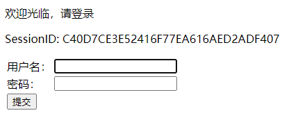
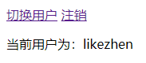
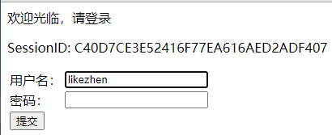
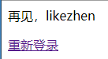
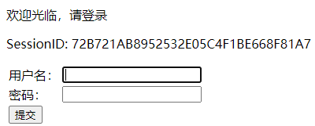

# 第八章 HTTP 会话使用与管理

### 8.1 会话简介

HTTP 是无状态的协议，没有提供连续跟踪特定浏览器端状态的规范。当不同客户端使用相同的 HTTP 请求时，服务器无法通过请求区分每个客户端。为了区分客户端，跟踪客户端的状态，通常使用以下四种方法：

- 在 HTML 表单中加入隐藏字段，包含着跟踪客户端状态的数据。
- 重写 URL，使其包含跟踪客户端状态的数据。
- 用 Cookie 来传送跟踪客户端状态的数据。
- 使用会话机制。

会话是指在一段时间内，单个客户与 Web 应用的一连串相关的交互过程。Servlet 规范指定了基于 Java 的具体运作机制。由 javax.servlet.HttpSession 接口定义，Servlet 容器实现此接口。
当一个会话开始时，Servlet 容器将创建一个 HttpSession 对象，在此对象中可以存放表示客户状态的信息。每个 HttpSession 对象都被分配一个唯一的标识符，称为 SessionID。SessionID 作为 Cookie 添加到 HTTP 响应结果中，浏览器会把包含 SessionID 的 Cookie 保存在客户端。

### 8.2 HttpSession 的生命周期及会话范围

会话范围与 HttpSession 对象的生命周期对应。Web 组件只要共享同一个 HttpSession 对象，也能共享会话范围内的共享数据。HttpSession 对象提供以下方法。
- getId()：获取 SessionID。
- invalidate()：销毁当前会话，释放 HttpSession 对象占用的资源
- setAttribute(String name, Object value)：将一个键值对保存在 HttpSession 对象中。
- getAttribute(String name)：根据指定属性名获取会话范围中的对应属性值。
- getAttributenames()：返回会话范围中的所有属性名。
- removeAttribute(String name)：移除会话范围中指定属性名的属性值
- isNew()：判断是否为新创建的会话。
- setMaxInactiveInterval(int interval)：设定会话有效期（秒）。超过时间自动销毁会话。负值代表会话永不过期。
- getMaxInactiveInterval()：获取会话有效期，秒为单位。
- getServletContext()：返回会话所属的 Web 应用的 SevletContext 对象。

以下情况会开始一个新会话，即 Servlet 容器会创建一个新的 HttpSession 对象。
- 一个浏览器进程第一个访问 Web 应用中支持会话的网页。
- 浏览器进程与 Web 应用的一次会话已被销毁后，浏览器进程再次访问 Web 应用中支持会话的网页。

以下情况会销毁会话，即 Servlet 容器会销毁 HttpSession 对象，释放共享资源。
- 客户端的浏览器进程中止。
- 执行 HttpSession 对象的 invalidate() 方法。
- 会话过期。

当 Tomcat 服务器中的 Web 应用终止时，不会销毁会话，而是将会话保存在存储设备中。

### 8.3 JSP 使用会话

JSP 文件默认支持会话。login.jsp、check.jsp 和 logout.jsp 三个文件模拟一个会话过程。

```jsp
<%--使用会话的 JSP，用于登录。之后跳转到 check.jsp 页面--%>
<%@ page contentType="text/html;charset=UTF-8" %>
<html>
<head><title>登录</title></head>
<body>
<%
    String name = "";
    if (!session.isNew()) {
        name = (String) session.getAttribute("username");
        if (name == null) name = "";
    }
%>
<p>欢迎光临，请登录</p>
<p>SessionID: <%=session.getId()%></p>
...
```
```jsp
<%--从会话范围内获取用户名，存放到会话范围内--%>
<%@ page contentType="text/html;charset=UTF-8" language="java" %>
<html>
<head><title>验证</title></head>
<body>

<%
    String name = null;
    name = request.getParameter("username");
    if (name != null) {
        session.setAttribute("username", name);
    } else {
        name = (String) session.getAttribute("username");
        if (name == null) response.sendRedirect("login.jsp");
    }
%>

<a href="login.jsp">切换用户</a>
<a href="logout.jsp">注销</a>
<p>当前用户为：<%=name%>
</p>
</body>
</html>
```

```jsp
<%--退出登录，销毁会话--%>
<%@ page contentType="text/html;charset=UTF-8" language="java" %>
<html>
<head><title>注销</title></head>
<body>
<%
    String name = (String) session.getAttribute("username");
    session.invalidate();
%>

<p>再见，<%=name%></p>
<a href="login.jsp">重新登录</a>

</body>
</html>
```

客户端首次访问 login.jsp 时，HTTP 请求中的 Cookie 中没有 SessionID，Servlet 容器会创建一个新的会话，并显示 SessionID。




当提交后，转到 check.jsp 。check.jsp 获取请求参数中的用户名，放入会话范围内。



当点击切换用户时，login.jsp 从会话范围中获取用户名，填入表单中。



在 logout.jsp 进行注销，注销后当前会话对象被销毁。



点击重新登录，Servlet 容器会创建一个新的会话对象。




### 8.4 Servlet 使用会话

JSP 文件默认支持会话，HttpServlet 类默认不支持会话。JSP 通过 session 固定引用变量获得 HttpSession 对象，HttpServlet 类通过 HttpServletRequest 对象来获得 HttpSession 对象。
- getSession()：若会话存在，获得当前 HttpSession 对象，若不存在，则创建一个新会话。
- getSession(boolean create)：若参数为 true，等价于 getSession() 方法。若参数为 false，会话存在则返回会话对象，否则返回 null。

在 Servlet 中，需要手动获取 HttpSession 对象，其余和 JSP 中的无区别。
```java
//获取 HttpSession 对象
HttpSession session = req.getSession();
```

### 8.5 重写 URL

Servlet 容器在客户端浏览器中保存一个 SessionID，之后浏览器发出的 HTTP 请求就会包含这个 SessionID。Servlet 容器读取 SessionID 就能判断出不同的浏览器请求。这一过程称为跟踪会话。
如果浏览器端支持 Cookie，Servlet 容器就把 SessionID 保存在 Cookie 中。如果浏览器端禁用 Cookie，Servlet 容器无法把 SessionID 保存在 Cookie 中，无法跟踪会话。为了解决禁用 Cookie 导致的问题，Servlet 容器可以重写 Web 组件的 URL，把 SessionID 添加到 URL中。HttpServletResponse 对象提供了重写 URL 的方法：

- encodeURL(String url)

```
修改前
<a href="login.jsp">切换用户</a>
修改后
<a href="<%=response.encodeURL('login.jsp')">切换用户</a>
```
encodeURL() 方法运行流程如下：
1. 判断当前 Web 组件是否支持会话，不支持会话则直接使用原参数。
2. 若支持会话，再判断浏览器是否支持 Cookie。若浏览器支持 Cookie，则直接使用原参数；若浏览器不支持 Cookie，则将 SessionID 加入原参数 URL 中。

### 8.6 会话持久化

当同一时刻有多个客户与服务器进行会话，Servlet 容器中将会存在多个 HttpSession 对象。把内存中的 HttpSession 对象保存到文件系统中或数据库中，称为会话的持久化。持久化会话能够节约内存空间，并确保服务器或 Web 应用重启之后能恢复重启前的会话。持久化采用 Java 的序列化技术，需要实现 java.io.Serializable 接口。会话在其生命周期中，可能会在运行时状态和持久化状态之间转换：

- 运行时状态：HttpSession 对象在内存中。若在一段时间内，会话中的客户端一直没有向 Web 应用发出任何 HTTP 请求，会话处于不活动状态。若在一段时间内，会话中的客户端频繁地向 Web 应用发出各种 HTTP 请求，会话处于活动状态。
- 持久化状态：HttpSession 对象位于永久性存储设备中。

会话从运行时状态变化持久化状态的过程称为搁置（或持久化）。在以下情况，会话会被搁置：
- 服务器终止或单个 Web 应用终止时。
- 会话处于不活动状态时间超过设定的时间。
- Web 应用中处于运行时状态的会话数量超过设定值，部分会话被搁置。

会话从持久化状态变为运行时状态的过程称为激活（或加载）。在以下情况，会话会被激活：
- 服务器重启或单个 Web 应用重启时。
- 处于会话中的客户端向 Web 应用发出 HTTP 请求。

Java Servlet API 没有为会话的持久化提供标准接口。会话持久化完全依赖于 Servlet 容器的具体实现。Tomcat 中采用会话管理器来管理会话，包括两种：
- org.apache.catalina.session.StandardManager 类：提供标准会话管理器。
- org.apache.catalina.session.PersistentManager 类：提供了更多会话管理功能。

在 context.xml 文件中进行配置，<Manager> 元素专门用于配置会话管理器，部分属性如下表。如果是 PersistentManager 类，还需要提供 <Store> 子元素。

| 属性                | 描述                                                         |
| ------------------- | ------------------------------------------------------------ |
| className           | 指定会话管理器类名                                           |
| saveOnRestart       | true 表示终止 Web 应用时保存会话对象，重启 Web 应用时重新加载这些会话对象 |
| maxActiveSessions   | 设定可以处于运行时状态的会话的最大数目，超过最大数目的会话将被保存 |
| minIdleSwap         | 设定会话处于不活动状态的最短时间（秒），超过时间可能被保存   |
| maxIdleSwap         | 设定会话处于不活动状态的最长时间（秒），超过时间将被保存     |
| maxIdleBackup       | 设定会话处于不活动状态的最长时间（秒），超过时间将被保存，但会话对象仍然在内存中 |
| maxInactiveInterval | 设定会话处于不活动状态的最长时间（秒），超过时间，会话会过期 |

#### 8.6.1 标准会话管理器

当用 Tomcat 管理平台终止服务器或 Web 应用时，被终止的 Web 应用的 HttpSession 对象被持久化在 <CATALINA_HOME>/work/Catalina/[hostname]/[applicationname]/SESSION.ser。通过管理平台重启 Web 应用后，Tomcat 服务器会把 SESSION.ser 文件中持久化的 HttpSession 对象加载到内存中。

#### 8.6.2 持久化会话管理器

PersistentManager 提供了比 StandardManager 更为灵活的会话管理功能。org.apache.Catalina.Store 接口提供存储方式，并提供两个实现这一接口的类：
- org.apache.Catalina.FileStore：把会话对象保存在一个文件中。
- org.apache.Catalina.JDBCStore：把会话对象保存在数据库的一张表中。

##### 配置 FileStore

FileStore 将会话对象保存在 <CATALINA_HOME>/work/Catalina/[hostname]/[applicationname]/[directory]/SessionID.session。


```xml
<Context reloadable="true">
    <Manager className="org.apache.catalina.session.PersistentManager"
             saveOnRestart="true"
             maxActiveSessions="10"
             minIdleSwap="60"
             maxIdleSwap="120"
             maxIdleBackup="180"
             maxInactiveInterval="300">
        <Store className="org.apache.catalina.session.FileStore"
               directory="mydir"/> #保存在 [applicationname]/mydir/SessionID.session
    </Manager>
</Context>
```

##### 配置 JDBCStore

<Store> 子元素部分属性如下：

| 属性                  | 描述                                      |
| --------------------- | ----------------------------------------- |
| className             | 设定 Store 实现类的类名                   |
| driverName            | 设定数据库驱动程序类名                    |
| connectionURL         | 设定访问数据库的 URL                      |
| sessionTable          | 设定存放会话对象的表的名字                |
| sessionIdCol          | 设定存放 SessionID 的字段名               |
| sessionDataCol        | 设定存放会话对象序列化数据的字段名        |
| sessionAppCol         | 设定存放会话对象所属的 Web 应用名的字段名 |
| sessionValidCol       | 设定存放是否为有效会话的字段名            |
| sessionMaxInactiveCol | 设定存放会话最长不活动时间的字段名        |
| sessonLaseAccessCol   | 设定存放最后一次访问会话的时间的字段名    |
| checkInterval         | 设定 Tomcat 定期检查会话状态的时间间隔    |

```xml
<Context reloadable="true">
    <Manager className="org.apache.catalina.session.PersistentManager"
             saveOnRestart="true"
             maxActiveSessions="10"
             minIdleSwap="60"
             maxIdleSwap="120"
             maxIdleBackup="180"
             maxIdleInterval="300">
        <Store className="org.apache.catalina.session.JDBCStore"
               driverName="com.mysql.cj.jdbc.Driver"
               connectionURL="jdbc:mysql://localhost:3306/sessionDB?user=root&amp;password=123456"
               sessionTable="tomcat_sessions"
               sessionIdCol="session_id"
               sessionDataCol="session_data"
               sessionAppCol="app_name"
               sessionValidCol="valid_session"
               sessionMaxInactiveCol="max_inactive"
               sessionLastAccessCol="last_access"
               checkInterval="60"/>
    </Manager>
</Context>
```

```dos
create database sessionDB;
use sessionDB;
create table tomcat_sessions(
	session_id varchar(100) not null primary key,
	session_data mediumblob,
	app_name varchar(255),
	valid_session char(1) not null,
	max_inactive int not null,
	last_access bigint not null,
	key kapp_name(app_name)
	);
```

### 8.7 监听会话

Servlet API 定义了四个用于监听会话中各种事件的监听器接口。
1. HttpSessionListener 接口：监听创建会话以及销毁会话的事件。
	- sessionCreated(HttpSessionEvent event)：当 Servlet 容器创建一个会话后，调用此方法。
	- sessionDestoryed(HttpSessionEvent event)：当 Servlet 容器将要销毁一个会话之前，会调用此方法。

2. HttpSessionAttributeListener 接口：监听向会话中加入属性、替换属性和删除属性的事件。
	- attributeAdded(HttpSessionBindingEvent event)：当 Web 应用向一个会话中加入一个新的属性时会调用此方法。
	- attributeRemoved(HttpSessionBindingEvent event)：当 Web 应用从一个会话中删除一个属性时会调用此方法。
	- attributeReplaced(HttpSessionBindingEvent event)：当 Web 应用替换了会话中的一个已存在的属性值时会调用此方法。

3. HttpSessionBindingListener 接口：监听会话与一个属性绑定或解绑的事件。
	- valueBound(HttpSessionBindingEvent event)：当 Web 应用把一个属性与会话绑定后调用此方法。
	- valueUnbound(HttpSessionBindingEvent event)：当 Web 应用将要把一个属性与会话解绑之前调用此方法。

4. HttpSessionActivationListener 接口：监听会话被激活和被搁置的事件。
	- sessionDidActivate(HttpSessionEvent event)：当激活一个会话后调用此方法。
	- sessionWillPassivate(HttpSessionEvent event)：当搁置一个会话前调用此方法。

其中，实现 HttpSessionListener 和 HttpSessionAttributeListener 接口的监听器必须在 web.xml 中进行注册，实现了 HttpSessionBindingListener 和 HttpSessionActivatiionListener 接口的监听器不用注册。

SessionListener 类实现 HttpSessioinListener 和 HttpSessionAttributeListener 接口。
```java
/**
 * 监听会话的 Servlet
 */
public class SessionListener implements HttpSessionListener, HttpSessionAttributeListener {
    @Override
    public void attributeAdded(HttpSessionBindingEvent event) {
        System.out.println("向会话中添加属性");
    }

    @Override
    public void attributeRemoved(HttpSessionBindingEvent event) {
        System.out.println("移除会话中的一个属性");
    }

    @Override
    public void attributeReplaced(HttpSessionBindingEvent event) {
        System.out.println("替换会话中的一个属性");
    }

    @Override
    public void sessionCreated(HttpSessionEvent se) {
        System.out.println("创建会话");
    }

    @Override
    public void sessionDestroyed(HttpSessionEvent se) {
        System.out.println("销毁会话");
    }
}
```
在 web.xml 进行注册。
```xml
<web-app>
    <listener>
        <listener-class>com.likezhen.helloapp.SessionListener</listener-class>
    </listener>
</web-app>
```

MyData 类实现了 HttpSessionBindingListener、HttpSessionActivationListener 和 Serializable 接口，作为属性放入会话范围中。
```java
/**
 * 和会话绑定的属性
 */
public class MyData implements HttpSessionBindingListener, HttpSessionActivationListener, Serializable {
    String name;

    public MyData() {
    }

    public String getName() {
        return name;
    }

    public void setName(String name) {
        this.name = name;
    }

    @Override
    public void sessionWillPassivate(HttpSessionEvent se) {
        System.out.println("搁置会话");
    }

    @Override
    public void sessionDidActivate(HttpSessionEvent se) {
        System.out.println("激活会话");
    }

    @Override
    public void valueBound(HttpSessionBindingEvent event) {
        System.out.println("MyData 对象绑定到当前会话");
    }

    @Override
    public void valueUnbound(HttpSessionBindingEvent event) {
        System.out.println("MyData 对象和当前会话解绑");
    }
}
```