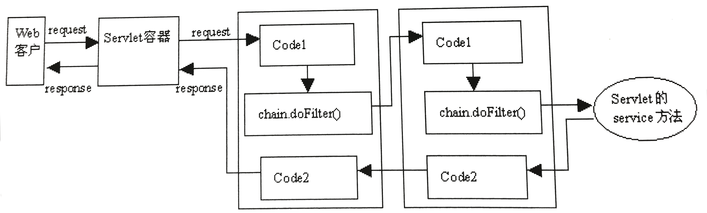

# 第十六章 过滤器

### 16.1 过滤器简介

过滤器能对 Servlet 容器传给 Web 组件的 ServletRequest 对象和 ServletResponse 对象进行检查和修改。过滤器本身并不产生 ServletRequest 对象和 ServletResponse 对象，它只为 Web 组件提供如下过滤功能：

-   在 Web 组件被调用之前检查 ServletRequest 对象，修改请求头和请求正文的内容，或对请求进行预处理操作。
-   在 Web 组件被调用之后检查 ServletResponse 对象，修改响应头或响应正文。

过滤器负责过滤的 Web 组件可以是 Servlet, JSP 或 HTML 文件，并拥有如下特点：

- 过滤器检查 ServletRequest 对象和 ServletResponse 对象，并利用 ServletRequestWrapper 和 ServletResponseWrapper 包装类进行修改。
- 在 web.xml 文件中为过滤器配置映射的 URL。当客户端访问此 URL 时，Servlet 容器会先触发过滤器。
- 多个过滤器可以被串联在一起，协同工作。

### 16.2 创建过滤器

所有自定义的过滤器类都必须实现 javax.servlet.Filter 接口。此接口定义了三个方法：
- init(FilterConfig config)：Web 应用启动时，先创建 FilterConfig 对象，再创建 Filter 对象，调用此方法初始化过滤器。
- doFilter(ServletRequest req, ServletResponse res, FilterChain chain)：Servlet 容器调用此方法完成实际的过滤操作。
- destory()：Servlet 容器在销毁过滤器之前先调用此方法。

```java
public class Filter1 implements javax.servlet.Filter {
    private FilterConfig config = null;
    private String value = null;

    @Override
    public void init(FilterConfig filterConfig) throws ServletException {
        //获取 FilterConfig 对象，读取设定好的过滤初始参数
        this.config = filterConfig;
        value = config.getInitParameter("username");
    }

    @Override
    public void doFilter(ServletRequest request, ServletResponse response, FilterChain chain) throws IOException, ServletException {

        //获取客户请求参数中的用户名
        String username = request.getParameter("username");

        //拦截指定用户名
        if (username.contains(value)) {

            response.setContentType("text/html; charset=utf-8");

            PrintWriter out = response.getWriter();
            out.println("<html<head><title>拒绝服务</title></head></html><body>");
            out.println("对不起，服务器无法为您提供服务</body></html>");

            //强制返回响应结果
            out.close();
            //不再执行后续的请求转发
            return;
        }

        //请求转发给后续过滤器或 Web 组件
        chain.doFilter(request, response);

        System.out.println("所有串联过滤器已执行完毕");
    }
}
```

### 16.3 发布过滤器

在 web.xml 中配置过滤器和配置 Servlet 类相似，必须先配置完所有过滤器，再配置 Servlet 类。
```xml
<filter>
    <filter-name>filter1</filter-name>
    <filter-class>com.likezhen.helloapp.Filter1</filter-class>
    <init-param>
        <param-name>username</param-name>
        <param-value>andy</param-value>
    </init-param>
</filter>
<filter-mapping>
    <filter-name>filter1</filter-name>
    <url-pattern>/checkout</url-pattern>
</filter-mapping>
```

或者用 WebFilter 注解进行配置。
```java
@WebFilter(filterName = "filter", value = "/filtration",
    initParams = {
        @WebInitParam(name = "username", value = "andy")},
    dispatcherTypes = {DispatcherType.REQUEST, DispatcherType.FORWARD}
)
```

| 属性            | 类型           | 描述                                                         |
| --------------- | -------------- | ------------------------------------------------------------ |
| filterName      | String         | 等价于 <filter-name> 元素，默认值为全类名                    |
| urlPatterns     | String[]       | 指定一组待过滤的 URL                                         |
| value           | String[]       | 同上，但两者不可同时使用                                     |
| iniitParams     | WebInitParam[] | 等价于 <init-param> 元素                                     |
| asyncSupported  | boolean        | 等价于 <asynx-supported> 元素，声明过滤器是否支持异步处理模式 |
| description     | String         | 等价于 <description> 元素                                    |
| displayName     | String         | 等价于 <display-name> 元素                                   |
| dispatcherTypes | DispatcherType | 指定过滤器的调用模式，可同时指定多个调用模式                 |

过滤器的调用模式包括：
- DispatcherType.REQUEST：当客户端直接请求访问待过滤的目标资源时，Web 容器会先调用该过滤器。
- DispatcherType.FORWARD：当待过滤的目标资源通过请求转发被访问时先调用该过滤器。
- DispatcherType.INCLUDE：当待过滤的目标资源通过请求包含被访问时先调用该过滤器。
- DispatcherType.ERROR：当待过滤的目标资源通过异常处理机制被访问时先调用该过滤器。
- DispatcherType.ASYNC：当待过滤的目标资源被异步访问时先调用该过滤器。

### 16.4 串联过滤器

多个过滤器对同一个 Servlet 进行过滤，称为过滤器的串联。在 web.xml 文件中，Servlet 容器将根据过滤器定义的先后顺序，依次调用它们的 doFilter() 方法进行过滤。

```xml
<filter>
    <filter-name>filter1</filter-name>
    <filter-class>com.likezhen.helloapp.Filter1</filter-class>
    <init-param>
        <param-name>username</param-name>
        <param-value>andy</param-value>
    </init-param>
</filter>
<filter-mapping>
    <filter-name>filter1</filter-name>
    <url-pattern>/checkout</url-pattern>
</filter-mapping>
<filter>
    <filter-name>filter2</filter-name>
    <filter-class>com.likezhen.helloapp.Filter2</filter-class>
</filter>
<filter-mapping>
    <filter-name>filter2</filter-name>
    <url-pattern>/checkout</url-pattern>
</filter-mapping>
```

串联过滤器的工作流程如下图所示：


