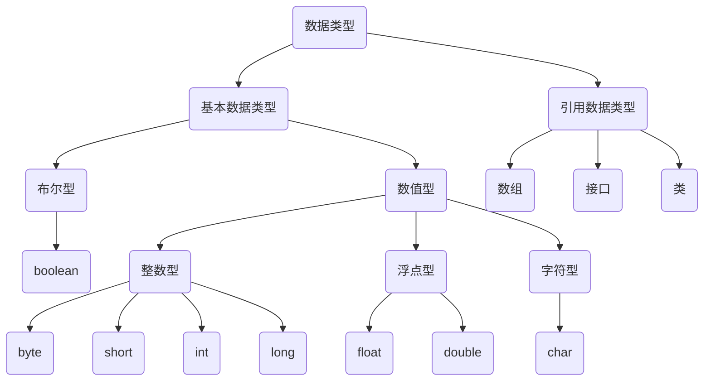

# 第五章 数据类型
## 一、分类
### 1、按数据类型分类

### 2、按声明的位置分类


## 二、基本数据类型

### （一）整数类型

- Java 各整数类型有固定的长度和范围，不受具体操作系统的影响，以保证 Java 程序的可移植性。
- Java 的整型常量默认为 **int** 型，声明 long 型常量须后加‘ l’ 或‘ L’

| 数据类型                                                     | 占用字节 | 范围                               |
| ------------------------------------------------------------ | -------- | ---------------------------------- |
| byte                                                         | 1        | -128 ~ 127                         |
| short                                                        | 2        | -2<sup>15</sup> ~2<sup>15</sup>-1  |
| int                                                          | 4        | -2<sup>31</sup> ~ 2<sup>31</sup>-1 |
| long                                                         | 8        | -2<sup>63</sup> ~ 2<sup>63</sup>-1 |
### （二）浮点类型                                       
- Java 的浮点型常量默认为 **double** 型，声明 float 型常量，须后加‘ f’ 或‘ F’ 。           

| 数据类型 | 占用字节 | 范围                   |
| -------- | -------- | ---------------------- |
| float    | 4        | -3.403E38 ~ 3.403E38   |
| double   | 8        | -1.798E308 ~ 1.798E308 |
>float: 单精度，尾数可以精确到 7 位有效数字。
>double: 双精度，精度是 float 的两倍。通常采用此类型。

### （三）字符类型
字符类型表示单个字符，必须用单引号括起来。Java字符采用双字节Unicode编码，占两个字节（16位），双字节Unicode的存储范围在 ```\u0000~\uFFFF```。因此 ```'A'```字符也可以用 Unicode 码 ```'\u0041'```表示。
```java
char first = 'A';
char two = '\u0041';
```
| 数据类型                                                     | 占用字节 | 范围                 |
| ------------------------------------------------------------ | -------- | -------------------- |
| char                                                         | 2        | 0 ~ 2<sup>16</sup>-1 |

Java 也支持转义字符。                                
| 转义字符 | 说明   |
| -------- | ------ |
| \t       | 制表符 |
| \n       | 换行   |
| \r       | 回车   |
| \\"      | ”      |
| \\'      | ‘      |
| \\\      | \      |
### （四）布尔类型                                 
Java 中布尔类型只有两个值：true 或 false。且没有 C 语言中，0 = false, 1 = true 的设定。所以不能和数值型数据进行运算。

### （五）数值类型转换
**自动类型提升：**
当取值范围较小的变量与取值范围较大的变量做运算或赋值时，结果自动提升为取值范围较大的数据类型。自动类型提升顺序：

byte, char, short --> int --> long --> folat --> double

注：
1、当 byte、char、short 三种数据类型两两做运算时，结果为 int。
2、boolean 类型不参与运算。

**强制类型转换：**
和自动类型提升相反的结果，但可能会造成精度损失。

```java
int number = (int)(5.3 + 2); //double类型强制转换成int类型
```
## 三、引用数据类型
在 Java 中保留了指针类型，但不支持指针计算。引用事实上就是指针，是指向一个对象的内存地址。