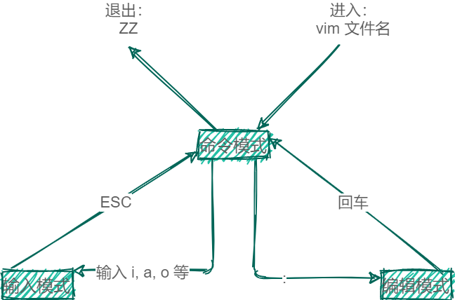

# 第五章 vim 编辑器

vim 是一个*全屏幕* 纯文本编辑器，是 vi 编辑器的增强版。不需要鼠标接入，所有操作都可以通过键盘完成。

## 5.1 vim 的基本使用

**命令模式**：是主要使用快捷键的模式。
**输入模式**：用于文本编辑。
**编辑模式**（末行模式）：用于输入命令。

### 5.1.1 命令模式：
1. 光标移动
   - 四处移动
| 左           | 下           | 上         | 右            |
| ------------ | ------------ | ---------- | ------------- |
| h            | j            | k          | l             |
| :arrow_left: | :arrow_down: | :arrow_up: | :arrow_right: |
- 
  - 移动到文件头或文件尾
     gg 移动到文件头
     G 移动到文件尾
  - 移动到行首或行尾
     ^ 移动到行首
     $ 移动到行尾
  - 移动到指定行
     :n 移动到第几行
2. 删除或剪切
   - 字母
     x 删除单个字母
     nx 删除 ｎ 个字母
   - 整行
     dd 删除单行 
     ndd 删除后面多行 
     :n1,n2d 删除指定范围的行  
3. 复制
     yy 复制单行
     nyy 复制多行
4. 粘贴
     p 粘贴到光标后
     P 粘贴到光标前
5. 撤销
     u 撤销
     ctrl+u 反撤销
6. 替换
     r 替换光标所在处的字符
     R 从光标所在处开始替换字符，按 ESC 结束
     :1,10s/old/new/g 替换1到10行的所有old为new
     :%s/old/new/g 替换整个文件的old为new
     :1,10s/^/#/g 替换1到10行的行首为#，即注释1到10行
     :1,10s/^#//g 取消1到10行的注释
     :1,10s/^/\/\//g 替换1到10行行首为 //
     :1,10s/^\/\///g 取消1到10行的行首 //
7. 查找
     /内容 从光标所在行向上查找
     ?内容 从光标所在行向下查找
     n 下一个
     N 上一个
8. 插入
     a 在光标所在字符后插入 
     A 在光标所在行尾插入  
     i 在光标所在字符前插入 
     I 在光标所在行首插入   
     o 在光标下插入新行     
     O 在光标上插入新行     

### 5.1.2 编辑模式：
:w 保存不退出
	:w 新文件名 把文件另存为新文件
:q 不保存退出
:wq 保存退出
:! 强制
	:q! 强制不保存退出
	:wq! 强制保存退出
:set nu/nonu 显示/取消行号，默认不显示
:syntax on/off 开启颜色，默认开启
:set hlserach/nohlsearch 查找的字符串高亮，默认开启
:set ruler\noruler 是否显示右下角的状态栏，默认显示
:set showmode/noshowmode 是否显示左下角状态栏，默认显示
:set list/nolist 是否显示隐藏字符，默认不显示
:set all 查看更多 vim 编辑模式的参数
想要永久生效，将设置写入配置文件 ~/.vimrc。

## 5.2 vim 使用技巧
**导入其他文件内容**
:r 文件绝对路径 把文件内容导入到光标位置
**执行系统命令**
:!命令 在 vim 中执行系统命令
:r !命令 执行系统命令并把结果导入光标所在行
**自定义快捷键**
:map 快捷键 执行的命令
`:map ^P I#<ESC>` 按 ctrl+p 时，在行首加入注释。设置时，先按 ctrl+v，再按 ctrl+p设置，最后快捷键为 ctrl+p。
**字符替换**
:ab 源字符 替换字符
`:ab mail xxxxx@xxx.com`
**多文件打开**
vim -o 文件一 文件二 上下两个分屏打开两个文件
vim -O 文件一 文件二 左右两个打开打开文件
按 ctrl+w，在按对应方向即可切换到对应的文件页面。