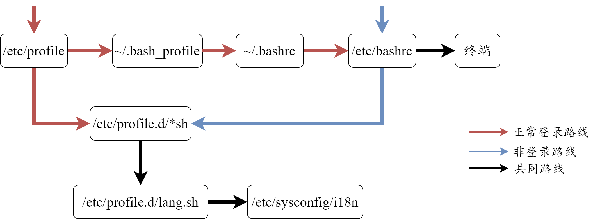

# 十一章 shell 基础

### shell 
硬件上->内核->shell命令解释器->外层应用程序
### shell 分类

|   shell 类别   | 易学性 | 可移植性 | 编辑性 | 快捷性 |
| ---- | ---- | ---- | ---- | ---- |
| Bourne shell(sh) | 容易 | 好 | 较差 | 较差 |
| Korn shell(ksh) | 较难 | 较好 | 好 | 较好 |
| Bourne Again(bash) | 难 | 较好 | 好 | 好 |
| POSIX shell(psh) | 较难 | 好 | 好 | 较好 |
| C shell (sch) | 较难 | 差 | 较好 | 较好 |
| TC shell(tcsh) | 难 | 差 | 好 | 好 |

`[root@localhost /]# cat /etc/shells` #查看当前系统支持的 shell
`/bin/sh
/bin/bash
/sbin/nologin
/bin/dash
/bin/tcsh
/bin/csh`

**echo&nbsp;&nbsp;&nbsp;&nbsp;[选项]&nbsp;&nbsp;&nbsp;&nbsp;[输出内容]**
   -e：支持转义字符
   -n：输出后不换行

| 转义字符 | 作用                        |
| -------- | --------------------------- |
| \\\      | 输出 \ 本身                 |
| \a       | 输出警告声                  |
| \b       | 退格键                      |
| \c       | 取消换行                    |
| \e       | ESC键                       |
| \f       | 换页符                      |
| \n       | 换行符                      |
| \r       | 回车键                      |
| \t       | 制表符                      |
| \v       | 垂直制表符                  |
| \0       | 按八进制ASCII码表输出字符   |
| \x       | 按十六进制ASCII码表输出字符 |

`[root@localhost /]# echo -e "\a"`
`[root@localhost /]# echo -e "\e[1;31m abcd \e[0m"` #把 abcd 字体输出为红色
字体颜色：30m=黑色，31m=红色，32m=绿色，33m=黄色，34m=蓝色，35m=洋红，36m=青色，37m=白色
背景色：40m=黑色，41m=红色，42m=绿色，43m=黄色，44m=蓝色，45m=洋红，46m=青色，47m=白色

### shell 脚本执行方式
shell 脚本一般以 \*.sh 结尾，文件开头 #!/bin/bash
`[root@localhost ~]# vim hello.sh
#!/bin/bash
echo "hello"`

`[root@localhost ~]# chmod 755 hello.sh` #给文件赋予执行权限
`[root@localhost ~]# /root/hello.sh #通过绝对或相对路径直接执行
hello`

`[root@localhost ~]# bash hello.sh` #通过 bash 执行调用该，不用赋予执行权限
`hello`

### bash 基本功能

1. 历史命令
   **history&nbsp;&nbsp;&nbsp;&nbsp;[选项]&nbsp;&nbsp;&nbsp;&nbsp;[保存文件]**
   -c：清空历史命令
   -w：缓存中的历史命令写入文件中。默认保存在~/.bash_history中
   历史命令先放在缓存中，等用户注销(logout)后，才写入保存文件。
   /etc/profile中可以修改保存历史命令条数（HISTSIZE）。

   使用上下箭头调用以前的历史命令
   使用“!n”重复执行第n条历史命令
   使用“!!”重复执行上一条命令
   使用“!字符串”重复执行最后一条以该字符串开头的命令
   使用“!$”重复上一条命令的最后一个参数
   
2. 命令与文件补全

3. 命令别名
    命令执行顺序：
   1. 绝对或相对路径执行
   2. 别名执行
   3. shell 内置命令
   4. 按照$PATH环境变量定义的目录查找顺序找到的第一个命令

4. bash 常用快捷键
    | 快捷键 | 作用                     |
    | ------ | ------------------------ |
    | ctrl+A | 光标移动到行首           |
    | ctrl+E | 光标移动到行尾           |
    | ctrl+C | 强制终止当前命令         |
    | ctrl+L | 清屏                     |
    | ctrl+U | 删除或剪切光标之前的命令 |
    | ctrl+K | 删除或剪切光标之后的命令 |
    | ctrl+Y | 粘贴剪切的内容           |
    | ctrl+R | 在历史命令中搜索         |
    | ctrl+D | 退出当前终端             |
    | ctrl+Z | 暂停，放入后台           |
    | ctrl+S | 暂停屏幕输出             |
    | ctrl+Q | 恢复屏幕输出             |

5. 输入输出重定向

- 标准输入输出
   | 设备   | 设备文件名  | 文件描述符 | 类型         |
   | ------ | ----------- | ---------- | ------------ |
   | 键盘   | /dev/stdin  | 0          | 标准输入     |
   | 显示器 | /dev/stdout | 1          | 标准输出     |
   | 显示器 | /dev/stderr | 2          | 标准错误输出 |
   
- 输出重定向，结果输出到文件而不是标准输出中
   | 类型               | 符号                   | 作用                                     |
   | ------------------ | ---------------------- | ---------------------------------------- |
   | 标准输出重定向     | 命令&nbsp;&nbsp;[>\|>>]&nbsp;&nbsp;文件      | > 代表覆盖，>> 代表追加                  |
   | 标准错误输出重定向 | 错误命令&nbsp;&nbsp;[2>\|>>]&nbsp;&nbsp;文件 | 2> 代表覆盖，2>> 代表追加                |
   | 输出重定向         | 命令&nbsp;&nbsp;[>\|>>]&nbsp;&nbsp;文件&nbsp;&nbsp;2>&1 | 正确和错误输出到同一个文件               |
   | 输出重定向         | 命令&nbsp;&nbsp;[&>\|>>]&nbsp;&nbsp;文件     | 正确和错误输出到同一个文件               |
   | 输出重定向         | 命令>>文件1&nbsp;&nbsp;2>>文件2  | 正确命令追加到文件1，错误命令追加到文件2 |
   
- 输入重定向，从文件输入而不是从标准输入
  **wc&nbsp;&nbsp;&nbsp;&nbsp;[选项]&nbsp;&nbsp;&nbsp;&nbsp;[文件名]**
   -c：统计字节数
   -w：统计单词数
   -l：统计行数
   <：输入重定向

6. 多命令执行
| 多命令执行符 | 格式  | 作用 |
| ------------ | ----- | ---- |
| ;            | 命令1&nbsp;&nbsp;;&nbsp;&nbsp;命令2 | 多个命令顺序执行，命令之间毫无关系 |
| &&           | 命令1&nbsp;&nbsp;&&&nbsp;&nbsp;命令2      | 命令1正确执行（$?=0），命令2才执行，否则命令2不执行 |
| \|\|         | 命令1&nbsp;&nbsp;\|\|&nbsp;&nbsp;命令2      | 命令1执行不正确（$?≠0），命令2才执行，否则命令2不执行 |

`命令 && echo yes || echo no` #判断命令或脚本是否正确执行   

7. 管道符
8. 通配符
9. bash 中其他特殊符号

| 符号 | 作用                                                         |
| ---- | ------------------------------------------------------------ |
| ' '  | 单引号。所有特殊符号都失去特殊意义。                         |
| " "  | 和单引号类似。但 $, " ", \例外，分别拥有调用变量的值，引用命令和转义符的特殊含义 |
| ``   | 反引号。bash 中会优先执行的系统命令。和$()作用一样           |
| $()  | 引用系统命令                                                 |
| ()   | 用于一串命令执行时，()中的命令会在子shell中运行              |
| {}   | 用于一串命令执行时，{}中的命令会在当前shell中运行            |
| []   | 用于变量测试                                                 |
| #    | shell 脚本中，#开头代表注释                                  |
| $    | 调用变量的值，$name 代表调用变量 name 的值                   |
| \    | 和单引号一样，使特殊符号失去特殊含义                         |

`[root@localhost ~]# name=lkz
[root@localhost ~]# echo '$name'
$name
[root@localhost ~]# echo "$name"
lkz`
`[root@localhost ~]# today=$(date) ; echo $today
2021年 05月 27日 星期四 23:19:37 CST`

() 与 {} 的区别：
- ()执行命令时，会新开一个子shell执行命令，命令结束后，关闭子shell，返会当前shell
- {}执行命令时，在当前shell执行
- ()最后一个命令可以不用分号
- {}最后一个命令要加分号
- ()两端命令和括号之间不要由空格
- {}两端命令和括号之间要有空格
- ()类似局部变量，{}类似全局变量

`[root@localhost ~]# (name=lkz;echo $name)`
`lkz
[root@localhost ~]# echo $name` #子shell变量不影响当前shell

`[root@localhost ~]# { name=lkz;echo $name; }
lkz
[root@localhost ~]# echo $name
lkz` #当前shell变量已定义

### bash 变量和运算符

1.变量的规则：
- 变量名由字母、数字和下划线组成。但不能以数字开头
- 变量默认类型为字符型。若要进行数值运算，必须指定变量类型为数值型
- 变量用等号赋值，等号两侧不能有空格
- 若变量值包含空格，需用引号包括
- 变量值可以叠加，即字符串的连接，用 "\$变量名" 或 \${变量名} 引用
- 命令的结果赋予变量，用反引号或$()
- 环境变量建议大写

`[root@localhost ~]# test=123 ; flag="$test"456 ; echo $flag
123456`
`[root@localhost ~]# temp=${flag}789 echo $temp
123456789`

**declare&nbsp;&nbsp;&nbsp;&nbsp;[+|-]&nbsp;&nbsp;&nbsp;&nbsp;[选项]&nbsp;&nbsp;&nbsp;&nbsp;变量名** 可以声明变量类型
   -：给变量设定类型
   +：取消变量类型
   -a：变量声明为数组型
   -i：变量声明为整数型
   -r：变量声明为只读，不能修改和删除，也不能取消只读。只能重启或重登后消失。
   -x：变量声明为环境变量，export是其简化版
   -p：显示指定变量的类型
`[root@localhost sh]# cc=1 ; declare -p cc ; declare -i cc ; declare  -p cc
declare -- cc="1"
declare -i cc="1"`

`[root@localhost sh]# declare -p` #查询所有变量类型

`[root@localhost sh]# declare -a name[0]=abc ; name[1]=def ; echo ${name[0]}
abc` #定义数组的两种方式，输出数组中元素。

2. 变量分类
- 用户自定义变量：最常见的变量，用户自定义变量名和变量值
- 环境变量：主要保存和系统操作环境相关的数据。一般由系统预先设定好
- 位置参数变量：向脚本传递参数或数据，变量名字不能自定义，变量作用固定，可以自定义变量值
- 预定义变量：bash 中定义好的变量，变量名不能自定义，变量租用固定，可以自定义变量值

**用户自定义变量**
可自定义变量名、变量值和变量作用，只在当前bash下生效
- 定义变量
`[root@localhost ~]# name=lkz`
- 调用变量
`[root@localhost ~]# echo $name
lkz`
- 查看变量
set | env：查看系统所有变量
set -u：临时生效，设定后调用未声明的变量会报错（系统原本默认无任何提示）
set -x：临时生效，设定后在命令执行前，会先输出一次命令
- 删除变量
unset 变量名

**环境变量**
用户自定义环境变量可自定义变量名、变量值和变量作用，系统自带环境变量只能自定义变量值，变量名和变量作用固定。环境变量在所有bash下都生效。

- 定义环境变量
`[root@localhost ~]# export age=18
[root@localhost ~]# bash` #开启子shell
`[root@localhost ~]# echo $age` #环境变量在子shell下也生效
`18`
- 查询环境变量
  set | env 两者一起使用，才能查看完整的环境变量
   - 如 PATH 环境变量，是系统查找命令的路径。当输入一个程序名，若没有写路径，系统会去 PATH 定义的路径中寻找，有就执行，没有就报错。
      `[root@localhost ~]# echo $PATH ; PATH="$PATH":/root/sh ; echo  $PATH 
      /usr/lib64/qt3.3/bin:/usr/local/sbin:/usr/local/bin:/sbin:/bin:/usr/sbin:/usr/bin:/root/bin
      /usr/lib64/qt3.3/bin:/usr/local/sbin:/usr/local/bin:/sbin:/bin:/usr/sbin:/usr/bin:/root/bin:/root/sh` #将自定义脚本目录 /root/sh 加入 PATH 环境变量，之后直接输入脚本名即可运行
  
   - PS1环境变量用于设置命令提示符。
     | 格式 | 作用                                      |
     | ---- | ----------------------------------------- |
     | \d   | 显示日期，格式为“星期 月 日”              |
     | \h   | 显示简写主机名，默认localhost             |
     | \H   | 显示完整主机名，默认locaohost.localdomain |
     | \t   | 显示24小时制时间，格式为"HH:MM:SS"        |
     | \T   | 显示12小时制时间，格式为"HH:MM:SS"        |
     | \A   | 显示24小时制时间，格式为"HH:MM"           |
     | \@   | 显示12小时制时间，格式为"HH:MM am/pm"     |
     | \u   | 显示当前用户名                            |
     | \v   | 显示bash版本信息                          |
     | \w   | 显示当前所在目录完整名称                  |
     | \W   | 显示当前所在目录的最后一个目录            |
     | \#   | 执行的第几个命令                          |
     | \$   | 提示符，root用户为#，普通用户为$          |

     `[root@localhost ~]# echo $PS1
     [\u@\h \W]\$ ` #默认显示方式

   - LANG 环境变量定义Linux系统的语系变量。
     `locale -a` #查看Linux支持的所有语系
     `locale`  #查看当前系统语系
     字符界面终端不支持中文，只能安装插件。远程工具和图形界面支持中文。

**位置参数变量**
只能自定义变量内容，变量名和变量作用固定。一般用于向脚本传入参数。

| 位置参数变量 | 作用                             |
| ------------ | -------------------------------- |
| $n           | \$0代表命令自身，$1~\$9 代表命令的第一到九个参数，第十个以上参数用大括号包含，如\${10} |
| $*           | 代表命令中所有参数，所有参数看作一个整体赋给$* |
| $@           | 代表命令中所有参数，每个参数依次赋给$@ |
| $#           | 统计命令中所有参数个数 |

`[root@localhost sh]# vim count.sh 
#!/bin/bash
sum=$(( $1+$2 ))` #数值运算用$((运算式))
`echo $sum` #返回第一个和第二个参数相加结果
`echo $0` #返回命令本身
`[root@localhost sh]# count.sh 11 22
33`
`/root/sh/count.sh`

read 接受键盘输入，也可以向脚本传入参数。
**read&nbsp;&nbsp;&nbsp;&nbsp;[选项]&nbsp;&nbsp;&nbsp;&nbsp;[变量名]**
   -p "提示信息"：输出提示信息
   -t 秒数：等候用户输入的时间
   -n 字符数：限制用户输入字符数
   -s：隐藏输入数据
   变量名：
   变量名可以自定义，若不指定变量名，默认把输入保存到REPLY变量中
   如果只提供一个变量，整个输入行赋予该变量
   如果提供一个以上变量（空格分开），输入行按空格分为若干字，一个一个赋予变量，最后一个变量会接收剩下所有内容。

`[root@localhost sh]# vim count.sh 
#!/bin/bash
#等待用户30秒，输出提示信息，输入结果赋给 num1 和 num2
read -t 30 -p "请输入第一个数字：" num1
read -t 30 -p "请输入第二个数字：" num2
echo 结果为： $(( $num1 + $num2))`

`[root@localhost sh]# count.sh 
请输入第一个数字：1
请输入第二个数字：2
结果为： 3`

**预定义变量**
只能自定义变量内容，变量名和变量作用固定。

| 预定义变量 | 作用                             |
| ------------ | -------------------------------- |
| $？           | 最后一次执行的命令的返回值。0代表成功执行，非0代表执行失败 |
| $\$           | 当前进程的进程号（PID）                                    |
| $!           | 后台运行的最后一个进程的进程号（PID）                      |

`[root@localhost sh]# ls
count.sh` #命令成功执行
`[root@localhost sh]# echo $?
0` 返回值为0
`[root@localhost sh]# lsl
-bash: lsl: command not found` #命令执行失败
`[root@localhost sh]# echo $?
127` #返回值为非0

**shell 进行数值运算的三种方式**

- 用 declare 命令
`[root@localhost sh]# a=1 ; b=2 ; declare -i c=$a+$b ; echo $c
3` 
- 用 expr 或 let 命令
`[root@localhost sh]# d=$(expr $a + $b) ; echo $c 
3` # expr 算式中，+ 两边必须有空格
`[root@localhost sh]# let e=$a+$b ; echo $e
3`
- 使用 \$((运算式)) 或 $[运算式]
`[root@localhost sh]# f=$(( $a+$b )) ; echo $f
3`

**变量测试与内容置换**

| 变量置换方式 | 变量y没有设置          | 变量y为空值            | 变量y设置值   |
| ------------ | ---------------------- | ---------------------- | ------------- |
| x=${y-新值}  | x=新值                 | x为空                  | x=$y          |
| x=${y:-新值} | x=新值                 | x=新值                 | x=$y          |
| x=${y+新值}  | x为空                  | x=新值                 | x=新值        |
| x=${y:+新值} | x为空                  | x为空                  | x=新值        |
| x=${y=新值}  | x=新值，y=新值         | x为空，y值不变         | x=$y，y值不变 |
| x=${y:=新值} | x=新值，y=新值         | x=新值，y=新值         | x=$y，y值不变 |
| x=${y?新值}  | 新值输出到标准错误输出 | x为空                  | x=$y          |
| x=${y:?新值} | 新值输出到标准错误输出 | 新值输出到标准错误输出 | x=$y          |
`[root@localhost sh]# x=${y-value} ; echo $x
value`
`[root@localhost sh]# y="" ; x=${y-value} ; echo $x`
`     `
`[root@localhost sh]# y=123 ; x=${y-value} ; echo $x
123
`

### 环境变量配置文件
`source 配置文件` 或 `. 配置文件`可以将需要重登才能生效的环境变量配置文件立刻生效。

**登录时主要生效的环境变量配置文件**
- /etc/profile
- /etc/profile.d/*.sh
- ~/.bash_profile
- ~/.bashrc
- /etc/bashrc

用户登录过程先调用 /etc/profile 文件，这个文件会定义以下默认环境变量
- USER：根据登录用户赋值
- LOGNAME：根据 USER 变量的值赋值
- MAIL：根据登录用户，定义用户的邮箱为/var/spool/mail/用户名
- PATH：根据登录用户  UID 是否为0，决定 PATH 变量是否包含/sbin，/usr/sbin和/usrlocal/sbin三个目录下的命令
- HOSTNAME：主机名
- HISTSIZE：历史命令保持条数
- umask：定义 umask 默认值
- 调用 /etc/profile.d/下所有以 .sh 结尾的文件

非登录包括 su 命令、开启子shell等情况

**注销时生效的环境变量配置文件**
用户退出登录时，只会调用 ~/.bash_logout 文件。这个文件默认为空。如果希望在退出登录时执行一些操作，可以把命令写入这个文件。

**其他配置文件**
~/.bash_history 文件保存历史命令

/etc/issue 显示本地终端shell登录的欢迎信息
`[root@localhost sh]#  cat /etc/issue
CentOS release 6.8 (Final)
Kernel \r on an \m`

通过 man agetty 查询支持的转义符
| 转义符 | 作用                     |
| ------ | ------------------------ |
| \d     | 显示当前系统日期         |
| \s     | 显示操作系统名称         |
| \l     | 显示登录终端号           |
| \m     | 显示硬件体系结构         |
| \n     | 显示主机名               |
| \o     | 显示域名                 |
| \r     | 显示内核版本             |
| \t     | 显示当前系统时间         |
| \u     | 显示当前登录用户的序列号 |

/etc/issue.net 用于显示远程登录的欢迎信息。但不在支持/etc/issue 下的转义符，且必须将/etc/ssh/sshd_config 文件修改
`[root@localhost ~]# vim /etc/ssh/sshd_config 
#Banner none` 修改为 `Banner /etc/issue.net`

/etc/motd 和前两个文件不同，它是在用户正确登录之后显示欢迎信息，且对本地终端和远程终端都生效

`stty -a` 查询 bash 快捷键
`stty 关键字 快捷键`可自定义快捷键

