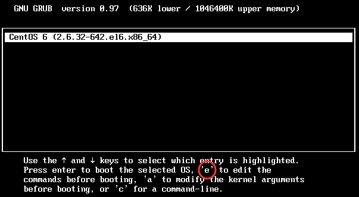
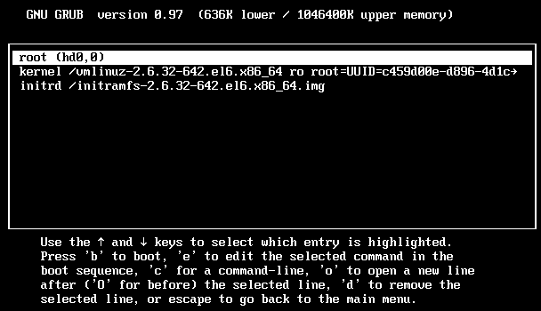
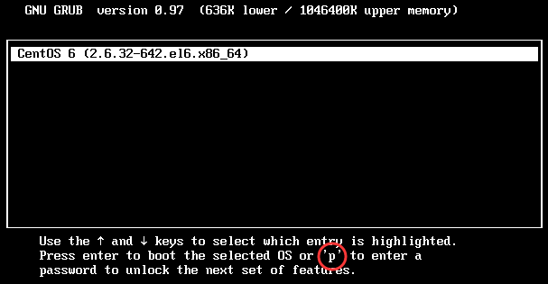
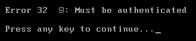
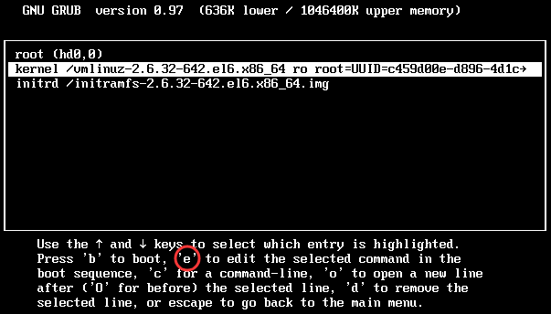
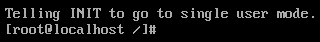
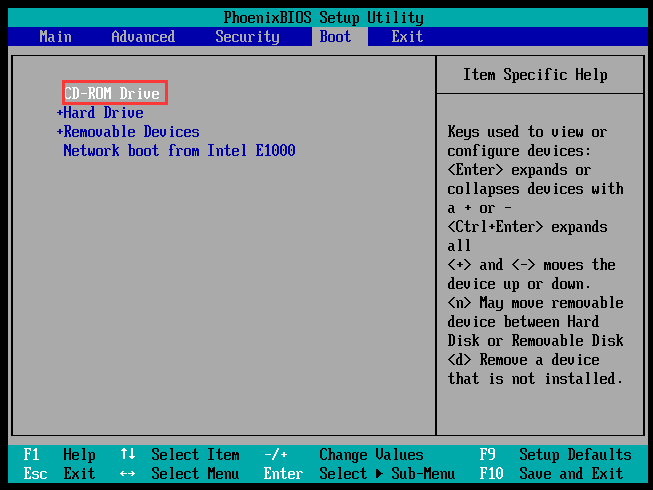
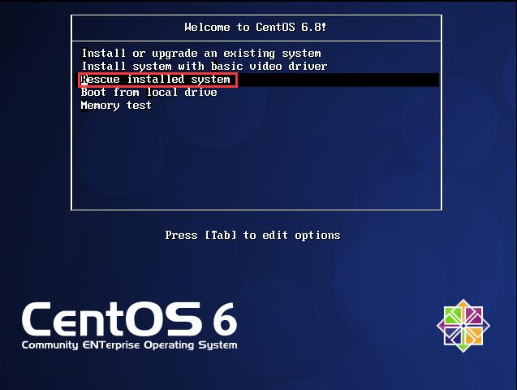

# 第十三章 启动引导与修复

### 系统运行级别

| 运行级别 | 含义                                                |
| -------- | --------------------------------------------------- |
| 0        | 关机                                                |
| 1        | 单用户模式，类似 Windows 安全模式，主要用于系统修复 |
| 2        | 不完全的命令行模式，不含 NFS 服务                   |
| 3        | 完全的命令行模式，即标准字符界面                    |
| 4        | 系统保留                                            |
| 5        | 图形模式                                            |
| 6        | 重启                                                |

`[root@localhost sh]# runlevel` #查看系统运行级别
`N 3` #N代表上一个运行级别为空，3代表当前运行级别为标准字符界面

`[root@localhost sh]# init 0` #设置运行级别
init 关机和重启不太安全，容易造成数据丢失

`[root@localhost ~]# vim /etc/inittab` 设置系统默认运行级别
`id:3:initdefault:` #默认运行级别为3

开机前系统调用的最后一个初始化脚本，可以将启动就运行的命令写入其中，例如独立服务的自启动命令
`[root@localhost ~]# cat /etc/rc.d/rc.local`
`touch /var/lock/subsys/local` #系统用这个文件记录开机时间

### 启动引导程序

主流启动引导程序 grub，相比早期的 Lilo 引导程序，有以下优点：
- 支持更多文件系统
- grub 主程序可直接在文件系统中查找内核文件
- 系统启动时，可以利用 grub 交互界面编辑和修改启动选项
- 可动态的修改 grub 配置文件，重启即可生效

**grub 中分区表示方法**

第一块硬盘：

|分区           | Linux 设备为文件名 | grub 设备为文件名 |
|-------------- | ------------------ | ----------------- |
|第一个主分区   | /dev/sda1 | hd(0,0) |
|第二个主分区   | /dev/sda2 | hd(0,1) |
| 扩展分区       | /dev/sda3 | hd(0,2) |
| 第一个逻辑分区 | /dev/sda5 | hd(0,4) |

第二块硬盘：
|分区           | Linux 设备为文件名 | grub 设备为文件名 |
|-------------- | ------------------ | ----------------- |
| 第一个主分区 | /dev/sdb1 | hd(1,0) |
| 第二个主分区 | /dev/sdb2 | hd(1,1) |
| 扩展分区 | /dev/sdb3 | hd(1,2) |
| 第一个逻辑分区 | /dev/sdb5 | hd(1,4) |

**grub 配置文件**
`[root@localhost ~]# vim /boot/grub/grub.conf`
#配置文件前四行对所有系统都有效
`default=0` #默认启动第一个操作系统
`timeout=5` #默认等待5秒后自动进入系统，0代表不会等待，-1代表不会自动进入系统
`splashimage=(hd0,0)/grub/splash.xpm.gz` #启动时的背景图像文件保存位置
`hiddenmenu` #隐藏菜单，启动时默认只能看到5秒倒计时
#每个系统都有单独的四行设置
`title CentOS 6 (2.6.32-642.el6.x86_64)` #启动菜单显示的系统名
`root (hd0,0)` #启动程序保存分区位置，即 /boot 分区
`kernel /vmlinuz-2.6.32-642.el6.x86_64 ro root=UUID=c459d00e-d896-4d1c-8d08-7922e98a9aa3 rd_NO_LUKS  KEYBOARDTYPE=pc KEYTABLE=us rd_NO_MD crashkernel=auto LANG=zh_CN.UTF-8 rd_NO_LVM rd_NO_DM rhgb quiet`
`initrd /initramfs-2.6.32-642.el6.x86_64.img`

**grub 加密**
默认在 grub 启动引导界面，按 e 可以进入编辑模式，编辑 grub 配置文件，如下图

`[root@localhost ~]# grub-md5-crypt` #通过此命令，输入密码获取md5加密
`Password:`
`Retype password:`
`$1$rqadS1$mAaqiypoulb3vTV/djh7P/`

`[root@localhost ~]# vim /boot/grub/grub.conf
timeout=5`
#在 timeout 和 splashimage 之间插入一行 password ，输入 md5 加密值
`password --md5 $1$rqadS1$mAaqiypoulb3vTV/djh7P/` 
`splashimage=(hd0,0)/grub/splash.xpm.gz`
启动时修改 grub 配置文件需要输入设定的密码，但正常启动不需要输入密码

加入 password 后，再加入 lock，修改配置文件和正常启动都需要输入密码，但服务器不在本地的情况，不能使用 lock，否则远程登录无法连接
#在 title 后插入 lock，
`title CentOS 6 (2.6.32-642.el6.x86_64)
lock`

### 系统修复模式

**单用户模式**
只启动最少的程序用于系统修复。在单用户模式中，Linux引导进入根 shell，禁用网络，只运行少数进程。订单用户模式用来修改文件系统损坏，还原配置文件，移动用户数据等

在进入 gurb 配置文件界面

选择配置文件 kernel 一行

在 kernel 行的最后追加单用户模式运行级别 1

重新启动，不需要输入账号密码就进入单用户模式，进行修复

**光盘模式**
光盘模式是系统修复的最终方法，可以额外修复单用户模式无法解决的问题

放入光盘，修改 BIOS 启动顺序，置顶光盘

选择救援安装模式

进入shell，此时处于光盘模拟的根目录下，真正的根目录放在/mnt/sysimage/目录中

修改根目录，进行修复
`bash-4.1# chroot /mnt/sysimage` 

