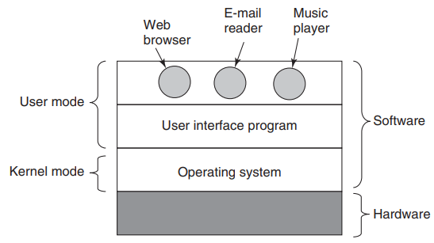

# 第一章 导论

### 操作系统

操作系统是一种运行在内核态的软件，介于硬件和应用程序之间。

操作系统有两大作用：

1、自顶向下地看，操作系统为应用程序提供服务。不同计算机之间的硬件有较大的差异，应用程序直接操作硬件时需要面对复杂且不友好的硬件接口。操作系统隐藏硬件接口，给应用程序提供良好友好的接口。

2、自底向上地看，操作系统管理硬件资源。当不同应用程序需要使用硬件时，操作系统在时间上（不同应用程序轮流使用 CPU）和空间上（多个应用程序载入内存）共享硬件资源。

### 操作系统分类

##### 大型机操作系统

大型机可作为高端 Web 服务器、大型电子商务服务站点和事务-事务交易服务器，提供三类服务：批处理、事务处理和分时。批处理系统处理不需要交互式用户干预地周期性作业。事务处理系统每秒处理大量小请求。分时系统运训多个远程用户同时在计算机上运行作业。例如 OS/390, Linux 等。

##### 服务器操作系统

服务器操作系统在服务器上运行，通过网络为若干个用户服务。例如 Solaris, FreeBSD, Linux 和 Windows Server 201X。

##### 多处理器操作系统

主流的 Windows 和 Linux 都可以运行在多核处理器上。

##### 个人计算机操作系统

主流的 Linux, FreeBSD, Windows7, OS X 等用于个人计算机。

##### 掌上计算机操作系统‘

平板电脑、智能手机等主流系统有 Android 和 苹果的 iOS。

##### 嵌入式操作系统

嵌入式系统用来控制设备中（例如微波炉、电视机、汽车等）计算机运行。所有软件保存在 ROM 中，不允许用户安装软件。例如 Linux, QNX, VxWorks 等。

##### 传感器节点操作系统

传感器内有一个小型计算机，例如 TinyOS。

##### 实时操作系统

实时操作系统中严格控制时间，规定时刻必须完成指定操作，常用于工业领域。例如 eCos。硬实时系统不允许任务运行超过截止时间，软实时系统可以接收偶尔超过截止时间。

##### 智能卡操作系统

最小的操作系统运行在智能卡上。智能卡是一种包含一块 CPU 芯片的信用卡。