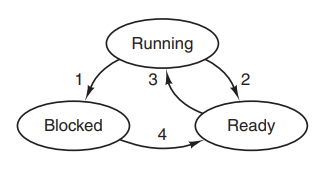

# 第二章 进程与线程

## 进程

计算机中所有可运行的软件，包括操作系统，都被组织成若干个顺序进程，简称进程。进程是对正在运行程序的抽象。一个进程就是一个正在执行程序的实例。每个进程都有一个地址空间和一个控制线程。

系统中的每个程序都运行在某个进程的上下文中。上下文由程序正确运行所需要的状态组成，包括内存中的程序代码、数据和进程表。

任一时刻一个 CPU 只能运行一个程序（串行）。CPU 使每个进程各运行几十或几百毫秒便切换到其他进程（并发）。对于用户来说，好像同一时刻同时运行多个程序（伪并行）；对于程序来说，好像该程序是系统中当前唯一运行的程序。


### 进程的实现

操作系统维护着一张进程表。每个进程占用一个进程表项（PCB）。表项包含了进程状态的重要信息，包括程序计数器、堆栈指针、内存分配情况等，确保该进程随后能再次启动，就好像从未被中断过一样。下图展示一个经典系统中的进程表关键字段。


### 进程的生命周期

#### 进程的创建

三种主要事件会导致创建进程：

- 系统初始化

启动操作系统时，通常会创建若干个进程。有与用户交互的前台进程，无需与用户交互的后台进程。停留在后台诸如电子邮件、Web 页面、新闻和打印机之类活动的进程称为守护进程。

- 执行创建进程的系统调用

一个正在运行的程序发出系统调用，创建若干个新线程协助完成工作。在多处理机中，让每个进程在不同的 CPU 上运行会使整个作业运行更快。

- 用户请求创建一个新进程

当用户输入一个命令或双击一个图标时就会创建进程，运行所选择的程序。

以上三种情形都是通过创建进程的系统调用实现。在 UNIX 系统中，只有系统调用 fork 可以创建新进程。调用 fork 后创建一个调用进程（父进程）的进程副本（子进程），接着子进程执行 execve 或类似的系统调用以运行一个新程序。新程序的堆栈和代码段会覆盖子进程的堆栈代码段。

在 Windows 系统中，Win32 函数调用 CreateProcess 即负责创建新进程，也负责把正确的程序装入新的进程中。

#### 进程的状态

进程在终止前有三种状态：

- 运行态：该时刻进程实际占用 CPU
- 就绪态：可运行，但因为其他进程正在使用 CPU 而暂时停止
- 阻塞态：除非某种外部事件发生，否则进程不能运行



若操作系统发现进程不能继续运行下去，例如进行 IO 操作时，发生转换 1。

转换 2 和 3 是由进程调度程序引起的。

当进程等待的外部事件发生时发生转换 4，例如进程等待的事件到达、该进程的 PCB 插入到就绪队列中、被阻塞进程需要的资源被满足等。

#### 进程的挂起

进程挂起是一种充分利用系统资源的方式，挂起就是把一个进程从内存转到磁盘上，激活就是把一个进程从磁盘转到内存中。

阻塞挂起：进程在磁盘中等待某种事的发生。就绪挂起：进程在磁盘中，只要进入内存即可运行。

挂起时可能发生从阻塞 -> 阻塞挂起、就绪 -> 就绪挂起、运行 -> 就绪挂起和阻塞挂起 -> 就绪挂起的转变。

激活时可能发生从阻塞挂起 -> 阻塞和就绪挂起 -> 就绪的转变。

#### 进程的终止

进程不会永远存在，通常下列条件会终止进程：

- 正常退出（自愿的）

多数进程时由于完成了工作或用户点击关闭按钮而终止。UNIX 中调用 exit，Windows 中调用 ExitProcess 终止进程。子进程终止后，内核并不是立即把它从系统中清除。进程保持一种已终止的状态，直到被它的父进程回收。一个终止了但还未被回收的进程称为僵尸进程。

- 出错退出（自愿的）

进程发现严重错误，例如文件不存在等。

- 严重错误（非自愿）

由于程序中的错误导致，例如执行一条非法指令、引用不存在的内存等。

- 被其他进程杀死（非自愿）

某个进程执行一个系统调用通知操作系统杀死某个其他进程。Unix 中调用 kill，Windows 中调用 TerminateProcess。

### 进程的层次结构

在 UNIX 中，父进程及其后代组成一个进程组。信号会发送给进程组中的每个进程。在 UNIX 中，所有进程都以 init 进程作为根，组成一棵进程数。

Windows 中没有进程层次，所有进程地位相同。父进程会得到一个令牌（句柄）用来控制子进程，父进程也可以把句柄传给其他进程。

### 进程的管理

操作系统维护一组队列，用来表示系统当中所有进程的当前状态。

不同状态分别用不同的队列来表示，可以分为就绪队列、各种类型的阻塞队列等。

每个进程的 PCB 根据进程状态加入到相应队列中，当一个进程状态发生变化时，它的 PCB 脱离当前队列加入到另一个状态队列中。

### 多道程序设计模型

采用多道程序设计可以提高 CPU 利用率。若一个进程等待 IO 操作的时间于其停留在内存中的时间比值为 p。内存中同时有 n 个进程时，所有进程都在等待 IO 操作的概率为 p^n^，CPU 的利用率为 1 - p^n^。n 称为多道程序设计的道数。


## 线程

线程是进程当中的一条执行流程。进程是资源分配的单位，线程是 CPU 调度单位。

优点：

- 线程共享同一个地址空间和全局变量的能力，进程做不到
- 线程比进程更轻量级，比进程更容易创建也更容易撤销。创建一个线程比创建一个进程快 10 ~ 100 倍
- 若存在大量计算和 IO 处理，多个线程并行会加快应用程序执行速度

缺点：

- 一个线程崩溃，该进程的所有线程崩溃

下图展示一个进程中所有线程共享的内容，包括地址空间、全部变量、所打开的文件集合、子进程等，每个线程都有自己的程序计数器、寄存器、栈和状态。


一个 CPU 通过快速切换并发执行多个进程（伪并行），一个 CPU 也可以并发执行多个线程（伪并行）。


### 线程的状态

线程和进程一样，有新建、运行、阻塞、就绪和终止状态。

进程通常从单个线程开始，调用 thread_create 创建新线程。线程完成工作后，调用 thread_exit 终止。一个线程可以调用 thread_join 被阻塞，直到另一个线程退出。一个线程可以调用 thread_yield 主动放弃 CPU 控制权。

### 用户态的线程

把线程包放在用户空间中执行，内核按单线程进程的方式管理。用户空间管理线程时，每个进程有其专用的线程表。每个线程有唯一的线程表项（TCB）。一组用户级的线程库来完成线程的管理，包括创建、终止、同步和调度。

优点：

- 用户态的线程切换比内核态快

- 允许每个进程有自定义的调度算法

缺点：

- 若一个线程被阻塞，所有线程都会受影响
- 若一个线程开始运行，除非主动交出 CPU，否则其他线程无法运行
- 时间片是分配给进程的，多线程执行时每个线程得到的时间片较少，执行较慢

### 内核态的线程

把线程包放在内核中，内核维护着一个线程表。由于在内核中创建或撤销线程的开销较大，系统可能会采用回收线程的方式，把某个被撤销的线程标记为不可运行而不销毁线程的数据结构。下一次创建新线程时重新启动旧线程。

优点：

- 解决在用户态线程的缺点

缺点：

- 线程切换开销较大


### 混合实现

内核只识别内核级线程并对其调度，其中一些内核级线程会被多个用户级线程多路复用。


## 进程间通信

进程间通信主要有以下几种方式：匿名管道、命名管道、信号、消息队列、共享内存、信号量、Socket。

- **匿名管道**：管道是一种半双工的通信方式，数据只能单向流动，而且只能在具有父子关系的进程间使用。
- **有名管道**：不同于匿名管道之处在于它提供了一个路径名与之关联，以有名管道的文件形式存在于文件系统中。只要可以访问该路径，就能够彼此通过有名管道相互通信。

- **信号**：信号是Linux系统中用于进程间通信的一种机制，信也是进程间通信机制中唯一的异步通信机制。信号可以在任何时候发给某一进程，而无需知道该进程的状态。如果该进程当前并未处于运行态，该信号由内核保存起来，直到该进程恢复执行，并传递给它。如果一个信号被进程设置为阻塞，则该信号的传递被延迟，直到其阻塞被取消时才传递给进程。

以下列出几个常用的信号：

| 信号    | 描述                                                         |
| :------ | :----------------------------------------------------------- |
| SIGHUP  | 当用户退出终端时，该终端开启的所有进程都会接收到这个信号，默认动作为终止进程。 |
| SIGINT  | 程序终止 (interrupt) 信号, 在用户键入 INTR 字符(通常是 Ctrl+C )时发出，用于通知前台进程组终止进程。 |
| SIGQUIT | 和 SIGINT 类似, 但由 QUIT 字符(通常是 Ctrl+ \\)来控制. 进程在因收到 SIGQUIT 退出时会产生core文件。 |
| SIGKILL | 用来立即结束程序的运行.。该信号不能被阻塞、处理和忽略。      |
| SIGTERM | 程序结束 (terminate) 信号, 与 SIGKILL 不同的是该信号可以被阻塞和处理。通常用来要求程序自己正常退出。 |
| SIGSTOP | 停止(stopped)进程的执行.。和 terminate 以及 interrupt 的区别：该进程还未结束, 只是暂停执行。本信号不能被阻塞, 处理或忽略。 |

- **消息队列**：消息队列是存放在内核中的消息链表，每个消息队列由消息队列标识符表示。消息队列克服了信号传递信息少、管道只能承载无格式字节流以及缓冲区大小受限等缺点。只有在内核重启(即，操作系统重启)或者显式地删除一个消息队列时，该消息队列才会被真正的删除。

- **共享内存**：进程间本身的内存是相互隔离的，共享内存机制相当于给两个进程开辟了一块二者均可访问的内存空间，这时两个进程可以共享一些数据，共享内存是最快的 IPC 方式。但是，多进程同时占用资源会带来一些意料之外的情况，采用信号量来控制多个进程对共享内存空间的访问。

- **Socket**：不同主机之间的进程进行双向通信的端点。（套接字 = IP地址 + 端口号）

## 调度

CPU 调度就是从就绪队列中挑选一个进程作为 CPU 将要运行的进程。

### 上下文切换

操作系统内核使用上下文切换来实现多任务。内核为每个进程维持一个上下文。上下文是内核重新启动一个被抢占进程所需的状态，包括通用目的寄存器、浮点寄存器、程序计数器、用户栈、状态寄存器、内核栈和各种内核数据结构，例如描述地址空间的页表、包含有关当前进程信息的进程表和包含进程已打开文件信息的文件表。

内核调度进程时进行上下文切换：保存当前进程的上下文到 PCB 中，加载另一个进程 PCB 中保存的上下文并将 CPU 控制权转移给该进程。

### 调度方式

- 不可抢占

调度程序必须等进程运行至阻塞或主动释放 CPU 时才再次调度。

- 可抢占

调度程序在硬件时钟的周期性中断时进行调度，控制每个进程运行时间不超过某个时间段，超过后切换进程。当一个进程从运行态转为阻塞态或一个进程终止时，调度程序也会进行调度。

### 调度原则

进程在 CPU 计算和等待 IO 中交替。cpu 密集型进程在 CPU 计算上花费大量时间，IO 密集型进程在等待 IO 操作上花费大量时间。随着 CPU 越来快，更多进程倾向为 IO 密集型。


对于所有系统而言，调度程序应该满足以下原则：

- 公平：给每个进程公平的 CPU 份额，公平通常会增加平均响应时间。
- 策略强制执行：保证规定的策略被执行
- 平衡：保持操作系统的所有部分都忙碌

### 调度算法

CPU 使用率：CPU 处于忙状态所占时间的百分比。

吞吐量：在单位时间内完成的进程数。

周转时间：一个进程从初始化到结束（包括等待时间）所花费的总时间。

等待时间：进程在就绪队列中的总时间。

响应时间：从第一请求被提交到产生第一次响应所花费的时间

批处理系统更关注吞吐量，交互式系统更关注响应时间。

**FCFS 先来先服务**

所有进程按照在 FIFO 就绪队列中的顺序执行。

优点：简单

缺点：

- 不公平，花费时间较少的进程可能排在花费时间长的任务后面导致平均等待时间长。
- 可能导致 IO 密集型进程扎堆运行，CPU 闲置；可能导致 CPU 密集型进程扎堆，导致 IO 设备闲置

**SPN 短作业优先**

先执行就绪队列中最短的进程。当有新进程进来时，不会切换当前进程。

优点：当多个进程处于就绪状态时，平均周转时间最短。

缺点：

- 不公平，非抢占式导致若一直有短任务会造成长任务饥饿（一个可执行的进程虽然处于可执行状态却被调度程序持续忽略）
- 需要根据进程之前所花费的时间预测将要花费的时间

SPN 短作业优先的抢占式版本称为 **SRT 最短剩余时间优先**。SRT 会比较当前进程的剩余时间和新进程的执行时间，若新进程需要更少的时间，当前进程被挂起而运行新进程。

**HRRN 最高响应比优先**

SPN 的改进，不可抢占。考虑了等待时间，改善饥饿现象，防止长任务的无限期推迟等待。

R = w/s + 1，选择 R 最高的进程执行。

**RR 轮询**

选择合适的时间片长度，让上下文开销处于 1% 以内。


优点：公平

缺点：

- 额外的上下文切换花销
- 若时间片太长，等待时间过程，极限情况下成为 FCFS。
- 若时间片太短，虽然反应迅速，当吞吐量因上下文切换开销增加而降低。

**MLFQ 多级反馈队列**

兼顾 RR 和 SRT 的优点。就绪队列被划分为若干个独立队列。每个队列采用 RR 调度，队列之间采用优先级调度。

对于 IO 密集型任务，需要快速响应，放在高优先级队列，这里分配较少时间片，IO 密集型任务需要更少的时间片，会保留在高优先级队列。
对于 CPU 密集型任务，不需要很快的响应，放在低优先级队列，这里较多的时间片，CPU 密集型任务需要更多的时间片，会逐渐从高优先级队列降到低优先级队列。


**FFS 公平共享调度**

在用户级别实现公平调度，每个用户公平的分到 CPU 份额。

### 优先级反转

在任何基于优先级可抢占式的调度算法中，低优先级任务 L 在临界区执行，高优先级任务 H 阻塞直到 L 离开临界区，此时另一个中等优先级的任务 M 就绪且无需进入临界区，所以抢占 L 直接开始运行。最后的结果是 H 直到 M 执行结束，L 执行结束离开临界区后才执行。

解决办法

- 优先级继承：低优先级任务的优先级暂时和高优先级任务一样，可避免被中优先级任务抢占。
- 优先级天花板：所有可访问共享资源的任务中的最高优先级为该资源的天花板，低优先级任务的优先级提升到天花板，避免被中优先级任务抢占。

## 同步与互斥

### 竞争条件

若干个进程读写某些共享数据，最后的结果取决于进程运行的先后顺序，称为竞争条件。不同的进程运行顺序会导致不同的结果。临界区是指进程中一段访问共享资源的代码片段。让多个进程不同时处于临界区可以避免竞争条件。

凡是涉及共享内存、共享文件等共享资源的情况都存在竞争条件。解决竞争条件的方法是互斥，以某种手段确保当一个进程在使用共享资源时，其他进程不能访问该共享资源。

### 互斥

互斥有以下几种实现方案：

**屏蔽中断**

在单处理器系统中，进程刚进入临界区后立即屏蔽所有中断，此后 CPU 不会切换进程。但屏蔽一个 CPU 的中断不会阻止其他 CPU 的操作。

**严格轮换法**

多个进程只能轮流进入临界区，临界区之外等待的进程只能一直循环测试锁变量，称为忙等待。


**Peterson 算法**

```c
#define FALSE 0
#define TRUE 1
#define N 2 /* 进程数量 */
int turn; /* 现在轮到谁 */
int interested[N]; /* 所有值初始化为 0 */
void enter region(int process); /* 进程是 0 或 1 */
{
	int other; /* 另一个进程号 */
	other = 1 − process; /* 另一个进程 */
	interested[process] = TRUE; /* 表示感兴趣 */
	tur n = process; /* 设置标志 */
	while (turn == process && interested[other] == TRUE) /* 忙等待 */ ;
}
void leave region(int process) /* 哪个进程离开 */
{
	interested[process] = FALSE; /* 设置标志表示离开临界区 */
}
```

**原子操作指令**

TSL 指令和 XCHG 原子操作硬件指令也可以实现互斥。

### **生产者与消费者**

sleep 将阻塞进程直到其被唤醒，wakeup 将唤醒一个进程。

两个进程共享一个缓冲区，一个是生产者一个是消费者。生产者只生产信息并将 count 加 1，消费者只消费信息并将 coun - 1。当缓冲区满时，生产者睡眠，直到消费者消费信息并将其唤醒；当缓冲区空时，消费者睡眠，直到生产者生产信息并将其唤醒。

但若不对共享的 count 进行访问限制。当消费者读取到 count 为 0 时 CPU 切换到生产者后，生产者生产信息后唤醒消费者。CPU 切换回消费者后，消费者以 count = 0 的状态睡眠。生产者一直生产直到缓冲区满后睡眠。两个进程永远睡眠下去。

### 信号量

信号量是一个特殊整型，可以用来控制多个进程对共享资源的访问。它常作为一种锁机制，防止某进程正在访问共享资源时，其他进程也访问该资源。因此，主要作为进程间以及同一进程内不同线程之间的同步手段。

原子操作是指一组操作不存在任何中断，要么都执行了，要么都没执行。检查和修改信号量值、进程阻塞可作为一个原子操作。

P 操作：如果信号量 <= 0，则阻塞，否则信号量 -1 并继续执行。
V 操作：信号量 +1 ，如果信号量 <= 0，则唤醒一个阻塞的进程。

```c
#define N 100 /* number of slots in the buffer */
typedef int semaphore; /* 信号量是一种特殊的整型数据 */
semaphore mutex = 1; /* 控制对临界区的访问 */
semaphore empty = N; /* 缓冲区空余数 */
semaphore full = 0; /* 缓冲区信息数 */
void producer(void)
{
	int item;
	while (TRUE) {
		item = produce item( ); /* 产生信息 */
		down(&empty); /* 缓冲区空余数 - 1 */
		down(&mutex); /* 进入临界区 */
		inser t item(item); /* 信息放入缓冲区 */
		up(&mutex); /* 离开临界区 */
		up(&full); /* 缓冲区信息数 + 1 */
	}
}
void consumer(void)
{
	int item;
	while (TRUE) {
		down(&full); /* 缓冲区信息数 - 1 */
		down(&mutex); /* 进入临界区 */
		item = remove item( ); /* 从缓冲区取走信息 */
		up(&mutex); /* 离开临界区 */
		up(&empty); /* 缓冲区空余数 + 1 */
		consume item(item); /* 消费信息 */
	}
}
```

### 管程

管程是由过程、变量和数据结构组成的一个集合。任意时刻管程中只能有一个活跃进程，即互斥。若要实现同步，引入条件变量和两个操作：wait 和 signal。当管程中一个进程必须等到某个条件满足才能继续执行时，会在某个条件变量上执行调用 wait 阻塞自己并释放锁。当满足某个条件时进程在条件变量上调用 signal 唤醒一个进程，自身执行完毕后，被唤醒的进程继续执行。

## 死锁

如果一个进程集合中的每个进程都在等待只能由该进程集合中的其他进程才能引发的事件，那么该进程集合就是死锁的。每一个进程都在等待其他进程释放其占有的资源，每一个进程都不会主动释放自身占有的资源。

### 死锁建模

有向图可以分析是否会发生死锁。圆形表示进程节点，方形表示资源节点。资源节点到进程节点的有向边表示该资源已被该进程占用，进程节点到资源节点的有向边表示当前进程已阻塞正在请求该资源。

当有向图只能组成若干个环路而没有额外的节点时会发生死锁。


### 死锁发生条件

死锁发生时一定同时满足以下四个条件：

- 互斥：每个资源只能分配给一个进程
- 持有并等待：已经占有资源的进程可以再请求新的资源
- 无抢占：已经分配给一个进程的资源不能被强制性抢占，除非该进程主动释放
- 循环等待：系统中一定有两个或两个以上的进程组成一条环路，该环路中的每个进程都再等待后一个进程所占有的资源

### 死锁处理

#### 死锁预防

只要破坏发生死锁的四个必要条件中的任一个就可以预防发生死锁。

- 破坏互斥：一个资源可以被多个进程使用
- 破坏占用并等待 ： 一个不持有任何其他资源的进程才能请求资源
- 破坏无抢占 ：如果进程占有某些资源并请求其他不能被立即分配的资源，则释放当前资源
- 破坏循环等待：对所有资源类型进行排序并要求每个进程按照资源的顺序进行申请

#### 死锁避免

银行家算法（略）

#### 死锁检测

每种类型的资源只有一个实例时，检查有向图是否有环路。算法思路：依次将每个节点作为一棵树的根节点，进行深度优先搜索，如果碰到已经遇到过的节点就算找到一个环。

每种类型的资源有若干个实例时，基于矩阵的算法（略）。

#### 死锁恢复

- 利用抢占恢复：将一个资源从一个进程中抢走。
- 利用回滚恢复：周期性地将若干个进程的状态写入文件。发生死锁时将程序回滚到之前的状态，释放资源。

- 利用杀死进程恢复：杀死若干个进程来释放资源

#### 活锁

进程 A  占有资源 1 并尝试获取资源 2。进程 B 占用资源 2 并尝试获取资源 1。两个进程都意识到无法获取需要的资源后，都主动放弃当前占有的资源。然后再试一次，两个进程一直在活动并且无法继续执行下去，就好像两个人在一条路上相遇并同时给对方让路，相同的步调导致双方都无法继续前进。