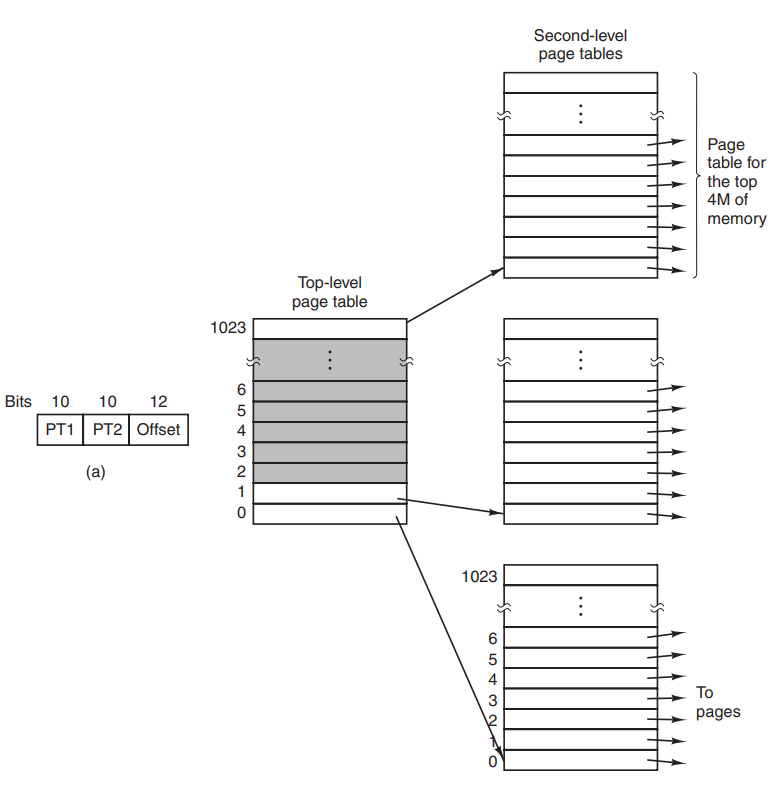

# 第三章 内存管理

操作系统也是软件，进行内存管理时高度依赖于硬件。内存管理单元(MMU)负责处理 CPU 的内存访问请求。

## 地址空间

物理地址空间：从 0 到某个上限的地址集合，每个地址对应一个存储单元，存储单元容量通常为 8 bit。

逻辑地址空间：一个进程可用于寻址内存的一套地址集合。实现逻辑地址空间最简单的方法是动态重定位。动态重定位即给每个 CPU 配置两个特殊的寄存器：基址寄存器和界限寄存器。每当加载一个程序时，将程序的初始物理地址装入基址寄存器，程序的长度装入界限寄存器，之后该进程每次访问内存之前都加上基址寄存器的值，得出最终的值。

## 内存使用记录

**位图**

内存被划分为几个字节到几千字节的分配单元，每个分配单元对应于位图中的一位。位图中 0 表示空闲，1 表示被占用。缺点是搜索可用空闲块时必须找出连续的 0 串，这是一个耗时的操作。

**链表**

用一个链表表示内存使用情况，每个节点表示一个进程占用的内存或一个空闲内存。节点的首位 P 表示进程占用，H 表示空闲内存；第二位表示内存起始地址，第三位表示内存长度。

## 连续内存分配

### 内存碎片问题

内存碎片问题指的是空闲的内存无法被程序利用

- 外部碎片 ：分配单元间的未使用内存，可以通过内存紧缩解决。
- 内部碎片 ：分配单元内的未使用内存

### 分配算法

分区的动态分配方式有以下三种：

1. 首次适配算法：只要第一次找到足够大的空闲区就分配给应用程序
1. 下次适配算法：首次适配算法的修改，找到足够大的空闲区之后记录下位置，下次寻找时从记录位置开始寻找
2. 最佳适配算法：在内存中找到最小且足够的空闲块，分配给应用程序
3. 最差适配算法：在内存中找到最大足够的空闲块，分配给应用程序

## 非连续内存分配

### 分段

**段 :** 在程序中会有来自不同文件的函数，在程序执行时，不同的数据也有不同的字段，比如 ：堆，栈，.bss，.data 等。

### 分页

**帧(Frame)**

物理内存被分割为大小相等的页帧。内存的物理地址是一个二元组 (f，o) → (帧号，帧内偏移)

帧号：F 位，代表共有 2^^^F 个页帧

帧内偏移：S 位，每帧有 2^^^S 个字节

物理地址 = 2^^^S * f + o

**页(Page)**

逻辑地址空间被划分为大小相等的页面，页面和页帧大小通常一致。逻辑地址是一个二元组(p，o) → (页号，页内偏移)

页号 ：P 位，共有 2^^^P 个页面

页内偏移 ：S 位，每页有 2^^^S 个字节

虚拟地址 = 2^^^S * p + o

#### 页表

操作系统维护一张页表，页表保存了逻辑地址到物理地址的映射关系。每个进程都有一个页表。

保护位：指出一个页允许什么类型的访问，可以使用 0/1 表示读/写，也可以使用 3 位表示读/写/执行。
修改位：如果一个页面已经被修改过，则必须写回磁盘，若没有修改过，可以直接丢弃。
访问位：该页面被访问时设置访问位，和页面置换算法相关。
高速缓存位：是否禁用高速缓存。
存在位：该页面是否在内存中，不存在则发生缺页中断。

#### 转换后备缓冲区

虚拟地址到物理地址的映射必须非常快。TLB 可加速分页过程。Translation Look-aside Buffer (TLB，即快表) 是一个缓冲区，可以将经常访问的页表存放在于此。

- 如果 TLB 缓存命中，物理页号可以很快被获取。
- 如果 TLB 未命中，要获取的表项被更新到 TLB 中。

TLB 可以由硬件单元 MMU 管理，也可以通过 TLB 软件管理。

#### 二级/多级页表

如果虚拟地址空间很大，页面也很大，多级页表可解决此问题。

二级页表将虚拟地址分为两个页号和一个偏移量，前一页号对应一级页表，后一页号对应二级页表。通过前一页号查找一级页表，获取对应哪个二级页表；通过后一页号查找选中的二级页表的表项，获取其页帧号，页帧号 + 偏移量 = 物理地址。多级页表同理。

通过多级页表，可以避免一次性将所有页表保存在内存中。

#### 反向页表

当使用多级页表时，页表层级不断增加。反向页表用页帧号对应表项，而不是用页号。只需要一张反向页表即可。缺点是从虚拟地址到物理地址的转换变得困难。

## 覆盖

如果程序超出了内存的容量，可以采用手动的覆盖,，只把需要的指令和数据保存在内存中。把程序按照其逻辑结构，划分为若干个功能上相互独立的程序模块，不会同时执行的模块共享同一块内存区域，按时间先后来运行。

- 必要部分（常用功能）的代码和数据常驻内存；
- 可选部分（不常用功能）在其他程序模块中实现，平时存放在外存中，需要时才才装入内存；
- 不存在调用关系的模块不必同时装入到内存，这些模块可共用一片内存区。

但由程序员来把一个大的程序划分为若干个小的功能模块，并确定各个模块之间的覆盖关系，增加了编程的复杂度。

## 交换

如果是进程太多，超过了内存的容量，可以采用自动交换技术，可将暂时不能运行的程序送到外存，从而获得空闲内存空间。

操作系统把一个进程的整个地址空间的内容保存到外存中（即换出），将外存中的某个进程的地址空间读入到内存中（换入）。交换技术以进程作为交换的单位，需要把进程的整个地址空间都换入换出，增加了处理器的开销。

### 虚拟内存管理技术

虚拟内存像覆盖技术一样，不把程序的所有内容都放在内存中，且由操作系统自动来完成，无需程序员的干涉；像交换技术一样，能够实现进程在内存与外存之间的交换，且只交换进程的部分内容。通过把物理内存和外存相结合，提供大于实际物理内存的虚拟内存空间。

缺页中断处理过程 :

1. 如果在内存中有空闲的页帧，则分配一页帧 f，然后转第 4 步；若没有空闲页帧则转到第2步；
2. 采用一种页面置换算法，选择一个要被替换的页帧 f，它所对应的逻辑页为 q。如果页 q 被修改过则需要写回磁盘，否则可以直接丢弃；
3. 修改 q 对应的页表项的存在位为 0；
4. 将需要访问的页面 p 装入到页帧 f 中；
5. 修改 p 对应的页表项，存在位设为 1，页帧号设为 f；
6. 重新执行被中断的指令。

## 局部页面置换算法

### 最优页面置换算法

基本思路：当一个缺页中断发生时，对于保存在内存当中的每一个逻辑页面，计算在它的下一次访问之前还需等待的时间，从中选择等待时间最长的那个作为被置换的页面。

但这是一种理想情况，在实际系统中是无法实现的，因为操作系统无法知道每一个页面要等待多长时间以后才会再次被访问。

### 先进先出算法

基本思路：选择在内存中驻留时间最长的页面淘汰。系统维护着一个链表记录了所有位于内存当中的逻辑页面。从链表的排列顺序来看，链首页面的驻留时间最长，链尾页面的驻留时间最短。当发生一个缺页中断时，把链首页面淘汰出去，并把新的页面添加到链表的末尾。但性能较差，调出的页面有可能是经常要访问的页面，并且有 Belady 现象。

### 最近最久未使用算法

LRU(Least Recently Used)

基本思路：当一个缺页中断发生时，选择最久未使用的那个页面并淘汰。它是对最优页面置换算法的一个近似，其依据是程序的局部性原理，即在最近一小段时间(最近几条指令)内，如果某些页面被频繁地访问，那么再将来的一小段时间内，他们还可能会再一次被频繁地访问。反过来说，如果过去某些页面长时间未被访问，那么在将来它们还可能会长时间地得不到访问。但 LRU算法需要记录各个页面使用时间的先后顺序，开销比较大。

两种可能的实现方法是 :

- 系统维护一个页面链表，最近刚刚使用过的页面作为首节点，最久未使用的作为尾结点。再一次访问内存时，找出相应的页面，把它从链表中摘下来，再移动到链表首。每次缺页中断发生时，淘汰链表末尾的页面。
- 设置一个活动页面栈，当访问某页时，将此页号压入栈顶，然后，考察栈内是否有与此页面相同的页号，若有则抽出。当需要淘汰一个页面时，总是选择栈底的页面，它就是最久未使用的。

### 时钟页面置换算法

基本思路：把各个页面组织成环形链表(类似钟表面)，把指针指向最老（最先进来）的页面。当一个页面被装入内存时，把访问位初始化为0；如果此页面被访问，把访问位位置设为1。

当发生缺页中断时，查询指针所指向的最老页面：若它的访问位为 0，立即淘汰此页面；若访问位为 1，把该页面访问位置为 0 ，然后指针往前移动一格。如此循环直到找到被淘汰的页面，然后把指针移动到下一格。

### 二次机会算法

时钟页面置换算法只考虑访问位，没有考虑到修改位。二次机会算法同时考虑访问位和修改位。替换优先级：访问位和修改位都为 0 的页面可以被直接淘汰；访问位或修改位为 1 的页面，将访问位或修改位置为 0 （即有一次机会不被淘汰）；访问位和修改位都为 1 的页面，有两次机会不被淘汰。

### 最不常用算法

LFU（Least Frequently used）

基本思路：当一个缺页中断发生时，淘汰访问次数最少的那个页面。

实现方法：对每一个页面设置一个访问计数器，每当一个页面被访问时，该页面的访问计数器加1。当发生缺页中断时，淘汰计数值最小的那个页面。

LRU 和 LFU 的对比 ：LRU考察的是多久未访问，时间越短越越不容易被淘汰。LFU考察的是访问的次数和频度，访问次数越多越不容易被淘汰。

### Belady 现象

在采用 FIFO 算法时，有时会出现分配的物理页面数增加，缺页率反而提高的异常现象。
出现原因 ：被 FIFO 算法置换出去的页面不一定是进程不会访问的。

### 算法比较

LRU 和 FIFO 都是先进先出的思路。LRU 是根据页面最近访问时间进行排序，所以需要动态地调整各个页面之间的先后顺序；FIFO 是根据页面进入内存的时间来进行排序，所以各个页面之间的先后顺序是固定的。 
如果内存当中的所有页面都未曾访问过，LRU 算法就退化为了 FIFO 算法。

### 抖动问题

如果分配给一个进程的物理页面太少，那么进程将会造成很多的缺页中断，需要频繁的在内存与外存之间替换页面，从而使进程的运行速度变得很慢，这种状态称为 "抖动"。