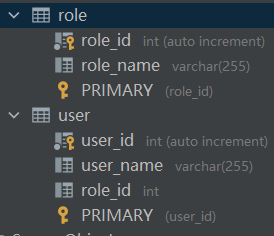

# 第三章 映射文件

MyBatis 的语句映射将减少不必要的代码编写。SQL 映射文件中定义有序的标签如下：

- cache 命名空间的缓存配置
- cache-ref 引用其他命名空间的缓存配置
- resultMap 自定义结果集映射
- sql 抽取可重用语句块
- insert 映射插入语句
- update 映射更新语句
- delete 映射删除语句
- select 映射查询语句

\<mapper> 为映射文件根标签，其余所有标签必须在根标签内有序配置。namespace 属性为映射接口全类名。

### 3.1 chche

MyBatis 系统定义了两级缓存。默认情况下开启 SqlSession 级别的一级缓存（本地缓存），namespace 级别的二级缓存（全局缓存）需要手动开启，或实现 Cache 缓存接口，自定义二级缓存。

#### 3.1.1 一级缓存

MyBatis 的一级缓存存在于 SqlSession 的生命周期中，在同一个 SqlSession 中查询时，MyBatis 会把执行的方法和参数通过算法生成缓存，并存入一个 Map 对象中。再次获取相同数据时，直接从缓存中返回数据。一级缓存无法关闭，但可以被清空。

#### 3.1.2 二级缓存

MyBatis 的二级缓存和映射文件的命名空间绑定。每个映射文件都有自己的二级缓存。

在配置文件中开启全局二级缓存配置。

```xml
<setting name="cacheEnabled" value="true"/>
```

在映射文件中使用 \<cache> 标签开启当前映射文件的二级缓存。

```xml
<cache eviction="LRU" flushInterval="60000" readOnly="false" size="1024"></cache>
```

eviction 缓存回收策略，默认值 LRU

- LRU 移除最长时间不被使用的缓存
- FIFO 按缓存创建先后顺序回收
- SOFT 移除基于垃圾回收器状态和软引用规则的缓存
- WEAK 更积极地移除基于垃圾回收器状态和弱引用规则的缓存

flushInterval 刷新间隔，默认没有刷新间隔，仅仅在调用语句时刷新

size 缓存可以储存的对象数目，默认值 1024

readOnly 缓存是否只读，默认值 false

- true 只读缓存，缓存不能修改，给所有调用者返回相同的缓存，性能更高
- false 读写缓存，缓存可以修改，给调用者返回缓存的拷贝 （通过序列化），更安全

若使用读写缓存，Bean 对象还需实现 Serializable 接口。

#### 3.1.3 缓存辨析

- 配置文件中 cacheEnabled=true 配置的是二级缓存，一级缓存始终开启，无法关闭。

- 映射文件的 \<select> 标签中 useCache=true 配置的是二级缓存，一级缓存始终开启并使用

- 映射文件中增删改查标签中的 flushCache=true 清空一级和二级缓存。

- SqlSession.clearCache() 方法清除一级缓存，对二级缓存无效。

开启一级和二级缓存后，只有当一个 SqlSession 连接关闭后，其一级缓存才会保存到二级缓存中。当调用者查询数据时，先在二级缓存中查询对应数据，找到则直接返回，没找到在一级缓存中查询对应数据，找到则直接返回，没找到直接在数据库里查询对应数据。

### 3.2 cache-ref

对于某一命名空间下的语句只能使用该命名空间的缓存。\<cache-ref> 标签可以引用指定其他命名空间的缓存，实现多个命名空间共享缓存。

```xml
<cache-ref namespace="xxx"/>
```

### 3.3 resultMap

#### 3.3.1 自动映射

MyBatis 默认开启自动映射。当 MyBatis 自动映射查询结果时，MyBatis 会获取结果的列名，和 Bean 中相同名字（忽略大小写）的属性匹配，匹配成功后将列值赋给属性值。在配置文件 \<setting> 标签中，autoMappingBehavior 属性提供三种自动映射等级：

- NONE 禁用自动映射，仅使用手动映射
- PARTIAL 对除了连接查询的属性之外的属性进行映射
- FULL 自动映射所有属性

```xml
<!--默认开启自动映射，默认值为 PARTIAL-->
<setting name="autoMappingBehavior" value="PARTIAL"/>
```

除了自动映射，MyBatis 还可以开启”下划线转驼峰“映射，此时结果集中列名（如 USER_NAME) 会自动匹配 Bean 中的 userName 属性。

```xml
<!--默认关闭下划线转驼峰映射，需手动开启-->
<setting name="mapUnderscoreToCamelCase" value="true"/>
```

#### 3.3.2 手动映射

在复杂的场景下，可能需要使用 \<resultMap> 标签手动映射结果和 Bean 。先处理自动映射，再处理手动映射。\<resultMap> 标签有以下属性：

| 属性        | 描述                                                         |
| ----------- | ------------------------------------------------------------ |
| id          | 此 resultMap 的唯一标识符                                    |
| type        | 全类名或别名，查询结果将映射此类的 Bean 上                   |
| extends     | 当前 resultMap 继承的 resultMap 的 id                        |
| autoMapping | 为当前 resultMap 开启或关闭自动映射，会覆盖全局属性 autoMappingBehavior |

\<resultMap> 标签结构如下：

- constructor 使用指定构造方法将结果映射到 Bean 属性中
- id 将结果中主键列的值映射到 Bean 属性中
- result 将结果中普通列的值映射到 Bean 属性中
- association 将 \<association> 标签内的结果封装到 \<association> 指定的 bean 中
- collection 将 \<collection> 标签内的结果封装到 \<collection> 指定类型的集合中
- discriminator 根据结果值决定使用哪种映射

以下为一个简单的 resultMap 配置。从数据库中查出 user_id 和 user_name 列值映射到 User Bean 的 userId 和 userName 属性中。

```xml
<resultMap id="getUserByIdMap" type="User" autoMapping="true">
    <id column="user_id" property="userId"/>
    <result column="user_name" property="userName"/>
</resultMap>

<!--使用 resultMap-->
<select id="getUserById" resultMap="getUserByIdMap">
    select * from user where user_id = #{id};
</select>
```
\<id> 和 \<result> 的详细属性如下表所示，不指定 javaType 和 jdbcType 属性时，MyBatis 会进行自动类型推断，并使用默认类型处理器进行处理。

| 属性        | 描述                 |
| ----------- | -------------------- |
| property    | Bean 中的属性        |
| column      | 数据库中的列名或别名 |
| javaType    | Java 全类名          |
| jdbcType    | JDBC 类型            |
| typeHandler | 类型处理器           |

除了简单的查询之外，经常需要多表连接查询，从多个表中查询的结果映射到多个嵌套 Bean 中。

如下案例，User 类依赖 Role 类，Role 类嵌套在 User 类中。

```java
public class User {
    private int userId;
    private String userName;
    private Role role;
	//省略空参构造器和 getter, setter 方法
}
```

```java
public class Role {
    private int roleId;
    private String roleName;
	//省略空参构造器和 getter, setter 方法
}
```
User 类对应的 user 表和 Role 类对应的 role 表通过 role_id 字段连接。


user 表和 role 表进行连接查询返回的结果映射到 User Bean 及其嵌套 Role Bean 中。如 resultMap 方式一中， user_id, user_name 列值映射到 User Bean 的  userId 和 userName 属性中，role_id 和 role_name 列值映射到 User Bean 的嵌套 Role Bean （即 role 属性）的 roleId 和 roleName 属性中，用 role.roleId 和 role.roleName 表示。

```xml
<!--方式一，使用 role.roleId 表示映射到嵌套 Role Bean 的 roleId 属性中-->
<resultMap id="getUserAndRoleByIdMap1" type="User" autoMapping="true">
    <id column="user_id" property="userId"/>
    <result column="user_name" property="userName"/>
    <result column="role_id" property="role.roleId"/>
    <result column="role_name" property="role.roleName"/>
</resultMap>

<!--使用 resultMap-->
<select id="getUserAndRoleById" resultMap="getUserAndRoleByIdMap">
    select user_id, user_name, user.role_id, role_name from user, role where user.role_id = role.role_id and user_id = #{id};
</select>
```

也可以将 resultMap 拆分后，用 extends 继承复用。resultMap 方式二和方式一等价。

```xml
<resultMap id="getUserByIdMap" type="User" autoMapping="true">
    <id column="user_id" property="userId"/>
    <result column="user_name" property="userName"/>
</resultMap>

<!--方式二，extends 继承复用-->
<resultMap id="getUserAndRoleByIdMap2" type="User" autoMapping="true" extends="getUserByIdMap">
    <id column="role_id" property="role.roleId"/>
    <result column="role_name" property="role.roleName"/>
</resultMap>
```

方式三使用 \<association> 标签单独表示嵌套 Role Bean。\<association> 标签内的结果映射到嵌套 Role Bean 中，方式三和方式一等价。


```xml
<!--方式三-->
<resultMap id="getUserAndRoleByIdMap3" type="User" autoMapping="true">
    <id column="user_id" property="userId"/>
    <result column="user_name" property="userName"/>
    <association property="role">
        <id column="role_id" property="roleId"/>
        <result column="role_name" property="roleName"/>
    </association>
</resultMap>
```
方式四使用 \<association> 标签的 select 属性进行分步查询。第一次查询出 user 表的 user_id, user_name 和 role_id 列值，根据查到的 role_id 去 role 表里进行第二次查询，两次查询得到的结果映射到 User 和 Role Bean 中，方式四和方式一等价。
```XML
<!--方式四-->
<resultMap id="getUserAndRoleByIdMap4" type="User" autoMapping="true">
    <id column="user_id" property="userId"/>
    <result column="user_name" property="userName"/>
    <association column="role_id" property="role" select="getRoleById"/>
</resultMap>

<!--第一次查询-->
<select id="getUserById" resultMap="getUserAndRoleByIdMap4">
    select * from user where user_id = #{id};
</select>

<!--第二次查询-->
<select id="getRoleById" resultMap="getRoleByIdMap">
    select * from role where role_id = #{id};
</select>
```

\<collection> 标签和 \<association> 标签十分相似，\<association> 标签内的结果封装到 \<association> 指定的 bean 中，\<collection> 标签内的结果封装到 \<collection> 指定类型的集合中。

#### 3.3.3 延迟加载

当使用 \<collection> 和  \<association> 标签的 select 属性对大型数据进行分布查询时，可能出现 N+1 查询问题。使用延迟加载提高查询性能。在全局配置文件中开启延迟加载和按需加载延迟属性。

```xml
<settings>
    <!--开启延迟加载-->
    <setting name="lazyLoadingEnabled" value="true"/>
    <!--按需加载延迟属性-->
    <setting name="aggressiveLazyLoading" value="false"/>
</settings>
```
\<collection> 和  \<association> 标签的 fetchType="lazy" 开启延迟加载，覆盖 lazyLoadingEnabled 全局配置。

#### 3.3.4 鉴别器

鉴别器根据不同的条件，使用不同的 resultMap。如下案例，根据 role_id 的不同值，选择不同的结果映射。

```xml
<resultMap id="Result" type="User">
    <id column="user_id" property="userId"/>
    <result column="user_name" property="userName"/>
    <discriminator javaType="int" column="role_id">
        <case value="1" resultMap="map1"/>
        <case value="2" resultMap="map2"/>
    </discriminator>
</resultMap>
```
### 3.4 sql 

\<sql> 标签抽取可重复使用的 SQL 语句块。\${} 用于获取 \<property> 标签传入的参数值。

```xml
<!--id 为该 SQL 语句块的唯一标识符-->
<sql id="mysql">
    from
    <!--定义 table 参数-->
    ${table}
</sql>
```

使用 \<include> 标签 refid 属性引用指定 SQL 语句块。\<property> 子标签为 SQL 语句块中的指定参数赋值。

```xml
<!--使用 sql 语句块-->
<select id="getUserById" resultMap="getUserByIdMap">
    select *
    <include refid="mysql">
        <!--为 SQL 语句块中的 table 参数赋值-->
        <property name="table" value="user"/>
    </include>
    where user_id = #{id};
</select>
```

### 3.5 insert, update, delete

增删改标签提供了很多属性来精确配置 SQL 语句。部分属性如下表所示：

| 属性             | 描述                                               | 默认值 |
| ---------------- | -------------------------------------------------- | ------ |
| id               | 该语句的唯一标识符                                 |        |
| parameterType    | 传入该语句的参数类型                               | unset  |
| flushCache       | 该语句被调用，一级缓存和二级缓存被清空             | true   |
| useGeneratedKeys | 是否使用 JDBC 的 getGeneratedKeys() 获取自增主键值 | false  |
| keyProperty      | 设置接收自增主键值的属性                           | unset  |
| databaseId       | 该语句匹配哪个数据库厂商                           |        |

设置简单的增删改映射语句：
```xml
<insert id="insert" parameterType="Country">
    insert into country(countryname, countrycode)
    values (#{countryName}, #{countryCode})
</insert>

<update id="update" parameterType="Country">
    update country
    set countryname= #{countryName},
        countrycode=#{countryCode}
    where id = #{id}
</update>

<delete id="delete">
    delete
    from country
    where id = #{id};
</delete>
```
映射接口中对应的方法：
```xml
//插入
public void insert(Country country);
//修改
public void update(Country country);
//删除
public void delete(Integer id);
```

单独使用 MyBatis 时，增删改操作必须提交数据才能生效。

增删改操作除了 void 返回值，还可以返回 boolean, int, long 及其包装类，表示操作影响的行数。

#### 获取自增主键值

MySQL 和 SQL Server 数据库支持主键自增。在插入或更新操作中，设置 \<useGeneratedKeys> 标签获取自增主键值。MyBatis 通过 Statement 对象的 getGeneratedKeys() 方法获取当前的自增主键值，并封装到 \<keyProperty> 标签的 JavaBean 属性中。

```xml
<insert id="insertGetId" parameterType="Country" useGeneratedKeys="true" keyProperty="id">
    insert into country(countryname, countrycode)
    values (#{countryName}, #{countryCode})
</insert>
```

对于不支持主键自增的数据库，用 \<selectKey> 标签。

### 3.6 select

\<select> 标签用于执行查询操作，提供了很多属性来精确配置 SQL 语句。部分属性如下表所示：

| 属性          | 描述                                   | 默认值 |
| ------------- | -------------------------------------- | ------ |
| id            | 该语句的唯一标识符                     |        |
| parameterType | 传入该语句的参数类型                   | unset  |
| resultType    | 该语句返回的结果类型                   | unset  |
| resultMap     | 引用 resultMap（结果映射）             |        |
| flushCache    | 该语句被调用，本地缓存和二级缓存被清空 | false  |
| useCache      | 该语句返回结果被二级缓存缓存起来       | true   |
| databaseId    | 该语句匹配哪个数据库厂商               |        |

设置一个简单的查询映射语句：
```xml
<select id="selectAll" resultType="com.likezhen.mybatis.model.Country" databaseId="mysql">
    select * from country
</select>
```
映射接口中对应的方法：
```java
public List<Country> selectAll();
```

### 3.7 参数处理

增删改查操作时必须传入参数值填充预编译语句的 ? 占位符。在映射接口的方法中定义传入的参数类型，映射文件中的映射 SQL 语句通过 #{} 获取参数值。

#### 3.7.1 传入单个参数

只传入单个参数时，MyBatis 不做额外处理。selectOneById() 方法定义一个 Integer 类型的参数。
```java
public Country selectOneById(Integer id);
```
selectOneById 映射语句中使用 #{变量名} 获取 id 值。传入单个参数时，变量名可以为任意值。
```xml
<select id="selectOneById" resultType="Country" parameterType="Integer">
    select *
    from country
    where id = #{id}
</select>
```

#### 3.7.2 传入多个参数

MyBatis 会将传入映射接口方法的多个参数值封装在 map 中。map 中 key 默认值为 param1 - paramN，value 为传入的参数值。映射文件中用 #{key} 从 map 中获取指定 key 的 value 值。

```java
public Country selectOneByMultiParams(Integer id, String countryCode);
```
```xml
<select id="selectOneByMultiParams" resultType="Country">
    <!--获取传入 selectOneByMultiParams() 方法的第一二个参数值-->
    select * from country where id = #{param1} and countrycode = #{param2}
</select>
```
用 @Param() 注解可自定义 map 中的 key 值。@Param("id") 指定 map 中 key 值为 id，用 #{id} 获取其 value 值。

```xml
 public Country selectOneByMultiParams(@Param("id") Integer id, @Param("countryCode") String countryCode);
```
```xml
<select id="selectOneByMultiParams" resultType="Country">
    <!--获取传入 selectOneByMultiParams() 方法的 id 和 countryCode 参数值-->
    select * from country where id = #{id} and countrycode = #{countryCode}
</select>
```
当传入参数值过多时，可将多个参数值封装在一个 bean 或 map 中再传入。

```java
public class Country {
    private Integer id;
    private String countryCode;
    
    //省略空参构造器
    //省略 getter 和 setter 方法
}
```

```java
 public Country selectOneByMultiParams(Country country);
```

```xml
<select id="selectOneByMultiParams" resultType="Country" parameterType="Country">
    <!--获取传入 selectOneByMultiParams() 方法的 Country 对象中的 id 和 countryCode 属性值 -->
    select * from country where id = #{id} and countrycode = #{countryCode}
</select>
```

使用 #{} 和 ${} 都可以从 map 中获取指定值。#{} 取出值后填充 ? 占位符，可防止 SQL 注入；\${} 取出之后直接拼接在 sql 语句中。

```java
public Country selectTest(@Param("table") String table, @Param("id") Integer id);
```
```xml
<select id="selectTest" resultType="Country">
    select * from ${table} where id = #{id}
</select>
```

