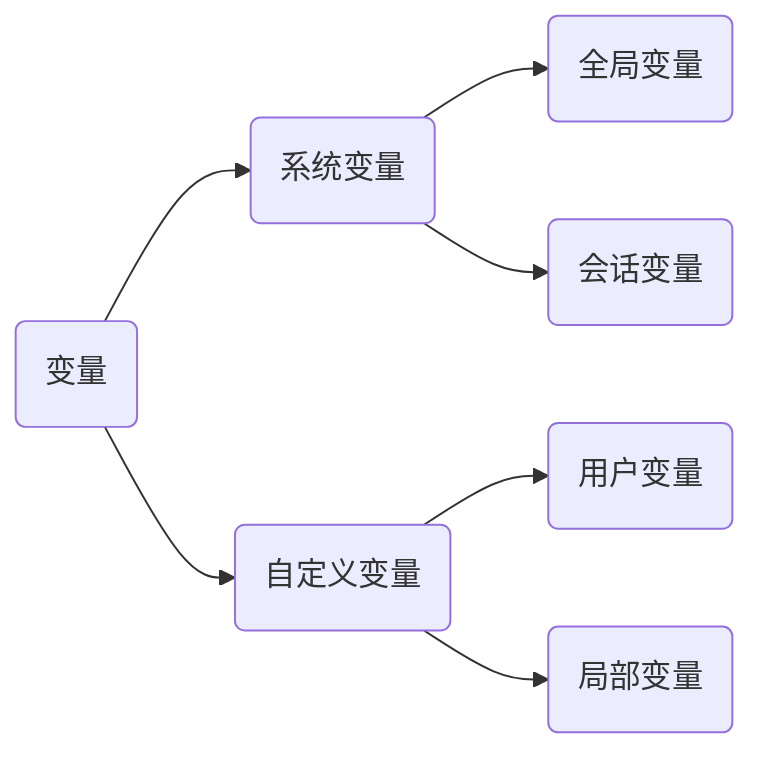

# 第三章 变量与函数

## 变量


<center>图一、变量的分类</center>

### 一、系统变量

一、系统变量
 >由系统提供，服务器启动时自动提供，并赋默认值。 包括全局变量和会话变量。

全局变量：用 ```global```关键词声明，对**服务器**有效，只要不重启就对所有连接有效。每次启动会为所有全局变量赋初始值。
会话变量：用 ```session```关键词声明，仅对**当前会话**有效，每次新的连接都会为所有会话变量赋初始值。

#### （一）查看系统变量

若不声明变量为全局变量，默认为 ```SESSION``` 会话变量。

案例一、查看所有系统变量
语法：
```sql
SHOW GLOBAL | [SESSION] VARIABLES;
```
例子：
```sql
SHOW GLOBAL VARIABLES; #查看全部全局变量
SHOW SESSION VARIABLES; #查看全部会话变量
```
案例二、查看满足条件的部分系统变量
语法：
```sql
SHOW GLOBAL |[SESSION] VARIABLES LIKE 模糊查询;
```
例子：
```sql
 SHOW SESSION VARIABLES LIKE '%char%'; #查看变量名中包含 char 的会话变量
```
案例三、查看指定的某个系统变量
语法：

```sql
SELECT @@global|[session].系统变量名;
```
例子：
```sql
SELECT @@global.transaction_isolation; #查看全局隔离级别
SELECT @@session.transaction_isolation; #查看会话隔离级别
```

#### （二）赋值系统变量

方式一、

语法：
```sql
SET GLOBAL|[SESSION] 系统变量名 = 值;
```
例子：
```sql
SET GLOBAL autocommit = 0; #关闭自动提交
```
方式二、

语法：
```sql
SET @@global|[session].系统变量名 = 值;
```
例子：
```sql
 SET @@session.auto_increment_increment = 3; #设置自增长步长为 3
```
### 二、自定义变量

用户变量：仅对**当前会话**有效
局部变量：仅在定义它的 **BEGIN END** 中有效

####  （一）用户变量
> 由用户自定义的变量，可以在任何地方使用

①声明并初始化（三种方式）
```sql
SET @用户变量名 = 值;
SET @用户变量名 := 值;
SELECT @用户变量名 := 值;
```
②赋值
方式一：如 ①
方式二：
```sql
SELECT 字段 INTO @用户变量名 
FROM 表; #要求只能查询得到一个结果并赋给变量
```
③查看
```sql
SELECT @用户变量名;
```
④删除
用赋值语句把值赋为 ```NULL```

案例、声明并初始化两个变量，求和
```sql
SET @num1 = 1; 
SET @num2 = 5;
SET @sum = @num1 + @num2;
SELECT @sum;
```

####  （二）局部变量

>由用户自定义的变量，只能用在BEGIN END中的第一句

①声明并初始化
```sql
DECLARE 局部变量名 类型;
DECLARE 局部变量名 类型 DEFAULT 值;
```
②赋值

方式一：
```sql
SET 局部变量名 = 值;
SET 局部变量名 := 值;
SELECT @局部变量名 := 值;
```
方式二：
```sql
SELECT 字段 INTO 局部变量名 
FROM 表; #要求只能查询得到一个结果并赋给变量
```
③查看
```sql
SELECT 局部变量名;
```
## 函数

函数在 SQL 中移植性不强，应做好注释。


### 字符函数
 （一）、**LENGTH**，获取参数值的字节个数
 ```sql
SELECT
	LENGTH('john'); #4
 ```

 （二）、**CONCAT**，拼接字符串
 ```sql
SELECT
	CONCAT(last_name, '_', first_name)
FROM
	employees;
 ```
 （三）**UPPER** 和 **LOWER**，将字符转化成大写或小写
 ```sql
SELECT
	UPPER('abc'); #ABC
SELECT
	LOWER('ABC'); #abc
 ```
（四）、**SUBSTRING**，截取，可指定开始截取的初始位置和截取长度
```sql
SELECT
	SUBSTRING('SQL中第一个字节位置为1', 10) AS output; #位置为1
```
```sql
SELECT
	SUBSTRING('SQL中第一个字节位置为1',4,2) AS output; #中第
```
（五）、**INSTR**，返回字串第一次出现的索引，如果找不到则返回 0
```sql
SELECT
	INSTR("今天是星期四","星期四") AS output; #4
```
（六）、**TRIM** 或 **RTRIM** 或 **LTRIM**，删除指定字符
 ```sql
SELECT
	TRIM('      一二   三      '); #一二   三
 ```
```	sql
SELECT
	TRIM('A' FROM 'AAAA一二A三AAAA'); #一二A三
```
（七）、**LPAD** 或**RPAD**，用指定字符填充至指定长度
```sql
SELECT
	LPAD('一二三', 5, '*'); #**一二三
```
```sql
SELECT
	RPAD('一二三', 2, '*'); #一二
```
（八）、**REPLACE**，替换指定字符
```sql
SELECT
	REPLACE('今天是周四','周四','周五'); #今天是周五
```
### 数学函数
（一）、**ROUND**，四舍五入
```sql
SELECT
	ROUND(1.65); #2
```
```sql
SELECT
	ROUND(1.65, 1); #1.7
```
（二）、**CEIL**，向上取整，返回 >= 参数的最小整数
 ```sql
SELECT
	CEIL(1.65); #2
 ```
  （三）、**FLOOR**，向下取整 返回 <= 参数的最大整数
  ```sql
SELECT
	FLOOR(1.65); #1
  ```
（四）、**TRUNCATE**，截断
```sql
SELECT
	TRUNCATE(1.6666, 1); #1.6
```
（五）、**MOD**，取余
```sql
SELECT
	MOD(10, 3); #1
```
### 日期函数
（一）、 **NOW**，返回当前系统日期+时间
```sql
SELECT
	NOW(); #2021-02-26 22:30:54
```
（二）、**CURTIME**，返回当前系统日期，无时间
```sql
SELECT
	CURTIME(); #22:30:54			
```
（三）、**CURDATE**，返回当前系统时间，无日期
```sql
SELECT
	CURDATE(); #2021-02-26，
```
（四）、**YEAR, MONTH, DAY, HOUR, MINUTE,SECOND,** 传入日期参数，获得年份、月份、日期、小时、分钟、秒钟
```sql
SELECT
	YEAR(NOW()); #2021
```
（五）、 **MONTHNAME**，传入日期参数，获得月份英文名称
```sql
SELECT
	MONTHNAME(NOW()); #February
```
（六）、**DATE, TIME**，传入日期参数，获得日期部分和时间部分
```sql
SELECT
	DATE(NOW()); #2021-02-26
```
```sql
SELECT
	TIME(NOW()); #22:34:01
```
（七）、**STR_TO_DATE**，将日期格式的字符串转换成指定格式的日期 
```sql
SELECT
	STR_TO_DATE('4-3 2002', '%d-%m %Y'); #2002-03-04
```
（八）、**DATA_FORMAT**，将日期转换成字符
```sql
SELECT
	DATE_FORMAT('2002-9-8', '%Y年%m月%d日'); #2002年09月08日
```
每种格式符的含义如表 1.1
| 格式符 | 功能                |
| ------ | ------------------- |
| %Y     | 四位的年份          |
| %y     | 2位的年份           |
| %m     | 月份（01,02…11,12） |
| %c     | 月份（1,2,…11,12）  |
| %d     | 日（01,02,…）       |
| %H     | 小时（24小时制）    |
| %h     | 小时（12小时制）    |
| %i     | 分钟（00,01…59）    |
| %s     | 秒（00,01,…59）     |
<center>表 1.1 格式符的含义

### 其他函数
```sql
SELECT
	VERSION(); #8.0.23，显示MySQL版本号
```
```sql
SELECT
	DATABASE(); #myemployees，显示当前数据库
```
```sql
SELECT
	USER(); #root@localhost，显示当前账户
```
### 流程控制函数
#### 1. IF 函数
- IF函数 可实现 Java 中的三元运算符
 ```sql
SELECT
	IF(commission_pct <=> NULL,0,commission_pct) AS 奖金率 #如果奖金率为 NULL，返回 0，否则返回当前奖金率
FROM
	employees;
 ```
#### 2. CASE 函数
- CASE 函数可实现 Java 中 switch-case 和 if-else if-else 的效果

类似于 switch-case 的语法：
```sql
CASE 字段或表达式
WHEN 常量 1 THEN 值 1 或语句 1
WHEN 常量 2 THEN 值 2 或语句 2
...
ELSE 值 n 或语句 n
END
```
案例一、查询员工的工资，要求
部门号 = 30, 显示工资的1.1倍
部门号 = 40, 显示工资的1.2倍
部门号 = 50, 显示工资的1.3倍
其他部门，显示原工资
```sql
SELECT
	department_id 部门号,
	salary 原工资,
	CASE
  		department_id
    	WHEN 30
    	THEN salary * 1.1
    	WHEN 40
    	THEN salary * 1.2
    	WHEN 50
    	THEN salary * 1.3
    	ELSE salary
  	END AS 新工资
FROM
	employees;
```

类似于 if-else if-else 的语法：
```sql
CASE
WHEN 条件一 THEN 值 1 或语句 1
WHEN 条件二 THEN 值 2 或语句 2
...
ELSE 值 n
END
```

案例二、查询员工工资情况
若工资 > 20k，为 A 
若工资 > 15k，为 B 
若工资 > 10k，为 C 
否则，为 D
```sql
SELECT
	salary,
	CASE
    	WHEN salary > 20000
    	THEN 'A'
    	WHEN salary > 15000
    	THEN 'B'
    	WHEN salary > 10000
    	THEN 'C'
    	ELSE 'D'
	END AS 级别
FROM
	employees;
```
### 分组函数
**SUM** 求和
**AVG** 平均
**MIN** 最小值
**MAX** 最大值
**COUNT** 个数，其中 **COUNT(*)** 常用来查询表中的行数，不管是否为 NULL
要点：

- SUM, AVG 函数一般用于处理数值型数据
- 5个分组函数都会忽略查询结果为 NULL 值 
- 能和 DISTINCT 搭配使用实现去重
- **和分组函数一同查询的字段通常放在 GROUP BY 后才有意义**

案例一、查询公司员工工资总和
```sql
SELECT
	SUM(salary)
FROM
	employees;
```
案例二、查询公司员工平均工资和最高工资
```sql
SELECT
	AVG(salary) 平均工资,
	MAX(salary) 最高工资
FROM
	employees;
```