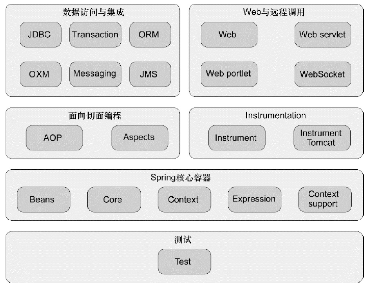
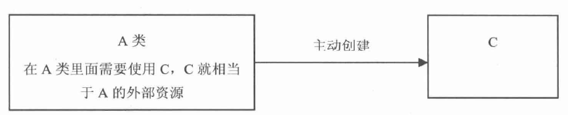
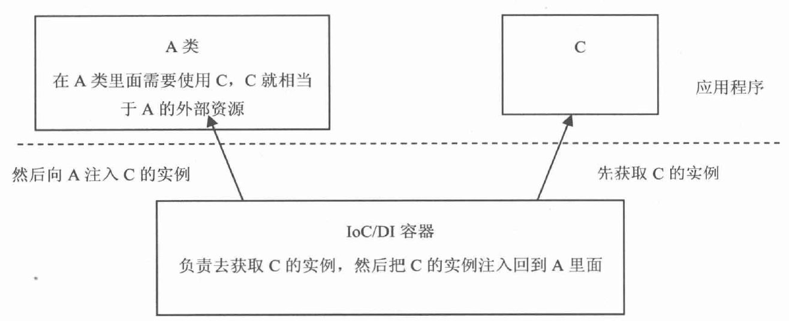
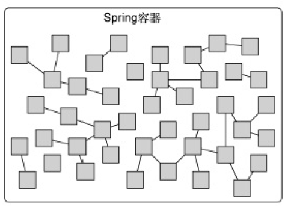

# 第一章 Spring 简介

### 1.1 Spring 框架

Spring 框架的众多模块以及和第三方框架和类库的集成构成了一个生态圈，提供了开发企业级应用所需的一切。



#### 1.1.1 Spring 容器

容器是 Spring 框架最核心的部分，管理着 Spring 应用中 bean 实例的创建、配置和管理，提供了 bean 工厂、应用上下文、E-mail、JNDI 访问、EJB 集成和调度等服务。

#### 1.1.2 AOP 模块

提供了面向切面编程的基础，将遍布系统的横切关注点从核心业务中解耦。

#### 1.1.3 数据集成与访问

Spring 的 JDBC 和 DAO 模块封装了样板式代码，使开发者专注于业务逻辑，并集成流行的 ORM 框架。

#### 1.1.4 Web 与远程调用

除了集成流行的 MVC 框架，Spring 自带了一个 MVC 框架帮助构建 Web 应用。

#### 1.1.5 Instrumentation

提供了为 JVM 添加代理的功能。

#### 1.1.6 测试

测试模块提供了对 Spring 应用的测试。

### 1.2 Spring 简介

Spring 是一个开源框架，设计初衷是用来代替更加重量级的企业级 Java 技术，尤其是 EJB，Spring 提供了更加轻量级和简单的编程模型。为了简化 Java 开发，Spring 采取以下策略：
- 基于轻量级的 POJO 和最小侵入性编程；
- 通过依赖注入和面向接口实现松耦合；
- 基于切面和惯例进行声明式编程；
- 基于切面和模板减少样板式代码。

#### 1.2.1 Java 对象常见术语

- POJO(Plain Ordinary Java Object)
简单无规则的 Java 对象，只有属性和属性的 getter/setter 方法，是最基本的 Jave Bean。

- PO(Persistant Object)
持久层对象，对应数据库中表的字段。一个 PO 代表数据库表中的一条记录。

- VO(Value Object)
值对象，将视图层中页面的属性封装在值对象中，用于在控制层和视图层之间进行数据传输。

- DTO(Data Transfer Object)
数据传输对象，只获取 PO 对象中需要的数据库字段，封装成 DTO 传输，减少不必要的数据传输。

- DAO(Data Access Object)
数据访问对象，负责持久层的操作，为业务层提供接口，包含了各种数据库的操作方法。

- BO(Business Object)
业务对象，封装业务逻辑的对象，调用 DAO 的方法，结合 PO, VO 进行业务操作。

#### 1.2.2 非侵入编程

在 Spring 中使用 bean 或 JavaBean 来表示 Spring 的应用组件，但 Spring 应用组件不一定要遵守 JavaBean 规范，可以遵循更加广泛的 JavaBean 规范，即 POJO(Plain Ordinary Java Object)。很多框架通过强迫应用继承它们的类或实现它们的接口从而导致应用与框架绑死。Spring 竭力避免因自身的 API 而弄乱你的应用程序代码。最坏的场景是一个类使用 Spring 注解，但它依旧是 POJO，这种非侵入编程意味着这个类在 Spring 应用和非 Spring 应用中有相同的作用。

#### 1.2.3 依赖注入（DI）

一般情况下，当对象需要使用对象外部的资源时，例如当 A 类需要使用 C 类时，会主动创建 C 类的对象，这种情况是**正向**的。此时 C 和 A 处于最强的关联关系——组合，如下图所示，这种情况会导致高度耦合和难以测试的代码。




```java
public class A {

    private C c;

    public A() {
        c = new C(); //A 与 C 紧耦合
    }

    public void use() {
        c.method();
    }
}
```

当使用实现了 IOC/DI 功能的框架之后，比如 Spring 容器，当 A 类需要使用 C 类时，不再主动创建 C 类的对象，而是由容器去获取 C 类对象，注入到 A 类中，这种情况称为**反向**的，此时 C 和 A 处于较弱的关联关系——聚合，如下图所示，此时不同类之间耦合程度降低。



```
public class A {

    private C c;

    public A(C c) {
        this.c = c; // 通过构造器注入 C，C 与 A 松耦合
    }

    public void use() {
        c.method();
    }
}
```

控制反转和依赖注入是对同一件事情的不同描述。**控制反转**从容器的角度出发：容器控制应用程序，由容器反向地向应用程序注入其所需要的外部资源。**依赖注入**从应用程序的角度出发：应用程序依赖容器创建并注入它所需要的外部资源。在 Spring 中进行简单的配置即可实现依赖注入。

#### 1.2.4 面向切面编程（AOP）

依赖注入让相互协作的组件保持松耦合，面向切面编程可以把遍布在应用各处的功能分离出来形成可重用的组件。例如每个核心业务模块除了实现自身核心的功能之外，都需要实现日志、事务管理和安全等额外的功能，这些功能称为横切关注点，它们分散在多个组件之中，使代码更加复杂混乱。
面向切面编程能够使这些额外的功能模块化。在 Spring 中进行配置，就可以使这些功能应用到多个组件中。但核心业务层并不知道这些额外功能的存在。

#### 1.2.5 使用模板消除样板式代码

例如使用 JDBC 访问数据库时，最核心的 sql 语句淹没在一堆样板式代码中：先获取数据库连接，再创建一个 PreparedStatement 对象，还必须捕捉异常和关闭资源等。JDBC 不是产生样板式代码的唯一场景，JMS，JNDI 和使用 REST 服务也涉及大量重复代码，编写这些代码有固定的套路，Spring 通过模板封装消除样板式代码，让开发者专注于核心逻辑。

### 1.3 Spring 容器

在基于 Spring  的应用中，Spring 容器负责创建对象，装配、配置、管理其整个生命周期直至死亡。Spring 容器使用依赖注入管理构成应用的组件，创建相互协作的组件之间的关联。



Spring 自带了多个容器实现，归为两种不同的类型：

- bean 工厂是最简单的容器，提供基本的依赖注入，由 org.springframework.beans.factory.BeanFactory 接口定义。
- 应用上下文基于 BeanFacotry 构建，提供应用框架级别的服务，由 org.springframeworks.context.ApplicationContext 接口定义。

#### 1.3.1 使用应用上下文

一般开发中不使用低级的 bean 工厂获取 bean 实例，而是使用应用上下文，应用上下文准备就绪后，调用上下文的 getBean() 方法获取 bean 实例。Spring 自带了多种类型的应用上下文，以下列举常用的应用上下文：
- AnnotationConfigApplicationContext：从一个或多个 Java 配置类中加载 Spring 应用上下文。
- AnnotationConfigWebApplicationContext：从一个或多个 Java 配置类中加载 Spring Web 应用上下文。
- ClassPathXmlApplicationContext：从类路径下的一个或多个 XML 配置文件中加载应用上下文。
- FileSystemXmlApplicationContext：从文件系统路径下的一个或多个 XML 配置文件中加载应用上下文。
- XmlWebApplicationContext：从 Web 应用下的一个或多个 XML 配置文件中加载应用上下文。

#### 1.3.2 bean 实例的生命周期

传统的 Java 应用程序中，bean 实例的生命周期很简单。从用 new 关键字创建 bean 实例，使用 bean 实例，直至不再使用被回收。Spring 容器中 bean 实例的生命周期更加复杂，在 bean 实例准备就绪之前，bean 工厂执行了若干启动步骤。流程如下：
1. Spring 实例化 bean；
2. Spring 将值和 bean 实例的引用注入到 bean 实例对应的属性中；
3. 若 bean 实例实现了 BeanNameAware 接口，Spring 将 bean 实例的 ID 传入 setBeanName() 方法；
4. 若 bean 实现了 BeanFactoryAware 接口，Spring 将 BeanFactory 实例传入 setBeanFactory() 方法；
5. 若 bean 实现了 ApplicationContextAware 接口，Spring 将 bean 实例所在应用上下文传入 setApplicationContext() 方法；
6. 若 bean 实现了 BeanPostProcessor 接口，Spring 将调用它的 postProcessBeforeInitialization() 方法；
7. 若 bean 实现了 InitializingBean 接口或自定义初始化方法，Spring 将调用它的 afterPropertiesSet() 方法；
8. 若 bean 实现了 BeanPostProcessor 接口，Spring 将调用它的 postProcessAfterInitialization() 方法；
9. bean 实例准备就绪，可以被应用程序使用，直至该应用上下文被销毁；
10. 若 bean 实现了 DisposableBean 接口或自定义销毁方法，Spring 将调用它的 destory() 方法。