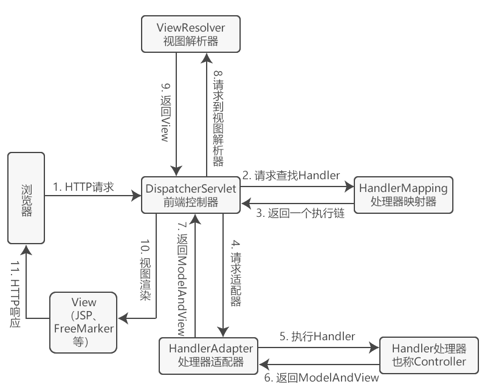

# 第五章 Spring MVC 起步

### 5.1 Spring MVC

Spring MVC 基于模型-视图-控制器模式实现 Web 应用程序。

模型层（Model）：负责处理业务逻辑 和数据操作

视图层（View）：负责格式化数据并呈现给用户

控制层（Controller）：负责接收、处理并转发请求，将响应结果发送给客户端

### 5.2 执行流程

每当用户在 Web 浏览器中点击链接或提交表单时，就开始一个请求。从发出请求到获取响应，中间经历好多过程。Spring MVC 执行流程如下：

1. 用户发起一个 HTTP 请求，请求被前端控制器 DispatcherServlet 接收；
2. DispatcherServlet 请求一个或多个处理器映射，返回一个执行链；
3. DispatcherServlet 将执行链返回的 Handler 发送给处理器适配器；

4. 处理器适配器根据 Handler 信息找到并执行相应的控制器；

5. 控制器执行完毕，返回 ModelAndView 对象，其中包括模型数据和视图信息；

6. 处理器适配器接收到 ModelAndView 对象，返回给 DispatcherServlet；
7. DispatcherServlet 接收到 ModelAndView 对象后，请求视图解析器解析视图；
8. 视图解析器根据接收到的视图信息匹配对应的视图结果，返回给 DispatcherServlet；
9. DispatcherServlet 接收到具体的视图后，填充模型数据渲染视图，生成最终的视图；
10. 视图通过响应结果返回给客户端。



### 5.3 Spring MVC 接口

- DispatcherServlet：所有的请求都要经过前端控制器统一分发，前端控制器相当于一个中央处理器，负责整个流程的执行，统一调度各个组件，降低组件之间的耦合。
- HandlerMapping：处理器映射根据请求的 URL 路径，通过注解或 XML 配置寻找匹配的控制器。
- HandlerAdapter：处理器适配器根据映射器找到的控制器信息，执行对应的控制器。
- Controller：控制器，也称为处理器，和 Java Servlet 起相同作用，执行请求的逻辑，将模型给数据和视图信息封装至 ModelAndView 对象并返回。
- ViewResolver：视图解析器根据视图信息将逻辑视图名解析为真正存在的视图。
- View：View 本身是一个接口，有不同的实现类支持不同的视图技术。

### 5.4 配置 Spring MVC

#### 5.4.1 配置应用上下文

Spring Web中有两种应用上下文，Spring MVC 应用上下文由 **DispatcherServlet** 启动时创建，加载配置文件或配置类中所声明的包含 Web 组件的 bean。另一种 Spring 应用上下文由 **ContextLoaderListener** 创建，加载应用中其他的 bean。
可以继承 AbstractAnnotationConfigDispatcherServletInitializer 类注册并初始化 DispatcherServlet 和 ContextLoaderListener。getServletConfigClasses() 方法声明一个配置类，配置Spring MVC 应用上下文；getRootConfigClasses() 方法声明另一个配置类，配置 Spring 应用上下文；getServletMappings() 方法将一个或多个路径映射到 DispatcherServlet。

```java
public class ChatterWebAppInitializer extends AbstractAnnotationConfigDispatcherServletInitializer {
    //配置 Spring MVC 应用上下文
    @Override
    protected Class<?>[] getRootConfigClasses() {
        return new Class[]{RootConfig.class};
    }

    //配置 Spring 应用上下文
    @Override
    protected Class<?>[] getServletConfigClasses() {
        return new Class[]{WebConfig.class};
    }

    //将 / 映射到 DispatcherServlet
    @Override
    protected String[] getServletMappings() {
        return new String[]{"/"};
    }
	
    //配置过滤器
    @Override
    protected Filter[] getServletFilters() {
        //解决请求查询参数中文乱码问题
        CharacterEncodingFilter characterEncodingFilter = new CharacterEncodingFilter();
        characterEncodingFilter.setEncoding("UTF-8");
        characterEncodingFilter.setForceResponseEncoding(true);

        //用于设置 RESTful DELETE 和 PUT 方法
        HiddenHttpMethodFilter hiddenHttpMethodFilter = new HiddenHttpMethodFilter();
        return new Filter[]{characterEncodingFilter, hiddenHttpMethodFilter};
    }
}
```
或者在 web.xml 文件中进行配置。\<param-name> 和 \<param-value> 键值对共有四种参数值可供使用。

| \<param-name>                  | 描述                                                         |
| ------------------------------ | ------------------------------------------------------------ |
| contextClass                   | 读取配置文件（XmlWebApplicationContext）或配置类（AnnotationConfigWebApplicationContext） |
| contextConfigLocation          | 配置文件（XmlWebApplicationContext）或配置类（AnnotationConfigWebApplicationContext）的路径 |
| namespace                      | WebApplicationContext 的命名空间，默认为 [servlet-name]-servlet |
| throwExceptionIfNoHandlerFound | 当找不到一个请求的控制器时是否抛出 NoHandlerFoundException，默认为 false |

```xml
<?xml version="1.0" encoding="UTF-8"?>
<web-app xmlns="http://xmlns.jcp.org/xml/ns/javaee"
         xmlns:xsi="http://www.w3.org/2001/XMLSchema-instance"
         xsi:schemaLocation="http://xmlns.jcp.org/xml/ns/javaee http://xmlns.jcp.org/xml/ns/javaee/web-app_4_0.xsd"
         version="4.0">
    <listener>
        <listener-class>org.springframework.web.context.ContextLoaderListener</listener-class>
    </listener>
    <!--ContextLoaderListener 加载的配置文件位置-->
    <context-param>
        <param-name>contextConfigLocation</param-name>
        <param-value>/WEB-INF/root-context.xml</param-value>
    </context-param>

    <servlet>
        <servlet-name>dispatcherServlet</servlet-name>
        <servlet-class>org.springframework.web.servlet.DispatcherServlet</servlet-class>
        <init-param>
            <!--DispatcherServlet 加载的配置文件位置-->
            <param-name>contextConfigLocation</param-name>
            <param-value>WEB-INF/dispatcherServlet-context.xml</param-value>
        </init-param>
        <load-on-startup>1</load-on-startup>
    </servlet>
    <servlet-mapping>
        <servlet-name>dispatcherServlet</servlet-name>
        <url-pattern>/</url-pattern>
    </servlet-mapping>
</web-app>
```

#### 5.4.2 配置其他  Servlet、Listener 和 Filter

通过实现 WebApplicationInitializer 接口来注册和初始化任何 Servlet、Listener 和 Filter，分别调用ServletContext 的 addServlet()、addListener() 和 addFilter() 方法。如下代码所示，先创建注解应用上下文，加载注册配置类，再创建并注册 DispatcherServlet，命名为 app，映射为根目录。

```java
public class ChatterWebAppInitializer implements WebApplicationInitializer {
    @Override
    public void onStartup(ServletContext servletContext) throws ServletException {
        //创建注解应用上下文，加载 Web 应用配置类
        AnnotationConfigWebApplicationContext context = new AnnotationConfigWebApplicationContext();
        context.register(AppConfig.class);

        //创建并注册 DispatcherServlet
        DispatcherServlet servlet = new DispatcherServlet(context);
        ServletRegistration.Dynamic registration = servletContext.addServlet("app", servlet);
        registration.setLoadOnStartup(1);
        registration.addMapping("/");
    }
}
```

### 5.5 Spring MVC 配置类

可在 Spring MVC 配置类中开启 Spring MVC，配置对静态资源的处理，配置视图解析器、文件上传解析器，拦截器，异常处理解析器等。

#### 5.5.1 开启 Spring MVC

配置类上的 @EnableWebMvc 注解开启 Spring MVC。

```java
@Configuration
@EnableWebMvc
@ComponentScan("chatter.web")
public class WebConfig implements WebMvcConfigurer {}
```

#### 5.5.2 处理静态资源

客户端发送对静态资源的请求不需要被 DispatcherServlet 转发至控制器。可以在 Spring MVC 配置类中实现 WebMvcConfigurer 接口，注册对静态资源的处理或开启默认 Servlet。

```java
@Configuration
@EnableWebMvc
@ComponentScan("chatter.web")
public class WebConfig implements WebMvcConfigurer {

      //方式一：注册对静态资源的处理
    @Override
    public void addResourceHandlers(ResourceHandlerRegistry registry) {
        registry.addResourceHandler("/resources/**").addResourceLocations("classpath:/static/")
                .setCacheControl(CacheControl.maxAge(Duration.ofDays(365)));
    }

    //方式二：开启 Servlet 容器中的默认 Servlet
    @Override
    public void configureDefaultServletHandling(DefaultServletHandlerConfigurer configurer) {
        //DispatcherServlet 无法处理的请求转发给默认 Servlet 处理
        configurer.enable();
    }
    
}
```

#### 5.5.3 配置视图解析器

配置视图解析器见 [Thymeleaf ](00.Thymeleaf.md) 学习笔记，配置其他视图解析器见 [Web 视图 ](06.Web视图.md) 。

#### 5.5.4 配置文件上传解析器

见 [控制器 ](07.控制器.md)。

#### 5.5.5 配置拦截器

Spring 提供了 HandlerInterceptor 接口，用于拦截处理器方法。

- preHandle()：在处理器方法执行之前拦截，返回 true 放行，返回 false 拦截。s
- postHandle()：在处理器方法执行之后执行
- afterCompletion()：在视图渲染之后执行

如下自定义 myInterceptor 拦截器。
```java
@Component
public class myInterceptor implements HandlerInterceptor {
    @Override
    public boolean preHandle(HttpServletRequest request, HttpServletResponse response, Object handler) throws Exception {
        System.out.println("在控制器处理方法执行之前拦截");

        //放行
        return true;
    }

    @Override
    public void postHandle(HttpServletRequest request, HttpServletResponse response, Object handler, ModelAndView modelAndView) throws Exception {
        System.out.println("在控制器处理方法执行之后执行");
    }

    @Override
    public void afterCompletion(HttpServletRequest request, HttpServletResponse response, Object handler, Exception ex) throws Exception {
        System.out.println("在视图渲染之后执行");
    }
}
```
在 java 配置类中注册拦截器，设置拦截和不拦截的 URL 请求路径。
```java
//注册拦截器
@Override
public void addInterceptors(InterceptorRegistry registry) {
    registry.addInterceptor(new myInterceptor()).addPathPatterns("/**").excludePathPatterns("/admin/**");
}
```

若配置多个拦截器，多个拦截器执行顺序为：

- 若所有拦截器都放行，每个拦截器的 preHandle() 方法按照注册先后顺序执行，postHandle() 和 afterCompletion() 按注册先后反序执行。
- 若有拦截器进行拦截，此拦截器和之前拦截器的 preHandle() 顺序执行，postHandle() 都不执行，此拦截器之前的 afterCompletion() 方法反序执行。

#### 5.5.6 配置异常解析器

Spring 定义了 异常处理接口 HandlerExceptionResolver，默认使用 DefaultHandlerExceptionResolver 处理异常，使用 SimpleMappingExceptionResolver 和  @ExceptionHandler 注解自定义异常处理器。

```java
//配置 SimpleMappingExceptionResolver 对象
@Bean
public SimpleMappingExceptionResolver exceptionResolver() {
    //创建 SimpleMappingExceptionResolver 对象
    SimpleMappingExceptionResolver resolver = new SimpleMappingExceptionResolver();

    Properties properties = new Properties();
    //配置异常名和处理异常的视图名
    properties.setProperty("java.lang.ArithmeticException", "error");
    //映射异常名和视图名
    resolver.setExceptionMappings(properties);
    //设置共享在请求范围中的异常信息的属性名，默认为 exception
    resolver.setExceptionAttribute("mathException");
    return resolver;
}
```
```java
@ExceptionHandler(value = {ArithmeticException.class})
public String error(Exception exception, Model model) {
    model.addAttribute("mathException", exception);
    return "error";
}
```

