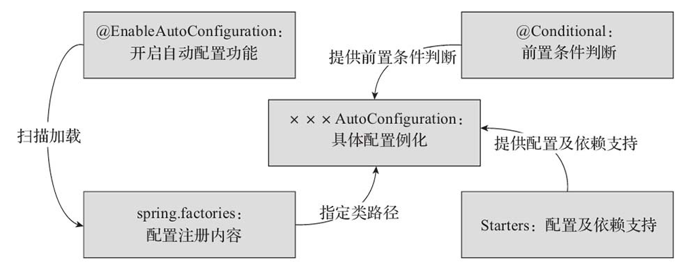
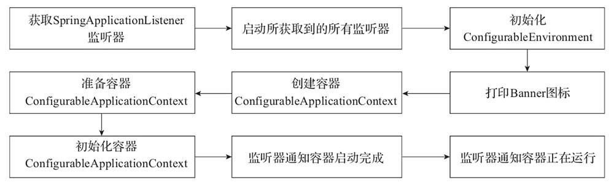

# 第九章 SpringBoot

Spring Boot 就是 Spring。使用 Spring Boot很容易创建一个能独立运行、准生产级别、基于 Spring 框架的项目，使用 Spring Boot 可以不用或者只需要很少的 Spring 配置。

简而言之，Spring Boot 本身并不提供 Spring 的核心功能，而是作为 Spring 的脚手架框架，以达到快速构建项目、预置三方配置、开箱即用的目的。Spring Boot 有如下的优点：

- 可以对主流开发框架的无配置集成；
- 项目可独立运行，无需外部依赖 Servlet 容器；
- 提供运行时的应用监控；
- 可以极大地提高开发、部署效率；
- 可以与云计算天然集成。

### 依赖管理

spring-boot-dependencies.pom 文件下声明了所有开发中常用的依赖的版本号。引用依赖时不需要写版本。

```pom
 <properties>
    <activemq.version>5.16.4</activemq.version>
    <antlr2.version>2.7.7</antlr2.version>
    <appengine-sdk.version>1.9.95</appengine-sdk.version>
    <artemis.version>2.19.1</artemis.version>
    <aspectj.version>1.9.7</aspectj.version>
    <assertj.version>3.21.0</assertj.version>
    <atomikos.version>4.0.6</atomikos.version>
    <awaitility.version>4.1.1</awaitility.version>
    <build-helper-maven-plugin.version>3.2.0</build-helper-maven-plugin.version>
    <byte-buddy.version>1.11.22</byte-buddy.version>
    <caffeine.version>2.9.3</caffeine.version>
 </properties>
```

可在配置文件中自定义版本号。

```
#自定义 mysql 版本号为 5.1.43
<properties>
    <mysql.version>5.1.43</mysql.version>
</properties>
```

Spring Boot通过提供众多起步依赖（Starter）降低项目依赖的复杂度。起步依赖本质上是一个 Maven 项目对象模型（POM），定义了对其他库的传递依赖。这些东西加在一起即支持某项功能。很多起步依赖的命名都暗示了它们提供的某种或某类功能。spring-boot-starter-\* 为官方提供的场景起步。

可以自定义场景依赖，\*-spring-boot-starter 一般为第三方提供的简化开发的场景起步。

### 自动配置

自动配置 Tomcat，SpringMVC 和 Web 常见功能，如前端控制器、字符编码过滤器、视图解析器等。SpringBoot 无需配置包扫描，主程序所在包及其下面的所有子包的组件都会被默认扫描进来。若想要改变扫描路径，@SpringBootApplication(scanBasePackages="com.andy") 或者 @ComponentScan 指定扫描路径或者用 Java 配置类进行配置。

```java
@SpringBootApplication
等价于
@SpringBootConfiguration
@EnableAutoConfiguration
@ComponentScan("com.andy.springbootdemo")
```
各种配置都拥有默认值，默认配置最终都是映射到对应的 Java 配置类上。配置文件的值最终也会绑定在 Java 配置类上，容器会创建配置类的 Bean。

引入的场景的自动配置才会开启，SpringBoot 所有的自动配置功能都在 spring-boot-autoconfigure 包里面。

###  自动配置原理

@SpringBootConfiguration 就是 @Configuration，代表当前类是一个配置类
@ComponentScan() 开启包扫描
@EnableAutoConfiguration 允许自动配置

- @AutoConfigurationPackage 给容器中导入 Registrar 组件，调用 Registrar 中的方法将主程序所在包下的所有组件导入进来。
  - ```
    @Import(AutoConfigurationPackages.Registrar.class)  
    public @interface AutoConfigurationPackage {}
    ```
  
- @Import({AutoConfigurationImportSelector.class}) 
  - 导入 AutoConfigurationImportSelector 类 -> getAutoConfigurationEntry() -> getCandidateConfigurations() -> SpringFactoriesLoader.loadSpringFactories() 。
    loadSpringFactories() 加载文件 META-INF/spring.factories。

spring-boot-autoconfigure-2.3.4.RELEASE.jar 包定义了 META-INF/spring.factories，该文件里定义了springboot 一启动就要给容器中加载的 127 个配置类。SpringBoot 默认会在底层配好所有的组件。但是如果用户自己配置了以用户的优先。



整个自动装配的过程是：SpringBoot 通过 @EnableAutoConfiguration 注解开启自动配置，加载spring.factories 中注册的各种 AutoConfiguration 类，当某个 AutoConfiguration 类满足其注解  @Conditional指定的生效条件时，默认都会与配置文件中指定的值绑定。实例化该 AutoConfiguration 类中定义的 Bean 并注入 Spring 容器。

Spring boot 提供两种定制化配置：

- 用户直接自己 @Bean 替换底层的组件

- 用户修改与该 bean 绑定的配置文件的值

### 组件添加

@Configuration 修饰的类表示配置类，配置类里的方法使用 @Bean 注解注册组件，默认是单实例。配置类本身也是组件。

@Configuration(proxyBeanMethods = true)，默认值，Full 模式，保证 @Bean 方法调用多少次都是单实例。SpringCglib 代理了 @Bean 的方法，调用方法时会先去容器里寻找组件。

@Configuration(proxyBeanMethods = false)，Lite模式，@Bean 方法每调用一次就创建一个新实例，因为没有代理方法，不会去容器里寻找组件。

组件之间无依赖关系用 Lite 模式加速容器启动过程，减少判断；组件之间有依赖关系用 Full 模式确保单实例。

@Component、@Controller、@Service、@Repository 仍然能够添加组件。

@Import 给容器中自动创建出指定类型的组件，默认组件的名字是全类名。

@Conditional 进行条件装配。满足 Conditional 指定的条件时才进行添加指定组件。

- @ConditionalOnBean：在容器中有指定 Bean 的条件下
- @ConditionalOnClass：在 classpath 类路径下有指定类的条件下
- @ConditionalOnCloudPlatform：当指定的云平台处于 active 状态时
- @ConditionalOnExpression：基于 SpEL 表达式的条件判断
- @ConditionalOnJava：基于 JVM 版本作为判断条件
- @ConditionalOnJndi：在 JNDI 存在的条件下查找指定的位置
- @ConditionalOnMissingBean：当容器里没有指定 Bean 的条件时
- @ConditionalOnMissingClass：当类路径下没有指定类的条件时
- @ConditionalOnNotWebApplication：在项目不是一个 Web 项目的条件下
- @ConditionalOnProperty：在指定的属性有指定值的条件下
- @ConditionalOnResource：类路径是否有指定的值
- @ConditionalOnSingleCandidate：当指定的 Bean 在容器中只有一个或者有多个但是指定了首选的 Bean时
- @ConditionalOnWebApplication：在项目是一个 Web 项目的条件下

@ImportResource 导入 spring xml 配置文件，注册组件 \<bean\>。

### 配置绑定

@ConfigurationProperties 将 application.properties 文件中的内容与 Bean 中的属性绑定。

@Component + @ConfigurationProperties 或 @EnableConfigurationProperties + @ConfigurationProperties 都可以开启配置绑定。

```
@Component
/*和配置文件中 user 开头的信息绑定*/
@ConfigurationProperties(prefix = "user")
public class User {
	
	private String username; //读取配置文件中 user.username 
	private String password; //读取配置文件中 user.password 

}
```
配置文件内容如下
```
user.username=andy
user.password=123456
```

### 启动流程

Spring Boot 项目创建完成会默认生成一个名为 *Application 的入口类，通过该类的 main 方法启动 Spring Boot项目。在 main 方法中，通过 SpringApplication 的静态方法 run 实例化 SpringApplication，然后用该对象调用另外一个 run 方法来完成整个项目的初始化和启动。

SpringApplication 调用的 run 方法的大致流程，如下图：



SpringApplication 在 run 方法中重点做了以下操作：

- 获取监听器和参数配置
- 打印 Banner 信息
- 创建并初始化容器
- 监听器发送通知

### 实践

- 引入场景实践

  https://docs.spring.io/spring-boot/docs/current/reference/html/using-spring-boot.html#using-boot-starter

- 配置文件开启 debug 开启自动配置报告
  ```debug=true```

- 修改配置文件

  https://docs.spring.io/spring-boot/docs/current/reference/html/appendix-application-properties.html#common-application-properties
  
- 自定义加入或替换组件


安装 spring-boot-devtools 后，项目或者页面修改以后按 Ctrl+F9 可以立即构建并重启项目。
