## 1. 基本知识

#### 1.1 MySQL 一条查询语句的执行过程

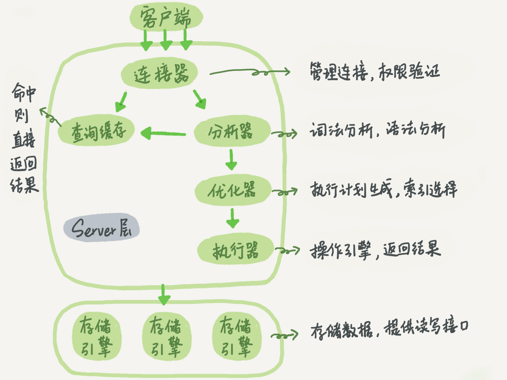

**连接器**

你会先连接到这个数据库上，这时候接待你的就是连接器。连接器负责跟客户端建立连接、获取权限、维持和管理连接。

如果用户名或密码不对，你就会收到一个"Access denied for user"的错误，然后客户端程序结束执行。
如果用户名密码认证通过，连接器会到权限表里面查出你拥有的权限。之后，这个连接里面的权限判断逻辑，都将依赖于此时读到的权限。

一个用户成功建立连接后，即使你用管理员账号对这个用户的权限做了修改，也不会影响已经存在连接的权限。修改完成后，只有再新建的连接才会使用新的权限设置。show processlist 查看空闲连接，默认连接 8 小时没动静断开连接

**分析器**

分析器先会做“词法分析”，做完了这些识别以后，就要做“语法分析”。根据词法分析的结果，语法分析器会根据语法规则，判断你输入的这个 SQL 语句是否满足 MySQL 语法。

**优化器**

优化器是在表里面有多个索引的时候，决定使用哪个索引；或者在一个语句有多表关联（join）的时候，决定各个表的连接顺序。优化器阶段完成后，这个语句的执行方案就确定下来了，然后进入执行器阶段。

**执行器**

开始执行的时候，要先判断一下你对这个表 T 有没有执行查询的权限，如果没有，就会返回没有权限的错误。如果有权限，就打开表继续执行。打开表的时候，执行器就会根据表的引擎定义，去使用这个引擎提供的接口。

**存储引擎**

#### 1.2 MySQL 一条更新语句的执行过程

除了和查询流程相似的流程，更新流程还涉及两个重要的日志模块 redo log（重做日志）和 binlog（归档日志）
WAL 技术：先写日志再写磁盘

**redo log**

redo log 是 InnoDB 引擎特有的日志。当有一条记录需要更新的时候，InnoDB 引擎就会先把记录写到 redo log（粉板）里面，并更新内存，这个时候更新就算完成了。同时，InnoDB 引擎会在适当的时候，将这个操作记录更新到磁盘里面。

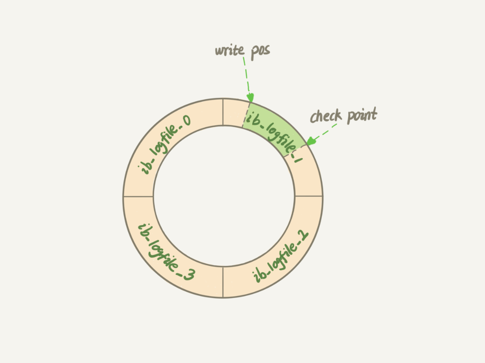

write pos 和 checkpoint 之间的是“粉板”上还空着的部分，可以用来记录新的操作。如果 write pos 追上 checkpoint，表示“粉板”满了，这时候不能再执行新的更新，得停下来先擦掉一些记录，把 checkpoint 推进一下。有了 redo log，InnoDB 就可以保证即使数据库发生异常重启，之前提交的记录都不会丢失，这个能力称为 crash-safe。

**binlog**

Server 层也有自己的日志，称为 binlog

**redo log 和 binlog**

redo log 是 InnoDB 引擎特有的；binlog 是 MySQL 的 Server 层实现的，所有引擎都可以使用。
redo log 是物理日志，记录的是“在某个数据页上做了什么修改”；binlog 是逻辑日志，记录的是这个语句的原始逻辑，比如“给 ID=2 这一行的 c 字段加 1 ”。
redo log 是循环写的，空间固定会用完；binlog 是可以追加写入的。“追加写”是指 binlog 文件写到一定大小后会切换到下一个，并不会覆盖以前的日志。

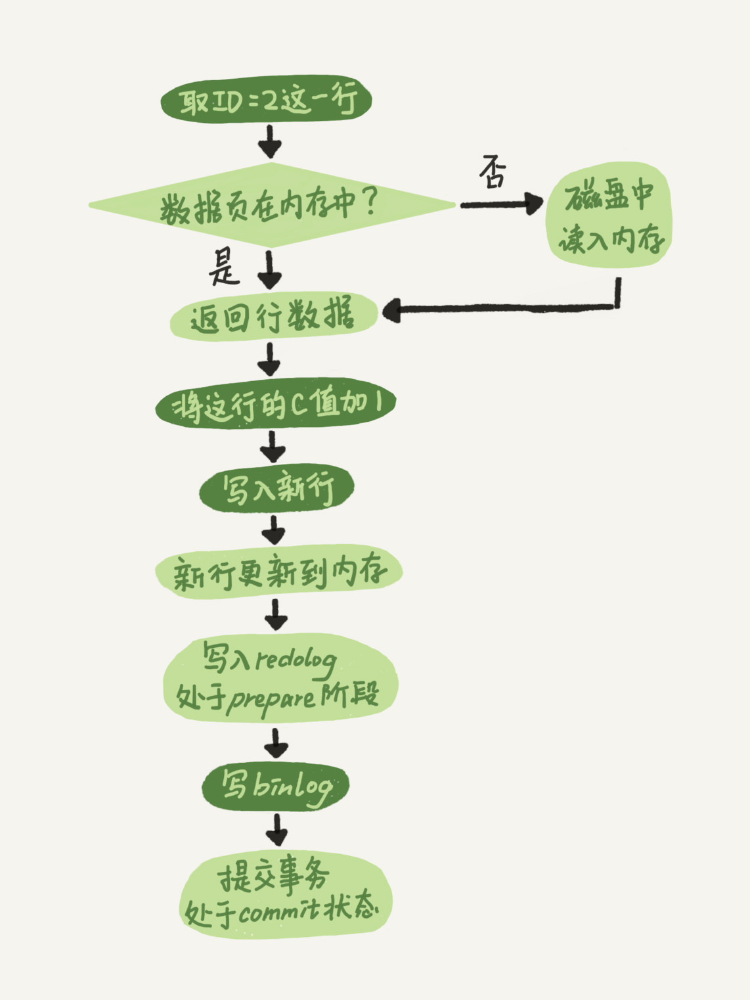

两阶段提交就是让这两个状态保持逻辑上的一致。

redo log 用于保证 crash-safe 能力。innodb_flush_log_at_trx_commit 这个参数设置成 1 的时候，表示每次事务的 redo log 都直接持久化到磁盘。
sync_binlog 这个参数设置成 1 的时候，表示每次事务的 binlog 都持久化到磁盘。

#### 1.3 表跟表是怎么关联的？

**参考答案**

表与表之间常用的关联方式有两种：内连接、外连接，下面以MySQL为例来说明这两种连接方式。

内连接：

内连接通过INNER JOIN来实现，它将返回两张表中满足连接条件的数据，不满足条件的数据不会查询出来。

外连接：

外连接通过OUTER JOIN来实现，它会返回两张表中满足连接条件的数据，同时返回不满足连接条件的数据。外连接有两种形式：左外连接（LEFT OUTER JOIN）、右外连接（RIGHT OUTER JOIN）。

-   左外连接：可以简称为左连接（LEFT JOIN），它会返回左表中的所有记录和右表中满足连接条件的记录。
-   右外连接：可以简称为右连接（RIGHT JOIN），它会返回右表中的所有记录和左表中满足连接条件的记录。

除此之外，还有一种常见的连接方式：等值连接。这种连接是通过WHERE子句中的条件，将两张表连接在一起，它的实际效果等同于内连接。出于语义清晰的考虑，一般更建议使用内连接，而不是等值连接。


## 2. 索引

当需要更新一个数据页时，如果数据页在内存中就直接更新，而如果这个数据页还没有在内存中
的话，在不影响数据一致性的前提下，InooDB会将这些更新操作缓存在change buffer中，这样
就不需要从磁盘中读入这个数据页了，change buffer用的是buffer pool里的内存。

对于唯一索引来说，需要将数据页读入内存（不使用 change buffer），判断到没有冲突，插入这个值，语句执行结束；
对于普通索引来说，则是将更新记录在change buffer，语句执行就结束了。


#### 2.1 MySQL 抖动现象？

一条SQL语句，正常执行的时候特别快，但是有时也不知道怎么回事，它就会变得特别慢，并且这样的场景很难复现，它不只随机，而且持续时间还很短的情况称为抖动。

刷脏页的四种情形：

1. 是InnoDB的redo log写满了。这时候系统会停止所有更新操作，把checkpoint往前推进，redo log留出空间可以继续写
2. 系统内存不足。当需要新的内存页，而内存不够用的时候，就要淘汰一些数据页，空出内存给别的数据页使用。如果淘汰的是“脏页”，就要先将脏页写到磁盘。
3. MySQL认为系统“空闲”的时候，只要有机会就刷一点“脏页”
4. MySQL正常关闭的情况。这时候，MySQL会把内存的脏页都flush到磁盘上，这样下次MySQL启动的时候，就可以直接从磁盘上读数据，启动速度会很快。

脏页比例：Innodb_buffer_pool_pages_dirty/Innodb_buffer_pool_pages_total。平时要多关注脏页比例，不要让它经常接近75%。

在准备刷一个脏页的时候，如果这个数据页旁边的数据页刚好是脏页，就会把这个“邻居”也带着一起刷掉；而且还可以继续蔓延，也就是对于每个邻居数据页，如果跟它相邻的数据页也还是脏页的话，也会被放到一起刷。**innodb_flush_neighbors** 参数就是用来控制这个行为的，值为1的时候会有上述的“连坐”机制，值为0时表示不找邻居，自己刷自己的。

#### 2.2 说你对MySQL索引的理解

**参考答案**

索引是一个单独的、存储在磁盘上的数据库结构，包含着对数据表里所有记录的引用指针。使用索引可以快速找出在某个或多个列中有一特定值的行，所有MySQL列类型都可以被索引，对相关列使用索引是提高查询操作速度的最佳途径。

索引是在存储引擎中实现的，因此，每种存储引擎的索引都不一定完全相同，并且每种存储引擎也不一定支持所有索引类型。MySQL中索引的存储类型有两种，即BTREE和HASH，具体和表的存储引擎相关。MyISAM和InnoDB存储引擎只支持BTREE索引；MEMORY/HEAP存储引擎可以支持HASH和BTREE索引。

1.  可以大大加快数据的查询速度，这也是创建索引的主要原因。
2.  在使用分组和排序子句进行数据查询时，也可以显著减少查询中分组和排序的时间。

增加索引也有许多不利的方面，主要表现在如下几个方面：

1.  创建索引和维护索引要耗费时间，并且随着数据量的增加所耗费的时间也会增加。
2.  索引需要占磁盘空间，除了数据表占数据空间之外，每一个索引还要占一定的物理空间，如果有大量的索引，索引文件可能比数据文件更快达到最大文件尺寸。
3.  当对表中的数据进行增加、删除和修改的时候，索引也要动态地维护，这样就降低了数据的维护速度。

#### 2.3 如何创建及保存MySQL的索引？

**参考答案**

MySQL支持多种方法在单个或多个列上创建索引：

在创建表的时候创建索引：

使用CREATE TABLE创建表时，除了可以定义列的数据类型，还可以定义主键约束、外键约束或者唯一性约束，而不论创建哪种约束，在定义约束的同时相当于在指定列上创建了一个索引。创建表时创建索引的基本语法如下：

```
CREATE TABLE table_name [col_name data_type] [UNIQUE|FULLTEXT|SPATIAL] [INDEX|KEY] [index_name] (col_name [length]) [ASC|DESC]
```

其中，UNIQUE、FULLTEXT和SPATIAL为可选参数，分别表示唯一索引、全文索引和空间索引；INDEX与KEY为同义词，两者作用相同，用来指定创建索引。

例如，可以按照如下方式，在id字段上使用UNIQUE关键字创建唯一索引：

```
CREATE TABLE t1 (  id INT NOT NULL,     name CHAR(30) NOT NULL,     UNIQUE INDEX UniqIdx(id) );
```

在已存在的表上创建索引

在已经存在的表中创建索引，可以使用ALTER TABLE语句或者CREATEINDEX语句。

ALTER TABLE创建索引的基本语法如下：

```
ALTER TABLE table_name ADD  [UNIQUE|FULLTEXT|SPATIAL] [INDEX|KEY] [index_name] (col_name[length],...) [ASC|DESC]
```

例如，可以按照如下方式，在bookId字段上建立名称为UniqidIdx的唯一索引：

```
ALTER TABLE book ADD UNIQUE INDEX UniqidIdx (bookId);
```

CREATE INDEX创建索引的基本语法如下：

```
CREATE [UNIQUE|FULLTEXT|SPATIAL] INDEX index_name  ON table_name (col_name [length],...) [ASC|DESC]
```

例如，可以按照如下方式，在bookId字段上建立名称为UniqidIdx的唯一索引：

```
CREATE UNIQUE INDEX UniqidIdx ON book (bookId);
```

#### 2.4 如何评估一个索引创建的是否合理？

建议按照如下的原则来设计索引：

1.  避免对经常更新的表进行过多的索引，并且索引中的列要尽可能少。应该经常用于查询的字段创建索引，但要避免添加不必要的字段。
2.  数据量小的表最好不要使用索引，由于数据较少，查询花费的时间可能比遍历索引的时间还要短，索引可能不会产生优化效果。
3.  在条件表达式中经常用到的不同值较多的列上建立索引，在不同值很少的列上不要建立索引。比如在学生表的“性别”字段上只有“男”与“女”两个不同值，因此就无须建立索引，如果建立索引不但不会提高查询效率，反而会严重降低数据更新速度。

#### 2.5 数据库索引失效了怎么办？

**参考答案**

可以采用以下几种方式，来避免索引失效：

1.  使用组合索引时，需要遵循“最左前缀”原则；
2.  不在索引列上做任何操作，例如计算、函数、类型转换，会导致索引失效而转向全表扫描；
3.  尽量使用覆盖索引（之访问索引列的查询），减少 select * 覆盖索引能减少回表次数；
4.  MySQL在使用不等于（!=或者<>）的时候无法使用索引会导致全表扫描；
5.  LIKE以通配符开头（%abc）MySQL索引会失效变成全表扫描的操作；

#### 2.6 所有的字段都适合创建索引吗？

**参考答案**

不是。

下列几种情况，是不适合创建索引的：

1.  频繁更新的字段不适合建立索引；
2.  where条件中用不到的字段不适合建立索引；
3.  数据比较少的表不需要建索引；
4.  数据重复且分布比较均匀的的字段不适合建索引，例如性别、真假值；
5.  参与列计算的列不适合建索引。

#### 2.7 说一说索引的实现原理

**参考答案**

在MySQL中，索引是在存储引擎层实现的，不同存储引擎对索引的实现方式是不同的，下面我们探讨一下MyISAM和InnoDB两个存储引擎的索引实现方式。

MyISAM索引实现：

MyISAM的索引文件仅仅保存数据记录的地址。在MyISAM中，主索引和辅助索引（Secondary key）在结构上没有任何区别，只是主索引要求key是唯一的，而辅助索引的key可以重复。

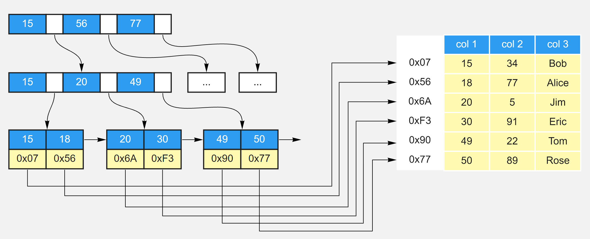

InnoDB索引实现：

虽然InnoDB也使用B+Tree作为索引结构，但具体实现方式却与MyISAM截然不同。

第一个重大区别是InnoDB的数据文件本身就是索引文件。MyISAM索引文件和数据文件是分离的，索引文件仅保存数据记录的地址。而在InnoDB中，表数据文件本身就是按B+Tree组织的一个索引结构，这棵树的叶节点data域保存了完整的数据记录。这个索引的key是数据表的主键，因此InnoDB表数据文件本身就是主索引。

叶节点包含了完整的数据记录。这种索引叫做聚集索引。因为InnoDB的数据文件本身要按主键聚集，所以InnoDB要求表必须有主键（MyISAM可以没有），如果没有显式指定，则MySQL系统会自动选择一个可以唯一标识数据记录的列作为主键，如果不存在这种列，则MySQL自动为InnoDB表生成一个隐含字段作为主键，这个字段长度为6个字节，类型为长整形。

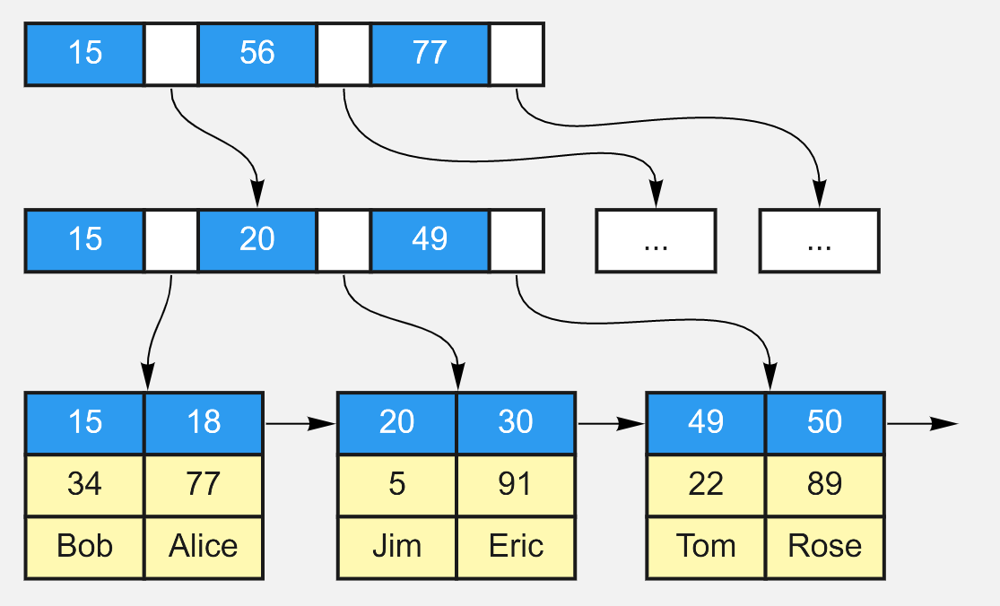

第二个与MyISAM索引的不同是InnoDB的辅助索引data域存储相应记录主键的值而不是地址。换句话说，InnoDB的所有辅助索引都引用主键作为data域。聚集索引这种实现方式使得按主键的搜索十分高效，但是辅助索引搜索需要检索两遍索引：首先检索辅助索引获得主键，然后用主键到主索引中检索获得记录。

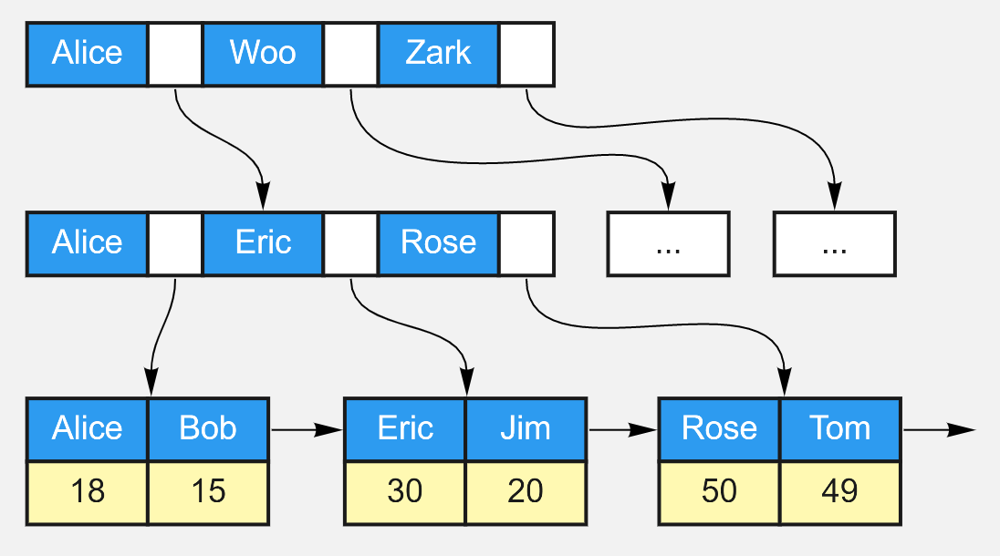

#### 2.8 MySQL的索引为什么用B+树？

**参考答案**

B+树由B树和索引顺序访问方法演化而来，它是为磁盘或其他直接存取辅助设备设计的一种平衡查找树，在B+树中，所有记录节点都是按键值的大小顺序存放在同一层的叶子节点，各叶子节点通过指针进行链接。如下图：

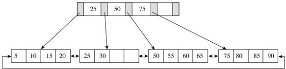

B+树索引在数据库中的一个特点就是高扇出性，例如在InnoDB存储引擎中，每个页的大小为16KB。在数据库中，B+树的高度一般都在2～4层，这意味着查找某一键值最多只需要2到4次IO操作，这还不错。因为现在一般的磁盘每秒至少可以做100次IO操作，2～4次的IO操作意味着查询时间只需0.02～0.04秒。

树根的数据块总是在内存中的，一个10亿行的表上一个整数字段的索引，查找一个值最多只需要访问3次磁盘。其实，树的第二层也有很大概率在内存中，那么访问磁盘的平均次数就更少了。

#### 2.9 MySQL的Hash索引和B树索引有什么区别？

**参考答案**

hash索引底层就是hash表，进行查找时，调用一次hash函数就可以获取到相应的键值，之后进行回表查询获得实际数据。B+树底层实现是多路平衡查找树，对于每一次的查询都是从根节点出发，查找到叶子节点方可以获得所查键值，然后根据查询判断是否需要回表查询数据。它们有以下的不同：

-   hash索引进行等值查询更快(一般情况下)，但是却无法进行范围查询。而B+树的的所有节点皆遵循(左节点小于父节点，右节点大于父节点，多叉树也类似)，天然支持范围。
-   hash索引不支持使用索引进行排序，原理同上。
-   hash索引不支持模糊查询以及多列索引的最左前缀匹配，原理也是因为hash函数的不可预测。
-   hash索引任何时候都避免不了回表查询数据，而B+树在符合某些条件(聚簇索引，覆盖索引等)的时候可以只通过索引完成查询。
-   hash索引虽然在等值查询上较快，但是不稳定，性能不可预测，当某个键值存在大量重复的时候，发生hash碰撞，此时效率可能极差。而B+树的查询效率比较稳定，对于所有的查询都是从根节点到叶子节点，且树的高度较低。

因此，在大多数情况下，直接选择B+树索引可以获得稳定且较好的查询速度。而不需要使用hash索引。

#### 2.10 聚簇索引和非聚簇索引有什么区别？

**参考答案**

在InnoDB存储引擎中，可以将B+树索引分为聚簇索引和辅助索引（非聚簇索引）。无论是何种索引，每个页的大小都为16KB，且不能更改。

聚簇索引是根据主键创建的一棵B+树，聚簇索引的叶子节点存放了表中的所有记录。辅助索引是根据索引键创建的一棵B+树，与聚簇索引不同的是，其叶子节点仅存放索引键值，以及该索引键值指向的主键。也就是说，如果通过辅助索引来查找数据，那么当找到辅助索引的叶子节点后，很有可能还需要根据主键值查找聚簇索引来得到数据，这种查找方式又被称为书签查找。因为辅助索引不包含行记录的所有数据，这就意味着每页可以存放更多的键值，因此其高度一般都要小于聚簇索引。

#### 2.11 什么是联合索引？

**参考答案**

联合索引是指对表上的多个列进行索引，联合索引的创建方法与单个索引创建的方法一样，不同之处仅在于有多个索引列。从本质上来说，联合索引还是一棵B+树，不同的是联合索引的键值数量不是1，而是大于等于2，参考下图。另外，只有在查询条件中使用了这些字段的左边字段时，索引才会被使用，所以使用联合索引时遵循最左前缀集合。

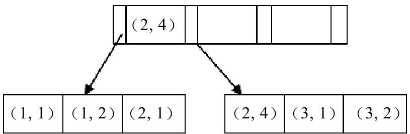

#### 2.12 模糊查询语句中如何使用索引？

**参考答案**

在MySQL中模糊查询 mobile like ‘%8765’，这种情况是不能使用 mobile 上的索引的，那么如果需要根据手机号码后四位进行模糊查询，可以用一下方法进行改造。

我们可以加入冗余列（MySQL5.7之后加入了虚拟列，使用虚拟列更合适，思路相同），比如 mobile_reverse，内部存储为 mobile 的倒叙文本，如 mobile为17312345678，那么 mobile_reverse 存储 87654321371，为 mobile_reverse 列建立索引，查询中使用语句 mobile_reverse like reverse(’%5678’) 即可。

reverse 是 MySQL 中的反转函数，这条语句相当于 mobile_reverse like ‘8765%’ ，这种语句是可以使用索引的。

## 3. 事务

#### 3.1 说一说你对数据库事务的了解

**参考答案**

事务可由一条非常简单的SQL语句组成，也可以由一组复杂的SQL语句组成。在事务中的操作，要么都执行修改，要么都不执行，这就是事务的目的，也是事务模型区别于文件系统的重要特征之一。

事务需遵循ACID四个特性：

-   A（atomicity），原子性。原子性指整个数据库事务是不可分割的工作单位。只有使事务中所有的数据库操作都执行成功，整个事务的执行才算成功。事务中任何一个SQL语句执行失败，那么已经执行成功的SQL语句也必须撤销，数据库状态应该退回到执行事务前的状态。
-   C（consistency），一致性。一致性指事务将数据库从一种状态转变为另一种一致的状态。在事务开始之前和事务结束以后，数据库的完整性约束没有被破坏。
-   I（isolation），隔离性。事务的隔离性要求每个读写事务的对象与其他事务的操作对象能相互分离，即该事务提交前对其他事务都不可见，这通常使用锁来实现。
-   D（durability） ，持久性。事务一旦提交，其结果就是永久性的，即使发生宕机等故障，数据库也能将数据恢复。持久性保证的是事务系统的高可靠性，而不是高可用性。

事务可以分为以下几种类型：

-   扁平事务：是事务类型中最简单的一种，而在实际生产环境中，这可能是使用最为频繁的事务。在扁平事务中，所有操作都处于同一层次，其由BEGIN WORK开始，由COMMIT WORK或ROLLBACK WORK结束。处于之间的操作是原子的，要么都执行，要么都回滚。
-   带有保存点的扁平事务：除了支持扁平事务支持的操作外，允许在事务执行过程中回滚到同一事务中较早的一个状态，这是因为可能某些事务在执行过程中出现的错误并不会对所有的操作都无效，放弃整个事务不合乎要求，开销也太大。保存点（savepoint）用来通知系统应该记住事务当前的状态，以便以后发生错误时，事务能回到该状态。
-   链事务：可视为保存点模式的一个变种。链事务的思想是：在提交一个事务时，释放不需要的数据对象，将必要的处理上下文隐式地传给下一个要开始的事务。注意，提交事务操作和开始下一个事务操作将合并为一个原子操作。这意味着下一个事务将看到上一个事务的结果，就好像在一个事务中进行的。
-   嵌套事务：是一个层次结构框架。有一个顶层事务（top-level transaction）控制着各个层次的事务。顶层事务之下嵌套的事务被称为子事务（subtransaction），其控制每一个局部的变换。
-   分布式事务：通常是一个在分布式环境下运行的扁平事务，因此需要根据数据所在位置访问网络中的不同节点。对于分布式事务，同样需要满足ACID特性，要么都发生，要么都失效。

对于MySQL的InnoDB存储引擎来说，它支持扁平事务、带有保存点的扁平事务、链事务、分布式事务。对于嵌套事务，MySQL数据库并不是原生的，因此对于有并行事务需求的用户来说MySQL就无能为力了，但是用户可以通过带有保存点的事务来模拟串行的嵌套事务。

#### 3.3 MySQL的ACID特性分别是怎么实现的？

**参考答案**

原子性实现原理：

实现原子性的关键，是当事务回滚时能够撤销所有已经成功执行的sql语句。InnoDB实现回滚靠的是undo log，当事务对数据库进行修改时，InnoDB会生成对应的undo log。如果事务执行失败或调用了rollback，导致事务需要回滚，便可以利用undo log中的信息将数据回滚到修改之前的样子。

undo log属于逻辑日志，它记录的是sql执行相关的信息。当发生回滚时，InnoDB会根据undo log的内容做与之前相反的工作。对于insert，回滚时会执行delete。对于delete，回滚时会执行insert。对于update，回滚时则会执行相反的update，把数据改回去。

持久性实现原理：

InnoDB作为MySQL的存储引擎，数据是存放在磁盘中的，但如果每次读写数据都需要磁盘IO，效率会很低。为此，InnoDB提供了缓存(Buffer Pool)，Buffer Pool中包含了磁盘中部分数据页的映射，作为访问数据库的缓冲。当从数据库读取数据时，会首先从Buffer Pool中读取，如果Buffer Pool中没有，则从磁盘读取后放入Buffer Pool。当向数据库写入数据时，会首先写入Buffer Pool，Buffer Pool中修改的数据会定期刷新到磁盘中（这一过程称为刷脏）。

Buffer Pool的使用大大提高了读写数据的效率，但是也带了新的问题：如果MySQL宕机，而此时Buffer Pool中修改的数据还没有刷新到磁盘，就会导致数据的丢失，事务的持久性无法保证。

于是，redo log被引入来解决这个问题。当数据修改时，除了修改Buffer Pool中的数据，还会在redo log记录这次操作。当事务提交时，会调用fsync接口对redo log进行刷盘。如果MySQL宕机，重启时可以读取redo log中的数据，对数据库进行恢复。redo log采用的是WAL（Write-ahead logging，预写式日志），所有修改先写入日志，再更新到Buffer Pool，保证了数据不会因MySQL宕机而丢失，从而满足了持久性要求。

既然redo log也需要在事务提交时将日志写入磁盘，为什么它比直接将Buffer Pool中修改的数据写入磁盘(即刷脏)要快呢？主要有以下两方面的原因：

-   刷脏是随机IO，因为每次修改的数据位置随机，但写redo log是追加操作，属于顺序IO。
-   刷脏是以数据页（Page）为单位的，MySQL默认页大小是16KB，一个Page上一个小修改都要整页写入。而redo log中只包含真正需要写入的部分，无效IO大大减少。

隔离性实现原理：

隔离性追求的是并发情形下事务之间互不干扰。简单起见，我们主要考虑最简单的读操作和写操作(加锁读等特殊读操作会特殊说明)，那么隔离性的探讨，主要可以分为两个方面。

第一方面，(一个事务)写操作对(另一个事务)写操作的影响：锁机制保证隔离性。

隔离性要求同一时刻只能有一个事务对数据进行写操作，InnoDB通过锁机制来保证这一点。锁机制的基本原理可以概括为：事务在修改数据之前，需要先获得相应的锁。获得锁之后，事务便可以修改数据。该事务操作期间，这部分数据是锁定的，其他事务如果需要修改数据，需要等待当前事务提交或回滚后释放锁。

按照粒度，锁可以分为表锁、行锁以及其他位于二者之间的锁。表锁在操作数据时会锁定整张表，并发性能较差。行锁则只锁定需要操作的数据，并发性能好。但是由于加锁本身需要消耗资源，因此在锁定数据较多情况下使用表锁可以节省大量资源。MySQL中不同的存储引擎支持的锁是不一样的，例如MyIsam只支持表锁，而InnoDB同时支持表锁和行锁，且出于性能考虑，绝大多数情况下使用的都是行锁。

第二方面，(一个事务)写操作对(另一个事务)读操作的影响：MVCC保证隔离性。

InnoDB默认的隔离级别是RR（REPEATABLE READ），RR解决脏读、不可重复读、幻读等问题，使用的是MVCC。MVCC全称Multi-Version Concurrency Control，即多版本的并发控制协议。它最大的优点是读不加锁，因此读写不冲突，并发性能好。InnoDB实现MVCC，多个版本的数据可以共存。

一致性实现原理：

可以说，一致性是事务追求的最终目标。前面提到的原子性、持久性和隔离性，都是为了保证数据库状态的一致性。此外，除了数据库层面的保障，一致性的实现也需要应用层面进行保障。实现一致性的措施包括：

-   保证原子性、持久性和隔离性，如果这些特性无法保证，事务的一致性也无法保证。
-   数据库本身提供保障，例如不允许向整形列插入字符串值、字符串长度不能超过列的限制等。
-   应用层面进行保障，例如如果转账操作只扣除转账者的余额，而没有增加接收者的余额，无论数据库实现的多么完美，也无法保证状态的一致。

#### 3.4 谈谈MySQL的事务隔离级别

**参考答案**

SQL 标准定义了四种隔离级别，这四种隔离级别分别是：

- 读未提交是指，一个事务还没提交时，它做的变更就能被别的事务看到。
- 读提交是指，一个事务提交之后，它做的变更才会被其他事务看到。
- 可重复读是指，一个事务执行过程中看到的数据，总是跟这个事务在启动时看到的数据是一
  致的。当然在可重复读隔离级别下，未提交变更对其他事务也是不可见的。
- 串行化，顾名思义是对于同一行记录，“写”会加“写锁”，“读”会加“读锁”。当出现读写锁冲突
  的时候，后访问的事务必须等前一个事务执行完成，才能继续执行。

事务隔离是为了解决脏读、不可重复读、幻读问题，下表展示了 4 种隔离级别对这三个问题的解决程度：

| 隔离级别         | 脏读   | 不可重复读 | 幻读   |
| :--------------- | :----- | :--------- | :----- |
| READ UNCOMMITTED | 可能   | 可能       | 可能   |
| READ COMMITTED   | 不可能 | 可能       | 可能   |
| REPEATABLE READ  | 不可能 | 不可能     | 可能   |
| SERIALIZABLE     | 不可能 | 不可能     | 不可能 |

上述4种隔离级别MySQL都支持，并且InnoDB存储引擎默认的支持隔离级别是REPEATABLE READ，但是与标准SQL不同的是，InnoDB存储引擎在REPEATABLE READ事务隔离级别下，使用Next-Key Lock的锁算法，因此避免了幻读的产生。所以，InnoDB存储引擎在默认的事务隔离级别下已经能完全保证事务的隔离性要求，即达到SQL标准的SERIALIZABLE隔离级别。

**扩展阅读**

并发情况下，读操作可能存在的三类问题：

1.  脏读：当前事务(A)中可以读到其他事务(B)未提交的数据（脏数据），这种现象是脏读。
2.  不可重复读：在事务A中先后两次读取同一个数据，两次读取的结果不一样，这种现象称为不可重复读。脏读与不可重复读的区别在于：前者读到的是其他事务未提交的数据，后者读到的是其他事务已提交的数据。
3.  幻读：在事务A中按照某个条件先后两次查询数据库，两次查询结果的条数不同，这种现象称为幻读。不可重复读与幻读的区别可以通俗的理解为：前者是数据变了，后者是数据的行数变了。

#### 3.5 MySQL的事务隔离级别是怎么实现的？

**参考答案**

这四种隔离级别的实现机制如下：

1. READ UNCOMMITTED & READ COMMITTED：

   通过Record Lock算法实现了行锁，但READ UNCOMMITTED允许读取未提交数据，所以存在脏读问题。而READ COMMITTED允许读取提交数据，所以不存在脏读问题，但存在不可重复读问题。

2. REPEATABLE READ：

   使用Next-Key Lock算法实现了行锁，并且不允许读取已提交的数据，所以解决了不可重复读的问题。另外，该算法包含了间隙锁，会锁定一个范围，因此也解决了幻读的问题。

3. SERIALIZABLE：

   对每个SELECT语句后自动加上LOCK IN SHARE MODE，即为每个读取操作加一个共享锁。因此在这个事务隔离级别下，读占用了锁，对一致性的非锁定读不再予以支持。

#### 3.6 如何解决幻读问题？

**参考答案**

MySQL的InnoDB引擎，在默认的REPEATABLE READ的隔离级别下，实现了可重复读，同时也解决了幻读问题。它使用Next-Key Lock算法实现了行锁，并且不允许读取已提交的数据，所以解决了不可重复读的问题。另外，该算法包含了间隙锁，会锁定一个范围，因此也解决了幻读的问题。

#### 3.7 MySQL事务如何回滚？

**参考答案**

在MySQL默认的配置下，事务都是自动提交和回滚的。当显示地开启一个事务时，可以使用ROLLBACK语句进行回滚。该语句有两种用法：

- ROLLBACK：要使用这个语句的最简形式，只需发出ROLLBACK。同样地，也可以写为ROLLBACK WORK，但是二者几乎是等价的。回滚会结束用户的事务，并撤销正在进行的所有未提交的修改。

- ROLLBACK TO [SAVEPOINT] identifier ：这个语句与SAVEPOINT命令一起使用。可以把事务回滚到标记点，而不回滚在此标记点之前的任何工作。

## 4. 锁

#### 4.1 了解数据库的锁吗？

**参考答案**

**全局锁**：Flush tables with read lock (FTWRL)。使用这个命令，之后其他线程的以下语句会被阻塞：数据更新语句（数据的增删改）、数据定义语句（包括建表、修改表结构等）和更新类事务的提交语句。

官方自带的逻辑备份工具是mysqldump。当mysqldump使用参数–single-transaction的时候，导数据之前就会启动一个事务，来确保拿到一致性视图。而由于MVCC的支持，这个过程中数据是可以正常更新的。

**表锁：**

- 表锁：lock tables … read/write。lock tables语法除了会限制别的线程的读写外，也限定了本线程接下来的操作对象。
- 元数据锁（MDL）：MDL不需要显式使用，在访问一个表的时候会被自动加上。当对一个表做增删改查操作的时候，加MDL读锁；当要对表做结构变更操作的时候，加MDL写锁。
  事务中的MDL锁，在语句执行开始时申请，但是语句结束后并不会马上释放，而会等到整个事务提交后再释放。

**行锁：**

MyISAM引擎就不支持行锁。InnoDB是支持行锁的。，在InnoDB事务中，行锁是在需要的时候才加上的，但并不是不需要了就立刻释放，而是要等到事务结束时才释放。这个就是**两阶段锁协议。**

InnoDB存储引擎实现了如下两种标准的行级锁：

- 共享锁（S Lock），允许事务读一行数据（select ...... lock in share mode)。
- 排他锁（X Lock），允许事务删除或更新一行数据(select ...... for update)。

读读不冲突，读写冲突，写写冲突

锁的算法：

InnoDB存储引擎有3种行锁的算法，其分别是：

- Record Lock：单个行记录上的锁。
- Gap Lock：间隙锁，锁定一个范围，但不包含记录本身。
- Next-Key Lock∶Gap Lock+Record Lock，锁定一个范围，并且锁定记录本身。

Record Lock总是会去锁住索引记录，如果InnoDB存储引擎表在建立的时候没有设置任何一个索引，那么这时InnoDB存储引擎会使用隐式的主键来进行锁定。Next-Key Lock是结合了Gap Lock和Record Lock的一种锁定算法，在Next-Key Lock算法下，InnoDB对于行的查询都是采用这种锁定算法。采用Next-Key Lock的锁定技术称为Next-Key Locking，其设计的目的是为了解决Phantom Problem（幻读）。而利用这种锁定技术，锁定的不是单个值，而是一个范围，是谓词锁（predict lock）的一种改进。

#### 4.2 介绍一下间隙锁

**参考答案**

InnoDB存储引擎有3种行锁的算法，间隙锁（Gap Lock）是其中之一。间隙锁用于锁定一个范围，但不包含记录本身。它的作用是为了阻止多个事务将记录插入到同一范围内，而这会导致幻读问题的产生。

具体算法逻辑：

1. 原则1：加锁的基本单位是next-key lock。希望你还记得，next-key lock是前开后闭区间。

2. 原则2：查找过程中访问到的对象才会加锁。
3. 优化1：索引上的等值查询，给唯一索引加锁的时候，next-key lock退化为行锁。
4. 优化2：索引上的等值查询，向右遍历时且最后一个值不满足等值条件的时候，next-key
lock退化为间隙锁。
5. 一个bug：唯一索引上的范围查询会访问到不满足条件的第一个值为止。

#### 4.3 数据库在什么情况下会发生死锁？

**参考答案**

死锁是指两个或两个以上的事务在执行过程中，因争夺锁资源而造成的一种互相等待的现象。若无外力作用，事务都将无法推进下去。下图演示了死锁的一种经典的情况，即A等待B、B等待A，这种死锁问题被称为AB-BA死锁。

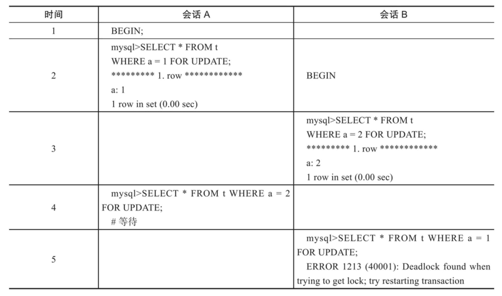

#### 4.4 说说数据库死锁的解决办法

**参考答案**

一种策略是，直接进入等待，直到超时。这个超时时间可以通过参数 innodb_lock_wait_timeout来设置。在InnoDB中，innodb_lock_wait_timeout的默认值是50s。

第二种策略，即：主动死锁检测，而且 innodb_deadlock_detect的默认值本身就是on。主动死锁检测在发生死锁的时候，是能够快速发现并进行处理的，但是死锁检测要耗费大量的CPU资源。


- ## 5. 优化

  #### 5.1 说一说你对数据库优化的理解

  **参考答案**

  MySQL数据库优化是多方面的，原则是减少系统的瓶颈，减少资源的占用，增加系统的反应速度。例如，通过优化文件系统，提高磁盘I\O的读写速度；通过优化操作系统调度策略，提高MySQL在高负荷情况下的负载能力；优化表结构、索引、查询语句等使查询响应更快。

  针对查询，我们可以通过使用索引、使用连接代替子查询的方式来提高查询速度。

  针对慢查询，我们可以通过分析慢查询日志，来发现引起慢查询的原因，从而有针对性的进行优化。

  针对插入，我们可以通过禁用索引、禁用检查等方式来提高插入速度，在插入之后再启用索引和检查。

  针对数据库结构，我们可以通过将字段很多的表拆分成多张表、增加中间表、增加冗余字段等方式进行优化。

  #### 5.2 该如何优化MySQL的查询？

  **参考答案**

  使用索引：

  如果查询时没有使用索引，查询语句将扫描表中的所有记录。在数据量大的情况下，这样查询的速度会很慢。如果使用索引进行查询，查询语句可以根据索引快速定位到待查询记录，从而减少查询的记录数，达到提高查询速度的目的。

  索引可以提高查询的速度，但并不是使用带有索引的字段查询时索引都会起作用。有几种特殊情况，在这些情况下有可能使用带有索引的字段查询时索引并没有起作用。

  1. 使用LIKE关键字的查询语句

     在使用LIKE关键字进行查询的查询语句中，如果匹配字符串的第一个字符为“%”，索引不会起作用。只有“%”不在第一个位置，索引才会起作用。

  2. 使用多列索引的查询语句

     MySQL可以为多个字段创建索引。一个索引可以包括16个字段。对于多列索引，只有查询条件中使用了这些字段中的第1个字段时索引才会被使用。

  3. 使用OR关键字的查询语句

     查询语句的查询条件中只有OR关键字，且OR前后的两个条件中的列都是索引时，查询中才使用索引。否则，查询将不使用索引。

  优化子查询：

  使用子查询可以进行SELECT语句的嵌套查询，即一个SELECT查询的结果作为另一个SELECT语句的条件。子查询可以一次性完成很多逻辑上需要多个步骤才能完成的SQL操作。

  子查询虽然可以使查询语句很灵活，但执行效率不高。执行子查询时，MySQL需要为内层查询语句的查询结果建立一个临时表。然后外层查询语句从临时表中查询记录。查询完毕后，再撤销这些临时表。因此，子查询的速度会受到一定的影响。如果查询的数据量比较大，这种影响就会随之增大。

  在MySQL中，可以使用连接（JOIN）查询来替代子查询。连接查询不需要建立临时表，其速度比子查询要快，如果查询中使用索引，性能会更好。

  #### 5.3 怎样插入数据才能更高效？

  **参考答案**

  影响插入速度的主要是索引、唯一性校验、一次插入记录条数等。针对这些情况，可以分别进行优化。

  对于MyISAM引擎的表，常见的优化方法如下：

  1. 禁用索引

     对于非空表，插入记录时，MySQL会根据表的索引对插入的记录建立索引。如果插入大量数据，建立索引会降低插入记录的速度。为了解决这种情况，可以在插入记录之前禁用索引，数据插入完毕后再开启索引。对于空表批量导入数据，则不需要进行此操作，因为MyISAM引擎的表是在导入数据之后才建立索引的。

  2. 禁用唯一性检查

     插入数据时，MySQL会对插入的记录进行唯一性校验。这种唯一性校验也会降低插入记录的速度。为了降低这种情况对查询速度的影响，可以在插入记录之前禁用唯一性检查，等到记录插入完毕后再开启。

  3. 使用批量插入

     插入多条记录时，可以使用一条INSERT语句插入一条记录，也可以使用一条INSERT语句插入多条记录。使用一条INSERT语句插入多条记录的情形如下，而这种方式的插入速度更快。

     ```
     INSERT INTO fruits VALUES ('x1', '101', 'mongo2', '5.7'), ('x2', '101', 'mongo3', '5.7'), ('x3', '101', 'mongo4', '5.7');
     ```

  4. 使用LOAD DATA INFILE批量导入

     当需要批量导入数据时，如果能用LOAD DATA INFILE语句，就尽量使用。因为LOAD DATA INFILE语句导入数据的速度比INSERT语句快。

  对于InnoDB引擎的表，常见的优化方法如下：

  1. 禁用唯一性检查

     插入数据之前执行set unique_checks=0来禁止对唯一索引的检查，数据导入完成之后再运行set unique_checks=1。这个和MyISAM引擎的使用方法一样。

  2. 禁用外键检查

     插入数据之前执行禁止对外键的检查，数据插入完成之后再恢复对外键的检查。

  3. 禁用自动提交

     插入数据之前禁止事务的自动提交，数据导入完成之后，执行恢复自动提交操作。

  #### 5.4 表中包含几千万条数据该怎么办？

  **参考答案**

  建议按照如下顺序进行优化：

  1.  优化SQL和索引；
  2.  增加缓存，如memcached、redis；
  3.  读写分离，可以采用主从复制，也可以采用主主复制；
  4.  使用MySQL自带的分区表，这对应用是透明的，无需改代码，但SQL语句是要针对分区表做优化的；
  5.  做垂直拆分，即根据模块的耦合度，将一个大的系统分为多个小的系统；
  6.  做水平拆分，要选择一个合理的sharding key，为了有好的查询效率，表结构也要改动，做一定的冗余，应用也要改，sql中尽量带sharding key，将数据定位到限定的表上去查，而不是扫描全部的表。

  #### 5.5 MySQL的慢查询优化有了解吗？

  **参考答案**

  优化MySQL的慢查询，可以按照如下步骤进行：

  开启慢查询日志：

  MySQL中慢查询日志默认是关闭的，可以通过配置文件my.ini或者my.cnf中的log-slow-queries选项打开，也可以在MySQL服务启动的时候使用--log-slow-queries[=file_name]启动慢查询日志。

  启动慢查询日志时，需要在my.ini或者my.cnf文件中配置long_query_time选项指定记录阈值，如果某条查询语句的查询时间超过了这个值，这个查询过程将被记录到慢查询日志文件中。

  分析慢查询日志：

  直接分析mysql慢查询日志，利用explain关键字可以模拟优化器执行SQL查询语句，来分析sql慢查询语句。

  常见慢查询优化：

  1. 索引没起作用的情况

     -   在使用LIKE关键字进行查询的查询语句中，如果匹配字符串的第一个字符为“%”，索引不会起作用。只有“%”不在第一个位置，索引才会起作用。
     -   MySQL可以为多个字段创建索引。一个索引可以包括16个字段。对于多列索引，只有查询条件中使用了这些字段中的第1个字段时索引才会被使用。
     -   查询语句的查询条件中只有OR关键字，且OR前后的两个条件中的列都是索引时，查询中才使用索引。否则，查询将不使用索引。

  2. 优化数据库结构

     -   对于字段比较多的表，如果有些字段的使用频率很低，可以将这些字段分离出来形成新表。因为当一个表的数据量很大时，会由于使用频率低的字段的存在而变慢。
     -   对于需要经常联合查询的表，可以建立中间表以提高查询效率。通过建立中间表，把需要经常联合查询的数据插入到中间表中，然后将原来的联合查询改为对中间表的查询，以此来提高查询效率。

  3. 分解关联查询

     很多高性能的应用都会对关联查询进行分解，就是可以对每一个表进行一次单表查询，然后将查询结果在应用程序中进行关联，很多场景下这样会更高效。

  4. 优化LIMIT分页

     当偏移量非常大的时候，例如可能是limit 10000,20这样的查询，这是mysql需要查询10020条然后只返回最后20条，前面的10000条记录都将被舍弃，这样的代价很高。优化此类查询的一个最简单的方法是尽可能的使用索引覆盖扫描，而不是查询所有的列。然后根据需要做一次关联操作再返回所需的列。对于偏移量很大的时候这样做的效率会得到很大提升。

  #### 5.6 说一说你对explain的了解

  **参考答案**

  MySQL中提供了EXPLAIN语句和DESCRIBE语句，用来分析查询语句，EXPLAIN语句的基本语法如下：

  ```
  EXPLAIN [EXTENDED] SELECT select_options
  ```

  使用EXTENED关键字，EXPLAIN语句将产生附加信息。执行该语句，可以分析EXPLAIN后面SELECT语句的执行情况，并且能够分析出所查询表的一些特征。下面对查询结果进行解释：

  -   id：SELECT识别符。这是SELECT的查询序列号。
  -   select_type：表示SELECT语句的类型。
  -   table：表示查询的表。
  -   type：表示表的连接类型。
  -   possible_keys：给出了MySQL在搜索数据记录时可选用的各个索引。
  -   key：是MySQL实际选用的索引。
  -   key_len：给出索引按字节计算的长度，key_len数值越小，表示越快。
  -   ref：给出了关联关系中另一个数据表里的数据列名。
  -   rows：是MySQL在执行这个查询时预计会从这个数据表里读出的数据行的个数。
  -   Extra：提供了与关联操作有关的信息。

  **扩展阅读**

  DESCRIBE语句的使用方法与EXPLAIN语句是一样的，分析结果也是一样的，并且可以缩写成DESC。。DESCRIBE语句的语法形式如下：

  ```
  DESCRIBE SELECT select_options
  ```

  #### 5.7 explain关注什么？

  **参考答案**

  重点要关注如下几列：

  | 列名    | 备注                                                         |
  | :------ | :----------------------------------------------------------- |
  | type    | 本次查询表联接类型，从这里可以看到本次查询大概的效率。       |
  | key     | 最终选择的索引，如果没有索引的话，本次查询效率通常很差。     |
  | key_len | 本次查询用于结果过滤的索引实际长度。                         |
  | rows    | 预计需要扫描的记录数，预计需要扫描的记录数越小越好。         |
  | Extra   | 额外附加信息，主要确认是否出现 Using filesort、Using temporary 这两种情况。 |

  其中，type包含以下几种结果，从上之下依次是最差到最好：

  | 类型            | 备注                                                         |
  | :-------------- | :----------------------------------------------------------- |
  | ALL             | 执行full table scan，这是最差的一种方式。                    |
  | index           | 执行full index scan，并且可以通过索引完成结果扫描并且直接从索引中取的想要的结果数据，也就是可以避免回表，比ALL略好，因为索引文件通常比全部数据要来的小。 |
  | range           | 利用索引进行范围查询，比index略好。                          |
  | index_subquery  | 子查询中可以用到索引。                                       |
  | unique_subquery | 子查询中可以用到唯一索引，效率比 index_subquery 更高些。     |
  | index_merge     | 可以利用index merge特性用到多个索引，提高查询效率。          |
  | ref_or_null     | 表连接类型是ref，但进行扫描的索引列中可能包含NULL值。        |
  | fulltext        | 全文检索。                                                   |
  | ref             | 基于索引的等值查询，或者表间等值连接。                       |
  | eq_ref          | 表连接时基于主键或非NULL的唯一索引完成扫描，比ref略好。      |
  | const           | 基于主键或唯一索引唯一值查询，最多返回一条结果，比eq_ref略好。 |
  | system          | 查询对象表只有一行数据，这是最好的情况。                     |

  另外，Extra列需要注意以下的几种情况：

  | 关键字                       | 备注                                                         |
  | :--------------------------- | :----------------------------------------------------------- |
  | Using filesort               | 将用外部排序而不是按照索引顺序排列结果，数据较少时从内存排序，否则需要在磁盘完成排序，代价非常高，需要添加合适的索引。 |
  | Using temporary              | 需要创建一个临时表来存储结果，这通常发生在对没有索引的列进行GROUP BY时，或者ORDER BY里的列不都在索引里，需要添加合适的索引。 |
  | Using index                  | 表示MySQL使用覆盖索引避免全表扫描，不需要再到表中进行二次查找数据，这是比较好的结果之一。注意不要和type中的index类型混淆。 |
  | Using where                  | 通常是进行了全表/全索引扫描后再用WHERE子句完成结果过滤，需要添加合适的索引。 |
  | Impossible WHERE             | 对Where子句判断的结果总是false而不能选择任何数据，例如where 1=0，无需过多关注。 |
  | Select tables optimized away | 使用某些聚合函数来访问存在索引的某个字段时，优化器会通过索引直接一次定位到所需要的数据行完成整个查询，例如MIN()\MAX()，这种也是比较好的结果之一。 |

## 5. 优化

#### 5.1 说一说你对数据库优化的理解

**参考答案**

MySQL数据库优化是多方面的，原则是减少系统的瓶颈，减少资源的占用，增加系统的反应速度。例如，通过优化文件系统，提高磁盘I\O的读写速度；通过优化操作系统调度策略，提高MySQL在高负荷情况下的负载能力；优化表结构、索引、查询语句等使查询响应更快。

针对查询，我们可以通过使用索引、使用连接代替子查询的方式来提高查询速度。

针对慢查询，我们可以通过分析慢查询日志，来发现引起慢查询的原因，从而有针对性的进行优化。

针对插入，我们可以通过禁用索引、禁用检查等方式来提高插入速度，在插入之后再启用索引和检查。

针对数据库结构，我们可以通过将字段很多的表拆分成多张表、增加中间表、增加冗余字段等方式进行优化。

#### 5.2 该如何优化MySQL的查询？

**参考答案**

使用索引：

如果查询时没有使用索引，查询语句将扫描表中的所有记录。在数据量大的情况下，这样查询的速度会很慢。如果使用索引进行查询，查询语句可以根据索引快速定位到待查询记录，从而减少查询的记录数，达到提高查询速度的目的。

索引可以提高查询的速度，但并不是使用带有索引的字段查询时索引都会起作用。有几种特殊情况，在这些情况下有可能使用带有索引的字段查询时索引并没有起作用。

1. 使用LIKE关键字的查询语句

   在使用LIKE关键字进行查询的查询语句中，如果匹配字符串的第一个字符为“%”，索引不会起作用。只有“%”不在第一个位置，索引才会起作用。

2. 使用多列索引的查询语句

   MySQL可以为多个字段创建索引。一个索引可以包括16个字段。对于多列索引，只有查询条件中使用了这些字段中的第1个字段时索引才会被使用。

3. 使用OR关键字的查询语句

   查询语句的查询条件中只有OR关键字，且OR前后的两个条件中的列都是索引时，查询中才使用索引。否则，查询将不使用索引。

优化子查询：

使用子查询可以进行SELECT语句的嵌套查询，即一个SELECT查询的结果作为另一个SELECT语句的条件。子查询可以一次性完成很多逻辑上需要多个步骤才能完成的SQL操作。

子查询虽然可以使查询语句很灵活，但执行效率不高。执行子查询时，MySQL需要为内层查询语句的查询结果建立一个临时表。然后外层查询语句从临时表中查询记录。查询完毕后，再撤销这些临时表。因此，子查询的速度会受到一定的影响。如果查询的数据量比较大，这种影响就会随之增大。

在MySQL中，可以使用连接（JOIN）查询来替代子查询。连接查询不需要建立临时表，其速度比子查询要快，如果查询中使用索引，性能会更好。

#### 5.3 怎样插入数据才能更高效？

**参考答案**

影响插入速度的主要是索引、唯一性校验、一次插入记录条数等。针对这些情况，可以分别进行优化。

对于MyISAM引擎的表，常见的优化方法如下：

1. 禁用索引

   对于非空表，插入记录时，MySQL会根据表的索引对插入的记录建立索引。如果插入大量数据，建立索引会降低插入记录的速度。为了解决这种情况，可以在插入记录之前禁用索引，数据插入完毕后再开启索引。对于空表批量导入数据，则不需要进行此操作，因为MyISAM引擎的表是在导入数据之后才建立索引的。

2. 禁用唯一性检查

   插入数据时，MySQL会对插入的记录进行唯一性校验。这种唯一性校验也会降低插入记录的速度。为了降低这种情况对查询速度的影响，可以在插入记录之前禁用唯一性检查，等到记录插入完毕后再开启。

3. 使用批量插入

   插入多条记录时，可以使用一条INSERT语句插入一条记录，也可以使用一条INSERT语句插入多条记录。使用一条INSERT语句插入多条记录的情形如下，而这种方式的插入速度更快。

   ```
   INSERT INTO fruits VALUES ('x1', '101', 'mongo2', '5.7'), ('x2', '101', 'mongo3', '5.7'), ('x3', '101', 'mongo4', '5.7');
   ```

4. 使用LOAD DATA INFILE批量导入

   当需要批量导入数据时，如果能用LOAD DATA INFILE语句，就尽量使用。因为LOAD DATA INFILE语句导入数据的速度比INSERT语句快。

对于InnoDB引擎的表，常见的优化方法如下：

1. 禁用唯一性检查

   插入数据之前执行set unique_checks=0来禁止对唯一索引的检查，数据导入完成之后再运行set unique_checks=1。这个和MyISAM引擎的使用方法一样。

2. 禁用外键检查

   插入数据之前执行禁止对外键的检查，数据插入完成之后再恢复对外键的检查。

3. 禁用自动提交

   插入数据之前禁止事务的自动提交，数据导入完成之后，执行恢复自动提交操作。

#### 5.4 表中包含几千万条数据该怎么办？

**参考答案**

建议按照如下顺序进行优化：

1. 优化SQL和索引；
2. 增加缓存，如memcached、redis；
3. 读写分离，可以采用主从复制，也可以采用主主复制；
4. 使用MySQL自带的分区表，这对应用是透明的，无需改代码，但SQL语句是要针对分区表做优化的；
5. 做垂直拆分，即根据模块的耦合度，将一个大的系统分为多个小的系统；
6. 做水平拆分，要选择一个合理的sharding key，为了有好的查询效率，表结构也要改动，做一定的冗余，应用也要改，sql中尽量带sharding key，将数据定位到限定的表上去查，而不是扫描全部的表。

#### 5.5 MySQL的慢查询优化有了解吗？

**参考答案**

优化MySQL的慢查询，可以按照如下步骤进行：

开启慢查询日志：

MySQL中慢查询日志默认是关闭的，可以通过配置文件my.ini或者my.cnf中的log-slow-queries选项打开，也可以在MySQL服务启动的时候使用--log-slow-queries[=file_name]启动慢查询日志。

启动慢查询日志时，需要在my.ini或者my.cnf文件中配置long_query_time选项指定记录阈值，如果某条查询语句的查询时间超过了这个值，这个查询过程将被记录到慢查询日志文件中。

分析慢查询日志：

直接分析mysql慢查询日志，利用explain关键字可以模拟优化器执行SQL查询语句，来分析sql慢查询语句。

常见慢查询优化：

1. 索引没起作用的情况

   - 在使用LIKE关键字进行查询的查询语句中，如果匹配字符串的第一个字符为“%”，索引不会起作用。只有“%”不在第一个位置，索引才会起作用。
   - MySQL可以为多个字段创建索引。一个索引可以包括16个字段。对于多列索引，只有查询条件中使用了这些字段中的第1个字段时索引才会被使用。
   - 查询语句的查询条件中只有OR关键字，且OR前后的两个条件中的列都是索引时，查询中才使用索引。否则，查询将不使用索引。

2. 优化数据库结构

   - 对于字段比较多的表，如果有些字段的使用频率很低，可以将这些字段分离出来形成新表。因为当一个表的数据量很大时，会由于使用频率低的字段的存在而变慢。
   - 对于需要经常联合查询的表，可以建立中间表以提高查询效率。通过建立中间表，把需要经常联合查询的数据插入到中间表中，然后将原来的联合查询改为对中间表的查询，以此来提高查询效率。

3. 分解关联查询

   很多高性能的应用都会对关联查询进行分解，就是可以对每一个表进行一次单表查询，然后将查询结果在应用程序中进行关联，很多场景下这样会更高效。

4. 优化LIMIT分页

   当偏移量非常大的时候，例如可能是limit 10000,20这样的查询，这是mysql需要查询10020条然后只返回最后20条，前面的10000条记录都将被舍弃，这样的代价很高。优化此类查询的一个最简单的方法是尽可能的使用索引覆盖扫描，而不是查询所有的列。然后根据需要做一次关联操作再返回所需的列。对于偏移量很大的时候这样做的效率会得到很大提升。

#### 5.6 说一说你对explain的了解

**参考答案**

MySQL中提供了EXPLAIN语句和DESCRIBE语句，用来分析查询语句，EXPLAIN语句的基本语法如下：

```
EXPLAIN [EXTENDED] SELECT select_options
```

使用EXTENED关键字，EXPLAIN语句将产生附加信息。执行该语句，可以分析EXPLAIN后面SELECT语句的执行情况，并且能够分析出所查询表的一些特征。下面对查询结果进行解释：

- id：SELECT识别符。这是SELECT的查询序列号。
- select_type：表示SELECT语句的类型。
- table：表示查询的表。
- type：表示表的连接类型。
- possible_keys：给出了MySQL在搜索数据记录时可选用的各个索引。
- key：是MySQL实际选用的索引。
- key_len：给出索引按字节计算的长度，key_len数值越小，表示越快。
- ref：给出了关联关系中另一个数据表里的数据列名。
- rows：是MySQL在执行这个查询时预计会从这个数据表里读出的数据行的个数。
- Extra：提供了与关联操作有关的信息。

**扩展阅读**

DESCRIBE语句的使用方法与EXPLAIN语句是一样的，分析结果也是一样的，并且可以缩写成DESC。。DESCRIBE语句的语法形式如下：

```
DESCRIBE SELECT select_options
```

#### 5.7 explain关注什么？

**参考答案**

重点要关注如下几列：

| 列名    | 备注                                                         |
| ------- | ------------------------------------------------------------ |
| type    | 本次查询表联接类型，从这里可以看到本次查询大概的效率。       |
| key     | 最终选择的索引，如果没有索引的话，本次查询效率通常很差。     |
| key_len | 本次查询用于结果过滤的索引实际长度。                         |
| rows    | 预计需要扫描的记录数，预计需要扫描的记录数越小越好。         |
| Extra   | 额外附加信息，主要确认是否出现 Using filesort、Using temporary 这两种情况。 |

其中，type包含以下几种结果，从上之下依次是最差到最好：

| 类型            | 备注                                                         |
| --------------- | ------------------------------------------------------------ |
| ALL             | 执行full table scan，这是最差的一种方式。                    |
| index           | 执行full index scan，并且可以通过索引完成结果扫描并且直接从索引中取的想要的结果数据，也就是可以避免回表，比ALL略好，因为索引文件通常比全部数据要来的小。 |
| range           | 利用索引进行范围查询，比index略好。                          |
| index_subquery  | 子查询中可以用到索引。                                       |
| unique_subquery | 子查询中可以用到唯一索引，效率比 index_subquery 更高些。     |
| index_merge     | 可以利用index merge特性用到多个索引，提高查询效率。          |
| ref_or_null     | 表连接类型是ref，但进行扫描的索引列中可能包含NULL值。        |
| fulltext        | 全文检索。                                                   |
| ref             | 基于索引的等值查询，或者表间等值连接。                       |
| eq_ref          | 表连接时基于主键或非NULL的唯一索引完成扫描，比ref略好。      |
| const           | 基于主键或唯一索引唯一值查询，最多返回一条结果，比eq_ref略好。 |
| system          | 查询对象表只有一行数据，这是最好的情况。                     |

另外，Extra列需要注意以下的几种情况：

| 关键字                       | 备注                                                         |
| ---------------------------- | ------------------------------------------------------------ |
| Using filesort               | 将用外部排序而不是按照索引顺序排列结果，数据较少时从内存排序，否则需要在磁盘完成排序，代价非常高，需要添加合适的索引。 |
| Using temporary              | 需要创建一个临时表来存储结果，这通常发生在对没有索引的列进行GROUP BY时，或者ORDER BY里的列不都在索引里，需要添加合适的索引。 |
| Using index                  | 表示MySQL使用覆盖索引避免全表扫描，不需要再到表中进行二次查找数据，这是比较好的结果之一。注意不要和type中的index类型混淆。 |
| Using where                  | 通常是进行了全表/全索引扫描后再用WHERE子句完成结果过滤，需要添加合适的索引。 |
| Impossible WHERE             | 对Where子句判断的结果总是false而不能选择任何数据，例如where 1=0，无需过多关注。 |
| Select tables optimized away | 使用某些聚合函数来访问存在索引的某个字段时，优化器会通过索引直接一次定位到所需要的数据行完成整个查询，例如MIN()\MAX()，这种也是比较好的结果之一。 |

## 6. 其他

#### 6.1 介绍一下数据库设计的三大范式

**参考答案**

目前关系数据库有六种范式，一般来说，数据库只需满足第三范式(3NF）就行了。

第一范式（1NF）：

数据库表的每一列都是不可再分的原子列。

“地址”列还可以细分为国家、省、市、区等，甚至有的程序还把“姓名”列也拆分为“姓”和“名”等。如果业务需求中不需要拆分“地址”和“姓名”列，则该数据表符合第一范式，如果需要将“地址”列拆分，则下列写法符合第一范式：

第二范式（2NF）：

其他数据项完全依赖于主键，不能依赖于主键的一部分。

表主键为（客人编号，客房号）

“姓名”列、“地址”列➡“客人编号”列。
“客房描述”列、 “客房类型”列、“客房状态”列、“床位数”列、“入住人数”列、“价格”列➡“客房号”列。

以上各列没有全部依赖于主键（客人编号，客房号），只是部分依赖于主键，不符合第二范式。

第三范式（3NF）：

确保每列都和主键列直接相关，而不是间接相关。若满足第二范式，并且除了主键以外的其他列都依赖于主键列，列和列之间不存在相互依赖关系，则满足第三范式。

#### 6.2 说一说你对MySQL引擎的了解

**参考答案**

MySQL提供了多个不同的存储引擎，包括处理事务安全表的引擎和处理非事务安全表的引擎。在MySQL中，不需要在整个服务器中使用同一种存储引擎，针对具体的要求，可以对每一个表使用不同的存储引擎。MySQL 8.0支持的存储引擎有InnoDB、MyISAM、Memory、Merge、Archive、Federated、CSV、BLACKHOLE等。其中，最常用的引擎是InnoDB和MyISAM。

InnoDB存储引擎：

InnoDB是事务型数据库的首选引擎，支持事务安全表（ACID），支持行锁定和外键。MySQL 5.5.5之后，InnoDB作为默认存储引擎，主要特性如下：

1.  InnoDB给MySQL提供了具有提交、回滚和崩溃恢复能力的事务安全（ACID兼容）存储引擎。
2.  InnoDB存储引擎完全与MySQL服务器整合，为在主内存中缓存数据和索引而维持它自己的缓冲池。InnoDB将它的表和索引存在一个逻辑表空间中，表空间可以包含数个文件（或原始磁盘分区）。
3.  InnoDB支持外键完整性约束（FOREIGN KEY）。存储表中的数据时，每张表的存储都按主键顺序存放，如果没有显示在表定义时指定主键，InnoDB会为每一行生成一个6B的ROWID，并以此作为主键。
5.  InnoDB被用在众多需要高性能的大型数据库站点上。InnoDB不创建目录，使用InnoDB时，MySQL将在数据目录下创建一个名为ibdata1的10MB大小的自动扩展数据文件，以及两个名为ib_logfile0和ib_logfile1的5MB大小的日志文件。

MyISAM存储引擎：

MyISAM基于ISAM存储引擎，并对其进行扩展。它是在Web、数据仓储和其他应用环境下最常使用的存储引擎之一。MyISAM拥有较高的插入、查询速度，但不支持事务。MyISAM的主要特性如下：

1.  在支持大文件（达63位文件长度）的文件系统和操作系统上被支持。
2.  当把删除和更新及插入操作混合使用的时候，动态尺寸的行产生更少碎片。这要通过合并相邻被删除的块以及若下一个块被删除则扩展到下一块来自动完成。
3.  每个MyISAM表最大的索引数是64，这可以通过重新编译来改变。每个索引最大的列数是16个。
4.  最大的键长度是1000B，这也可以通过编译来改变。对于键长度超过250B的情况，一个超过1024B的键将被用上。
5.  BLOB和TEXT列可以被索引。
6.  NULL值被允许在索引的列中，这个值占每个键的0~1个字节。
7.  所有数字键值以高字节优先被存储，以允许一个更高的索引压缩。
8.  每个表一个AUTO_INCREMENT列的内部处理。MyISAM为INSERT和UPDATE操作自动更新这一列，这使得AUTO_INCREMENT列更快（至少10%）。在序列顶的值被删除之后就不能再利用。
9.  可以把数据文件和索引文件放在不同目录。
10.  每个字符列可以有不同的字符集。
11.  有VARCHAR的表可以固定或动态记录长度。
12.  VARCHAR和CHAR列可以多达64KB。

#### 6.3 说一说你对redo log、undo log、binlog的了解

**参考答案**

binlog（Binary Log）：

二进制日志文件就是常说的binlog。二进制日志记录了MySQL所有修改数据库的操作，然后以二进制的形式记录在日志文件中，其中还包括每条语句所执行的时间和所消耗的资源，以及相关的事务信息。

默认情况下，二进制日志功能是开启的，启动时可以重新配置--log-bin[=file_name]选项，修改二进制日志存放的目录和文件名称。

事务执行过程中，先把日志写到binlog cache，事务提交的时候，再把binlog cache写到binlog文件中。系统给binlog cache分配了一片内存，每个线程一个，参数 binlog_cache_size用于控制单个线程内binlog cache所占内存的大小。如果超过了这个参数规定的大小，就要暂存到磁盘。

binlog 格式：

- 当binlog_format=statement时，binlog里面记录的就是SQL语句的原文
- 当 binlog_format=row格式的binlog里没有了SQL语句的原文，而是替换成了两个event：Table_map和Delete_rows。

mixed 格式的 binlog

- 因为有些statement格式的binlog可能会导致主备不一致，所以要使用row格式。
- 但row格式的缺点是，很占空间。比如你用一个delete语句删掉10万行数据，用statement的话就是一个SQL语句被记录到binlog中，占用几十个字节的空间。但如果用row格式的binlog，就要把这10万条记录都写到binlog中。这样做，不仅会占用更大的空间，同时写binlog也要耗费IO资源，影响执行速度。
- 所以，MySQL就取了个折中方案，也就是有了mixed格式的binlog。mixed格式的意思是，MySQL自己会判断这条SQL语句是否可能引起主备不一致，如果有可能，就用row格式，否则就用statement格式。


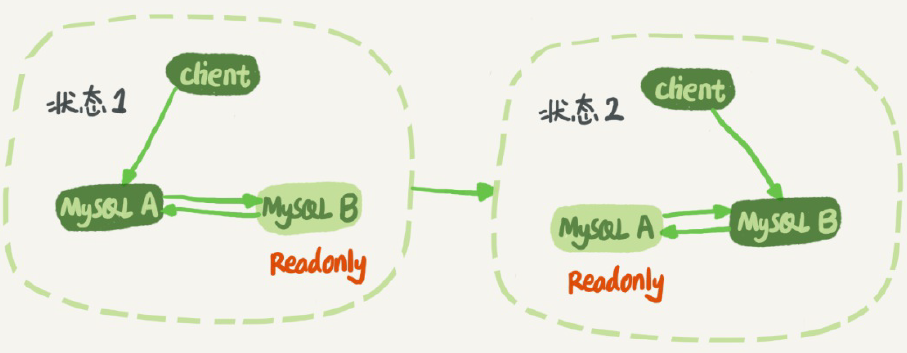

redo log：

重做日志用来实现事务的持久性，即事务ACID中的D。它由两部分组成：一是内存中的重做日志缓冲（redo log buffer），其是易失的；二是重做日志文件（redo log file），它是持久的。

InnoDB是事务的存储引擎，它通过Force Log at Commit机制实现事务的持久性，即当事务提交（COMMIT）时，必须先将该事务的所有日志写入到重做日志文件进行持久化，待事务的COMMIT操作完成才算完成。这里的日志是指重做日志，在InnoDB存储引擎中，由两部分组成，即redo log和undo log。

redo log用来保证事务的持久性，undo log用来帮助事务回滚及MVCC的功能。redo log基本上都是顺序写的，在数据库运行时不需要对redo log的文件进行读取操作。而undo log是需要进行随机读写的。

InnoDB有一个后台线程，每隔1秒，就会把redo log buffer中的日志，调用write写到文件系统的page cache，然后调用fsync持久化到磁盘。

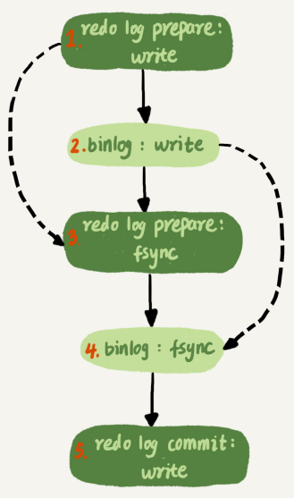

redo log 存储内容：

表空间号+数据页号+偏移量+修改几个字节的值+具体的值

redo log的行数据不断写入到redolog buffe，并且后台线程不断的把数据刷新到磁盘当中，当一行数据的不断写入写满后，就需要把它写入到磁盘的文件里面，

redo log 刷新到磁盘的时机
mysql触发下面的条件的时候会把redo log buffer 刷新到磁盘当中：

1.   超过redo log buffer 的一半大小
2.   redo log需要在事务提交的时候，需要把redo log对应的redo log block刷新到磁盘中，同时为了保证事务正确提交，redo log存在重做日志。
3.   后台线程1秒一次刷新数据到磁盘
4.   mysql关闭会把redo log 全部刷新到磁盘

undo log：

重做日志记录了事务的行为，可以很好地通过其对页进行“重做”操作。但是事务有时还需要进行回滚操作，这时就需要undo。因此在对数据库进行修改时，InnoDB存储引擎不但会产生redo，还会产生一定量的undo。事务开始之前产生 undo log，事务结束之后不会立即删除，而是由后台 purge 线程判断是否有其他事务会使用，当没有事务再需要用到这些回滚日志时，回滚日志会被删除。

undo log 是逻辑日志，记录的是事务[开始前]的数据状态，记录的是更新之前的值，redo log 是物理日志，记录的是事务[完成后]的数据状态，记录的是更新之后的值。

undo log 存储内容：


#### 6.4 谈谈你对MVCC的了解

**参考答案**

InnoDB默认的隔离级别是RR（REPEATABLE READ），RR解决脏读、不可重复读、幻读等问题，使用的是MVCC。MVCC全称Multi-Version Concurrency Control，即多版本的并发控制协议。它最大的优点是读不加锁，因此读写不冲突，并发性能好。InnoDB实现MVCC，多个版本的数据可以共存。

在“可重复读”隔离级别下，这个视图是在事务启动时创建的，整个事务存在期间都用这个视图；
在“读提交”隔离级别下，这个视图是在每个SQL语句开始执行的时候创建的。
串行化”隔离级别下直接用加锁的方式来避免并行访问。

主要基于以下技术及数据结构：

1.  隐藏列：InnoDB中每行数据都有隐藏列，隐藏列中包含了本行数据的事务id、指向undo log的指针等。InnoDB里面每个事务有一个唯一的事务ID，叫作transaction id。它是在事务开始的时候向 InnoDB的事务系统申请的，是按申请顺序严格递增的。每行数据也都是有多个版本的。每次事务更新数据的时候，都会生成一个新的数据版本，并且把transaction id赋值给这个数据版本的事务ID，记为row trx_id。
2.  基于undo log的版本链：每行数据的隐藏列中包含了指向undo log的指针，而每条undo log也会指向更早版本的undo log，从而形成一条版本链。
3.  ReadView：通过隐藏列和版本链，MySQL可以将数据恢复到指定版本。但是具体要恢复到哪个版本，则需要根据ReadView来确定。

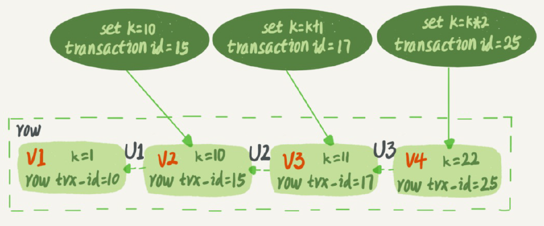

InnoDB为每个事务构造了一个数组，用来保存这个事务启动瞬间，当前正在“活跃”的所有事务ID。“活跃”指的就是，启动了但还没提交。

数组里面事务ID的最小值记为低水位，当前系统里面已经创建过的事务ID的最大值加1记为高水
位。这个视图数组和高水位，就组成了当前事务的一致性视图（read-view）。


当前事务的启动瞬间来说，一个数据版本的row trx_id，有以下几种可能：

1. 如果落在绿色部分，表示这个版本是已提交的事务或者是当前事务自己生成的，这个数据是
   可见的；

2. 如果落在红色部分，表示这个版本是由将来启动的事务生成的，是肯定不可见的；
3. 如果落在黄色部分，那就包括两种情况
a. 若 row trx_id在数组中，表示这个版本是由还没提交的事务生成的，不可见；
b. 若 row trx_id不在数组中，表示这个版本是已经提交了的事务生成的，可见。

查询时可以保证一致性读（快照读），更新数据都是先读后写的，只能读当前的最新值，称为“当前读”（current read）。除了update语句外，select语句如果加锁，也是当前读。

```
select k from t where id=1 lock in share mode; //读锁
select k from t where id=1 for update;		  //写锁
```

#### 6.5 MySQL主从同步是如何实现的？

**参考答案**

复制（replication）是MySQL数据库提供的一种高可用高性能的解决方案，一般用来建立大型的应用。总体来说，replication的工作原理分为以下3个步骤：

1.  主服务器（master）把数据更改记录到二进制日志（binlog）中。
2.  从服务器（slave）把主服务器的二进制日志复制到自己的中继日志（relay log）中。
3.  从服务器重做中继日志中的日志，把更改应用到自己的数据库上，以达到数据的最终一致性。

复制的工作原理并不复杂，其实就是一个完全备份加上二进制日志备份的还原。不同的是这个二进制日志的还原操作基本上实时在进行中。这里特别需要注意的是，复制不是完全实时地进行同步，而是异步实时。这中间存在主从服务器之间的执行延时，如果主服务器的压力很大，则可能导致主从服务器延时较大。复制的工作原理如下图所示，其中从服务器有2个线程，一个是I/O线程，负责读取主服务器的二进制日志，并将其保存为中继日志；另一个是SQL线程，复制执行中继日志。

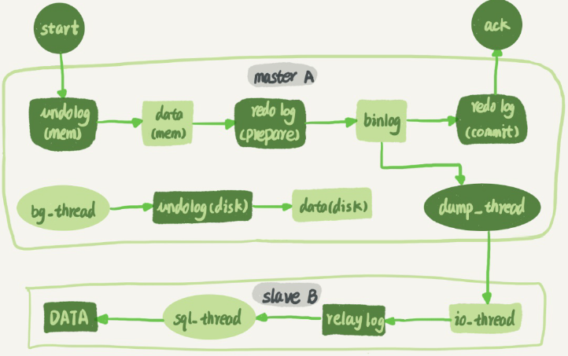

主备延迟，就是同一个事务，在备库执行完成的时间和主库执行完成的时间之间的差值，也就是T3-T1。

seconds_behind_master，用于表示当前备库延迟了多少秒。

主备延迟来源：

- 备库所在机器的性能要比主库所在的机器性能差、
- 备库的压力大
- 大事务。主库上必须等事务执行完成才会写入binlog，再传给备库。
- 大表 DDL

**可靠性优先**

1. 判断备库B现在的seconds_behind_master，如果小于某个值（比如5秒）继续下一步，否则
   持续重试这一步；

2. 把主库A改成只读状态，即把readonly设置为true；
3. 判断备库B的seconds_behind_master的值，直到这个值变成0为止；
4. 把备库B改成可读写状态，也就是把readonly 设置为false；
5. 把业务请求切到备库B。

**可用性优先**

1. 步骤2中，主库A执行完insert语句，插入了一行数据（4,4），之后开始进行主备切换。

2. 步骤3中，由于主备之间有5秒的延迟，所以备库B还没来得及应用“插入c=4”这个中转日志，
    就开始接收客户端“插入 c=5”的命令。
3. 步骤4中，备库B插入了一行数据（4,5），并且把这个binlog发给主库A。
4. 步骤5中，备库B执行“插入c=4”这个中转日志，插入了一行数据（5,4）。而直接在备库B执
    行的“插入c=5”这个语句，传到主库A，就插入了一行新数据（5,5）。

使用mixed或者statement格式的binlog时，数据很可能悄悄地就不一致了

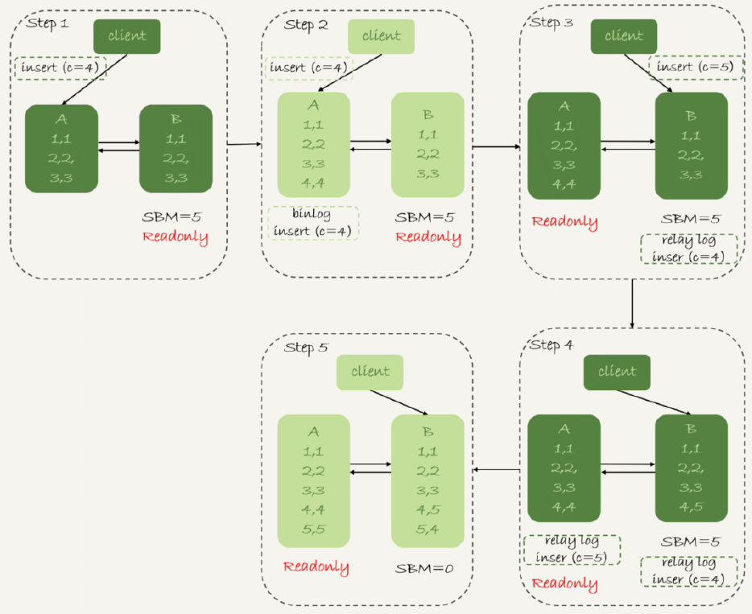

使用row格式的binlog时，数据不一致的问题更容易被发现

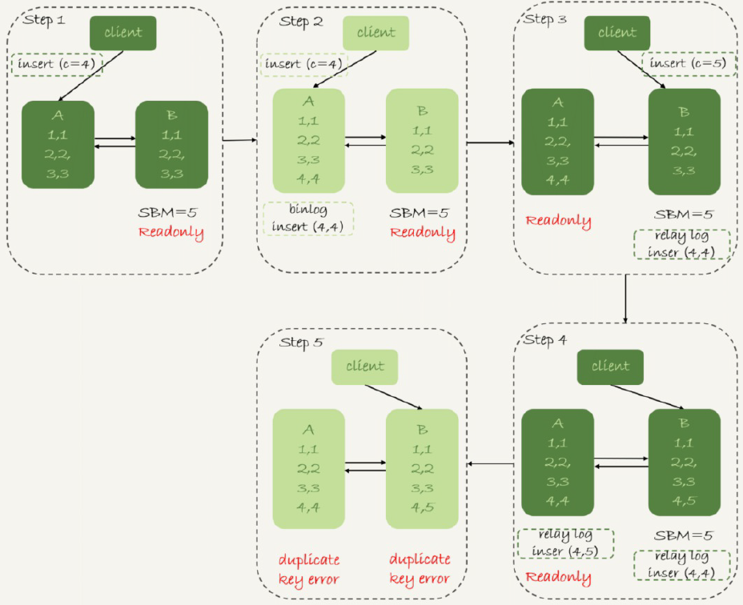

**主库出问题了从库怎么办？**

GTID 为了解决从库找新主库的开始同步位点难得问题。

GTID的全称是Global Transaction Identifier，也就是全局事务ID，是一个事务在提交的时候生成的，是这个事务的唯一标识。

- server_uuid是一个实例第一次启动时自动生成的，是一个全局唯一的值；
- gno是一个整数，初始值是1，每次提交事务的时候分配给这个事务，并加1。

启动一个MySQL实例的时候，加上参数gtid_mode=on和enforce_gtid_consistency=on就可以了。

每个MySQL实例都维护了一个GTID集合，用来对应“这个实例执行过的所有事务”

基于 GTID 的主备切换

1. 实例B指定主库A，基于主备协议建立连接。
2. 实例B把set_b发给主库A。
3. 实例A算出set_a与set_b的差集，也就是所有存在于set_a，但是不存在于set_b的GITD的
   集合，判断A本地是否包含了这个差集需要的所有binlog事务。
   a. 如果不包含，表示A已经把实例B需要的binlog给删掉了，直接返回错误；
   b. 如果确认全部包含，A从自己的binlog文件里面，找出第一个不在set_b的事务，发给B；
4. 之后就从这个事务开始，往后读文件，按顺序取binlog发给B去执行。

**主从数据不一致导致过期读怎么办？**

- 强制走主库方案其实就是，将查询请求做分类。对于必须要拿到最新结果的请求，强制将其发到主库上；对于可以读到旧数据的请求，才将其发到从库上
- 主库更新后，读从库之前先sleep一下。这个方案的假设是，大多数情况下主备延迟在1秒之内，做一个sleep可以有很大概率拿到最新的数据。
- 判断主备无延迟。Master_Log_File和Read_Master_Log_Pos，表示的是读到的主库的最新位点；Relay_Master_Log_File和Exec_Master_Log_Pos，表示的是备库执行的最新位点。如果Master_Log_File和Relay_Master_Log_File、Read_Master_Log_Pos和Exec_Master_Log_Pos这两组值完全相同，就表示接收到的日志已经同步完成。
- 启用了semi-sync，就表示所有给客户端发送过确认的事务，都确保了备库已经
  收到了这个日志。

#### 6.6 count

count(\*) ≈ count(1) > count(主键 id) > count(字段)

- count(主键id)来说，InnoDB引擎会遍历整张表，把每一行的id值都取出来，返回给server 层。server层拿到id后，判断是不可能为空的，就按行累加。

- count(1)来说，InnoDB引擎遍历整张表，但不取值。server层对于返回的每一行，放一个数字“1”进去，判断是不可能为空的，按行累加。

**count(字段)**

- 如果这个“字段”是定义为not null的话，一行行地从记录里面读出这个字段，判断不能为
  null，按行累加；
- 如果这个“字段”定义允许为null，那么执行的时候，判断到有可能是null，还要把值取出来再
  判断一下，不是null才累加。
- count(\*) MySQL优化器会找到最小的那棵树来遍历。在保证逻辑正确的前提下，尽量减少扫描的数据量
