## 1. Java基础

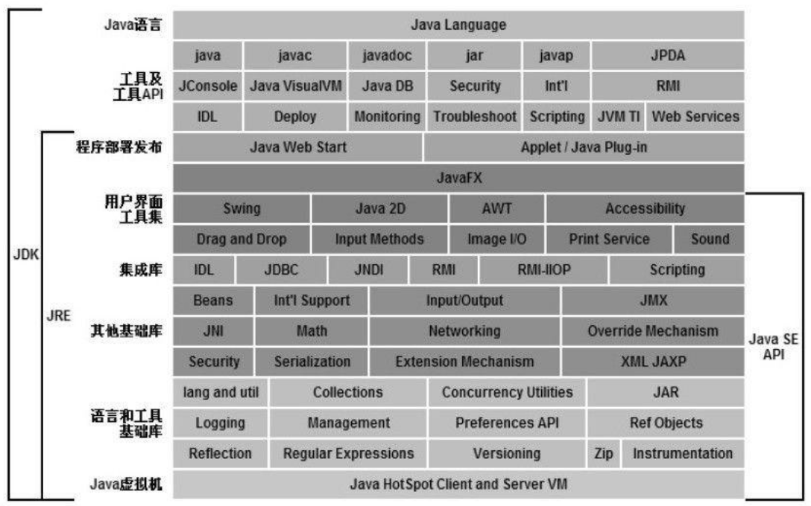

#### 1.1 为什么Java代码可以实现一次编写、到处运行？

**参考答案**

JVM（JVM）是Java跨平台的关键。

在程序运行前，Java源代码（.java）需要经过编译器编译成字节码（.class）。在程序运行时，JVM负责将字节码翻译成特定平台下的机器码并运行，也就是说，只要在不同的平台上安装对应的JVM，就可以运行字节码文件。

同一份Java源代码在不同的平台上运行，它不需要做任何的改变，并且只需要编译一次。而编译好的字节码，是通过JVM这个中间的“桥梁”实现跨平台的，JVM是与平台相关的软件，它能将统一的字节码翻译成该平台的机器码。

**注意事项**

1. 编译的结果是生成字节码、不是机器码，字节码不能直接运行，必须通过JVM翻译成机器码才能运行；
2. 跨平台的是Java程序、而不是JVM，JVM是用C/C++开发的软件，不同平台下需要安装不同版本的JVM。

#### 1.2 一个Java文件里可以有多个类吗（不含内部类）？

**参考答案**

1. 一个java文件里可以有多个类，但最多只能有一个被public修饰的类；
2. 如果这个java文件中包含public修饰的类，则这个类的名称必须和java文件名一致。

#### 1.3 说一说你对Java访问权限的了解

**参考答案**

Java语言为我们提供了三种访问修饰符，即private、protected、public，在使用这些修饰符修饰目标时，一共可以形成四种访问权限，即private、default、protected、public，注意在不加任何修饰符时为default访问权限。

在修饰成员变量/成员方法时，该成员的四种访问权限的含义如下：

- private：该成员可以被该类内部成员访问；
- default：该成员可以被该类内部成员访问，也可以被同一包下其他的类访问；
- protected：该成员可以被该类内部成员访问，也可以被同一包下其他的类访问，还可以被它的子类访问；
- public：该成员可以被任意包下，任意类的成员进行访问。

在修饰类时，该类只有两种访问权限，对应的访问权限的含义如下：

- default：该类可以被同一包下其他的类访问；
- public：该类可以被任意包下，任意的类所访问。

#### 1.4 介绍一下Java的数据类型

**参考答案**

Java数据类型包括基本数据类型和引用数据类型两大类。

基本数据类型有8个，可以分为4个小类，分别是整数类型（byte/short/int/long）、浮点类型（float/double）、字符类型（char）、布尔类型（boolean）。其中，4个整数类型中，int类型最为常用。2个浮点类型中，double最为常用。另外，在这8个基本类型当中，除了布尔类型之外的其他7个类型，都可以看做是数字类型，它们相互之间可以进行类型转换。

引用类型就是对一个对象的引用，根据引用对象类型的不同，可以将引用类型分为3类，即数组、类、接口类型。引用类型本质上就是通过指针，指向堆中对象所持有的内存空间，只是Java语言不再沿用指针这个说法而已。

**扩展阅读**

对于基本数据类型，你需要了解每种类型所占据的内存空间，面试官可能会追问这类问题：

- byte：1字节（8位），数据范围是 -2^7 ~ 2^7-1。
- short：2字节（16位），数据范围是 -2^15 ~ 2^15-1。
- int：4字节（32位），数据范围是 -2^31 ~ 2^31-1。
- long：8字节（64位），数据范围是 -2^63 ~ 2^63-1。
- float：4字节（32位），数据范围大约是 -3.4*10^38 ~ 3.4*10^38。
- double：8字节（64位），数据范围大约是 -1.8*10^308 ~ 1.8*10^308。
- char：2字节（16位），数据范围是 \u0000 ~ \uffff。
- boolean：Java规范没有明确的规定，不同的JVM有不同的实现机制。

对于引用数据类型，你需要了解JVM的内存分布情况，知道引用以及引用对象存放的位置，详见JVM部分的题目。

#### 1.6 请介绍全局变量和局部变量的区别

**参考答案**

Java中的变量分为成员变量和局部变量，它们的区别如下：

成员变量：

1. 成员变量是在类的范围里定义的变量；
2. 成员变量有默认初始值；
3. 未被static修饰的成员变量也叫实例变量，它存储于对象所在的堆内存中，生命周期与对象相同；
4. 被static修饰的成员变量也叫类变量，它存储于方法区中，生命周期与当前类相同。

局部变量：

1. 局部变量是在方法里定义的变量；
2. 局部变量没有默认初始值；
3. 局部变量存储于栈内存中，作用的范围结束，变量空间会自动的释放。

**注意事项**

Java中没有真正的全局变量，面试官应该是出于其他语言的习惯说全局变量的，他的本意应该是指成员变量。

#### 1.7 请介绍一下实例变量的默认值

**参考答案**

实例变量若为引用数据类型，其默认值一律为null。若为基本数据类型，其默认值如下：

- byte：0
- short：0
- int：0
- long：0L
- float：0.0F
- double：0.0
- char：'\u0000'
- boolean：false

**注意事项**

上述默认值规则适用于所有的成员变量，所以对于类变量也是适用的。

#### 1.8 为啥要有包装类？

**参考答案**

Java语言是面向对象的语言，其设计理念是“一切皆对象”。但8种基本数据类型却出现了例外，它们不具备对象的特性。正是为了解决这个问题，Java为每个基本数据类型都定义了一个对应的引用类型，这就是包装类。

**扩展阅读**

Java之所以提供8种基本数据类型，主要是为了照顾程序员的传统习惯。这8种基本数据类型的确带来了一定的方便性，但在某些时候也会受到一些制约。比如，所有的引用类型的变量都继承于Object类，都可以当做Object类型的变量使用，但基本数据类型却不可以。如果某个方法需要Object类型的参数，但实际传入的值却是数字的话，就需要做特殊的处理了。有了包装类，这种问题就可以得以简化。

#### 1.9 说一说自动装箱、自动拆箱的应用场景

**参考答案**

自动装箱、自动拆箱是JDK1.5提供的功能。

自动装箱：可以把一个基本类型的数据直接赋值给对应的包装类型；

自动拆箱：可以把一个包装类型的对象直接赋值给对应的基本类型；

通过自动装箱、自动拆箱功能，可以大大简化基本类型变量和包装类对象之间的转换过程。比如，某个方法的参数类型为包装类型，调用时我们所持有的数据却是基本类型的值，则可以不做任何特殊的处理，直接将这个基本类型的值传入给方法即可。

#### 1.10 如何对Integer和Double类型判断相等？

**参考答案**

Integer、Double不能直接进行比较，这包括：

- 不能用==进行直接比较，因为它们是不同的数据类型；
- 不能转为字符串进行比较，因为转为字符串后，浮点值带小数点，整数值不带，这样它们永远都不相等；
- 不能使用compareTo方法进行比较，虽然它们都有compareTo方法，但该方法只能对相同类型进行比较。

整数、浮点类型的包装类，都继承于Number类型，而Number类型分别定义了将数字转换为byte、short、int、long、float、double的方法。所以，可以将Integer、Double先转为转换为相同的基本数据类型（如double），然后使用==进行比较。

**示例代码**

```java
Integer i = 100;
Double d = 100.00;
System.out.println(i.doubleValue() == d.doubleValue());
```

#### 1.11 int和Integer有什么区别，二者在做==运算时会得到什么结果？

**参考答案**

int是基本数据类型，Integer是int的包装类。二者在做==运算时，Integer会自动拆箱为int类型，然后再进行比较。届时，如果两个int值相等则返回true，否则就返回false。

#### 1.13 面向对象的三大特征是什么？

**参考答案**

面向对象的程序设计方法具有三个基本特征：封装、继承、多态。其中，封装指的是将对象的实现细节隐藏起来，然后通过一些公用方法来暴露该对象的功能；继承是面向对象实现软件复用的重要手段，当子类继承父类后，子类作为一种特殊的父类，将直接获得父类的属性和方法；多态指的是子类对象可以直接赋给父类变量，但运行时依然表现出子类的行为特征，这意味着同一个类型的对象在执行同一个方法时，可能表现出多种行为特征。

**扩展阅读**

抽象也是面向对象的重要部分，抽象就是忽略一个主题中与当前目标无关的那些方面，以便更充分地注意与当前目标有关的方面。抽象并不打算了解全部问题，而只是考虑部分问题。例如，需要考察Person对象时，不可能在程序中把Person的所有细节都定义出来，通常只能定义Person的部分数据、部分行为特征，而这些数据、行为特征是软件系统所关心的部分。

#### 面向对象的五大基本原则

- 单一职责原则：一个类最好只做一件事，高内聚、低耦合
- 开放封闭原则：软件实体对扩展开放，对修改封闭
- 里氏替换原则：子类必须能够替换其父类，程序的行为不会发生任何变化
- 依赖倒置原则：高层模块不依赖底层模块，二者都依赖于抽象，抽象不依赖于具体。
- 接口隔离原则：使用多个小的专门的接口，而不要使用一个大的总接口

#### 1.14 封装的目的是什么，为什么要有封装？

**参考答案**

封装是面向对象编程语言对客观世界的模拟，在客观世界里，对象的状态信息都被隐藏在对象内部，外界无法直接操作和修改。对一个类或对象实现良好的封装，可以实现以下目的：

- 隐藏类的实现细节；
- 让使用者只能通过事先预定的方法来访问数据，从而可以在该方法里加入控制逻辑，限制对成员变量的不合理访问；
- 可进行数据检查，从而有利于保证对象信息的完整性；
- 便于修改，提高代码的可维护性。

**扩展阅读**

为了实现良好的封装，需要从两个方面考虑：

- 将对象的成员变量和实现细节隐藏起来，不允许外部直接访问；
- 把方法暴露出来，让方法来控制对这些成员变量进行安全的访问和操作。

封装实际上有两个方面的含义：把该隐藏的隐藏起来，把该暴露的暴露出来。这两个方面都需要通过使用Java提供的访问控制符来实现。

#### 1.15 说一说你对多态的理解

**参考答案**

因为子类其实是一种特殊的父类，因此Java允许把一个子类对象直接赋给一个父类引用变量，无须任何类型转换，或者被称为向上转型，向上转型由系统自动完成。

当把一个子类对象直接赋给父类引用变量时，例如 BaseClass obj = new SubClass();，这个obj引用变量的编译时类型是BaseClass，而运行时类型是SubClass，当运行时调用该引用变量的方法时，其方法行为总是表现出子类方法的行为特征，而不是父类方法的行为特征，这就可能出现：相同类型的变量、调用同一个方法时呈现出多种不同的行为特征，这就是多态。

#### 1.16 Java中的多态是怎么实现的？

**参考答案**

多态的实现离不开继承，在设计程序时，我们可以将参数的类型定义为父类型。在调用程序时，则可以根据实际情况，传入该父类型的某个子类型的实例，这样就实现了多态。对于父类型，可以有三种形式，即普通的类、抽象类、接口。对于子类型，则要根据它自身的特征，重写父类的某些方法，或实现抽象类/接口的某些抽象方法。

#### 1.17 Java为什么是单继承，为什么不能多继承？

**参考答案**

首先，Java是单继承的，指的是Java中一个类只能有一个直接的父类。Java不能多继承，则是说Java中一个类不能直接继承多个父类。

其次，Java在设计时借鉴了C++的语法，而C++是支持多继承的。Java语言之所以摒弃了多继承的这项特征，是因为多继承容易产生混淆。比如，两个父类中包含相同的方法时，子类在调用该方法或重写该方法时就会迷惑。

准确来说，Java是可以实现"多继承"的。因为尽管一个类只能有一个直接父类，但是却可以有任意多个间接的父类。这样的设计方式，避免了多继承时所产生的混淆。

#### 1.18 说一说重写与重载的区别

**参考答案**

重载发生在同一个类中，若多个方法之间方法名相同、参数列表不同，则它们构成重载的关系。重载与方法的返回值以及访问修饰符无关，即重载的方法不能根据返回类型进行区分。

重写发生在父类子类中，若子类方法想要和父类方法构成重写关系，则它的方法名、参数列表必须与父类方法相同。另外，返回值要小于等于父类方法，抛出的异常要小于等于父类方法，访问修饰符则要大于等于父类方法。还有，若父类方法的访问修饰符为private，则子类不能对其重写。

#### 1.20 介绍一下Object类中的方法

**参考答案**

Object类提供了如下几个常用方法：

- Class<?> getClass()：返回该对象的运行时类。
- boolean equals(Object obj)：判断指定对象与该对象是否相等。
- int hashCode()：返回该对象的hashCode值。在默认情况下，**Object类的hashCode()方法根据该对象的地址来计算。**但很多类都重写了Object类的hashCode()方法，不再根据地址来计算其hashCode()方法值。
- String toString()：返回该对象的字符串表示，当程序使用System.out.println()方法输出一个对象，或者把某个对象和字符串进行连接运算时，系统会自动调用该对象的toString()方法返回该对象的字符串表示。Object类的toString()方法返回 运行时类名@十六进制hashCode值 格式的字符串，但很多类都重写了Object类的toString()方法，用于返回可以表述该对象信息的字符串。

另外，Object类还提供了wait()、notify()、notifyAll()这几个方法，通过这几个方法可以控制线程的暂停和运行。Object类还提供了一个clone()方法，该方法用于帮助其他对象来实现“自我克隆”，所谓“自我克隆”就是得到一个当前对象的副本，而且二者之间完全隔离。由于该方法使用了protected修饰，因此它只能被子类重写或调用。

**扩展阅读**

Object类还提供了一个finalize()方法，当系统中没有引用变量引用到该对象时，垃圾回收器调用此方法来清理该对象的资源。并且，针对某一个对象，垃圾回收器最多只会调用它的finalize()方法一次。

注意，finalize()方法何时调用、是否调用都是不确定的，我们也不要主动调用finalize()方法。从JDK9开始，这个方法被标记为不推荐使用的方法。

#### 1.21 说一说hashCode()和equals()的关系

**参考答案**

hashCode()用于获取哈希码（散列码），eauqls()用于比较两个对象是否相等，它们应遵守如下规定：

- 如果两个对象相等，则它们必须有相同的哈希码。
- 如果两个对象有相同的哈希码，则它们未必相等。

**扩展阅读**

在Java中，Set接口代表无序的、元素不可重复的集合，HashSet则是Set接口的典型实现。当向HashSet中加入一个元素时，它需要判断集合中是否已经包含了这个元素，从而避免重复存储。HashSet首先会调用对象的hashCode()方法获取其哈希码，并通过哈希码确定该对象在集合中存放的位置。假设这个位置之前已经存了一个对象，则HashSet会调用equals()对两个对象进行比较。若相等则说明对象重复，此时不会保存新加的对象。若不等说明对象不重复，但是它们存储的位置发生了碰撞，此时HashSet会采用链式结构在同一位置保存多个对象，即将新加对象链接到原来对象的之后。之后，再有新添加对象也映射到这个位置时，就需要与这个位置中所有的对象进行equals()比较，若均不相等则将其链到最后一个对象之后。

#### 1.22 为什么要重写hashCode()和equals()？

**参考答案**

Object类提供的equals()方法默认是用==来进行比较的，也就是说只有两个对象是同一个对象时，才能返回相等的结果。而实际的业务中，我们通常的需求是，若两个不同的对象它们的内容是相同的，就认为它们相等。鉴于这种情况，Object类中equals()方法的默认实现是没有实用价值的，所以通常都要重写。

由于hashCode()与equals()具有联动关系（参考“说一说hashCode()和equals()的关系”一题），所以equals()方法重写时，通常也要将hashCode()进行重写，使得这两个方法始终满足相关的约定。

#### 1.23 ==和equals()有什么区别？

**参考答案**

==运算符：

- 作用于基本数据类型时，是比较两个数值是否相等；
- 作用于引用数据类型时，是比较两个对象的内存地址是否相同，即判断它们是否为同一个对象；

equals()方法：

- 没有重写时，Object默认以 == 来实现，即比较两个对象的内存地址是否相同；
- 进行重写后，一般会按照对象的内容来进行比较，若两个对象内容相同则认为对象相等，否则认为对象不等。

#### 1.24 String类有哪些方法？

**参考答案**

String类是Java最常用的API，它包含了大量处理字符串的方法，比较常用的有：

- char charAt(int index)：返回指定索引处的字符；
- String substring(int beginIndex, int endIndex)：从此字符串中截取出一部分子字符串；
- String[] split(String regex)：以指定的规则将此字符串分割成数组；
- String trim()：删除字符串前导和后置的空格；
- int indexOf(String str)：返回子串在此字符串首次出现的索引；
- int lastIndexOf(String str)：返回子串在此字符串最后出现的索引；
- boolean startsWith(String prefix)：判断此字符串是否以指定的前缀开头；
- boolean endsWith(String suffix)：判断此字符串是否以指定的后缀结尾；
- String toUpperCase()：将此字符串中所有的字符大写；
- String toLowerCase()：将此字符串中所有的字符小写；
- String replaceFirst(String regex, String replacement)：用指定字符串替换第一个匹配的子串；
- String replaceAll(String regex, String replacement)：用指定字符串替换所有的匹配的子串。

**注意事项**

String类的方法太多了，你没必要都记下来，更不需要一一列举。面试时能说出一些常用的方法，表现出对这个类足够的熟悉就可以了。另外，建议你挑几个方法仔细看看源码实现，面试时可以重点说这几个方法。

#### 1.25 String可以被继承吗？

**参考答案**

String类由final修饰，所以不能被继承。

**扩展阅读**

在Java中，String类被设计为不可变类，主要表现在它保存字符串的成员变量是final的。

- Java 9之前字符串采用char[]数组来保存字符，即 private final char[] value；
- Java 9做了改进，采用byte[]数组来保存字符，即 private final byte[] value；

之所以要把String类设计为不可变类，主要是出于安全和性能的考虑，可归纳为如下4点。

- 由于字符串无论在任何 Java 系统中都广泛使用，会用来存储敏感信息，如账号，密码，网络路径，文件处理等场景里，保证字符串 String 类的安全性就尤为重要了，如果字符串是可变的，容易被篡改，那我们就无法保证使用字符串进行操作时，它是安全的，很有可能出现 SQL 注入，访问危险文件等操作。
- 在多线程中，只有不变的对象和值是线程安全的，可以在多个线程中共享数据。由于 String 天然的不可变，当一个线程”修改“了字符串的值，只会产生一个新的字符串对象，不会对其他线程的访问产生副作用，访问的都是同样的字符串数据，不需要任何同步操作。
- 字符串作为基础的数据结构，大量地应用在一些集合容器之中，尤其是一些散列集合，在散列集合中，存放元素都要根据对象的 hashCode() 方法来确定元素的位置。由于字符串 hashcode 属性不会变更，保证了唯一性，使得类似 HashMap，HashSet 等容器才能实现相应的缓存功能。由于 String 的不可变，避免重复计算 hashcode，只要使用缓存的 hashcode 即可，这样一来大大提高了在散列集合中使用 String 对象的性能。
- 当字符串不可变时，字符串常量池才有意义。字符串常量池的出现，可以减少创建相同字面量的字符串，让不同的引用指向池中同一个字符串，为运行时节约很多的堆内存。若字符串可变，字符串常量池失去意义，基于常量池的 String.intern() 方法也失效，每次创建新的字符串将在堆内开辟出新的空间，占据更多的内存。

因为要保证String类的不可变，那么将这个类定义为final的就很容易理解了。如果没有final修饰，那么就会存在String的子类，这些子类可以重写String类的方法，强行改变字符串的值，这便违背了String类设计的初衷。

#### 1.26 说一说String和StringBuffer有什么区别

**参考答案**

String类是不可变类，即一旦一个String对象被创建以后，包含在这个对象中的字符序列是不可改变的，直至这个对象被销毁。

StringBuffer对象则代表一个字符序列可变的字符串，当一个StringBuffer被创建以后，通过StringBuffer提供的append()、insert()、reverse()、setCharAt()、setLength()等方法可以改变这个字符串对象的字符序列。一旦通过StringBuffer生成了最终想要的字符串，就可以调用它的toString()方法将其转换为一个String对象。

#### 1.27 说一说StringBuffer和StringBuilder有什么区别

**参考答案**

StringBuffer、StringBuilder都代表可变的字符串对象，它们有共同的父类 AbstractStringBuilder，并且两个类的构造方法和成员方法也基本相同。不同的是，StringBuffer是线程安全的，而StringBuilder是非线程安全的，所以StringBuilder性能略高。一般情况下，要创建一个内容可变的字符串，建议优先考虑StringBuilder类。

#### 1.28 使用字符串时，new和""推荐使用哪种方式？

**参考答案**

先看看 "hello" 和 new String("hello") 的区别：

- 当Java程序直接使用 "hello" 的字符串直接量时，JVM将会使用常量池来管理这个字符串；
- 当使用 new String("hello") 时，JVM会先使用常量池来管理 "hello" 直接量，再调用String类的构造器来创建一个新的String对象，新创建的String对象被保存在堆内存中。

显然，采用new的方式会多创建一个对象出来，会占用更多的内存，所以一般建议使用直接量的方式创建字符串。

#### 1.29 说一说你对字符串拼接的理解

**参考答案**

拼接字符串有很多种方式，其中最常用的有4种，下面列举了这4种方式各自适合的场景。

1. \+ 运算符：如果拼接的都是字符串直接量，则适合使用 + 运算符实现拼接；
2. StringBuilder：如果拼接的字符串中包含变量，并不要求线程安全，则适合使用StringBuilder；
3. StringBuffer：如果拼接的字符串中包含变量，并且要求线程安全，则适合使用StringBuffer；
4. String类的concat方法：如果只是对两个字符串进行拼接，并且包含变量，则适合使用concat方法；

**扩展阅读**

采用 + 运算符拼接字符串时：

- 如果拼接的都是字符串直接量，则在编译时编译器会将其直接优化为一个完整的字符串，和你直接写一个完整的字符串是一样的，所以效率非常的高。
- 如果拼接的字符串中包含变量，则在编译时编译器采用StringBuilder对其进行优化，即自动创建StringBuilder实例并调用其append()方法，将这些字符串拼接在一起，效率也很高。但如果这个拼接操作是在循环中进行的，那么每次循环编译器都会创建一个StringBuilder实例，再去拼接字符串，相当于执行了 new StringBuilder().append(str)，所以此时效率很低。

采用StringBuilder/StringBuffer拼接字符串时：

- StringBuilder/StringBuffer都有字符串缓冲区，缓冲区的容量在创建对象时确定，并且默认为16。当拼接的字符串超过缓冲区的容量时，会触发缓冲区的扩容机制，即缓冲区加倍。
- 缓冲区频繁的扩容会降低拼接的性能，所以如果能提前预估最终字符串的长度，则建议在创建可变字符串对象时，放弃使用默认的容量，可以指定缓冲区的容量为预估的字符串的长度。

采用String类的concat方法拼接字符串时：

- concat方法的拼接逻辑是，先创建一个足以容纳待拼接的两个字符串的字节数组，然后先后将两个字符串拼到这个数组里，最后将此数组转换为字符串。
- 在拼接大量字符串的时候，concat方法的效率低于StringBuilder。但是只拼接2个字符串时，concat方法的效率要优于StringBuilder。并且这种拼接方式代码简洁，所以只拼2个字符串时建议优先选择concat方法。

#### 1.30 两个字符串相加的底层是如何实现的？

**参考答案**

如果拼接的都是字符串直接量，则在编译时编译器会将其直接优化为一个完整的字符串，和你直接写一个完整的字符串是一样的。

如果拼接的字符串中包含变量，则在编译时编译器采用StringBuilder对其进行优化，即自动创建StringBuilder实例并调用其append()方法，将这些字符串拼接在一起。

#### 1.31 String a = "abc"; ，说一下这个过程会创建什么，放在哪里？

**参考答案**

JVM会使用常量池来管理字符串直接量。在执行这句话时，JVM会先检查常量池中是否已经存有"abc"，若没有则将"abc"存入常量池，否则就复用常量池中已有的"abc"，将其引用赋值给变量a。

#### 1.32 new String("abc") 是去了哪里，仅仅是在堆里面吗？

**参考答案**

在执行这句话时，JVM会先使用常量池来管理字符串直接量，即将"abc"存入常量池。然后再创建一个新的String对象，这个对象会被保存在堆内存中。并且，堆中对象的数据会指向常量池中的直接量。

#### 1.33 接口和抽象类有什么区别？

**参考答案**

从设计目的上来说，二者有如下的区别：

接口体现的是一种规范。对于接口的实现者而言，接口规定了实现者必须向外提供哪些服务；对于接口的调用者而言，接口规定了调用者可以调用哪些服务，以及如何调用这些服务。接口是多个程序之间的通信标准。

抽象类体现的是一种模板式设计。抽象类作为多个子类的抽象父类，可以被当成系统实现过程中的中间产品，这个中间产品已经实现了系统的部分功能，但这个产品依然不能当成最终产品，必须有更进一步的完善，这种完善可能有几种不同方式。

从使用方式上来说，二者有如下的区别：

- 接口里只能包含抽象方法、静态方法、默认方法和私有方法，不能为普通方法提供方法实现；抽象类则完全可以包含普通方法。
- 接口里只能定义静态常量(static final)，不能定义普通成员变量；抽象类里则既可以定义普通成员变量，也可以定义静态常量。
- 接口里不包含构造器；抽象类里可以包含构造器，抽象类里的构造器并不是用于创建对象，而是让其子类调用这些构造器来完成属于抽象类的初始化操作。
- 接口里不能包含初始化块；但抽象类则完全可以包含初始化块。
- 一个类最多只能有一个直接父类，包括抽象类；但一个类可以直接实现多个接口，通过实现多个接口可以弥补Java单继承的不足。

**扩展阅读**

接口和抽象类很像，它们都具有如下共同的特征：

- 接口和抽象类都不能被实例化，它们都位于继承树的顶端，用于被其他类实现和继承。
- 接口和抽象类都可以包含抽象方法，实现接口或继承抽象类的普通子类都必须实现这些抽象方法。

#### 1.34 接口中可以有构造函数吗？

**参考答案**

由于接口定义的是一种规范，因此接口里不能包含构造器和初始化块定义。接口里可以包含成员变量（只能是静态常量）、方法（只能是抽象实例方法、类方法、默认方法或私有方法）、内部类（包括内部接口、枚举）定义。

#### 1.36 遇到过异常吗，如何处理？

**参考答案**

在Java中，可以按照如下三个步骤处理异常：

1. 捕获异常

   将业务代码包裹在try块内部，当业务代码中发生任何异常时，系统都会为此异常创建一个异常对象。创建异常对象之后，JVM会在try块之后寻找可以处理它的catch块，并将异常对象交给这个catch块处理。

2. 处理异常

   在catch块中处理异常时，应该先记录日志，便于以后追溯这个异常。然后根据异常的类型、结合当前的业务情况，进行相应的处理。比如，给变量赋予一个默认值、直接返回空值、向外抛出一个新的业务异常交给调用者处理，等等。

3. 回收资源

   如果业务代码打开了某个资源，比如数据库连接、网络连接、磁盘文件等，则需要在这段业务代码执行完毕后关闭这项资源。并且，无论是否发生异常，都要尝试关闭这项资源。将关闭资源的代码写在finally块内，可以满足这种需求，即无论是否发生异常，finally块内的代码总会被执行。

#### 1.37 说一说Java的异常机制

**参考答案**

关于异常处理：

在Java中，处理异常的语句由try、catch、finally三部分组成。其中，try块用于包裹业务代码，catch块用于捕获并处理某个类型的异常，finally块则用于回收资源。当业务代码发生异常时，系统会创建一个异常对象，然后由JVM寻找可以处理这个异常的catch块，并将异常对象交给这个catch块处理。若业务代码打开了某项资源，则可以在finally块中关闭这项资源，因为无论是否发生异常，finally块一定会执行。

关于抛出异常：

当程序出现错误时，系统会自动抛出异常。除此以外，Java也允许程序主动抛出异常。当业务代码中，判断某项错误的条件成立时，可以使用throw关键字向外抛出异常。在这种情况下，如果当前方法不知道该如何处理这个异常，可以在方法签名上通过throws关键字声明抛出异常，则该异常将交给JVM处理。

关于异常跟踪栈：

程序运行时，经常会发生一系列方法调用，从而形成方法调用栈。异常机制会导致异常在这些方法之间传播，而异常传播的顺序与方法的调用相反。异常从发生异常的方法向外传播，首先传给该方法的调用者，再传给上层调用者，以此类推。最终会传到main方法，若依然没有得到处理，则JVM会终止程序，并打印异常跟踪栈的信息

#### 1.38 请介绍Java的异常接口

**参考答案**

Throwable是异常的顶层父类，代表所有的非正常情况。它有两个直接子类，分别是Error、Exception。

Error是错误，一般是指与虚拟机相关的问题，如系统崩溃、虚拟机错误、动态链接失败等，这种错误无法恢复或不可能捕获，将导致应用程序中断。通常应用程序无法处理这些错误，因此应用程序不应该试图使用catch块来捕获Error对象。在定义方法时，也无须在其throws子句中声明该方法可能抛出Error及其任何子类。

Exception是异常，它被分为两大类，分别是Checked异常和Runtime异常。所有的RuntimeException类及其子类的实例被称为Runtime异常；不是RuntimeException类及其子类的异常实例则被称为Checked异常。Java认为Checked异常都是可以被处理（修复）的异常，所以Java程序必须显式处理Checked异常。如果程序没有处理Checked异常，该程序在编译时就会发生错误，无法通过编译。Runtime异常则更加灵活，Runtime异常无须显式声明抛出，如果程序需要捕获Runtime异常，也可以使用try...catch块来实现。

#### 1.39 finally是无条件执行的吗？

**参考答案**

不管try块中的代码是否出现异常，也不管哪一个catch块被执行，甚至在try块或catch块中执行了return语句，finally块总会被执行。

**注意事项**

如果在try块或catch块中使用 System.exit(1); 来退出虚拟机，则finally块将失去执行的机会。但是我们在实际的开发中，重来都不会这样做，所以尽管存在这种导致finally块无法执行的可能，也只是一种可能而已。

#### 1.40 在finally中return会发生什么？

**参考答案**

在通常情况下，不要在finally块中使用return、throw等导致方法终止的语句，一旦在finally块中使用了return、throw语句，将会导致try块、catch块中的return、throw语句失效。

**详细解析**

当Java程序执行try块、catch块时遇到了return或throw语句，这两个语句都会导致该方法立即结束，但是系统执行这两个语句并不会结束该方法，而是去寻找该异常处理流程中是否包含finally块，如果没有finally块，程序立即执行return或throw语句，方法终止；如果有finally块，系统立即开始执行finally块。只有当finally块执行完成后，系统才会再次跳回来执行try块、catch块里的return或throw语句；如果finally块里也使用了return或throw等导致方法终止的语句，finally块已经终止了方法，系统将不会跳回去执行try块、catch块里的任何代码。

#### 1.41 说一说你对static关键字的理解

**参考答案**

在Java类里只能包含成员变量、方法、构造器、初始化块、内部类（包括接口、枚举）5种成员，而static可以修饰成员变量、方法、初始化块、内部类（包括接口、枚举），以static修饰的成员就是类成员。类成员属于整个类，而不属于单个对象。

对static关键字而言，有一条非常重要的规则：类成员（包括成员变量、方法、初始化块、内部类和内部枚举）不能访问实例成员（包括成员变量、方法、初始化块、内部类和内部枚举）。因为类成员是属于类的，类成员的作用域比实例成员的作用域更大，完全可能出现类成员已经初始化完成，但实例成员还不曾初始化的情况，如果允许类成员访问实例成员将会引起大量错误。

#### 1.42 static修饰的类能不能被继承？

**参考答案**

static修饰的类可以被继承。

**扩展阅读**

如果使用static来修饰一个内部类，则这个内部类就属于外部类本身，而不属于外部类的某个对象。因此使用static修饰的内部类被称为类内部类，有的地方也称为静态内部类。

static关键字的作用是把类的成员变成类相关，而不是实例相关，即static修饰的成员属于整个类，而不属于单个对象。外部类的上一级程序单元是包，所以不可使用static修饰；而内部类的上一级程序单元是外部类，使用static修饰可以将内部类变成外部类相关，而不是外部类实例相关。因此static关键字不可修饰外部类，但可修饰内部类。

静态内部类需满足如下规则：

1. 静态内部类可以包含静态成员，也可以包含非静态成员；

2. 静态内部类不能访问外部类的实例成员，只能访问它的静态成员；

3. 外部类的所有方法、初始化块都能访问其内部定义的静态内部类；

4. 在外部类的外部，也可以实例化静态内部类，语法如下：

   ```
   外部类.内部类 变量名 = new 外部类.内部类构造方法();
   ```

#### 1.43 static和final有什么区别？

**参考答案**

static关键字可以修饰成员变量、成员方法、初始化块、内部类，被static修饰的成员是类的成员，它属于类、不属于单个对象。以下是static修饰这4种成员时表现出的特征：

- 类变量：被static修饰的成员变量叫类变量（静态变量）。类变量属于类，它随类的信息存储在方法区，并不随对象存储在堆中，类变量可以通过类名来访问，也可以通过对象名来访问，但建议通过类名访问它。
- 类方法：被static修饰的成员方法叫类方法（静态方法）。类方法属于类，可以通过类名访问，也可以通过对象名访问，建议通过类名访问它。
- 静态块：被static修饰的初始化块叫静态初始化块。静态块属于类，它在类加载的时候被隐式调用一次，之后便不会被调用了。
- 静态内部类：被static修饰的内部类叫静态内部类。静态内部类可以包含静态成员，也可以包含非静态成员。静态内部类不能访问外部类的实例成员，只能访问外部类的静态成员。外部类的所有方法、初始化块都能访问其内部定义的静态内部类。

final关键字可以修饰类、方法、变量，以下是final修饰这3种目标时表现出的特征：

- final类：final关键字修饰的类不可以被继承。
- final方法：final关键字修饰的方法不可以被重写。
- final变量：final关键字修饰的变量，一旦获得了初始值，就不可以被修改。

**扩展阅读**

变量分为成员变量、局部变量。

final修饰成员变量：

- 类变量：可以在声明变量时指定初始值，也可以在静态初始化块中指定初始值；
- 实例变量：可以在声明变量时指定初始值，也可以在初始化块或构造方法中指定初始值；

final修饰局部变量：

- 可以在声明变量时指定初始值，也可以在后面的代码中指定初始值。

*注意：被 final 修饰的任何形式的变量，一旦获得了初始值，就不可以被修改！*

#### 1.44 说一说你对泛型的理解

**参考答案**

Java集合有个缺点—把一个对象“丢进”集合里之后，集合就会“忘记”这个对象的数据类型，当再次取出该对象时，该对象的编译类型就变成了Object类型（其运行时类型没变）。

Java集合之所以被设计成这样，是因为集合的设计者不知道我们会用集合来保存什么类型的对象，所以他们把集合设计成能保存任何类型的对象，只要求具有很好的通用性。但这样做带来如下两个问题：

- 集合对元素类型没有任何限制，这样可能引发一些问题。例如，想创建一个只能保存Dog对象的集合，但程序也可以轻易地将Cat对象“丢”进去，所以可能引发异常。
- 由于把对象“丢进”集合时，集合丢失了对象的状态信息，只知道它盛装的是Object，因此取出集合元素后通常还需要进行强制类型转换。这种强制类型转换既增加了编程的复杂度，也可能引发ClassCastException异常。

从Java 5开始，Java引入了“参数化类型”的概念，允许程序在创建集合时指定集合元素的类型，Java的参数化类型被称为泛型（Generic）。例如 List\<String\>，表明该List只能保存字符串类型的对象。

有了泛型以后，程序再也不能“不小心”地把其他对象“丢进”集合中。而且程序更加简洁，集合自动记住所有集合元素的数据类型，从而无须对集合元素进行强制类型转换。

#### 1.45 介绍一下泛型擦除

**参考答案**

在严格的泛型代码里，带泛型声明的类总应该带着类型参数。但为了与老的Java代码保持一致，也允许在使用带泛型声明的类时不指定实际的类型。如果没有为这个泛型类指定实际的类型，此时被称作raw type（原始类型），默认是声明该泛型形参时指定的第一个上限类型。

当把一个具有泛型信息的对象赋给另一个没有泛型信息的变量时，所有在尖括号之间的类型信息都将被扔掉。比如一个 List\<String\> 类型被转换为List，则该List对集合元素的类型检查变成了泛型参数的上限（即Object）。

上述规则即为泛型擦除，可以通过下面代码进一步理解泛型擦除：

```
List<String> list1 = ...; List list2 = list1; // list2将元素当做Object处理
```

**扩展阅读**

从逻辑上来看，List\<String> 是List的子类，如果直接把一个List对象赋给一个List\<String>对象应该引起编译错误，但实际上不会。对泛型而言，可以直接把一个List对象赋给一个 List\<String> 对象，编译器仅仅提示“未经检查的转换”。

上述规则叫做泛型转换，可以通过下面代码进一步理解泛型转换：

```
List list1 = ...; List<String> list2 = list1; // 编译时警告“未经检查的转换”
```

#### 1.46 List<? super T>和List<? extends T>有什么区别？

**参考答案**

- ? 是类型通配符，List<?> 可以表示各种泛型List的父类，意思是元素类型未知的List；
- List<? super T> 用于设定类型通配符的下限，此处 ? 代表一个未知的类型，但它必须是T的父类型；
- List<? extends T> 用于设定类型通配符的上限，此处 ? 代表一个未知的类型，但它必须是T的子类型。

#### 1.47 说一说你对Java反射机制的理解

**参考答案**

Java程序中的对象在运行时可以表现为两种类型，即编译时类型和运行时类型。例如 Person p = new Student(); ，这行代码将会生成一个p变量，该变量的编译时类型为Person，运行时类型为Student。

有时，程序在运行时接收到外部传入的一个对象，该对象的编译时类型是Object，但程序又需要调用该对象的运行时类型的方法。这就要求程序需要在运行时发现对象和类的真实信息，而解决这个问题有以下两种做法：

- 第一种做法是假设在编译时和运行时都完全知道类型的具体信息，在这种情况下，可以先使用instanceof运算符进行判断，再利用强制类型转换将其转换成其运行时类型的变量即可。
- 第二种做法是编译时根本无法预知该对象和类可能属于哪些类，程序只依靠运行时信息来发现该对象和类的真实信息，这就必须使用反射。

具体来说，通过反射机制，我们可以实现如下的操作：

- 程序运行时，可以通过反射获得任意一个类的Class对象，并通过这个对象查看这个类的信息；
- 程序运行时，可以通过反射创建任意一个类的实例，并访问该实例的成员；
- 程序运行时，可以通过反射机制生成一个类的动态代理类或动态代理对象。

#### 1.48 Java反射在实际项目中有哪些应用场景？

**参考答案**

Java的反射机制在实际项目中应用广泛，常见的应用场景有：

- 使用JDBC时，如果要创建数据库的连接，则需要先通过反射机制加载数据库的驱动程序；
- 多数框架都支持注解/XML配置，从配置中解析出来的类是字符串，需要利用反射机制实例化；
- 面向切面编程（AOP）的实现方案，是在程序运行时创建目标对象的代理类，这必须由反射机制来实现。

#### 1.49 说一说Java的四种引用方式

**参考答案**

Java对象的四种引用方式分别是强引用、软引用、弱引用、虚引用，具体含义如下：

- 强引用：这是Java程序中最常见的引用方式，即程序创建一个对象，并把这个对象赋给一个引用变量，程序通过该引用变量来操作实际的对象。当一个对象被一个或一个以上的引用变量所引用时，它处于可达状态，不可能被系统垃圾回收机制回收。
- 软引用：当一个对象只有软引用时，它有可能被垃圾回收机制回收。对于只有软引用的对象而言，当系统内存空间足够时，它不会被系统回收，程序也可使用该对象。当系统内存空间不足时，系统可能会回收它。软引用通常用于对内存敏感的程序中。
- 弱引用：弱引用和软引用很像，但弱引用的引用级别更低。对于只有弱引用的对象而言，当系统垃圾回收机制运行时，不管系统内存是否足够，总会回收该对象所占用的内存。当然，并不是说当一个对象只有弱引用时，它就会立即被回收，正如那些失去引用的对象一样，必须等到系统垃圾回收机制运行时才会被回收。
- 虚引用：虚引用完全类似于没有引用。虚引用对对象本身没有太大影响，对象甚至感觉不到虚引用的存在。如果一个对象只有一个虚引用时，那么它和没有引用的效果大致相同。虚引用主要用于跟踪对象被垃圾回收的状态，虚引用不能单独使用，虚引用必须和引用队列联合使用。

## 2. 集合类

#### 2.1 Java中有哪些容器（集合类）？

**参考答案**

Java中的集合类主要由Collection和Map这两个接口派生而出，其中Collection接口又派生出三个子接口，分别是Set、List、Queue。所有的Java集合类，都是Set、List、Queue、Map这四个接口的实现类，这四个接口将集合分成了四大类，其中

- Set代表无序的，元素不可重复的集合；
- List代表有序的，元素可以重复的集合；
- Queue代表先进先出（FIFO）的队列；
- Map代表具有映射关系（key-value）的集合。

这些接口拥有众多的实现类，其中最常用的实现类有HashSet、TreeSet、ArrayList、LinkedList、ArrayDeque、HashMap、TreeMap等。

**扩展阅读**


*注：紫色框体代表接口，其中加粗的是代表四类集合的接口。蓝色框体代表实现类，其中有阴影的是常用实现类。*


#### 2.2 Java中的容器，线程安全和线程不安全的分别有哪些？

**参考答案**

java.util包下的集合类大部分都是线程不安全的，例如我们常用的HashSet、TreeSet、ArrayList、LinkedList、ArrayDeque、HashMap、TreeMap，这些都是线程不安全的集合类，但是它们的优点是性能好。如果需要使用线程安全的集合类，则可以使用Collections工具类提供的synchronizedXxx()方法，将这些集合类包装成线程安全的集合类。

java.util包下也有线程安全的集合类，例如Vector、Hashtable、Stack。建议将线程不安全的集合类包装成线程安全集合类的方式，而不是直接使用这些古老的API。

从Java5开始，Java在java.util.concurrent包下提供了大量支持高效并发访问的集合类，它们既能包装良好的访问性能，有能包装线程安全。这些集合类可以分为两部分，它们的特征如下：

- 以Concurrent开头的集合类：

  以Concurrent开头的集合类代表了支持并发访问的集合，它们可以支持多个线程并发写入访问，这些写入线程的所有操作都是线程安全的，但读取操作不必锁定。以Concurrent开头的集合类采用了更复杂的算法来保证永远不会锁住整个集合，因此在并发写入时有较好的性能。

- 以CopyOnWrite开头的集合类：

  以CopyOnWrite开头的集合类采用复制底层数组的方式来实现写操作。当线程对此类集合执行读取操作时，线程将会直接读取集合本身，无须加锁与阻塞。当线程对此类集合执行写入操作时，集合会在底层复制一份新的数组，接下来对新的数组执行写入操作。由于对集合的写入操作都是对数组的副本执行操作，因此它是线程安全的。

**扩展阅读**

java.util.concurrent包下线程安全的集合类的体系结构：


#### 集合类常用方法？


List 常用方法

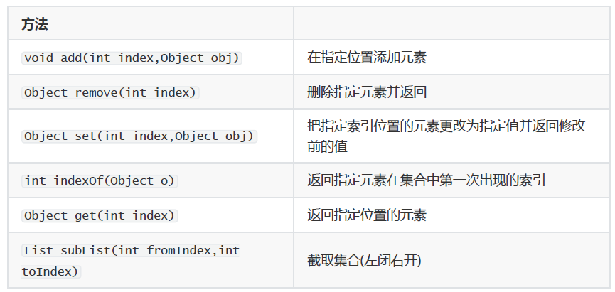

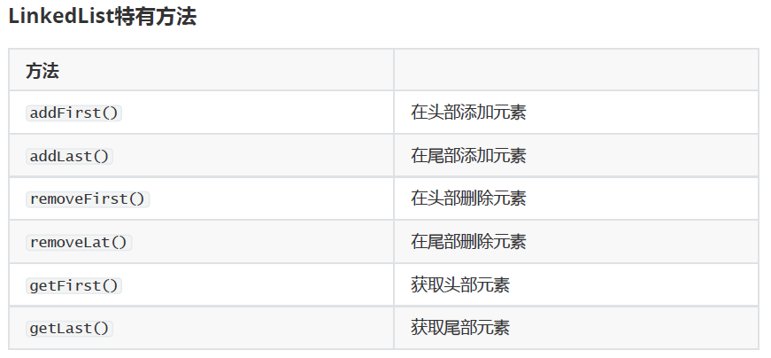

Map 常用方法


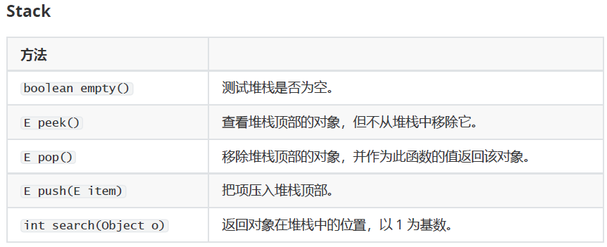

Queue 常用方法


#### Java 集合的快速失败机制和安全失败机制是什么？

- 快速失败：Java 的快速失败是 Java 集合框架中的一种错误检测机制，当多个线程同时对集合中的内容进行修改时或单线程时增强for循环一边遍历集合一边修改集合的元素时会抛出ConcurrentModificationException 异常，正确的做法是使用迭代器进行修改。

- 安全失败：java.util.concurrent 包下的容器都是安全失败的，可以在多线程下并发使用。采用安全失败的集合容器，在遍历时不是直接在集合内容上访问的，而是先复制原有集合内容，在拷贝的集合上进行遍历。缺点是迭代器无法访问遍历期间修改的值，优点是遍历过程对原集合的修改不会抛出异常。

#### 2.3 Map接口有哪些实现类？

**参考答案**

Map接口有很多实现类，其中比较常用的有HashMap、LinkedHashMap、TreeMap、ConcurrentHashMap。

**对于不需要排序的场景**：优先考虑使用HashMap，因为它是性能最好的Map实现。如果需要保证线程安全，则可以使用ConcurrentHashMap。它的性能好于Hashtable，而不是像Hashtable那样，无论是put还是get都做同步处理。

**对于需要排序的场景**：如果需要按插入顺序排序则可以使用LinkedHashMap，如果需要将key按自然顺序排列甚至是自定义顺序排列，则可以选择TreeMap。如果需要保证线程安全，则可以使用Collections工具类将上述实现类包装成线程安全的Map。

#### Array 和 ArrayList 有什么区别？

Array 是数组，可以储存基本数据类型和引用数据类型，ArrayList 只能储存引用数据类型
Array 容量确定后不可更改，ArraList 大小可变。

#### comparable 和 comparator 有什么区别？

comparable 可以使用 compareTo() 进行比较。
comparator 可以使用 compare() 进行比较，comparator 可以自定义排序，更加灵活，不需要修改源代码。

#### 2.4 描述一下Map put的过程

**参考答案**

HashMap是最经典的Map实现，下面以它的视角介绍put的过程：

1. 首次扩容：

   先判断数组是否为空，若数组为空则进行第一次扩容（resize）；

2. 计算索引：

   通过hash算法，计算键值对在数组中的索引；

3. 插入数据：

   - 如果当前位置元素为空，则直接插入数据；
   - 如果当前位置元素非空，且key已存在，则直接覆盖其value；
   - 如果当前位置元素非空，且key不存在，则将数据链到链表末端；
   - 若链表长度达到8，则将链表转换成红黑树，并将数据插入树中；

4. 再次扩容

   如果数组中元素个数（size）超过threshold，则再次进行扩容操作。

**扩展阅读**

HashMap添加数据的详细过程，如下图：

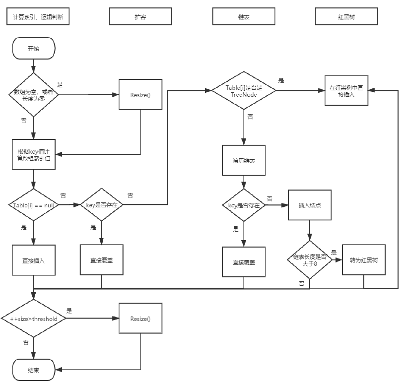

#### 2.6 HashMap有什么特点？

**参考答案**

1. HashMap是线程不安全的实现；
2. HashMap可以使用null作为key或value。

#### 2.7 JDK7和JDK8中的HashMap有什么区别？

**参考答案**

JDK7中的HashMap，是基于数组+链表来实现的，它的底层维护一个Entry数组。它会根据计算的hashCode将对应的KV键值对存储到该数组中，一旦发生hashCode冲突，那么就会将该KV键值对放到对应的已有元素的后面， 此时便形成了一个链表式的存储结构。

JDK7中HashMap的实现方案有一个明显的缺点，即当Hash冲突严重时，在桶上形成的链表会变得越来越长，这样在查询时的效率就会越来越低，其时间复杂度为O(N)。

JDK8中的HashMap，是基于数组+链表+红黑树来实现的，它的底层维护一个Node数组。当链表的存储的数据个数大于等于8的时候，不再采用链表存储，而采用了红黑树存储结构。这么做主要是在查询的时间复杂度上进行优化，链表为O(N)，而红黑树一直是O(logN)，可以大大的提高查找性能。

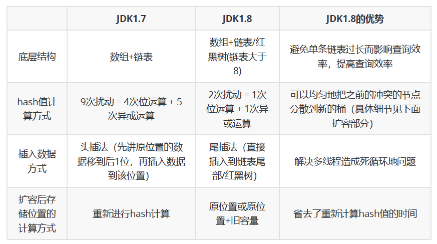

#### 2.8 介绍一下HashMap底层的实现原理

**参考答案**

它基于hash算法，通过put方法和get方法存储和获取对象。

存储对象时，我们将K/V传给put方法时，它调用K的hashCode计算hash从而得到bucket位置，进一步存储，HashMap会根据当前bucket的占用情况自动调整容量(超过Load Facotr则**resize为原来的2倍**)。获取对象时，我们将K传给get，它调用hashCode计算hash从而得到bucket位置，并进一步调用equals()方法确定键值对。

如果发生碰撞的时候，HashMap通过链表将产生碰撞冲突的元素组织起来。在Java 8中，如果一个bucket中碰撞冲突的元素超过某个限制(默认是8)，则使用红黑树来替换链表，从而提高速度。

#### 2.9 介绍一下HashMap的扩容机制

**参考答案**

1. 数组的初始容量为16，而容量是以2的次方扩充的，一是为了提高性能使用足够大的数组，二是为了能使用位运算 (length - 1) & hash代替取模运算 hash % length(据说提升了5~8倍)。
2. 数组是否需要扩充是通过负载因子判断的，如果当前元素个数为数组容量的0.75时，就会扩充数组。这个0.75就是默认的负载因子，可由构造器传入。我们也可以设置大于1的负载因子，这样数组就不会扩充，牺牲性能，节省内存。
3. 为了解决碰撞，数组中的元素是单向链表类型。当链表长度到达一个阈值时（8），会将链表转换成红黑树提高性能。而当链表长度缩小到另一个阈值时（6），又会将红黑树转换回单向链表提高性能。
4. 对于第三点补充说明，检查链表长度转换成红黑树之前，还会先检测当前数组数组是否到达一个阈值（64），如果没有到达这个容量，会放弃转换，先去扩充数组。所以上面也说了链表长度的阈值是8，因为会有一次放弃转换的操作。

**扩展阅读**


#### HashMap 的默认加载因子为什么是 0.75?

主要考虑到空间利用率和查询成本的一个折中。如果加载因子过高，空间利用率会提高，但是会使得哈希冲突的概率增加；如果加载因子过低，会频繁扩容，哈希冲突概率降低，但是空间利用率会变低。基于泊松分布和行业规定得到 0.75 的结论。

#### HashMap 是如何解决哈希冲突的？

1.8 中，从以下三个方面考虑：

- 拉链法：用单向链表保存冲突的元素
- hash 函数：key 的 HashCode 经过两次扰动，key 的 HashCode 与 key 的 HashCode 的值右移 16 位进行异或，然后对数组的长度取余（实际上是位运算），这样做可以让 HashCode 取出的高位也参与运算，进一步降低 hash 冲突的概率，使得数据分布更均匀。
- 红黑树：hash 冲突特别严重时，转为红黑树，O(N) -> O(logN)

#### 2.10 HashMap中的循环链表是如何产生的？

**参考答案**

在多线程的情况下，当重新调整HashMap大小的时候，就会存在条件竞争，因为如果两个线程都发现HashMap需要重新调整大小了，它们会同时试着调整大小。在调整大小的过程中，存储在链表中的元素的次序会反过来，因为移动到新的bucket位置的时候，HashMap并不会将元素放在链表的尾部，而是放在头部，这是为了避免尾部遍历。如果条件竞争发生了，那么就会产生死循环了。

#### 能否使用任何类作为 Map 的 key？

可以，但是要注意以下两点：

- 如果类重写了 equals() 方法，也应该重写 hashcode 方法
- 定义为 key 的类最好是不可变的，这样 key 对应的 hashcode 可以被缓存起来，String 就是很好的 key

#### 为什么 String, Integer 等包装类适合作为 key?

- 这些类都是 final 修饰的，不可变，可以缓存不可变的 hashcode
- 内部已经重写过 hashcode 和 equals 方法

#### 2.11 HashMap为什么用红黑树而不用B树？

**参考答案**

B/B+树多用于外存上时，B/B+也被成为一个磁盘友好的数据结构。

HashMap本来是数组+链表的形式，链表由于其查找慢的特点，所以需要被查找效率更高的树结构来替换。如果用B/B+树的话，在数据量不是很多的情况下，数据都会“挤在”一个结点里面，这个时候遍历效率就退化成了链表。

#### 2.13 HashMap如何实现线程安全？

**参考答案**

1. 直接使用Hashtable类；
2. 直接使用ConcurrentHashMap；
3. 使用Collections将HashMap包装成线程安全的Map。

#### 2.16 HashMap、ConcurrentHashMap 和 Hashtable有什么区别？

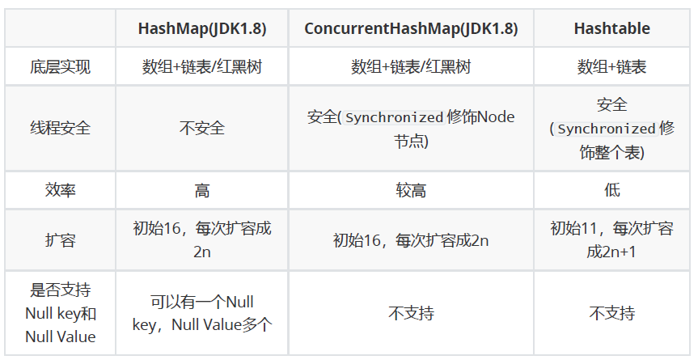

#### 2.17 介绍一下ConcurrentHashMap是怎么实现的？

**参考答案**

JDK 1.7中的实现：

在 jdk 1.7 中，ConcurrentHashMap 是由 Segment 数据结构和 HashEntry 数组结构构成，采取分段锁来保证安全性。Segment 是 ReentrantLock 重入锁，在 ConcurrentHashMap 中扮演锁的角色，HashEntry 则用于存储键值对数据。一个 ConcurrentHashMap 里包含一个 Segment 数组，一个 Segment 里包含一个 HashEntry 数组，Segment 的结构和 HashMap 类似，是一个数组和链表结构。


JDK 1.8中的实现：

JDK1.8 的实现已经摒弃了 Segment 的概念，而是直接用 Node 数组+链表+红黑树的数据结构来实现，并发控制使用 Synchronized 和 CAS 来操作，整个看起来就像是优化过且线程安全的 HashMap，虽然在 JDK1.8 中还能看到 Segment 的数据结构，但是已经简化了属性，只是为了兼容旧版本。


#### 2.19 说一说你对LinkedHashMap的理解

**参考答案**

LinkedHashMap使用双向链表来维护key-value对的顺序（其实只需要考虑key的顺序），该链表负责维护Map的迭代顺序，迭代顺序与key-value对的插入顺序保持一致。

LinkedHashMap可以避免对HashMap、Hashtable里的key-value对进行排序（只要插入key-value对时保持顺序即可），同时又可避免使用TreeMap所增加的成本。

LinkedHashMap需要维护元素的插入顺序，因此性能略低于HashMap的性能。但因为它以链表来维护内部顺序，所以在迭代访问Map里的全部元素时将有较好的性能。

#### 2.20 请介绍LinkedHashMap的底层原理

**参考答案**

LinkedHashMap继承于HashMap，它在HashMap的基础上，通过维护一条双向链表，解决了HashMap不能随时保持遍历顺序和插入顺序一致的问题。在实现上，LinkedHashMap很多方法直接继承自HashMap，仅为维护双向链表重写了部分方法。

#### 2.21 请介绍TreeMap的底层原理

**参考答案**

TreeMap基于红黑树（Red-Black tree）实现。映射根据其键的自然顺序进行排序，或者根据创建映射时提供的 Comparator 进行排序，具体取决于使用的构造方法。TreeMap的基本操作containsKey、get、put、remove方法，它的时间复杂度是log(N)。

TreeMap包含几个重要的成员变量：root、size、comparator。其中root是红黑树的根节点。它是Entry类型，Entry是红黑树的节点，它包含了红黑树的6个基本组成：key、value、left、right、parent和color。Entry节点根据根据Key排序，包含的内容是value。Entry中key比较大小是根据比较器comparator来进行判断的。size是红黑树的节点个数。

#### 2.22 Map和Set有什么区别？

**参考答案**

Set代表无序的，元素不可重复的集合；

Map代表具有映射关系（key-value）的集合，其所有的key是一个Set集合，即key无序且不能重复。

#### 2.23 List和Set有什么区别？

**参考答案**

Set代表无序的，元素不可重复的集合；
List代表有序的，元素可以重复的集合。

#### 如何遍历 List

- 使用 for 循环，0 ~ list.size()
- Iterator 遍历
```java
while (iterator.hasNext()){
    System.out.println(iterator.next());
}
```
- foreach 循环
```java
for(Integer num : list){
    System.out.println(list);
}
```

#### 2.24 ArrayList和LinkedList有什么区别？

**参考答案**

1. ArrayList的实现是基于数组，LinkedList的实现是基于双向链表；
2. 对于随机访问ArrayList要优于LinkedList，ArrayList可以根据下标以O(1)时间复杂度对元素进行随机访问，而LinkedList的每一个元素都依靠地址指针和它后一个元素连接在一起，查找某个元素的时间复杂度是O(N)；
3. 对于插入和删除操作，LinkedList要优于ArrayList，因为当元素被添加到LinkedList任意位置的时候，不需要像ArrayList那样重新计算大小或者是更新索引；
4. LinkedList比ArrayList更占内存，因为LinkedList的节点除了存储数据，还存储了两个引用，一个指向前一个元素，一个指向后一个元素。

#### 2.25 有哪些线程安全的List？

**参考答案**

1. Vector

   Vector是比较古老的API，虽然保证了线程安全，但是由于效率低一般不建议使用。

2. Collections.SynchronizedList

   SynchronizedList是Collections的内部类，Collections提供了synchronizedList方法，可以将一个线程不安全的List包装成线程安全的List，即SynchronizedList。它比Vector有更好的扩展性和兼容性，但是它所有的方法都带有同步锁，也不是性能最优的List。

3. CopyOnWriteArrayList

   CopyOnWriteArrayList是Java 1.5在java.util.concurrent包下增加的类，它采用复制底层数组的方式来实现写操作。当线程对此类集合执行读取操作时，线程将会直接读取集合本身，无须加锁与阻塞。当线程对此类集合执行写入操作时，集合会在底层复制一份新的数组，接下来对新的数组执行写入操作。由于对集合的写入操作都是对数组的副本执行操作，因此它是线程安全的。在所有线程安全的List中，它是性能最优的方案。
   
   Collections

#### 2.26 介绍一下ArrayList的数据结构？

**参考答案**

ArrayList的底层是用数组来实现的，**默认第一次插入元素时创建大小为10的数组，超出限制时会增加50%的容量**，并且数据以 System.arraycopy() 复制到新的数组，因此最好能给出数组大小的预估值。

按数组下标访问元素的性能很高，这是数组的基本优势。直接在数组末尾加入元素的性能也高，但如果按下标插入、删除元素，则要用 System.arraycopy() 来移动部分受影响的元素，性能就变差了，这是基本劣势。

#### 2.27 谈谈CopyOnWriteArrayList的原理

**参考答案**

CopyOnWriteArrayList是Java并发包里提供的并发类，简单来说它就是一个线程安全且读操作无锁的ArrayList。正如其名字一样，在写操作时会复制一份新的List，在新的List上完成写操作，然后再将原引用指向新的List。这样就保证了写操作的线程安全。

CopyOnWriteArrayList允许线程并发访问读操作，这个时候是没有加锁限制的，性能较高。而写操作的时候，则首先将容器复制一份，然后在新的副本上执行写操作，这个时候写操作是上锁的。结束之后再将原容器的引用指向新容器。注意，在上锁执行写操作的过程中，如果有需要读操作，会作用在原容器上。因此上锁的写操作不会影响到并发访问的读操作。

- 优点：读操作性能很高，因为无需任何同步措施，比较适用于读多写少的并发场景。在遍历传统的List时，若中途有别的线程对其进行修改，则会抛出ConcurrentModificationException异常。而CopyOnWriteArrayList由于其"读写分离"的思想，遍历和修改操作分别作用在不同的List容器，所以在使用迭代器进行遍历时候，也就不会抛出ConcurrentModificationException异常了。
- 缺点：一是内存占用问题，毕竟每次执行写操作都要将原容器拷贝一份，数据量大时，对内存压力较大，可能会引起频繁GC。二是无法保证实时性，Vector对于读写操作均加锁同步，可以保证读和写的强一致性。而CopyOnWriteArrayList由于其实现策略的原因，写和读分别作用在新老不同容器上，在写操作执行过程中，读不会阻塞但读取到的却是老容器的数据。

#### 2.28 说一说TreeSet和HashSet的区别

**参考答案**

HashSet、TreeSet中的元素都是不能重复的，并且它们都是线程不安全的，二者的区别是：

1. HashSet中的元素可以是null，但TreeSet中的元素不能是null；
2. HashSet不能保证元素的排列顺序，而TreeSet支持自然排序、定制排序两种排序的方式；
3. HashSet底层是采用哈希表实现的，而TreeSet底层是采用红黑树实现的。

#### 2.29 说一说HashSet的底层结构

**参考答案**

HashSet是基于HashMap实现的，默认构造函数是构建一个初始容量为16，负载因子为0.75 的HashMap。它封装了一个 HashMap 对象来存储所有的集合元素，所有放入 HashSet 中的集合元素实际上由 HashMap 的 key 来保存，而 HashMap 的 value 则存储了一个 PRESENT，它是一个静态的 Object 对象。

#### HaseSet 如何检查重复？

HashSet 先计算对象的 HashCode 值来确定对象的存储位置，如果该位置没有其他对象，直接将该对象添加到该位置；如果该存储位置有其他对象，调用 equals() 来判断两个对象是否相等。如果相同，添加对象失败；如果不相同，将对象重新散列到其他位置。

#### 2.30 BlockingQueue中有哪些方法，为什么这样设计？

**参考答案**

为了应对不同的业务场景，BlockingQueue 提供了4 组不同的方法用于插入、移除以及对队列中的元素进行检查。如果请求的操作不能得到立即执行的话，每组方法的表现是不同的。这些方法如下：

|      | 抛异常    | 特定值   | 阻塞   | 超时                 |
| ---- | --------- | -------- | ------ | -------------------- |
| 插入 | add(e)    | offer(e) | put(e) | offer(e, time, unit) |
| 移除 | remove()  | poll()   | take() | poll(time, unit)     |
| 检查 | element() | peek()   |        |                      |

四组不同的行为方式含义如下：

- 抛异常：如果操作无法立即执行，则抛一个异常；
- 特定值：如果操作无法立即执行，则返回一个特定的值(一般是 true / false)。
- 阻塞：如果操作无法立即执行，则该方法调用将会发生阻塞，直到能够执行；
- 超时：如果操作无法立即执行，则该方法调用将会发生阻塞，直到能够执行。但等待时间不会超过给定值，并返回一个特定值以告知该操作是否成功(典型的是true / false)。

#### 2.31 BlockingQueue是怎么实现的？

**参考答案**

BlockingQueue是一个接口，它的实现类有ArrayBlockingQueue、DelayQueue、 LinkedBlockingQueue、PriorityBlockingQueue、SynchronousQueue等。它们的区别主要体现在存储结构上或对元素操作上的不同，但是对于put与take操作的原理是类似的。下面以ArrayBlockingQueue为例，来说明BlockingQueue的实现原理。

·ArrayBlockingQueue：一个由数组结构组成的**有界**阻塞队列。
·LinkedBlockingQueue：一个由链表结构组成的**有界**阻塞队列。
·PriorityBlockingQueue：一个支持优先级排序的无界阻塞队列。
·DelayQueue：一个使用优先级队列实现的无界阻塞队列。
·SynchronousQueue：一个不存储元素的阻塞队列。
·LinkedTransferQueue：一个由链表结构组成的无界阻塞队列。
·LinkedBlockingDeque：一个由链表结构组成的双向阻塞队列

## 3. IO

#### 3.1 介绍一下Java中的IO流

**参考答案**

IO（Input Output）用于实现对数据的输入与输出操作，Java把不同的输入/输出源（键盘、文件、网络等）抽象表述为流（Stream）。流是从起源到接收的有序数据，有了它程序就可以采用同一方式访问不同的输入/输出源。

- 按照数据流向，可以将流分为输入流和输出流，其中输入流只能读取数据、不能写入数据，而输出流只能写入数据、不能读取数据。
- 按照数据类型，可以将流分为字节流和字符流，其中字节流操作的数据单元是8位的字节，而字符流操作的数据单元是16位的字符。
- 按照处理功能，可以将流分为节点流和处理流，其中节点流可以直接从/向一个特定的IO设备（磁盘、网络等）读/写数据，也称为低级流，而处理流是对节点流的连接或封装，用于简化数据读/写功能或提高效率，也称为高级流。

Java提供了大量的类来支持IO操作，下表给大家整理了其中比较常用的一些类。其中，黑色字体的是抽象基类，其他所有的类都继承自它们。红色字体的是节点流，蓝色字体的是处理流。


根据命名很容易理解各个流的作用：

- 以File开头的文件流用于访问文件；
- 以ByteArray/CharArray开头的流用于访问内存中的数组；
- 以Piped开头的管道流用于访问管道，实现进程之间的通信；
- 以String开头的流用于访问内存中的字符串；
- 以Buffered开头的缓冲流，用于在读写数据时对数据进行缓存，以减少IO次数；
- InputStreamReader、InputStreamWriter是转换流，用于将字节流转换为字符流；
- 以Object开头的流是对象流，用于实现对象的序列化；
- 以Print开头的流是打印流，用于简化打印操作；
- 以Pushback开头的流是推回输入流，用于将已读入的数据推回到缓冲区，从而实现再次读取；
- 以Data开头的流是特殊流，用于读写Java基本类型的数据。

#### 3.2 怎么用流打开一个大文件？

**参考答案**

打开大文件，应避免直接将文件中的数据全部读取到内存中，可以采用分次读取的方式。

1. 使用缓冲流。缓冲流内部维护了一个缓冲区，通过与缓冲区的交互，减少与设备的交互次数。使用缓冲输入流时，它每次会读取一批数据将缓冲区填满，每次调用读取方法并不是直接从设备取值，而是从缓冲区取值，当缓冲区为空时，它会再一次读取数据，将缓冲区填满。使用缓冲输出流时，每次调用写入方法并不是直接写入到设备，而是写入缓冲区，当缓冲区填满时它会自动刷入设备。
2. 使用NIO。NIO采用内存映射文件的方式来处理输入/输出，NIO将文件或文件的一段区域映射到内存中，这样就可以像访问内存一样来访问文件了（这种方式模拟了操作系统上的虚拟内存的概念），通过这种方式来进行输入/输出比传统的输入/输出要快得多。

#### BIO, NIO, AIO 有什么区别？

BIO：同步阻塞，JDK 1.4 之前唯一的 IO，面向流
NIO：异步阻塞，面向缓冲区
AIO：异步非阻塞

**阻塞 IO** 是指用户程序在发起 IO 请求后的状态为阻塞状态。
**非阻塞 IO** 是指用户程序在发起 IO 请求后的状态为非阻塞状态。
**同步 IO** 是指用户空间（进程或线程）是主动发起 IO 请求的一方，系统内核是被动接收方。
**异步 IO** 是指系统内核是主动发起 IO 请求的一方，用户空间是被动接收方。

#### 3.3 说说NIO的实现原理

**参考答案**

Java的NIO主要由三个核心部分组成：Channel、Buffer、Selector。

基本上，所有的IO在NIO中都从一个Channel开始，数据可以从Channel读到Buffer中，也可以从Buffer写到Channel中。Channel有好几种类型，其中比较常用的有FileChannel、DatagramChannel、SocketChannel、ServerSocketChannel等，这些通道涵盖了UDP和TCP网络IO以及文件IO。

Buffer本质上是一块可以写入数据，然后可以从中读取数据的内存。这块内存被包装成NIO Buffer对象，并提供了一组方法，用来方便的访问该块内存。Java NIO里关键的Buffer实现有CharBuffer、ByteBuffer、ShortBuffer、IntBuffer、LongBuffer、FloatBuffer、DoubleBuffer。这些Buffer覆盖了你能通过IO发送的基本数据类型，即byte、short、int、long、float、double、char。

Buffer对象包含三个重要的属性，分别是capacity、position、limit，其中position和limit的含义取决于Buffer处在读模式还是写模式。但不管Buffer处在什么模式，capacity的含义总是一样的。

- capacity：作为一个内存块，Buffer有个固定的最大值，就是capacity。Buffer只能写capacity个数据，一旦Buffer满了，需要将其清空才能继续写数据往里写数据。
- position：当写数据到Buffer中时，position表示当前的位置。初始的position值为0。当一个数据写到Buffer后， position会向前移动到下一个可插入数据的Buffer单元。position最大可为capacity–1。当读取数据时，也是从某个特定位置读。当将Buffer从写模式切换到读模式，position会被重置为0。当从Buffer的position处读取数据时，position向前移动到下一个可读的位置。
- limit：在写模式下，Buffer的limit表示最多能往Buffer里写多少数据，此时limit等于capacity。当切换Buffer到读模式时， limit表示你最多能读到多少数据，此时limit会被设置成写模式下的position值。

三个属性之间的关系，如下图所示：

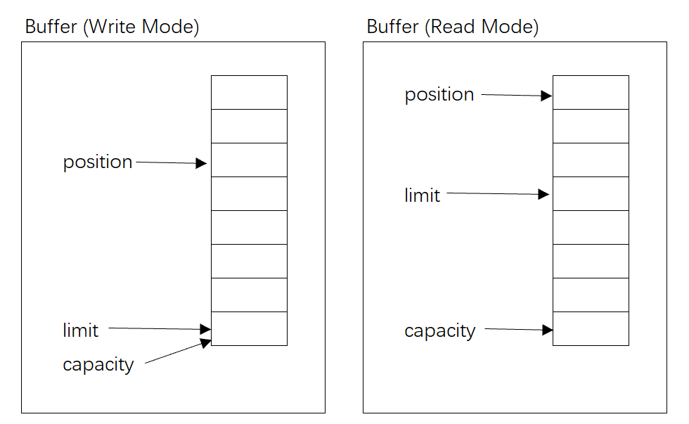

Selector允许单线程处理多个 Channel，如果你的应用打开了多个连接（通道），但每个连接的流量都很低，使用Selector就会很方便。要使用Selector，得向Selector注册Channel，然后调用它的select()方法。这个方法会一直阻塞到某个注册的通道有事件就绪。一旦这个方法返回，线程就可以处理这些事件，事件例如有新连接进来，数据接收等。

这是在一个单线程中使用一个Selector处理3个Channel的图示：

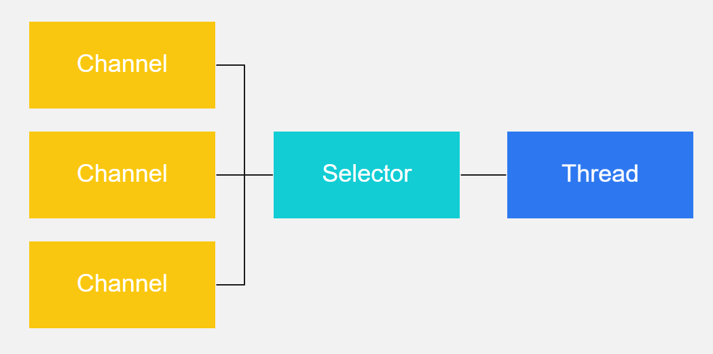

#### 3.4 介绍一下Java的序列化与反序列化

**参考答案**

序列化机制可以将对象转换成字节序列，这些字节序列可以保存在磁盘上，也可以在网络中传输，并允许程序将这些字节序列再次恢复成原来的对象。其中，对象的序列化（Serialize），是指将一个Java对象写入IO流中，对象的反序列化（Deserialize），则是指从IO流中恢复该Java对象。

若对象要支持序列化机制，则它的类需要实现Serializable接口，该接口是一个标记接口，它没有提供任何方法，只是标明该类是可以序列化的，Java的很多类已经实现了Serializable接口，如包装类、String、Date等。

若要实现序列化，则需要使用对象流ObjectInputStream和ObjectOutputStream。其中，在序列化时需要调用ObjectOutputStream对象的writeObject()方法，以输出对象序列。在反序列化时需要调用ObjectInputStream对象的readObject()方法，将对象序列恢复为对象。

#### 3.5 Serializable接口为什么需要定义serialVersionUID变量？

**参考答案**

serialVersionUID代表序列化的版本，通过定义类的序列化版本，在反序列化时，只要对象中所存的版本和当前类的版本一致，就允许做恢复数据的操作，否则将会抛出序列化版本不一致的错误。

如果不定义序列化版本，在反序列化时可能出现冲突的情况，在反系列化恢复数据的时候，当前的类已经和序列化的数据的格式产生了冲突，可能会发生各种意想不到的问题。增加了序列化版本之后，在这种情况下则可以抛出异常，以提示这种矛盾的存在，提高数据的安全性。

#### 3.6 除了Java自带的序列化之外，你还了解哪些序列化工具？

**参考答案**

- JSON：目前使用比较频繁的格式化数据工具，简单直观，可读性好，有jackson，gson，fastjson等等，比较优秀的JSON解析工具的表现还是比较好的，有些json解析工具甚至速度超过了一些二进制的序列化方式。
- Protobuf：一个用来序列化结构化数据的技术，支持多种语言诸如C++、Java以及Python语言，可以使用该技术来持久化数据或者序列化成网络传输的数据。相比较一些其他的XML技术而言，该技术的一个明显特点就是更加节省空间（以二进制流存储）、速度更快以及更加灵活。另外Protobuf支持的数据类型相对较少，不支持常量类型。
- Thrift：是Facebook开源提供的一个高性能，轻量级RPC服务框架，其产生正是为了满足当前大数据量、分布式、跨语言、跨平台数据通讯的需求。
- Avro：提供两种序列化格式，即JSON格式或者Binary格式。

#### 3.7 如果不用JSON工具，该如何实现对实体类的序列化？

**参考答案**

可以使用Java原生的序列化机制，但是效率比较低一些，适合小项目；

可以使用其他的一些第三方类库，比如Protobuf、Thrift、Avro等。

## 4. 多线程

#### 4.1 创建线程有哪几种方式？

**参考答案**

创建线程有三种方式，分别是继承Thread类、实现Runnable接口、实现Callable接口。

通过继承Thread类来创建并启动线程的步骤如下：

1. 定义Thread类的子类，并重写该类的run()方法，该run()方法将作为线程执行体。
2. 创建Thread子类的实例，即创建了线程对象。
3. 调用线程对象的start()方法来启动该线程。

通过实现Runnable接口来创建并启动线程的步骤如下：

1. 定义Runnable接口的实现类，并实现该接口的run()方法，该run()方法将作为线程执行体。
2. 创建Runnable实现类的实例，并将其作为Thread的target来创建Thread对象，Thread对象为线程对象。
3. 调用线程对象的start()方法来启动该线程。

通过实现Callable接口来创建并启动线程的步骤如下：

1. 创建Callable接口的实现类，并实现call()方法，该call()方法将作为线程执行体，且该call()方法有返回值。然后再创建Callable实现类的实例。
2. 使用FutureTask类来包装Callable对象，该FutureTask对象封装了该Callable对象的call()方法的返回值。
3. 使用FutureTask对象作为Thread对象的target创建并启动新线程。
4. 调用FutureTask对象的get()方法来获得子线程执行结束后的返回值。

**扩展阅读**

通过继承Thread类、实现Runnable接口、实现Callable接口都可以实现多线程，不过实现Runnable接口与实现Callable接口的方式基本相同，只是Callable接口里定义的方法有返回值，可以声明抛出异常而已。因此可以将实现Runnable接口和实现Callable接口归为一种方式。

采用实现Runnable、Callable接口的方式创建多线程的优缺点：

- 线程类只是实现了Runnable接口或Callable接口，还可以继承其他类。
- 在这种方式下，多个线程可以共享同一个target对象，所以非常适合多个相同线程来处理同一份资源的情况，从而可以将CPU、代码和数据分开，形成清晰的模型，较好地体现了面向对象的思想。
- 劣势是，编程稍稍复杂，如果需要访问当前线程，则必须使用Thread.currentThread()方法。

采用继承Thread类的方式创建多线程的优缺点：

- 劣势是，因为线程类已经继承了Thread类，所以不能再继承其他父类。
- 优势是，编写简单，如果需要访问当前线程，则无须使用Thread.currentThread()方法，直接使用this即可获得当前线程。

鉴于上面分析，因此一般推荐采用实现Runnable接口、Callable接口的方式来创建多线程。

#### 4.2 说说Thread类的常用方法

**参考答案**

Thread类常用构造方法：

- Thread()
- Thread(String name)
- Thread(Runnable target)
- Thread(Runnable target, String name)

*其中，参数 name为线程名，参数 target为包含线程体的目标对象。*

Thread类常用静态方法：

- currentThread()：返回当前正在执行的线程；
- interrupted()：返回当前执行的线程是否已经被中断；
- sleep(long millis)：使当前执行的线程睡眠多少毫秒数；
- yield()：使当前执行的线程自愿暂时放弃对处理器的使用权并允许其他线程执行；

Thread类常用实例方法：

- getId()：返回该线程的id；
- getName()：返回该线程的名字；
- getPriority()：返回该线程的优先级；
- interrupt()：使该线程中断；
- isInterrupted()：返回该线程是否被中断；
- isAlive()：返回该线程是否处于活动状态；
- isDaemon()：返回该线程是否是守护线程；
- setDaemon(boolean on)：将该线程标记为守护线程或用户线程，如果不标记默认是非守护线程；
- setName(String name)：设置该线程的名字；
- setPriority(int newPriority)：改变该线程的优先级；
- join()：等待该线程终止；
- join(long millis)：等待该线程终止,至多等待多少毫秒数。

#### 4.3 run()和start()有什么区别？

**参考答案**

run()方法被称为线程执行体，它的方法体代表了线程需要完成的任务，而start()方法用来启动线程，含义是当前线程（即parent线程）同步告知Java虚拟机，只要线程规划器空闲，应立即启动调用start()方法的线程。

调用start()方法启动线程时，系统会把该run()方法当成线程执行体来处理。但如果直接调用线程对象的run()方法，则run()方法立即就会被执行，而且在run()方法返回之前其他线程无法并发执行。也就是说，如果直接调用线程对象的run()方法，系统把线程对象当成一个普通对象，而run()方法也是一个普通方法，而不是线程执行体。

#### 4.4 线程是否可以重复启动，会有什么后果？

**参考答案**

只能对处于新建状态的线程调用start()方法，否则将引发IllegalThreadStateException异常。

**扩展阅读**

当程序使用new关键字创建了一个线程之后，该线程就处于新建状态，此时它和其他的Java对象一样，仅仅由JVM为其分配内存，并初始化其成员变量的值。此时的线程对象没有表现出任何线程的动态特征，程序也不会执行线程的线程执行体。

当线程对象调用了start()方法之后，该线程处于就绪状态，JVM会为其创建方法调用栈和程序计数器，处于这个状态中的线程并没有开始运行，只是表示该线程可以运行了。至于该线程何时开始运行，取决于JVM里线程调度器的调度。

#### 4.5 介绍一下线程的生命周期

**参考答案**

**通用的线程声明周期**

在线程的生命周期中，它要经过新建（New）、就绪（Runnable）、运行（Running）、阻塞（Blocked）和死亡（Dead）5种状态。尤其是当线程启动以后，它不可能一直“霸占”着CPU独自运行，所以CPU需要在多条线程之间切换，于是线程状态也会多次在运行、就绪之间切换。

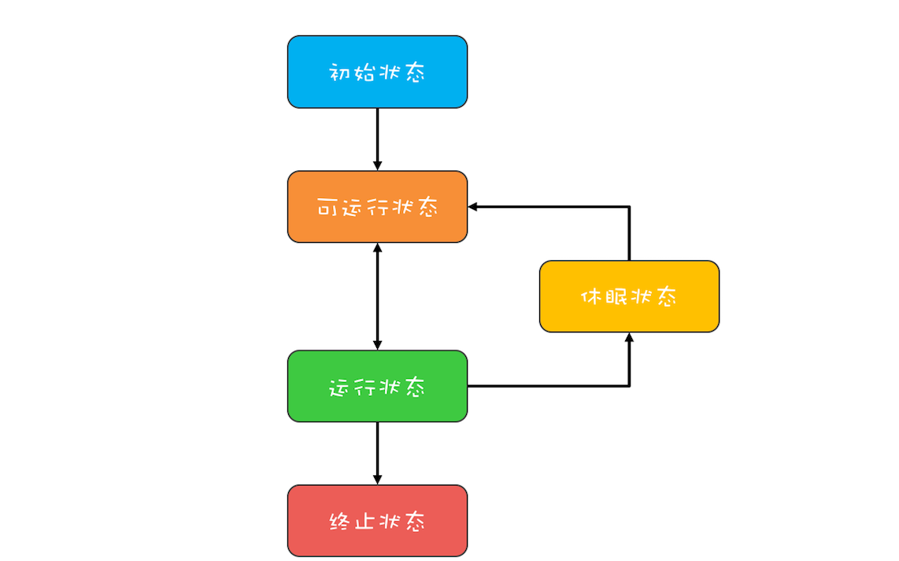

- 初始状态，指的是线程已经被创建，但是还不允许分配 CPU 执行。这个状态属于编程语言特有的，不过这里所谓的被创建，仅仅是在编程语言层面被创建，而在操作系统层面，真正的线程还没有创建。

- 可运行状态，指的是线程可以分配 CPU 执行。在这种状态下，真正的操作系统线程已经被成功创建了，所以可以分配 CPU 执行。
- 当有空闲的 CPU 时，操作系统会将其分配给一个处于可运行状态的线程，被分配到 CPU 的线程的状态就转换成了运行状态。

- 运行状态的线程如果调用一个阻塞的 API（例如以阻塞方式读文件）或者等待某个事件（例如条件变量），那么线程的状态就会转换到休眠状态，同时释放 CPU 使用权，休眠状态的线程永远没有机会获得 CPU 使用权。当等待的事件出现了，线程就会从休眠状态转换到可运行状态。

- 线程执行完或者出现异常就会进入终止状态，终止状态的线程不会切换到其他任何状态，进入终止状态也就意味着线程的生命周期结束了。

**Java 语言中线程共有六种状态**


1. NEW（初始化状态）

2. RUNNABLE（可运行 / 运行状态）

3. BLOCKED（阻塞状态）

4. WAITING（无时限等待）

5. TIMED_WAITING（有时限等待）

6. TERMINATED（终止状态）

1. **RUNNABLE 与 BLOCKED 的状态转换**
   - 只有一种场景会触发这种转换，就是线程等待 synchronized 的隐式锁。

2. **RUNNABLE 与 WAITING 的状态转换**

   - 第一种场景，获得 synchronized 隐式锁的线程，调用无参数的 Object.wait() 方法。其中，wait() 方法我们在上一篇讲解管程的时候已经深入介绍过了，这里就不再赘述。

   - 第二种场景，调用无参数的 Thread.join() 方法。其中的 join() 是一种线程同步方法，例如有一个线程对象 thread A，当调用 A.join() 的时候，执行这条语句的线程会等待 thread A 执行完，而等待中的这个线程，其状态会从 RUNNABLE 转换到 WAITING。当线程 thread A 执行完，原来等待它的线程又会从 WAITING 状态转换到 RUNNABLE。

   - 第三种场景，调用 LockSupport.park() 方法。其中的 LockSupport 对象，也许你有点陌生，其实 Java 并发包中的锁，都是基于它实现的。调用 LockSupport.park() 方法，当前线程会阻塞，线程的状态会从 RUNNABLE 转换到 WAITING。调用 LockSupport.unpark(Thread thread) 可唤醒目标线程，目标线程的状态又会从 WAITING 状态转换到 RUNNABLE。

3. **RUNNABLE 与 TIMED_WAITING 的状态转换**

   - 调用带超时参数的 Thread.sleep(long millis) 方法；

   - 获得 synchronized 隐式锁的线程，调用带超时参数的 Object.wait(long timeout) 方法；

   - 调用带超时参数的 Thread.join(long millis) 方法；

   - 调用带超时参数的 LockSupport.parkNanos(Object blocker, long deadline) 方法；

   - 调用带超时参数的 LockSupport.parkUntil(long deadline) 方法。

线程会以如下三种方式结束，结束后就处于死亡状态：

- run()或call()方法执行完成，线程正常结束。
- 线程抛出一个未捕获的Exception或Error。
- 一个运行中的线程是否被其他线程进行了中断操作。其他线程通过调用该线程的interrupt()方法对其进行中断操作。线程通过检查自身是否被中断来进行响应，线程通过方法isInterrupted()来进行判断是否被中断，也可以调用静态方法Thread.interrupted()对当前线程的中断标识位进行复位。许多声明抛InterruptedException的方法（例如Thread.sleep(longmillis)方法）这些方法在抛出InterruptedException之前，Java虚拟机会先将该线程的中断标识位清除，然后抛出InterruptedException，此时调用isInterrupted()方法将会返回false。


#### 4.6 如何实现线程同步？

**参考答案**

1. 同步方法

   即有synchronized关键字修饰的方法，由于java的每个对象都有一个内置锁，当用此关键字修饰方法时， 内置锁会保护整个方法。在调用该方法前，需要获得内置锁，否则就处于阻塞状态。需要注意， synchronized关键字也可以修饰静态方法，此时如果调用该静态方法，将会锁住整个类。

2. 同步代码块

   即有synchronized关键字修饰的语句块，被该关键字修饰的语句块会自动被加上内置锁，从而实现同步。需值得注意的是，同步是一种高开销的操作，因此应该尽量减少同步的内容。通常没有必要同步整个方法，使用synchronized代码块同步关键代码即可。

3. ReentrantLock

   Java 5新增了一个java.util.concurrent包来支持同步，其中ReentrantLock类是可重入、互斥、实现了Lock接口的锁，它与使用synchronized方法和快具有相同的基本行为和语义，并且扩展了其能力。需要注意的是，ReentrantLock还有一个可以创建公平锁的构造方法，但由于能大幅度降低程序运行效率，因此不推荐使用。

4. volatile

   volatile关键字为域变量的访问提供了一种免锁机制，使用volatile修饰域相当于告诉虚拟机该域可能会被其他线程更新，因此每次使用该域就要重新计算，而不是使用寄存器中的值。需要注意的是，volatile不会提供任何原子操作，它也不能用来修饰final类型的变量。

5. 原子变量

   在java的util.concurrent.atomic包中提供了创建了原子类型变量的工具类，使用该类可以简化线程同步。例如AtomicInteger 表可以用原子方式更新int的值，可用在应用程序中（如以原子方式增加的计数器），但不能用于替换Integer。可扩展Number，允许那些处理机遇数字类的工具和实用工具进行统一访问。

#### 4.7 说一说Java多线程之间的通信方式

**参考答案**

在Java中线程通信主要有以下三种方式：

1. wait()、notify()、notifyAll()

   如果线程之间采用synchronized来保证线程安全，则可以利用wait()、notify()、notifyAll()来实现线程通信。这三个方法都不是Thread类中所声明的方法，而是Object类中声明的方法。原因是每个对象都拥有锁，所以让当前线程等待某个对象的锁，当然应该通过这个对象来操作。并且因为当前线程可能会等待多个线程的锁，如果通过线程来操作，就非常复杂了。另外，这三个方法都是本地方法，并且被final修饰，无法被重写。

   wait()方法可以让当前线程释放对象锁并进入阻塞状态。notify()方法用于唤醒一个正在等待相应对象锁的线程，使其进入就绪队列，以便在当前线程释放锁后竞争锁，进而得到CPU的执行。notifyAll()用于唤醒所有正在等待相应对象锁的线程，使它们进入就绪队列，以便在当前线程释放锁后竞争锁，进而得到CPU的执行。

   每个锁对象都有两个队列，一个是就绪队列，一个是阻塞队列。就绪队列存储了已就绪（将要竞争锁）的线程，阻塞队列存储了被阻塞的线程。当一个阻塞线程被唤醒后，才会进入就绪队列，进而等待CPU的调度。反之，当一个线程被wait后，就会进入阻塞队列，等待被唤醒。

2. await()、signal()、signalAll()

   如果线程之间采用Lock来保证线程安全，则可以利用await()、signal()、signalAll()来实现线程通信。这三个方法都是Condition接口中的方法，该接口是在Java 1.5中出现的，它用来替代传统的wait+notify实现线程间的协作，它的使用依赖于 Lock。相比使用wait+notify，使用Condition的await+signal这种方式能够更加安全和高效地实现线程间协作。

   Condition依赖于Lock接口，生成一个Condition的基本代码是lock.newCondition() 。 必须要注意的是，Condition 的 await()/signal()/signalAll() 使用都必须在lock保护之内，也就是说，必须在lock.lock()和lock.unlock之间才可以使用。事实上，await()/signal()/signalAll() 与 wait()/notify()/notifyAll()有着天然的对应关系。即：Conditon中的await()对应Object的wait()，Condition中的signal()对应Object的notify()，Condition中的signalAll()对应Object的notifyAll()。

3. BlockingQueue

   Java 5提供了一个BlockingQueue接口，虽然BlockingQueue也是Queue的子接口，但它的主要用途并不是作为容器，而是作为线程通信的工具。BlockingQueue具有一个特征：当生产者线程试图向BlockingQueue中放入元素时，如果该队列已满，则该线程被阻塞；当消费者线程试图从BlockingQueue中取出元素时，如果该队列已空，则该线程被阻塞。

   程序的两个线程通过交替向BlockingQueue中放入元素、取出元素，即可很好地控制线程的通信。线程之间需要通信，最经典的场景就是生产者与消费者模型，而BlockingQueue就是针对该模型提供的解决方案。

#### 4.9 说一说sleep()和wait()的区别

**参考答案**

1. sleep()是Thread类中的静态方法，而wait()是Object类中的成员方法；
2. sleep()可以在任何地方使用，而wait()只能在同步方法或同步代码块中使用；
3. sleep()不会释放锁，而wait()会释放锁，并需要通过notify()/notifyAll()重新获取锁。

#### 4.10 说一说notify()、notifyAll()的区别

**参考答案**

- notify()

  用于随机唤醒一个正在等待相应对象锁的线程，使其进入就绪队列，以便在当前线程释放锁后竞争锁，进而得到CPU的执行。

- notifyAll()

  用于唤醒所有正在等待相应对象锁的线程，使它们进入就绪队列，以便在当前线程释放锁后竞争锁，进而得到CPU的执行。

扩展阅读：

- Hasen 模型里面，要求 notify() 放在代码的最后，这样 T2 通知完 T1 后，T2 就结束了，然后 T1 再执行，这样就能保证同一时刻只有一个线程执行。
- Hoare 模型里面，T2 通知完 T1 后，T2 阻塞，T1 马上执行；等 T1 执行完，再唤醒 T2，也能保证同一时刻只有一个线程执行。但是相比 Hasen 模型，T2 多了一次阻塞唤醒操作。
- MESA 管程里面，T2 通知完 T1 后，T2 还是会接着执行，T1 并不立即执行，仅仅是从条件变量的等待队列进到入口等待队列里面。这样做的好处是 notify() 不用放到代码的最后，T2 也没有多余的阻塞唤醒操作。但是也有个副作用，就是当 T1 再次执行的时候，可能曾经满足的条件，现在已经不满足了，所以需要以循环方式检验条件变量。

#### 4.11 如何实现子线程先执行，主线程再执行？

**参考答案**

启动子线程后，立即调用该线程的join()方法，则主线程必须等待子线程执行完成后再执行。

**扩展阅读**

Thread类提供了让一个线程等待另一个线程完成的方法——join()方法。当在某个程序执行流中调用其他线程的join()方法时，调用线程将被阻塞，直到被join()方法加入的join线程执行完为止。

join()方法通常由使用线程的程序调用，以将大问题划分成许多小问题，每个小问题分配一个线程。当所有的小问题都得到处理后，再调用主线程来进一步操作。

#### 4.13 说一说synchronized与Lock的区别

**参考答案**

1. synchronized是Java关键字，在JVM层面实现加锁和解锁；Lock是一个接口，在代码层面实现加锁和解锁。
2. synchronized可以用在代码块上、方法上；Lock只能写在代码里。
3. synchronized在代码执行完或出现异常时自动释放锁；Lock不会自动释放锁，需要在finally中显示释放锁。
4. synchronized会导致线程拿不到锁一直等待；Lock可以设置获取锁失败的超时时间。
5. synchronized无法得知是否获取锁成功；Lock则可以通过tryLock得知加锁是否成功。
6. synchronized锁可重入、不可中断、非公平；Lock锁可重入、可中断、可公平/不公平，并可以细分读写锁以提高效率。

#### 4.14 说一说synchronized的底层实现原理

**参考答案**

一、synchronized作用在代码块时，它的底层是通过monitorenter、monitorexit指令来实现的。

- monitorenter：

  每个对象都是一个监视器锁（monitor），当monitor被占用时就会处于锁定状态，线程执行monitorenter指令时尝试获取monitor的所有权，过程如下：

  如果monitor的进入数为0，则该线程进入monitor，然后将进入数设置为1，该线程即为monitor的所有者。如果线程已经占有该monitor，只是重新进入，则进入monitor的进入数加1。如果其他线程已经占用了monitor，则该线程进入阻塞状态，直到monitor的进入数为0，再重新尝试获取monitor的所有权。

- monitorexit：

  执行monitorexit的线程必须是objectref所对应的monitor持有者。指令执行时，monitor的进入数减1，如果减1后进入数为0，那线程退出monitor，不再是这个monitor的所有者。其他被这个monitor阻塞的线程可以尝试去获取这个monitor的所有权。

  monitorexit指令出现了两次，第1次为同步正常退出释放锁，第2次为发生异步退出释放锁。

二、方法的同步并没有通过 monitorenter 和 monitorexit 指令来完成，不过相对于普通方法，其常量池中多了 ACC_SYNCHRONIZED 标示符。JVM就是根据该标示符来实现方法的同步的：

当方法调用时，调用指令将会检查方法的 ACC_SYNCHRONIZED 访问标志是否被设置，如果设置了，执行线程将先获取monitor，获取成功之后才能执行方法体，方法执行完后再释放monitor。在方法执行期间，其他任何线程都无法再获得同一个monitor对象。

三、总结

两种同步方式本质上没有区别，只是方法的同步是一种隐式的方式来实现，无需通过字节码来完成。两个指令的执行是JVM通过调用操作系统的互斥原语mutex来实现，被阻塞的线程会被挂起、等待重新调度，会导致“用户态和内核态”两个态之间来回切换，对性能有较大影响。

java 内置的管程为 synchronized，使用 MESA 模型。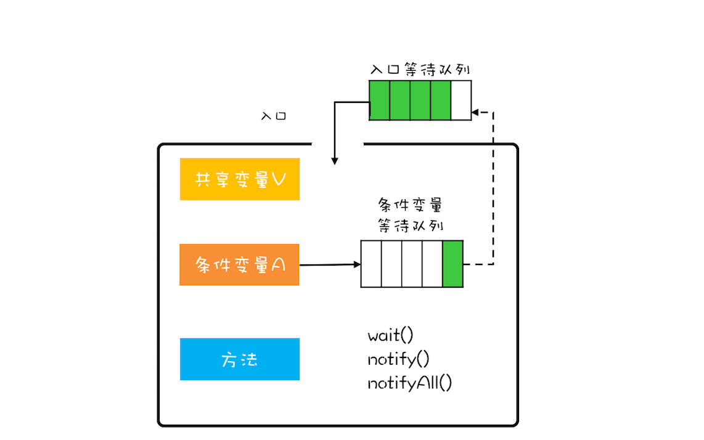

#### 4.15 synchronized可以修饰静态方法和静态代码块吗？

**参考答案**

synchronized可以修饰静态方法，但不能修饰静态代码块。

当修饰静态方法时，监视器锁（monitor）便是对象的Class实例，因为Class数据存在于永久代，因此静态方法锁相当于该类的一个全局锁。

#### 4.16 谈谈ReentrantLock的实现原理

**参考答案**

ReentrantLock是基于AQS实现的，AQS即AbstractQueuedSynchronizer的缩写，这个是个内部实现了两个队列的抽象类，分别是同步队列和条件队列。其中同步队列是一个双向链表，里面储存的是处于等待状态的线程，正在排队等待唤醒去获取锁，而条件队列是一个单向链表，里面储存的也是处于等待状态的线程，只不过这些线程唤醒的结果是加入到了同步队列的队尾，AQS所做的就是管理这两个队列里面线程之间的等待状态-唤醒的工作。

在同步队列中，还存在2中模式，分别是独占模式和共享模式，这两种模式的区别就在于AQS在唤醒线程节点的时候是不是传递唤醒，这两种模式分别对应独占锁和共享锁。

AQS是一个抽象类，所以不能直接实例化，当我们需要实现一个自定义锁的时候可以去继承AQS然后重写获取锁的方式和释放锁的方式还有管理state，而ReentrantLock就是通过重写了AQS的tryAcquire和tryRelease方法实现的lock和unlock。

ReentrantLock 结构如下图所示：


首先ReentrantLock 实现了 Lock 接口，然后有3个内部类，其中Sync内部类继承自AQS，另外的两个内部类继承自Sync，这两个类分别是用来公平锁和非公平锁的。通过Sync重写的方法tryAcquire、tryRelease可以知道，ReentrantLock实现的是AQS的独占模式，也就是独占锁，这个锁是悲观锁。

#### 4.17 如果不使用synchronized和Lock，如何保证线程安全？

**参考答案**

1. volatile

   volatile关键字为域变量的访问提供了一种免锁机制，使用volatile修饰域相当于告诉虚拟机该域可能会被其他线程更新，因此每次使用该域就要重新计算，而不是使用寄存器中的值。需要注意的是，volatile不会提供任何原子操作，它也不能用来修饰final类型的变量。

2. 原子变量

   在java的util.concurrent.atomic包中提供了创建了原子类型变量的工具类，使用该类可以简化线程同步。例如AtomicInteger 表可以用原子方式更新int的值，可用在应用程序中（如以原子方式增加的计数器），但不能用于替换Integer。可扩展Number，允许那些处理机遇数字类的工具和实用工具进行统一访问。

3. 本地存储

   可以通过ThreadLocal类来实现线程本地存储的功能。每一个线程的Thread对象中都有一个ThreadLocalMap对象，这个对象存储了一组以ThreadLocal.threadLocalHashCode为键，以本地线程变量为值的K-V值对，ThreadLocal对象就是当前线程的ThreadLocalMap的访问入口，每一个ThreadLocal对象都包含了一个独一无二的threadLocalHashCode值，使用这个值就可以在线程K-V值对中找回对应的本地线程变量。

4. 不可变的

   只要一个不可变的对象被正确地构建出来，那其外部的可见状态永远都不会改变，永远都不会看到它在多个线程之中处于不一致的状态，“不可变”带来的安全性是最直接、最纯粹的。Java语言中，如果多线程共享的数据是一个基本数据类型，那么只要在定义时使用final关键字修饰它就可以保证它是不可变的。如果共享数据是一个对象，由于Java语言目前暂时还没有提供值类型的支持，那就需要对象自行保证其行为不会对其状态产生任何影响才行。String类是一个典型的不可变类，可以参考它设计一个不可变类。

#### 4.18 说一说Java中乐观锁和悲观锁的区别

**参考答案**

悲观锁：总是假设最坏的情况，每次去拿数据的时候都认为别人会修改，所以每次在拿数据的时候都会上锁，这样别人想拿这个数据就会阻塞直到它拿到锁。Java中悲观锁是通过synchronized关键字或Lock接口来实现的。

乐观锁：顾名思义，就是很乐观，每次去拿数据的时候都认为别人不会修改，所以不会上锁，但是在更新的时候会判断一下在此期间别人有没有去更新这个数据。乐观锁适用于多读的应用类型，这样可以提高吞吐量。在JDK1.5 中新增 java.util.concurrent (J.U.C)就是建立在CAS之上的。相对于对于 synchronized 这种阻塞算法，CAS是非阻塞算法的一种常见实现。所以J.U.C在性能上有了很大的提升。

#### 4.19 公平锁与非公平锁是怎么实现的？

**参考答案**

在Java中实现锁的方式有两种，一种是使用Java自带的关键字synchronized对相应的类或者方法以及代码块进行加锁，另一种是ReentrantLock，前者只能是非公平锁，而后者是默认非公平但可实现公平的一把锁。

ReentrantLock是基于其内部类FairSync(公平锁)和NonFairSync(非公平锁)实现的，并且它的实现依赖于Java同步器框架AbstractQueuedSynchronizer（AQS），AQS使用一个整形的volatile变量state来维护同步状态，这个volatile变量是实现ReentrantLock的关键。

是将当前线程结点加入等待队列之中。公平锁在锁释放后会严格按照等到队列去取后续值，而非公平锁在对于新晋线程有很大优势。

-   公平锁FairSync：公平锁的实现机理在于每次有线程来抢占锁的时候，都会检查一遍有没有等待队列，判断条件多了 hasQueuedPredecessors()方法，即加入了同步队列中当前节点是否有前驱节点的判断，如果该 方法返回true，则表示有线程比当前线程更早地请求获取锁，因此需要等待前驱线程获取并释 放锁之后才能继续获取锁。

```
if (!hasQueuedPredecessors() && compareAndSetState(0, acquires)) {        setExclusiveOwnerThread(current);     return true;  }
```

- 非公平锁NonfairSync：非公平锁在实现的时候多次强调随机抢占：

  ```
  if (c == 0) {  if (compareAndSetState(0, acquires)) {   setExclusiveOwnerThread(current);   return true;      } } 
  ```
  
  与公平锁的区别在于新晋获取锁的进程会有多次机会去抢占锁

#### 4.20 了解Java中的锁升级吗？

**参考答案**

JDK 1.6之前，synchronized 还是一个重量级锁，是一个效率比较低下的锁。但是在JDK 1.6后，JVM为了提高锁的获取与释放效率对synchronized 进行了优化，引入了偏向锁和轻量级锁 ，从此以后锁的状态就有了四种：无锁、偏向锁、轻量级锁、重量级锁。并且四种状态会随着竞争的情况逐渐升级，而且是不可逆的过程，即不可降级，这四种锁的级别由低到高依次是：无锁、偏向锁，轻量级锁，重量级锁。如下图所示：

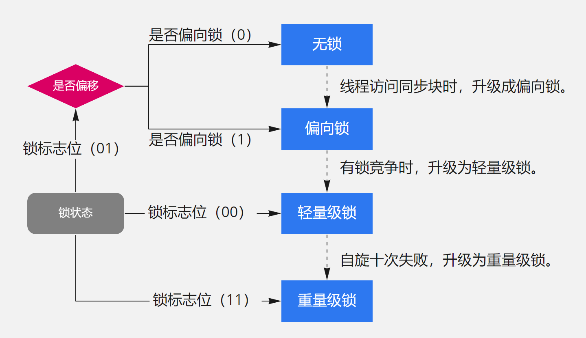

1. 无锁

   无锁是指没有对资源进行锁定，所有的线程都能访问并修改同一个资源，但同时只有一个线程能修改成功。无锁的特点是修改操作会在循环内进行，线程会不断的尝试修改共享资源。如果没有冲突就修改成功并退出，否则就会继续循环尝试。如果有多个线程修改同一个值，必定会有一个线程能修改成功，而其他修改失败的线程会不断重试直到修改成功。

2. 偏向锁

   初次执行到synchronized代码块的时候，锁对象变成偏向锁（通过CAS修改对象头里的锁标志位），字面意思是“偏向于第一个获得它的线程”的锁。执行完同步代码块后，线程并不会主动释放偏向锁（直到出现锁竞争才发生偏向锁撤销）。当第二次到达同步代码块时，线程会判断此时持有锁的线程是否就是自己（持有锁的线程ID也在对象头里），如果是则正常往下执行。由于之前没有释放锁，这里也就不需要重新加锁。如果自始至终使用锁的线程只有一个，很明显偏向锁几乎没有额外开销，性能极高。

   偏向锁是指当一段同步代码一直被同一个线程所访问时，即不存在多个线程的竞争时，那么该线程在后续访问时便会自动获得锁，从而降低获取锁带来的消耗，即提高性能。

   当一个线程访问同步代码块并获取锁时，会在 Mark Word 里存储锁偏向的线程 ID。在线程进入和退出同步块时不再通过 CAS 操作来加锁和解锁，而是检测 Mark Word 里是否存储着指向当前线程的偏向锁。轻量级锁的获取及释放依赖多次 CAS 原子指令，而偏向锁只需要在置换 ThreadID 的时候依赖一次 CAS 原子指令即可。

   偏向锁只有遇到其他线程尝试竞争偏向锁时，持有偏向锁的线程才会释放锁，线程是不会主动释放偏向锁的。关于偏向锁的撤销，需要等待全局安全点，即在某个时间点上没有字节码正在执行时，它会先暂停拥有偏向锁的线程，然后判断锁对象是否处于被锁定状态。如果线程不处于活动状态，则将对象头设置成无锁状态，并撤销偏向锁，恢复到无锁（标志位为01）或轻量级锁（标志位为00）的状态。

3. 轻量级锁

   轻量级锁是指当锁是偏向锁的时候，却被另外的线程所访问，此时偏向锁就会升级为轻量级锁，其他线程会通过自旋的形式尝试获取锁，线程不会阻塞，从而提高性能。

   轻量级锁的获取主要由两种情况：

   1. 当关闭偏向锁功能时；
   2. 由于多个线程竞争偏向锁导致偏向锁升级为轻量级锁。

   一旦有第二个线程加入锁竞争，偏向锁就升级为轻量级锁（自旋锁）。这里要明确一下什么是锁竞争：如果多个线程轮流获取一个锁，但是每次获取锁的时候都很顺利，没有发生阻塞，那么就不存在锁竞争。只有当某线程尝试获取锁的时候，发现该锁已经被占用，只能等待其释放，这才发生了锁竞争。

   在轻量级锁状态下继续锁竞争，没有抢到锁的线程将自旋，即不停地循环判断锁是否能够被成功获取。获取锁的操作，其实就是通过CAS修改对象头里的锁标志位。先比较当前锁标志位是否为“释放”，如果是则将其设置为“锁定”，比较并设置是原子性发生的。这就算抢到锁了，然后线程将当前锁的持有者信息修改为自己。

   长时间的自旋操作是非常消耗资源的，一个线程持有锁，其他线程就只能在原地空耗CPU，执行不了任何有效的任务，这种现象叫做忙等（busy-waiting）。如果多个线程用一个锁，但是没有发生锁竞争，或者发生了很轻微的锁竞争，那么synchronized就用轻量级锁，允许短时间的忙等现象。这是一种折衷的想法，短时间的忙等，换取线程在用户态和内核态之间切换的开销。

4. 重量级锁

   重量级锁显然，此忙等是有限度的（有个计数器记录自旋次数，默认允许循环10次，可以通过虚拟机参数更改）。如果锁竞争情况严重，某个达到最大自旋次数的线程，会将轻量级锁升级为重量级锁（依然是CAS修改锁标志位，但不修改持有锁的线程ID）。当后续线程尝试获取锁时，发现被占用的锁是重量级锁，则直接将自己挂起（而不是忙等），等待将来被唤醒。

   重量级锁是指当有一个线程获取锁之后，其余所有等待获取该锁的线程都会处于阻塞状态。简言之，就是所有的控制权都交给了操作系统，由操作系统来负责线程间的调度和线程的状态变更。而这样会出现频繁地对线程运行状态的切换，线程的挂起和唤醒，从而消耗大量的系统资。
   
   

**扩展阅读**

synchronized 用的锁是存在Java对象头里的，那么什么是对象头呢？我们以 Hotspot 虚拟机为例进行说明，Hopspot 对象头主要包括两部分数据：Mark Word（标记字段） 和 Klass Pointer（类型指针）。

- Mark Word：默认存储对象的HashCode，分代年龄和锁标志位信息。这些信息都是与对象自身定义无关的数据，所以Mark Word被设计成一个非固定的数据结构以便在极小的空间内存存储尽量多的数据。它会根据对象的状态复用自己的存储空间，也就是在运行期间Mark Word里存储的数据会随着锁标志位的变化而变化。
- Klass Point：对象指向它的类元数据的指针，虚拟机通过这个指针来确定这个对象是哪个类的实例。

那么，synchronized 具体是存在对象头哪里呢？答案是：存在锁对象的对象头的Mark Word中，那么MarkWord在对象头中到底长什么样，它到底存储了什么呢？

在32位的虚拟机中：


在64位的虚拟机中：


下面我们以 32位虚拟机为例，来看一下其 Mark Word 的字节具体是如何分配的：

- 无锁 ：对象头开辟 25bit 的空间用来存储对象的 hashcode ，4bit 用于存放对象分代年龄，1bit 用来存放是否偏向锁的标识位，2bit 用来存放锁标识位为01。
- 偏向锁： 在偏向锁中划分更细，还是开辟 25bit 的空间，其中23bit 用来存放线程ID，2bit 用来存放 Epoch，4bit 存放对象分代年龄，1bit 存放是否偏向锁标识， 0表示无锁，1表示偏向锁，锁的标识位还是01。
- 轻量级锁：在轻量级锁中直接开辟 30bit 的空间存放指向栈中锁记录的指针，2bit 存放锁的标志位，其标志位为00。
- 重量级锁： 在重量级锁中和轻量级锁一样，30bit 的空间用来存放指向重量级锁的指针，2bit 存放锁的标识位，为。
- GC标记： 开辟30bit 的内存空间却没有占用，2bit 空间存放锁标志位为11。

其中无锁和偏向锁的锁标志位都是01，只是在前面的1bit区分了这是无锁状态还是偏向锁状态。

- age_bits： 就是我们说的分代回收的标识，占用4字节。
- lock_bits： 是锁的标志位，占用2个字节。
- biased_lock_bits： 是是否偏向锁的标识，占用1个字节。

#### 4.22 分段锁是怎么实现的？

**参考答案**

在并发程序中，串行操作是会降低可伸缩性，并且上下文切换也会减低性能。在锁上发生竞争时将通水导致这两种问题，使用独占锁时保护受限资源的时候，基本上是采用串行方式—-每次只能有一个线程能访问它。所以对于可伸缩性来说最大的威胁就是独占锁。

我们一般有三种方式降低锁的竞争程度：

1. 减少锁的持有时间；
2. 降低锁的请求频率；
3. 使用带有协调机制的独占锁，这些机制允许更高的并发性。

在某些情况下我们可以将锁分解技术进一步扩展为一组独立对象上的锁进行分解，这称为分段锁。其实说的简单一点就是：容器里有多把锁，每一把锁用于锁容器其中一部分数据，那么当多线程访问容器里不同数据段的数据时，线程间就不会存在锁竞争，从而可以有效的提高并发访问效率，这就是ConcurrentHashMap所使用的锁分段技术，首先将数据分成一段一段的存储，然后给每一段数据配一把锁，当一个线程占用锁访问其中一个段数据的时候，其他段的数据也能被其他线程访问。

如下图，ConcurrentHashMap使用Segment数据结构，将数据分成一段一段的存储，然后给每一段数据配一把锁，当一个线程占用锁访问其中一个段数据的时候，其他段的数据也能被其他线程访问，能够实现真正的并发访问。所以说，ConcurrentHashMap在并发情况下，不仅保证了线程安全，而且提高了性能。


#### 4.23 说说你对读写锁的了解

**参考答案**

一般的独占锁是：读读互斥、读写互斥、写写互斥。读写锁的规则是可以共享读，但只能一个写，总结起来为：读读不互斥、读写互斥、写写互斥，读写锁就是为了场景中读远远大于写而创建出来的一种机制。 在Java中ReadWriteLock的主要实现为ReentrantReadWriteLock，其提供了以下特性：

1. 公平性选择：支持公平与非公平（默认）的锁获取方式，吞吐量非公平优先于公平。
2. 可重入：读线程获取读锁之后可以再次获取读锁，写线程获取写锁之后可以再次获取写锁。
3. 可降级：写线程获取写锁之后，其还可以再次获取读锁，然后释放掉写锁，那么此时该线程是读锁状态，也就是降级操作。

```java
//缓存的实现
public class Cache {
	static Map<String, Object> map = new HashMap<String, Object>();
	static ReentrantReadWriteLock rwl = new ReentrantReadWriteLock();
	static Lock r = rwl.readLock();
	static Lock w = rwl.writeLock();
	// 获取一个key对应的value
	public static final Object get(String key) {
		r.lock();
		try {
			return map.get(key);
		} finally {
			r.unlock();
		}
	}
	// 设置key对应的value，并返回旧的value
	public static final Object put(String key, Object value) {
		w.lock();
		try {
			return map.put(key, value);
		} finally {
			w.unlock();
		}
	}
	// 清空所有的内容
	public static final void clear() {
		w.lock();
		try {
			map.clear();
		} finally {
			w.unlock();
		}
	}
}
```

#### 4.24 volatile关键字有什么用？

**参考答案**

当一个变量被定义成volatile之后，它将具备两项特性：

1. 保证可见性

   当写一个volatile变量时，JMM会把该线程本地内存中的变量强制刷新到主内存中去，这个写会操作会导致其他线程中的volatile变量缓存无效。

2. 禁止指令重排

   使用volatile关键字修饰共享变量可以禁止指令重排序，volatile禁止指令重排序有一些规则：

   - 当程序执行到volatile变量的读操作或者写操作时，在其前面的操作的更改肯定全部已经进行，且结果已经对后面的操作可见，在其后面的操作肯定还没有进行；
   - 在进行指令优化时，不能将对volatile变量访问的语句放在其后面执行，也不能把volatile变量后面的语句放到其前面执行。

   即执行到volatile变量时，其前面的所有语句都执行完，后面所有语句都未执行。且前面语句的结果对volatile变量及其后面语句可见。

注意，虽然volatile能够保证可见性，但它不能保证原子性。volatile变量在各个线程的工作内存中是不存在一致性问题的，但是Java里面的运算操作符并非原子操作，这导致volatile变量的运算在并发下一样是不安全的。

#### 4.25 谈谈volatile的实现原理

**参考答案**

volatile可以保证线程可见性且提供了一定的有序性，但是无法保证原子性。在JVM底层volatile是采用“内存屏障”来实现的。观察加入volatile关键字和没有加入volatile关键字时所生成的汇编代码发现，加入volatile关键字时，会多出一个lock前缀指令，lock前缀指令实际上相当于一个内存屏障，内存屏障会提供3个功能：

1. 它确保指令重排序时不会把其后面的指令排到内存屏障之前的位置，也不会把前面的指令排到内存屏障的后面；即在执行到内存屏障这句指令时，在它前面的操作已经全部完成；
2. 它会强制将对缓存的修改操作立即写入主存；
3. 如果是写操作，它会导致其他CPU中对应的缓存行无效。

#### 4.26 说说你对JUC的了解

**参考答案**

JUC是java.util.concurrent的缩写，该包参考自EDU.oswego.cs.dl.util.concurrent，是JSR 166标准规范的一个实现。JSR 166是一个关于Java并发编程的规范提案，在JDK中该规范由java.util.concurrent包实现。即JUC是Java提供的并发包，其中包含了一些并发编程用到的基础组件。

JUC这个包下的类基本上包含了我们在并发编程时用到的一些工具，大致可以分为以下几类：

- 原子更新

  Java从JDK1.5开始提供了java.util.concurrent.atomic包，方便程序员在多线程环 境下，无锁的进行原子操作。在Atomic包里一共有16个类，五种原子更新方式，分别是原子更新基本类型，原子更新数组，原子更新引用、原子更新字段和累加器。

- 锁和条件变量

  java.util.concurrent.locks包下包含了同步器的框架 AbstractQueuedSynchronizer，基于AQS构建的Lock以及与Lock配合可以实现等待/通知模式的Condition。JUC 下的大多数工具类用到了Lock和Condition来实现并发。

- 线程池

  涉及到的类比如：Executor、Executors、ThreadPoolExector、 AbstractExecutorService、Future、Callable、ScheduledThreadPoolExecutor等等。

- 阻塞队列

  涉及到的类比如：ArrayBlockingQueue、LinkedBlockingQueue、PriorityBlockingQueue、LinkedBlockingDeque等等。

- 并发容器

  涉及到的类比如：ConcurrentHashMap、CopyOnWriteArrayList、ConcurrentLinkedQueue、CopyOnWriteArraySet等等。

- 同步器

  剩下的是一些在并发编程中时常会用到的工具类，主要用来协助线程同步。比如：CountDownLatch、CyclicBarrier、Exchanger、Semaphore、FutureTask等等。

#### 4.27 说说你对AQS的理解

**参考答案**

抽象队列同步器AbstractQueuedSynchronizer （以下都简称AQS），是用来构建锁或者其他同步组件的骨架类，减少了各功能组件实现的代码量，也解决了在实现同步器时涉及的大量细节问题，例如等待线程采用FIFO队列操作的顺序。在不同的同步器中还可以定义一些灵活的标准来判断某个线程是应该通过还是等待。

AQS采用模板方法模式，在内部维护了n多的模板的方法的基础上，子类只需要实现特定的几个方法，就可以实现子类自己的需求。

基于AQS实现的组件，诸如：

- ReentrantLock 可重入锁（支持公平和非公平的方式获取锁）；
- Semaphore 计数信号量;
- ReentrantReadWriteLock 读写锁。

**扩展阅读**

AQS内部维护了一个int成员变量来表示同步状态，通过内置的FIFO(first-in-first-out)同步队列来控制获取共享资源的线程。

我们可以猜测出，AQS其实主要做了这么几件事情：

- 同步状态（state）的维护管理；
- 等待队列的维护管理；
- 线程的阻塞与唤醒。

通过AQS内部维护的int型的state，可以用于表示任意状态！

- ReentrantLock用它来表示锁的持有者线程已经重复获取该锁的次数，而对于非锁的持有者线程来说，如果state大于0，意味着无法获取该锁，将该线程包装为Node，加入到同步等待队列里。
- Semaphore用它来表示剩余的许可数量，当许可数量为0时，对未获取到许可但正在努力尝试获取许可的线程来说，会进入同步等待队列，阻塞，直到一些线程释放掉持有的许可（state+1），然后争用释放掉的许可。
- FutureTask用它来表示任务的状态（未开始、运行中、完成、取消）。
- ReentrantReadWriteLock在使用时，稍微有些不同，int型state用二进制表示是32位，前16位（高位）表示为读锁，后面的16位（低位）表示为写锁。
- CountDownLatch使用state表示计数次数，state大于0，表示需要加入到同步等待队列并阻塞，直到state等于0，才会逐一唤醒等待队列里的线程。

AQS通过内置的FIFO(first-in-first-out)同步队列来控制获取共享资源的线程。CLH队列是FIFO的双端双向队列，AQS的同步机制就是依靠这个CLH队列完成的。队列的每个节点，都有前驱节点指针和后继节点指针。如下图：


#### 4.28 LongAdder解决了什么问题，它是如何实现的？

**参考答案**

高并发下计数AtomicXXX中的 CAS 操作在出现线程竞争时，失败的线程会白白地循环一次，在并发很大的情况下，因为每次CAS都只有一个线程能成功，竞争失败的线程会非常多。失败次数越多，循环次数就越多，很多线程的CAS操作越来越接近自旋锁（spin lock）。计数操作本来是一个很简单的操作，实际需要耗费的cpu时间应该是越少越好，AtomicXXX在高并发计数时，大量的cpu时间都浪费会在 自旋上了，这很浪费，也降低了实际的计数效率。

LongAdder是jdk8新增的用于并发环境的计数器，目的是为了在高并发情况下，代替AtomicLong/AtomicInt，成为一个用于高并发情况下的高效的通用计数器。LongAdder是根据锁分段来实现的，它里面维护一组按需分配的计数单元，并发计数时，不同的线程可以在不同的计数单元上进行计数，这样减少了线程竞争，提高了并发效率。仅需要累加操作，使用原子化的累加器性能会更好。其他情况，比如序号生成，这种情况下需要准确的数值，全局唯一的AtomicLong才是正确的选择，此时不应该使用LongAdder。

#### 4.29 介绍下ThreadLocal和它的应用场景

**参考答案**

ThreadLocal，即线程变量，是一个以ThreadLocal对象为键、任意对象为值的存储结构。这个结构被附带在线程上，也就是说一个线程可以根据一个ThreadLocal对象查询到绑定在这个线程上的一个值。每个线程可以通过set()和get()存取变量，多线程间无法访问各自的局部变量。只要线程处于活动状态，它所对应的ThreadLocal实例就是可访问的，线程被终止后，它的所有实例将被垃圾收集。

ThreadLocal经典的使用场景是为每个线程分配一个 JDBC 连接 Connection，这样就可以保证每个线程的都在各自的 Connection 上进行数据库的操作，不会出现 A 线程关了 B线程正在使用的 Connection。 另外ThreadLocal还经常用于管理Session会话，将Session保存在ThreadLocal中，使线程处理多次处理会话时始终是同一个Session。

#### 4.30 请介绍ThreadLocal的实现原理，它是怎么处理hash冲突的？

**参考答案**

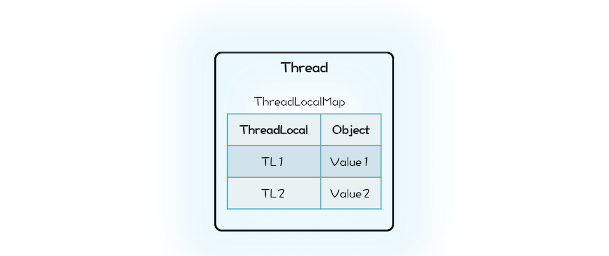

Thread类中有个变量threadLocals，它的类型为ThreadLocal中的一个内部类ThreadLocalMap，这个类没有实现map接口，就是一个普通的Java类，但是实现的类似map的功能。每个线程都有自己的一个map，map是一个数组的数据结构存储数据，每个元素是一个Entry，entry的key是ThreadLocal的引用，也就是当前变量的副本，value就是set的值。
ThreadLocalMap 里对 ThreadLocal 的引用还是弱引用（WeakReference），所以只要 Thread 对象可以被回收，那么 ThreadLocalMap 就能被回收。通过开放地址法解决 hash 冲突。

#### 4.31 介绍一下线程池

**参考答案** 

目前业界线程池的设计，普遍采用的都是生产者 - 消费者模式。系统启动一个新线程的成本是比较高的，因为它涉及与操作系统交互。在这种情形下，使用线程池可以很好地提高性能，尤其是当程序中需要创建大量生存期很短暂的线程时，更应该考虑使用线程池。

与数据库连接池类似的是，线程池在系统启动时即创建大量空闲的线程，程序将一个Runnable对象或Callable对象传给线程池，线程池就会启动一个空闲的线程来执行它们的run()或call()方法，当run()或call()方法执行结束后，该线程并不会死亡，而是再次返回线程池中成为空闲状态，等待执行下一个Runnable对象的run()或call()方法。

从Java 5开始，Java内建支持线程池。Java 5新增了一个Executors工厂类来产生线程池，该工厂类包含如下几个静态工厂方法来创建线程池。创建出来的线程池，都是通过ThreadPoolExecutor类来实现的。

- newCachedThreadPool()，它是一种用来处理大量短时间工作任务的线程池，具有几个鲜明特点：它会试图缓存线程并重用，当无缓存线程可用时，就会创建新的工作线程；如果线程闲置的时间超过 60 秒，则被终止并移出缓存；长时间闲置时，这种线程池，不会消耗什么资源。其内部使用 SynchronousQueue 作为工作队列。
- newFixedThreadPool(int nThreads)，重用指定数目（nThreads）的线程，其背后使用的是无界的工作队列，任何时候最多有 nThreads 个工作线程是活动的。这意味着，如果任务数量超过了活动队列数目，将在工作队列中等待空闲线程出现；如果有工作线程退出，将会有新的工作线程被创建，以补足指定的数目 nThreads。
- newSingleThreadExecutor()，它的特点在于工作线程数目被限制为 1，操作一个无界的工作队列，所以它保证了所有任务的都是被顺序执行，最多会有一个任务处于活动状态，并且不允许使用者改动线程池实例，因此可以避免其改变线程数目。
- newSingleThreadScheduledExecutor() 和 newScheduledThreadPool(int corePoolSize)，创建的是个 ScheduledExecutorService，可以进行定时或周期性的工作调度，区别在于单一工作线程还是多个工作线程。

- newWorkStealingPool(int parallelism)，这是一个经常被人忽略的线程池，Java 8 才加入这个创建方法，其内部会构建ForkJoinPool，利用Work-Stealing算法，并行地处理任务，不保证处理顺序。

#### 4.32 介绍一下线程池的工作流程

**参考答案**

线程池的工作流程如下图所示：


1. 判断核心线程池是否已满，没满则创建一个新的工作线程来执行任务。
2. 判断任务队列是否已满，没满则将新提交的任务添加在工作队列。
3. 判断整个线程池是否已满，没满则创建一个新的工作线程来执行任务，已满则执行饱和（拒绝）策略。

```java
public void execute(Runnable command) {
	if (command == null)
		throw new NullPointerException();
	// 如果线程数小于基本线程数，则创建线程并执行当前任务
	if (poolSize >= corePoolSize || !addIfUnderCorePoolSize(command)) {
	// 如线程数大于等于基本线程数或线程创建失败，则将当前任务放到工作队列中。
	if (runState == RUNNING && workQueue.offer(command)) {
		if (runState != RUNNING || poolSize == 0)
			ensureQueuedTaskHandled(command);
	} // 如果线程池不处于运行中或任务无法放入队列，并且当前线程数量小于最大允许的线程数量，
	// 则创建一个线程执行任务。
	else if (!addIfUnderMaximumPoolSize(command))
		// 抛出RejectedExecutionException异常
		reject(command); // is shutdown or saturated
	}
}
```

#### 4.33 线程池都有哪些状态？

**参考答案**

线程池一共有五种状态, 分别是：

1. RUNNING ：能接受新提交的任务，并且也能处理阻塞队列中的任务。
2. SHUTDOWN：关闭状态，会拒绝接收新的任务，但是会等待线程池中正在执行的任务和已经进入阻塞队列的任务都执行完之后才最终关闭线程池。在线程池处于 RUNNING 状态时，调用 shutdown()方法会使线程池进入到该状态。
3. STOP：拒绝接收新的任务，同时还会中断线程池中正在执行的任务，已经进入阻塞队列的任务也被剥夺了执行的机会，不过这些被剥夺执行机会的任务会作为 shutdownNow() 方法的返回值返回。在线程池处于 RUNNING 或 SHUTDOWN 状态时，调用 shutdownNow() 方法会使线程池进入到该状态。
4. TIDYING：如果所有的任务都已终止了，workerCount (有效线程数) 为0，线程池进入该状态后会调用 terminated() 方法进入TERMINATED 状态。
5. TERMINATED：在terminated() 方法执行完后进入该状态，默认terminated()方法中什么也没有做。进入TERMINATED的条件如下：
   - 线程池不是RUNNING状态；
   - 线程池状态不是TIDYING状态或TERMINATED状态；
   - 如果线程池状态是SHUTDOWN并且workerQueue为空；
   - workerCount为0；
   - 设置TIDYING状态成功。

下图为线程池的状态转换过程：


#### 4.34 谈谈线程池的拒绝策略

**参考答案**

当线程池的任务缓存队列已满并且线程池中的线程数目达到maximumPoolSize，如果还有任务到来就会采取任务拒绝策略，通常有以下四种策略：

1. AbortPolicy：丢弃任务并抛出RejectedExecutionException异常。
2. DiscardPolicy：也是丢弃任务，但是不抛出异常。
3. DiscardOldestPolicy：丢弃队列最老的任务，然后把新任务加入工作队列。
4. CallerRunsPolicy：由调用线程处理该任务。

#### 4.35 线程池大小你通常怎么设置？

**参考答案**

1. CPU密集型任务

   一般为CPU核心数+1。当线程因为偶尔的内存页失效或其他原因导致阻塞时，这个额外的一个线程可以顶上，从而保证 CPU 的利用率。 若开过多的线程数，会造成CPU过度切换。

2. IO密集型任务

   最佳线程数 =CPU 核数 *2。 IO密集型任务CPU使用率并不高，因此可以让CPU在等待IO的时候有其他线程去处理别的任务，充分利用CPU时间。

3. 混合型任务

   可以将任务分成IO密集型和CPU密集型任务，然后分别用不同的线程池去处理。 只要分完之后两个任务的执行时间相差不大，那么就会比串行执行来的高效。因为如果划分之后两个任务执行时间有数据级的差距，那么拆分没有意义。因为先执行完的任务就要等后执行完的任务，最终的时间仍然取决于后执行完的任务，而且还要加上任务拆分与合并的开销，得不偿失。

#### 4.36 线程池有哪些参数，各个参数的作用是什么？

**参考答案**

线程池主要有如下6个参数：

1. corePoolSize（核心工作线程数）：当向线程池提交一个任务时，若线程池已创建的线程数小于corePoolSize，即便此时存在空闲线程，也会通过创建一个新线程来执行该任务，直到已创建的线程数大于或等于corePoolSize时。
2. maximumPoolSize（最大线程数）：线程池所允许的最大线程个数。当队列满了，且已创建的线程数小于maximumPoolSize，则线程池会创建新的线程来执行任务。另外，对于无界队列，可忽略该参数。
3. keepAliveTime（临时线程存活时间）：当线程池中线程数大于核心线程数时，线程的空闲时间如果超过线程存活时间，那么这个线程就会被销毁，直到线程池中的线程数小于等于核心线程数。
4. workQueue（队列）：用于传输和保存等待执行任务的阻塞队列。
5. threadFactory（线程创建工厂）：用于创建新线程。threadFactory创建的线程也是采用new Thread()方式，threadFactory创建的线程名都具有统一的风格：pool-m-thread-n（m为线程池的编号，n为线程池内的线程编号）。
6. handler（拒绝策略）：当线程池和队列都满了，再加入线程会执行此策略

## 5. JVM

#### 5.1 说一说 JVM 的内存分布

**参考答案**

JVM在执行Java程序的过程中会把它所管理的内存划分为若干个不同的数据区域。这些区域有各自的用途，以及创建和销毁的时间，有的区域随着虚拟机进程的启动而一直存在，有些区域则是依赖用户线程的启动和结束而建立和销毁。根据《JVM 规范》的规定，JVM所管理的内存将会包括以下几个区域。


1. 程序计数器

   程序计数器（Program Counter Register）是一块较小的内存空间，指向下一条指令的地址。每条线程都需要有一个独立的程序计数器，各条线程之间计数器互不影响，独立存储，我们称这类内存区域为“**线程私有**”的内存。

   如果线程正在执行的是一个Java方法，这个计数器记录的是正在执行的虚拟机字节码指令的地址；如果正在执行的是本地（Native）方法，这个计数器值则应为空（Undefined）。此内存区域是唯一一个在《JVM 规范》中没有规定任何OutOfMemoryError情况的区域。

2. 虚拟机栈

   JVM栈（Java Virtual Machine Stack）是**线程私有**的，它的生命周期与线程相同。虚拟机栈描述的是Java方法执行的线程内存模型：每个方法被执行的时候，JVM都会同步创建一个栈帧（Stack Frame）用于存储局部变量表、操作数栈、动态连接、方法出口等信息。每一个方法被调用直至执行完毕的过程，就对应着一个栈帧在虚拟机栈中从入栈到出栈的过程。

   在《JVM 规范》中，对这个内存区域规定了两类异常状况：如果线程请求的栈深度大于虚拟机所允许的深度，将抛出StackOverflowError异常；如果JVM栈容量可以动态扩展，当栈扩展时无法申请到足够的内存会抛出OutOfMemoryError异常。

3. 本地方法栈

   本地方法栈（Native Method Stacks）与虚拟机栈所发挥的作用是非常相似的，其区别只是虚拟机栈为虚拟机执行Java方法（也就是字节码）服务，而本地方法栈则是为虚拟机使用到的本地（Native）方法服务。

   《JVM 规范》对本地方法栈中方法使用的语言、使用方式与数据结构并没有任何强制规定，因此具体的虚拟机可以根据需要自由实现它，甚至有的JVM（譬如Hot-Spot虚拟机）直接就把本地方法栈和虚拟机栈合二为一。与虚拟机栈一样，本地方法栈也会在栈深度溢出或者栈扩展失败时分别抛出StackOverflowError和OutOfMemoryError异常。

4. Java堆

   对于Java应用程序来说，Java堆（Java Heap）是虚拟机所管理的内存中最大的一块。Java堆是被所有线程共享的一块内存区域，在虚拟机启动时创建。此内存区域的唯一目的就是存放对象实例，Java世界里“几乎”所有的对象实例都在这里分配内存。由于即时编译技术的进步，尤其是逃逸分析技术的日渐强大，栈上分配、标量替换优化手段已经导致一些微妙的变化悄然发生，所以说Java对象实例都分配在堆上也渐渐变得不是那么绝对了。

   根据《JVM 规范》的规定，Java堆可以处于物理上不连续的内存空间中，但在逻辑上它应该被视为连续的，但对于大对象（典型的如数组对象），多数虚拟机实现出于实现简单、存储高效的考虑，很可能会要求连续的内存空间。

   Java堆既可以被实现成固定大小的，也可以是可扩展的，不过当前主流的JVM都是按照可扩展来实现的（通过参数-Xmx和-Xms设定）。如果在Java堆中没有内存完成实例分配，并且堆也无法再扩展时，JVM将会抛出OutOfMemoryError异常。

5. 方法区

   方法区（Method Area）与Java堆一样，是各个线程共享的内存区域，它用于存储已被虚拟机加载的类型信息、常量、静态变量、即时编译器编译后的代码缓存等数据。它有一个别名叫作“非堆”（Non-Heap），目的是与Java堆区分开来。

   根据《JVM 规范》的规定，如果方法区无法满足新的内存分配需求时，将抛出OutOfMemoryError异常。

6. 运行时常量池

   运行时常量池（Runtime Constant Pool）是方法区的一部分。常量池表（Constant Pool Table），用于存放编译期生成的各种字面量与符号引用，这部分内容将在类加载后存放到方法区的运行时常量池中。

   既然运行时常量池是方法区的一部分，自然受到方法区内存的限制，当常量池无法再申请到内存时会抛出OutOfMemoryError异常。

7. 直接内存

   直接内存（Direct Memory）并不是虚拟机运行时数据区的一部分，也不是《JVM 规范》中定义的内存区域。但是这部分内存也被频繁地使用，而且也可能导致OutOfMemoryError异常出现。

   在 JDK 1.4 中新加入 NIO 类，引入了一种基于通道和缓冲区的 IO 方式，它可以使用 Native 函数库直接分配堆外内存，然后通过一个存储在 Java 堆中的 DirectByteBuffer 对象作为这块内存的引用直接操作。避免在 Java 堆和 Native 堆中来回复制数据。
   
   显然，本机直接内存的分配不会受到Java堆大小的限制，但是，既然是内存，则肯定还是会受到本机总内存（包括物理内存、SWAP分区或者分页文件）大小以及处理器寻址空间的限制，一般服务器管理员配置虚拟机参数时，会根据实际内存去设置-Xmx等参数信息，但经常忽略掉直接内存，使得各个内存区域总和大于物理内存限制（包括物理的和操作系统级的限制），从而导致动态扩展时出现OutOfMemoryError异常。

#### 5.2 说一下 volitile 关键字？

底层 CPU 实现原理：

- 将当前处理器缓存行的数据写回到系统内存。
- 这个写回内存的操作会使在其他CPU里缓存了该内存地址的数据无效。

#### 5.3 说一下 happens-before 规则

1. 在一个线程中，按照程序顺序，前面的操作 Happens-Before 于后续的任意操作
2. 对一个 volatile 变量的写操作， Happens-Before 于后续对这个 volatile 变量的读操作
3. 如果 A Happens-Before B，且 B Happens-Before C，那么 A Happens-Before C
4. 对一个锁的解锁 Happens-Before 于后续对这个锁的加锁
5. 关于线程启动的（调用 start() 方法）。它是指主线程 A 启动子线程 B 后，子线程 B 能够看到主线程在启动子线程 B 前的操作
6. 主线程 A 等待子线程 B 完成（主线程 A 通过调用子线程 B 的 join() 方法实现），当子线程 B 完成后（主线程 A 中 join() 方法返回），主线程能够看到子线程的操作。

#### 5.4 类存放在哪里？

**参考答案**

方法区（Method Area）与Java堆一样，是各个线程共享的内存区域，它用于存储已被虚拟机加载的类型信息、常量、静态变量、即时编译器编译后的代码缓存等数据。虽然《JVM 规范》中把方法区描述为堆的一个逻辑部分，但是它却有一个别名叫作“非堆”（Non-Heap），目的是与Java堆区分开来。

#### 5.5 局部变量存放在哪里？

**参考答案**

与程序计数器一样，虚拟机栈（Java Virtual Machine Stack）也是线程私有的，它的生命周期与线程相同。虚拟机栈描述的是Java方法执行的线程内存模型：每个方法被执行的时候，JVM都会同步创建一个栈帧（Stack Frame）用于存储局部变量表、操作数栈、动态连接、方法出口等信息。每一个方法被调用直至执行完毕的过程，就对应着一个栈帧在虚拟机栈中从入栈到出栈的过程。

#### 5.6 介绍一下类加载的过程

**参考答案**

一个类型从被加载到虚拟机内存中开始，到卸载出内存为止，它的整个生命周期将会经历加载（Loading）、验证（Verification）、准备（Preparation）、解析（Resolution）、初始化（Initialization）、使用（Using）和卸载（Unloading）七个阶段，其中验证、准备、解析三个部分统称为连接（Linking）。这七个阶段的发生顺序如下图所示。


在上述七个阶段中，包括了类加载的全过程，即加载、验证、准备、解析和初始化这五个阶段。

一、加载

“加载”（Loading）阶段是整个“类加载”（Class Loading）过程中的一个阶段，在加载阶段，JVM需要完成以下三件事情：

1. 通过一个类的全限定名来获取定义此类的二进制字节流。
2. 将这个字节流所代表的静态存储结构转化为方法区的运行时数据结构。
3. 在内存中生成一个代表这个类的java.lang.Class对象，作为方法区这个类的各种数据的访问入口。

加载阶段结束后，JVM外部的二进制字节流就按照虚拟机所设定的格式存储在方法区之中了，方法区中的数据存储格式完全由虚拟机实现自行定义，《JVM 规范》未规定此区域的具体数据结构。类型数据妥善安置在方法区之后，会在Java堆内存中实例化一个java.lang.Class类的对象，这个对象将作为程序访问方法区中的类型数据的外部接口。

二、验证

验证是连接阶段的第一步，这一阶段的目的是确保Class文件的字节流中包含的信息符合《JVM 规范》的全部约束要求，保证这些信息被当作代码运行后不会危害虚拟机自身的安全。验证阶段大致上会完成下面四个阶段的检验动作：文件格式验证、元数据验证、字节码验证和符号引用验证。

1. 文件格式验证：

   第一阶段要验证字节流是否符合Class文件格式的规范，并且能被当前版本的虚拟机处理。

2. 元数据验证：

   第二阶段是对字节码描述的信息进行语义分析，以保证其描述的信息符合《Java语言规范》的要求。

3. 字节码验证：

   第三阶段是通过数据流分析和控制流分析，确定程序语义是合法的、符合逻辑的。

4. 符号引用验证：

   符号引用验证可以看作是对类自身以外（常量池中的各种符号引用）的各类信息进行匹配性校验，通俗来说就是，该类是否缺少或者被禁止访问它依赖的某些外部类、方法、字段等资源。

三、准备

准备阶段是正式为类中定义的变量（即静态变量，被static修饰的变量）分配内存并设置类变量初始值的阶段。从概念上讲，这些变量所使用的内存都应当在方法区中进行分配，但必须注意到方法区本身是一个逻辑上的区域，在JDK7及之前，HotSpot使用永久代来实现方法区时，实现是完全符合这种逻辑概念的。而在JDK 8及之后，类变量则会随着Class对象一起存放在Java堆中，这时候“类变量在方法区”就完全是一种对逻辑概念的表述了。

四、解析

解析阶段是JVM将常量池内的符号引用替换为直接引用的过程

符号引用（Symbolic References）：符号引用以一组符号来描述所引用的目标，符号可以是任何形式的字面量，只要使用时能无歧义地定位到目标即可。符号引用与虚拟机实现的内存布局无关，引用的目标并不一定是已经加载到虚拟机内存当中的内容。

直接引用（Direct References）：直接引用是可以直接指向目标的指针，如果有了直接引用，那引用的目标必定已经在虚拟机的内存中存在。

五、初始化

如果直接赋值的静态字段被 final 所修饰，并且它的类型是基本类型或字符串时，那么该字段便会被 Java 编译器标记成常量值（ConstantValue），其初始化直接由 Java 虚拟机完成。除此之外的类变量的直接赋值操作，以及所有静态代码块中的代码，则会被 Java 编译器置于同一方法中，并把它命名为 < clinit >。

初始化，便是为标记为常量值的字段赋值，以及执行 < clinit > 方法的过程。Java 虚拟机会通过加锁来确保类的 < clinit > 方法仅被执行一次。

#### 5.7 介绍一下对象的创建过程

**参考答案**

（1）类加载检查
JVM（jvm）在读取一条 new 指令时候，首先检查能否在常量池中定位到这个类的符号引用，并且检查这个符号引用代表的类是否被加载、解析和初始化。如果没有，则会先执行相应的类加载过程。

（2）内存分配
在通过（1）后，则开始为新生的对象分配内存。该对象所需的内存大小在类加载完成后便可确定，因此为每个对象分配的内存大小是确定的。而分配方式主要有两种，分别为：

1.指针碰撞

应用场合：堆内存规整（通俗的说就是用过的内存被整齐充分的利用，用过的内存放在一边，没有用过的放在另外一边，而中间利用一个分界值指针对这两边的内存进行分界，从而掌握内存分配情况）。

即在开辟内存空间时候，将分界值指针往没用过的内存方向移动向应大小位置即可）。

将堆内存这样划分的代表的GC收集器算法有：Serial，ParNew

2.空闲列表

应用场合;堆内存不规整（虚拟机维护一个可以记录内存块是否可以用的列表来了解内存分配情况）

即在开辟内存空间时候，找到一块足够大的内存块分配给该对象即可，同时更新记录列表。

将堆内存这样划分的代表的GC收集器算法有：CMS

（3）初始化默认值
第（2）步完成后，紧接着，虚拟机需要将分配到的内存空间都进行初始化（即给一些默认值），这将做是为了保证对象实例的字段在Java代码中可以在不赋初值的情况下使用。程序可以访问到这些字段对用数据类型的默认值。

（4）设置对象头
初始化（3）完成后，虚拟机对对象进行一些简单设置，如标记该对象是那个类的实例，这个对象的hash码，该对象所处的年龄段等等（这些可以理解为对象实例的基本信息）。这些信息被卸载对象头中。jvm根据当前的运行状态，会给出不同的设置方式。

（5）执行初始化方法
在（4）完成后，最后执行由开发人员编写的对象的初始化方法，把对象按照开发人员的设计进行初始化，一个对象便创建出来了。就是执行类构造函数对应在字节码文件中的\<init>()方法(实例构造器)，\<init>()方法由非静态变量、非静态代码块以及对应的构造器组成。

- \<init>()方法可以重载多个，类有几个构造器就有几个\<init>()方法；
- \<init>()方法中的代码执行顺序为：父类变量初始化、父类代码块、父类构造器、子类变量初始化、子类代码块、子类构造器。

具有父类的子类的实例化顺序如下：


#### 5.8 元空间在栈内还是栈外？

**参考答案**

在栈外，元空间占用的是本地内存。

**扩展阅读**

到了JDK 7的HotSpot，已经把原本放在永久代的字符串常量池、静态变量等移出，而到了JDK 8，终于完全废弃了永久代的概念，改用与JRockit、J9一样在本地内存中实现的元空间（Meta-space）来代替，把JDK 7中永久代还剩余的内容（主要是类型信息）全部移到元空间中。

#### 5.9 谈谈JVM的类加载器，以及双亲委派模型

**参考答案**

一、类加载器

对于任意一个类，都必须由加载它的类加载器和这个类本身一起共同确立其在JVM中的唯一性，每一个类加载器，都拥有一个独立的类名称空间。这句话可以表达得更通俗一些：比较两个类是否“相等”，只有在这两个类是由同一个类加载器加载的前提下才有意义，否则，即使这两个类来源于同一个Class文件，被同一个JVM加载，只要加载它们的类加载器不同，那这两个类就必定不相等。

二、双亲委派模型

自JDK1.2以来，Java一直保持着三层类加载器、双亲委派的类加载架构。对于这个时期的Java应用，绝大多数Java程序都会使用到以下3个系统提供的类加载器来进行加载。

- 启动类加载器（Bootstrap Class Loader）：这个类加载器负责加载存放在<JAVA_HOME>\lib目录，或者被-Xbootclasspath参数所指定的路径中存放的，而且是JVM能够识别的（按照文件名识别，如rt.jar、tools.jar，名字不符合的类库即使放在lib目录中也不会被加载）类库加载到虚拟机的内存中。启动类加载器无法被Java程序直接引用，用户在编写自定义类加载器时，如果需要把加载请求委派给引导类加载器去处理，那直接使用null代替即可。
- 扩展类加载器（Extension Class Loader）：这个类加载器负责加载<JAVA_HOME>\lib\ext目录中，或者被java.ext.dirs系统变量所指定的路径中所有的类库。根据“扩展类加载器”这个名称，就可以推断出这是一种Java系统类库的扩展机制，JDK的开发团队允许用户将具有通用性的类库放置在ext目录里以扩展Java SE的功能，在JDK 9之后，这种扩展机制被模块化带来的天然的扩展能力所取代。由于扩展类加载器是由Java代码实现的，开发者可以直接在程序中使用扩展类加载器来加载Class文件。
- 应用程序类加载器（Application Class Loader）：这个类加载器是ClassLoader类中的getSystem-ClassLoader()方法的返回值，所以有些场合中也称它为“系统类加载器”。它负责加载用户类路径（ClassPath）上所有的类库，开发者同样可以直接在代码中使用这个类加载器。如果应用程序中没有自定义过自己的类加载器，一般情况下这个就是程序中默认的类加载器。

这些类加载器之间的协作关系“通常”会如下图所示，图中展示的各种类加载器之间的层次关系被称为类加载器的“双亲委派模型（Parents Delegation Model）”。双亲委派模型要求除了顶层的启动类加载器外，其余的类加载器都应有自己的父类加载器。


双亲委派模型的工作过程是：如果一个类加载器收到了类加载的请求，它首先不会自己去尝试加载这个类，而是把这个请求委派给父类加载器去完成，每一个层次的类加载器都是如此，因此所有的加载请求最终都应该传送到最顶层的启动类加载器中，只有当父加载器反馈自己无法完成这个加载请求（它的搜索范围中没有找到所需的类）时，子加载器才会尝试自己去完成加载。

#### 5.10 介绍一下Java的垃圾回收机制

**参考答案**

一、哪些内存需要回收

在Java内存运行时区域的各个部分中，堆和方法区这两个区域则有着很显著的不确定性：一个接口的多个实现类需要的内存可能会不一样，一个方法所执行的不同条件分支所需要的内存也可能不一样，只有处于运行期间，我们才能知道程序究竟会创建哪些对象，创建多少个对象，这部分内存的分配和回收是动态的。垃圾收集器所关注的正是这部分内存该如何管理，我们平时所说的内存分配与回收也仅仅特指这一部分内存。

二、怎么定义垃圾

引用计数算法：

在对象中添加一个引用计数器，每当有一个地方引用它时，计数器值就加一；当引用失效时，计数器值就减一；任何时刻计数器为零的对象就是不可能再被使用的。

但是，在Java领域，至少主流的JVM里面都没有选用引用计数算法来管理内存，主要原因是，这个看似简单的算法有很多例外情况要考虑，必须要配合大量额外处理才能保证正确地工作，譬如单纯的引用计数就很难解决对象之间相互循环引用的问题。

举个简单的例子：对象objA和objB都有字段instance，赋值令objA.instance=objB及objB.instance=objA，除此之外，这两个对象再无任何引用，实际上这两个对象已经不可能再被访问，但是它们因为互相引用着对方，导致它们的引用计数都不为零，引用计数算法也就无法回收它们。

可达性分析算法：

当前主流的商用程序语言的内存管理子系统，都是通过可达性分析（Reachability Analysis）算法来判定对象是否存活的。这个算法的基本思路就是通过一系列称为“GC Roots”的根对象作为起始节点集，从这些节点开始，根据引用关系向下搜索，搜索过程所走过的路径称为“引用链”（Reference Chain），如果某个对象到GC Roots间没有任何引用链相连，或者用图论的话来说就是从GC Roots到这个对象不可达时，则证明此对象是不可能再被使用的。

如下图所示，对象object 5、object 6、object 7虽然互有关联，但是它们到GC Roots是不可达的，因此它们将会被判定为可回收的对象。


在Java技术体系里面，固定可作为GC Roots的对象包括以下几种：

- 在虚拟机栈（栈帧中的本地变量表）中引用的对象，譬如各个线程被调用的方法堆栈中使用到的参数、局部变量、临时变量等。
- 在方法区中类静态属性引用的对象，譬如Java类的引用类型静态变量。
- 在方法区中常量引用的对象，譬如字符串常量池（String Table）里的引用。
- 在本地方法栈中JNI（即通常所说的Native方法）引用的对象。
- JVM内部的引用，如基本数据类型对应的Class对象，一些常驻的异常对象（比如NullPointExcepiton、OutOfMemoryError）等，还有系统类加载器。
- 所有被同步锁（synchronized关键字）持有的对象。

回收方法区：

方法区的垃圾收集主要回收两部分内容：废弃的常量和不再使用的类型。回收废弃常量与回收Java堆中的对象非常类似。举个常量池中字面量回收的例子，假如一个字符串“java”曾经进入常量池中，但是当前系统又没有任何一个字符串对象的值是“java”，换句话说，已经没有任何字符串对象引用常量池中的“java”常量，且虚拟机中也没有其他地方引用这个字面量。如果在这时发生内存回收，而且垃圾收集器判断确有必要的话，这个“java”常量就将会被系统清理出常量池。常量池中其他类（接口）、方法、字段的符号引用也与此类似。

判定一个常量是否“废弃”还是相对简单，而要判定一个类型是否属于“不再被使用的类”的条件就比较苛刻了。需要同时满足下面三个条件：

- 该类所有的实例都已经被回收，也就是Java堆中不存在该类及其任何派生子类的实例。
- 加载该类的类加载器已经被回收，这个条件除非是经过精心设计的可替换类加载器的场景，如OSGi、JSP的重加载等，否则通常是很难达成的。
- 该类对应的java.lang.Class对象没有在任何地方被引用，无法在任何地方通过反射访问该类的方法。

三、怎么回收垃圾

分代收集理论：

当前商业虚拟机的垃圾收集器，大多数都遵循了“分代收集”（GenerationalCollection）的理论进行设计，分代收集名为理论，实质是一套符合大多数程序运行实际情况的经验法则，它建立在两个分代假说之上：

1. 弱分代假说（Weak Generational Hypothesis）：绝大多数对象都是朝生夕灭的。
2. 强分代假说（Strong Generational Hypothesis）：熬过越多次垃圾收集过程的对象就越难以消亡。

这两个分代假说共同奠定了多款常用的垃圾收集器的一致的设计原则：收集器应该将Java堆划分出不同的区域，然后将回收对象依据其年龄（年龄即对象熬过垃圾收集过程的次数）分配到不同的区域之中存储。显而易见，如果一个区域中大多数对象都是朝生夕灭，难以熬过垃圾收集过程的话，那么把它们集中放在一起，每次回收时只关注如何保留少量存活而不是去标记那些大量将要被回收的对象，就能以较低代价回收到大量的空间；如果剩下的都是难以消亡的对象，那把它们集中放在一块，虚拟机便可以使用较低的频率来回收这个区域，这就同时兼顾了垃圾收集的时间开销和内存的空间有效利用。

标记-清除（清除）算法：

最早出现也是最基础的垃圾收集算法是“标记-清除”（Mark-Sweep）算法，如它的名字一样，算法分为“标记”和“清除”两个阶段：首先标记出所有需要回收的对象，在标记完成后，统一回收掉所有被标记的对象，也可以反过来，标记存活的对象，统一回收所有未被标记的对象。

它的主要缺点有两个：第一个是执行效率不稳定，如果Java堆中包含大量对象，而且其中大部分是需要被回收的，这时必须进行大量标记和清除的动作，导致标记和清除两个过程的执行效率都随对象数量增长而降低；第二个是内存空间的碎片化问题，标记、清除之后会产生大量不连续的内存碎片，空间碎片太多可能会导致当以后在程序运行过程中需要分配较大对象时无法找到足够的连续内存而不得不提前触发另一次垃圾收集动作。标记-清除算法的执行过程如下图所示。


标记-复制（复制）算法：

为了解决标记-清除算法面对大量可回收对象时执行效率低的问题，1969年Fenichel提出了一种称为“半区复制”（Semispace Copying）的垃圾收集算法，它将可用内存按容量划分为大小相等的两块，每次只使用其中的一块。当这一块的内存用完了，就将还存活着的对象复制到另外一块上面，然后再把已使用过的内存空间一次清理掉。如果内存中多数对象都是存活的，这种算法将会产生大量的内存间复制的开销，但对于多数对象都是可回收的情况，算法需要复制的就是占少数的存活对象，而且每次都是针对整个半区进行内存回收，分配内存时也就不用考虑有空间碎片的复杂情况，只要移动堆顶指针，按顺序分配即可。这样实现简单，运行高效，不过其缺陷也显而易见，这种复制回收算法的代价是将可用内存缩小为了原来的一半，空间浪费未免太多了一点。标记-复制算法的执行过程如下图所示。


在1989年，Andrew Appel针对具备“朝生夕灭”特点的对象，提出了一种更优化的半区复制分代策略，现在称为“Appel式回收”。Appel式回收的具体做法是把新生代分为一块较大的Eden空间和两块较小的Survivor空间，每次分配内存只使用Eden和其中一块Survivor。发生垃圾搜集时，将Eden和Survivor中仍然存活的对象一次性复制到另外一块Survivor空间上，然后直接清理掉Eden和已用过的那块Survivor空间。HotSpot虚拟机默认Eden和Survivor的大小比例是8∶1，也即每次新生代中可用内存空间为整个新生代容量的90%（Eden的80%加上一个Survivor的10%），只有一个Survivor空间，即10%的新生代是会被“浪费”的。当然，98%的对象可被回收仅仅是“普通场景”下测得的数据，任何人都没有办法百分百保证每次回收都只有不多于10%的对象存活，因此Appel式回收还有一个充当罕见情况的“逃生门”的安全设计，当Survivor空间不足以容纳一次Minor GC之后存活的对象时，就需要依赖其他内存区域（实际上大多就是老年代）进行分配担保（Handle Promotion）。

标记-整理（压缩）算法：

标记-复制算法在对象存活率较高时就要进行较多的复制操作，效率将会降低。更关键的是，如果不想浪费50%的空间，就需要有额外的空间进行分配担保，以应对被使用的内存中所有对象都100%存活的极端情况，所以在老年代一般不能直接选用这种算法。

针对老年代对象的存亡特征，1974年Edward Lueders提出了另外一种有针对性的“标记-整理”（Mark-Compact）算法，其中的标记过程仍然与“标记-清除”算法一样，但后续步骤不是直接对可回收对象进行清理，而是让所有存活的对象都向内存空间一端移动，然后直接清理掉边界以外的内存，“标记-整理”算法的示意图如下图所示。


#### 5.11 Minor GC 和 Full GC 有什么区别？

Minor GC：指发生在新生代的垃圾收集动作，因为 Java 对象大多数具有朝生夕灭的特性，所有 Minor GC 非常频繁，一般回收速度比较快。

Major GC(Full GC)：指发生在老年代的 GC，至少会伴随一次的 Minor GC，Major GC 的速度的一般会比 Minor GC 慢 10 倍以上。

#### 5.12 JVM 内存分配规则？

- 对象优先在 Eden 分配
  大多数情况下，对象在新生代 Eden 区中分配。当 Eden 中没有足够空间进行分配时，虚拟机将发起一次 Minor GC。

- 大对象直接进入老年代

  需要连续内容空间的  Java（大对象）大于 -XX: PretenureSizeThreshold 设定的值时，直接将该对象分配到老年代，避免在 Eden 和两个 Survivor 区之间发生大量的内存复制。

- 长期存活的对象将进入老年代
  虚拟机采用了分代收集的思想来管理内存。虚拟机给每个对象定义了一个对象年龄（Age）计数器，存储在对象头中。对象通常在Eden区里诞生，如果经过第一次MinorGC后仍然存活，并且能被Survivor容纳的话，该对象会被移动到Survivor空间中，并且将其对象年龄设为1岁。对象在Survivor区中每熬过一次MinorGC，年龄就增加1岁，当它的年龄增加到一定程度（默认为15），就会被晋升到老年代中。对象晋升老年代的年龄阈值，可以通过参数-XX：MaxTenuringThreshold设置。

- 动态对象年龄判断
  为了更好地适应不同程序的内存状态，虚拟机并不是永远要求对象的年龄必须达到了 MaxTenuringThreshold 才能晋升到老年代，如果 Survival 空间中相同年龄的所有对象大小的总和大于 Survival 空间的一半，年龄大于或等于该年龄的对象就可以直接进入老年代，无需等到 MaxTenuringThreshold 中要求的年龄。

- 空间分配担保
  在发生 Minor GC 之前，虚拟机会先检查老年代最大可用的连续空间是否大于新生代所有对象的总空间。如果这个条件成立，那么 Minor GC 可以确保是安全的。如果不成立，则虚拟机会检查 HandlePromotionFailur 设置值是否允许担保失败。如果允许，会继续检查老年代最大可用连续空间是否大于历次晋升到老年代对象的平均大小，如果大于，将尝试着进行一次 Minor GC，尽管这次 Minor GC 是有风险的；如果小于，或 HandlePromotionFailur 设置不允许冒险，那此时改为进行一次 Full GC。

#### 5.14 JVM中一次完整的GC流程是怎样的？

**参考答案**

新创建的对象一般会被分配在新生代中，常用的新生代的垃圾回收器是 ParNew 垃圾回收器，它按照 8:1:1 将新生代分成 Eden 区，以及两个 Survivor 区。某一时刻，我们创建的对象将 Eden 区全部挤满，这个对象就是挤满新生代的最后一个对象。此时，Minor GC 就触发了。

在正式 Minor GC 前，JVM 会先检查新生代中对象，是比老年代中剩余空间大还是小。为什么要做这样的检查呢？原因很简单，假如 Minor GC 之后 Survivor 区放不下剩余对象，这些对象就要进入到老年代，所以要提前检查老年代是不是够用。这样就有两种情况：

1. 老年代剩余空间大于新生代中的对象大小，那就直接Minor GC，GC完survivor不够放，老年代也绝对够放；

2. 老年代剩余空间小于新生代中的对象大小，这个时候就要查看是否启用了“老年代空间分配担保规则”，具体来说就是看 -XX:-HandlePromotionFailure 参数是否设置了。

   老年代空间分配担保规则是这样的，如果老年代中剩余空间大小，大于历次 Minor GC 之后剩余对象的大小，那就允许进行 Minor GC。因为从概率上来说，以前的放的下，这次的也应该放的下。那就有两种情况：

   老年代中剩余空间大小，大于历次Minor GC之后剩余对象的大小，进行 Minor GC；

   老年代中剩余空间大小，小于历次Minor GC之后剩余对象的大小，进行Full GC，把老年代空出来再检查。

开启老年代空间分配担保规则只能说是大概率上来说，Minor GC 剩余后的对象够放到老年代，所以当然也会有万一，Minor GC 后会有这样三种情况：

1. Minor GC 之后的对象足够放到 Survivor 区，皆大欢喜，GC 结束；
2. Minor GC 之后的对象不够放到 Survivor 区，接着进入到老年代，老年代能放下，那也可以，GC 结束；
3. Minor GC 之后的对象不够放到 Survivor 区，老年代也放不下，那就只能 Full GC。

前面都是成功 GC 的例子，还有 3 中情况，会导致 GC 失败，报 OOM：

1. 紧接上一节 Full GC 之后，老年代任然放不下剩余对象，就只能 OOM；
2. 未开启老年代分配担保机制，且一次 Full GC 后，老年代任然放不下剩余对象，也只能 OOM；
3. 开启老年代分配担保机制，但是担保不通过，一次 Full GC 后，老年代任然放不下剩余对象，也是能 OOM。

#### 5.15 Full GC会导致什么？

**参考答案**

Full GC会“Stop The World”（全局安全点），即在GC期间全程暂停用户的应用程序。

#### 5.16 JVM什么时候触发GC，如何减少FullGC的次数？

**参考答案**

当 Eden 区的空间耗尽时 Java 虚拟机便会触发一次 Minor GC 来收集新生代的垃圾，存活下来的对象，则会被送到 Survivor 区，简单说就是当新生代的Eden区满的时候触发 Minor GC。

serial GC 中，老年代内存剩余已经小于之前年轻代晋升老年代的平均大小，则进行 Full GC。而在 CMS 等并发收集器中则是每隔一段时间检查一下老年代内存的使用量，超过一定比例时进行 Full GC 回收。

可以采用以下措施来减少Full GC的次数：

1. 增加方法区的空间；
2. 增加老年代的空间；
3. 减少新生代的空间；
4. 禁止使用System.gc()方法；
5. 使用标记-整理算法，尽量保持较大的连续内存空间；
6. 排查代码中无用的大对象。

#### 5.18 为什么老年代不能使用标记复制？

**参考答案**

因为老年代保留的对象都是难以消亡的，而标记复制算法在对象存活率较高时就要进行较多的复制操作，效率将会降低，所以在老年代一般不能直接选用这种算法。

#### 5.19 新生代为什么要分为Eden和Survivor，它们的比例是多少？

**参考答案**

现在的商用JVM大多都优先采用了“标记-复制算法”去回收新生代，该算法早期采用“半区复制”的机制进行垃圾回收。它将可用内存按容量划分为大小相等的两块，每次只使用其中的一块。当这一块的内存用完了，就将还存活着的对象复制到另外一块上面，然后再把已使用过的内存空间一次清理掉。这样实现简单，运行高效，不过其缺陷也显而易见，这种复制回收算法的代价是将可用内存缩小为了原来的一半，空间浪费未免太多了一点。

实际上，新生代中的对象有98%熬不过第一轮收集，因此并不需要按照1∶1的比例来划分新生代的内存空间。在1989年，Andrew Appel提出了一种更优化的半区复制分代策略，现在称为“Appel式回收”。Appel式回收的具体做法是把新生代分为一块较大的Eden空间和两块较小的Survivor空间，每次分配内存只使用Eden和其中一块Survivor。发生垃圾搜集时，将Eden和Survivor中仍然存活的对象一次性复制到另外一块Survivor空间上，然后直接清理掉Eden和已用过的那块Survivor空间。

默认情况下，Java 虚拟机采取的是一种动态分配的策略，根据生成对象的速率，以及 Survivor 区的使用情况动态调整 Eden 区和 Survivor 区的比例。

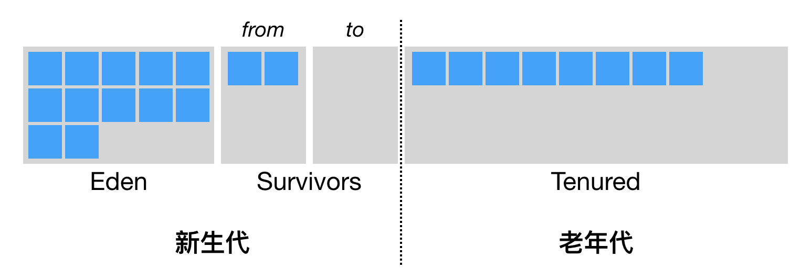

#### 5.20 为什么新生代和老年代要采用不同的回收算法？

**参考答案**

如果一个区域中大多数对象都是朝生夕灭，难以熬过垃圾收集过程的话，那么把它们集中放在一起，每次回收时只关注如何保留少量存活而不是去标记那些大量将要被回收的对象，就能以较低代价回收到大量的空间，一般采用复制算法。

如果剩下的都是难以消亡的对象，那把它们集中放在一块，虚拟机便可以使用较低的频率来回收这个区域，可以使用压缩或清除算法。

#### 5.21请介绍G1垃圾收集器

**参考答案**

G1（Garbage First）是一款主要面向服务端应用的垃圾收集器，采用**标记-复制+“标记-整理**算法。JDK 9发布之日，G1宣告取代ParallelScavenge加Parallel Old组合，成为服务端模式下的默认垃圾收集器，而CMS则沦落至被声明为不推荐使用（Deprecate）的收集器。

虽然G1也仍是遵循分代收集理论设计的，但其堆内存的布局与其他收集器有非常明显的差异：G1不再坚持固定大小以及固定数量的分代区域划分，而是把连续的Java堆划分为多个大小相等的独立区域（Region），每一个Region都可以根据需要，扮演新生代的Eden空间、Survivor空间，或者老年代空间。收集器能够对扮演不同角色的Region采用不同的策略去处理，这样无论是新创建的对象还是已经存活了一段时间、熬过多次收集的旧对象都能获取很好的收集效果。

Region中还有一类特殊的Humongous区域，专门用来存储大对象。G1认为只要大小超过了一个Region容量一半的对象即可判定为大对象。每个Region的大小可以通过参数 -XX：G1HeapRegionSize 设定，取值范围为1MB～32MB，且应为2的N次幂。而对于那些超过了整个Region容量的超级大对象，将会被存放在N个连续的Humongous Region 之中，G1的大多数行为都把 Humongous Region 作为老年代的一部分来进行看待，如下图所示。

1. 初始标记
   标记与GC Roots直接关联的对象,停止所有用户线程,只启动一条初始标记线程,这个过程很快.
2. 并发标记
   进行全面的可达性分析,开启一条并发标记线程与用户线程并行执行.这个过程比较长.
3. 最终标记
   标记出并发标记过程中用户线程新产生的垃圾，停止所有用户线程，并使用多条最终标记线程并行执行.
4. 筛选回收
   回收废弃的对象。此时也需要停止一切用户线程,并使用多条筛选回收线程并行执行.

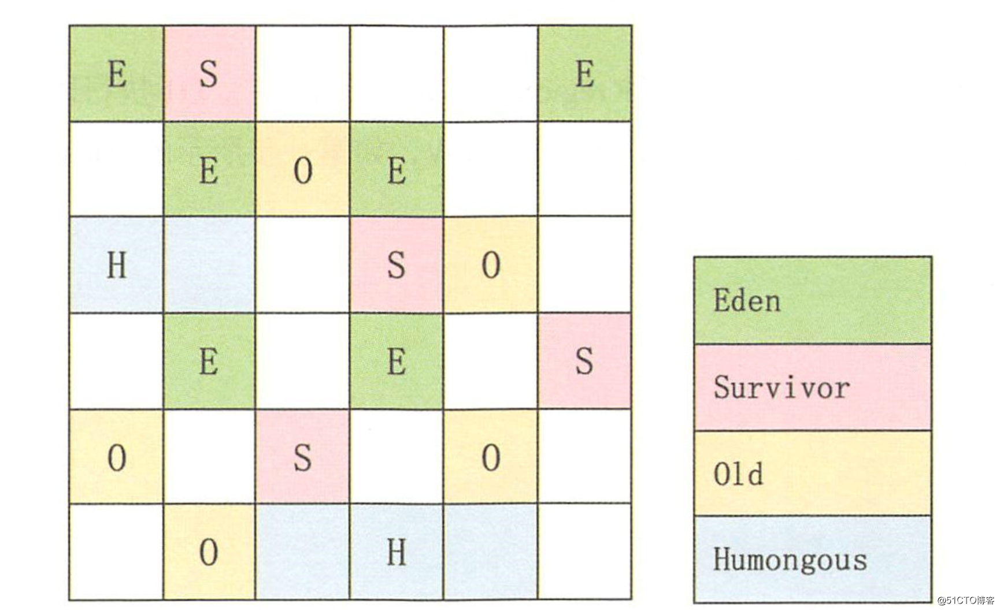

#### 5.22 请介绍CMS垃圾收集器

**参考答案**

CMS（Concurrent Mark Sweep）收集器是一种以获取最短回收停顿时间为目标的收集器。从名字上就可以看出CMS收集器是基于标记-清除算法实现的，它的运作过程分为四个步骤，包括：

1. 初始标记（CMS initial mark）；初始标记仅仅只是标记一下GC Roots能直接关联到的对象，速度很快；
2. 并发标记（CMS concurrent mark）；并发标记阶段就是从GC Roots的直接关联对象开始遍历整个对象图的过程，这个过程耗时较长但是不需要停顿用户线程，可以与垃圾收集线程一起并发运行；
3. 重新标记（CMS remark）；重新标记阶段则是为了修正并发标记期间，因用户程序继续运作而导致标记产生变动的那一部分对象的标记记录，这个阶段的停顿时间通常会比初始标记阶段稍长一些，但也远比并发标记阶段的时间短；
4. 并发清除（CMS concurrent sweep）；并发清除阶段，清理删除掉标记阶段判断的已经死亡的对象，由于不需要移动存活对象，所以这个阶段也是可以与用户线程同时并发的。

其中初始标记、重新标记这两个步骤仍然需要“Stop The World”。

由于在整个过程中耗时最长的并发标记和并发清除阶段中，垃圾收集器线程都可以与用户线程一起工作，所以从总体上来说，CMS收集器的内存回收过程是与用户线程一起并发执行的。通过下图可以比较清楚地看到CMS收集器的运作步骤中并发和需要停顿的阶段。


CMS收集器还远达不到完美的程度，它至少有以下三个明显的缺点：

- CMS收集器对处理器资源非常敏感。在并发阶段，它虽然不会导致用户线程停顿，但却会因为占用了一部分线程（或者说处理器的计算能力）而导致应用程序变慢，降低总吞吐量。
- 由于CMS收集器无法处理“浮动垃圾”（Floating Garbage），有可能出现“Con-current Mode Failure”失败进而导致另一次完全“Stop TheWorld”的Full GC的产生。
- CMS是一款基于“标记-清除”算法实现的收集器，这意味着收集结束时会有大量空间碎片产生。空间碎片过多时，将会给大对象分配带来很大麻烦，往往会出现老年代还有很多剩余空间，但就是无法找到足够大的连续空间来分配当前对象，而不得不提前触发一次Full GC的情况。

#### 5.23 请说一说 Java 中的垃圾收集器


针对新生代的垃圾回收器共有三个：Serial，Parallel Scavenge 和 Parallel New。这三个采用的都是标记 - 复制算法。其中，Serial 是一个单线程的，Parallel New 可以看成 Serial 的多线程版本。Parallel Scavenge 和 Parallel New 类似，但更加注重吞吐率。此外，Parallel Scavenge 不能与 CMS 一起使用。

针对老年代的垃圾回收器也有三个：刚刚提到的 Serial Old 和 Parallel Old，以及 CMS。Serial Old 和 Parallel Old 都是标记 - 压缩算法。同样，前者是单线程的，而后者可以看成前者的多线程版本。

Serial


Parallel New


Serial Old


CMS


#### 5.24 内存泄漏和内存溢出有什么区别？

**参考答案**

- 内存泄漏（memory leak）：内存泄漏指程序运行过程中分配内存给临时变量，用完之后却没有被GC回收，始终占用着内存，既不能被使用也不能分配给其他程序，于是就发生了内存泄漏。

- 内存溢出（out of memory）：简单地说内存溢出就是指程序运行过程中申请的内存大于系统能够提供的内存，导致无法申请到足够的内存，于是就发生了内存溢出。

#### 5.25 什么是内存泄漏，怎么解决？

**参考答案**

内存泄漏的根本原因是长生命周期的对象持有短生命周期对象的引用，尽管短生命周期的对象已经不再需要，但由于长生命周期对象持有它的引用而导致不能被回收。以发生的方式来分类，内存泄漏可以分为4类：

1. 常发性内存泄漏。发生内存泄漏的代码会被多次执行到，每次被执行的时候都会导致一块内存泄漏。
2. 偶发性内存泄漏。发生内存泄漏的代码只有在某些特定环境或操作过程下才会发生。常发性和偶发性是相对的。对于特定的环境，偶发性的也许就变成了常发性的。所以测试环境和测试方法对检测内存泄漏至关重要。
3. 一次性内存泄漏。发生内存泄漏的代码只会被执行一次，或者由于算法上的缺陷，导致总会有一块仅且一块内存发生泄漏。
4. 隐式内存泄漏。程序在运行过程中不停的分配内存，但是直到结束的时候才释放内存。严格的说这里并没有发生内存泄漏，因为最终程序释放了所有申请的内存。但是对于一个服务器程序，需要运行几天，几周甚至几个月，不及时释放内存也可能导致最终耗尽系统的所有内存。所以，我们称这类内存泄漏为隐式内存泄漏。

避免内存泄漏的几点建议：

1. 尽早释放无用对象的引用。
2. 避免在循环中创建对象。
3. 使用字符串处理时避免使用String，应使用StringBuffer。
4. 尽量少使用静态变量，因为静态变量存放在永久代，基本不参与垃圾回收。

#### 5.26 什么是内存溢出，怎么解决？

**参考答案**

内存溢出（out of memory）：简单地说内存溢出就是指程序运行过程中申请的内存大于系统能够提供的内存，导致无法申请到足够的内存，于是就发生了内存溢出。

引起内存溢出的原因有很多种，常见的有以下几种：

1. 内存中加载的数据量过于庞大，如一次从数据库取出过多数据；
2. 集合类中有对对象的引用，使用完后未清空，使得JVM不能回收；
3. 代码中存在死循环或循环产生过多重复的对象实体；
4. 使用的第三方软件中的BUG；
5. 启动参数内存值设定的过小。

内存溢出的解决方案：

- 第一步，修改JVM启动参数，直接增加内存。
- 第二步，检查错误日志，查看“OutOfMemory”错误前是否有其它异常或错误。
- 第三步，对代码进行走查和分析，找出可能发生内存溢出的位置。
- 第四步，使用内存查看工具动态查看内存使用情况。

#### 5.27 哪些区域会OOM，怎么触发OOM？

**参考答案**

除了程序计数器外，虚拟机内存的其他几个运行时区域都有发生OOM异常的可能。

1. Java堆溢出

   Java堆用于储存对象实例，我们只要不断地创建对象，并且保证GC Roots到对象之间有可达路径来避免垃圾回收机制清除这些对象，那么随着对象数量的增加，总容量触及最大堆的容量限制后就会产生内存溢出异常。

2. 虚拟机栈和本地方法栈溢出

   HotSpot虚拟机中并不区分虚拟机栈和本地方法栈，如果虚拟机的栈内存允许动态扩展，当扩展栈容量无法申请到足够的内存时，将抛出OutOfMemoryError异常。

3. 方法区和运行时常量池溢出

   方法区溢出也是一种常见的内存溢出异常，在经常运行时生成大量动态类的应用场景里，就应该特别关注这些类的回收状况。这类场景常见的包括：程序使用了CGLib字节码增强和动态语言、大量JSP或动态产生JSP文件的应用（JSP第一次运行时需要编译为Java类）、基于OSGi的应用（即使是同一个类文件，被不同的加载器加载也会视为不同的类）等。

   在JDK 6或更早之前的HotSpot虚拟机中，常量池都是分配在永久代中，即常量池是方法去的一部分，所以上述问题在常量池中也同样会出现。而HotSpot从JDK 7开始逐步“去永久代”的计划，并在JDK 8中完全使用元空间来代替永久代，所以上述问题在JDK 8中会得到避免。

4. 本地直接内存溢出

   直接内存（Direct Memory）的容量大小可通过-XX：MaxDirectMemorySize参数来指定，如果不去指定，则默认与Java堆最大值（由-Xmx指定）一致。如果直接通过反射获取Unsafe实例进行内存分配，并超出了上述的限制时，将会引发OOM异常